# Elmchemy —用 Elm 的语法编写类型安全的仙丹代码—第 2 部分—我们自己的 RPG 字符模块

> 原文：<https://medium.com/hackernoon/elmchemy-write-type-safe-elixir-code-with-elms-syntax-part-2-our-own-rpg-character-module-cedbf7da138d>

在文章的这一部分，我们将使用 [Elmchemy](http://github.com/wende/elmchemy) 编写自己的库。
如果你还没有读过[第一部](/@krzysztof.wende/elmchemy-write-type-safe-elixir-code-with-elms-syntax-part-1-introduction-8968b76d721d)，强烈建议你这么做。它涵盖了开始一个新项目和用 [Elmchemy](https://hackernoon.com/tagged/elmchemy) 编译器集成一个现有项目的基础知识。

在本教程中，我们将学习如何:

1.  定义类型别名
2.  定义工会类型
3.  使用别名和标记联合作为函数
4.  联合类型的模式匹配
5.  将运算符用作函数，并定义自己的自定义函数
6.  从其他模块导入类型和类型别名

想象我们正在写一个游戏。令人惊叹的创新游戏。一个前无古人的游戏。有角色，等级，统计和物品的游戏。它以科幻世界为背景，所以我们可以拥有十字弓、步枪、撬棍、爆能枪等等。因为我们正在创建一个 block-buster，而项目经理很少碰巧有不可思议的期限预期，所以我们被分配了一个单一的任务:我们的工作是创建一个负责我们主要角色的模块。
我们是一家初创公司，我们的工资大约是每月 500 美元，所以我们有机会自己设计功能(产品经理会说这不是他想要的)。

我们是一个懒惰的程序员，我们将使用在[第一部分](/@krzysztof.wende/elmchemy-write-type-safe-elixir-code-with-elms-syntax-part-1-introduction-8968b76d721d)中创建的项目。如果你没有，那么你已经失败了。你的股权没了。
作为第一步，我们将创建几个场景来测试未实现的功能，然后我们将开始考虑如何实现它们。它被称为 TDD，是你在不被解雇的情况下最接近工作中的游戏。测试套件将在 Elixir 的 ExUnit 中实现，就像本教程的前一部分一样，其他的都将只使用 Elmchemy 进行编码。

说够了。是时候开始编码了。

# 准备

**本文是使用 Elmchemy 0.3.31 编写的。确保拥有高于 0.3.31 但不高于 0.4 的版本**

由于你的工资和每周不可协商的全职小时数，你遭受了退出魔兽世界的痛苦。缺少你最讨厌和最喜欢的游戏会导致一个相当大胆的声明:**每个游戏角色都必须有属性**。

让我们编写一个测试来检查新角色是否拥有它们。
如果您遵循上一部分，您的项目结构应该如下所示:

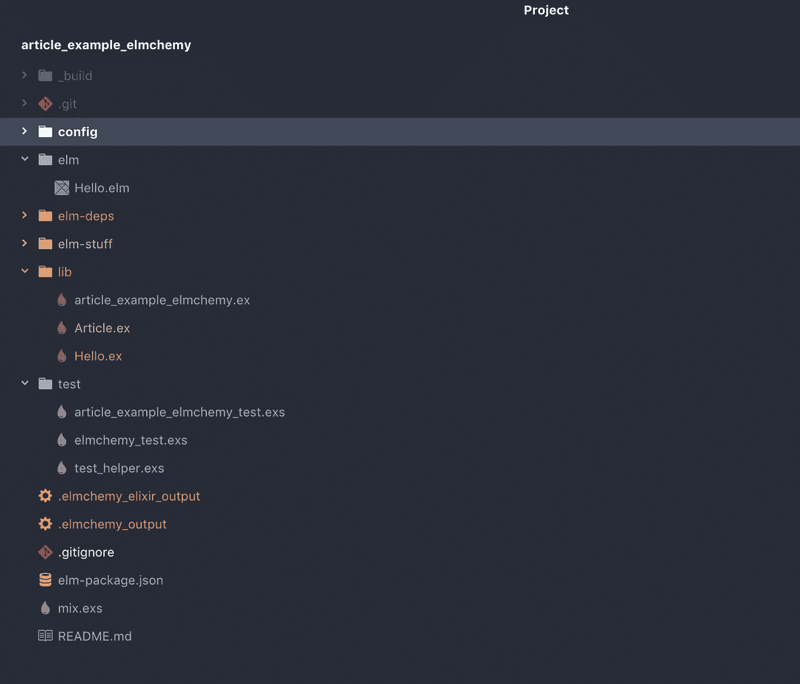

在`test`目录下创建一个名为`character_test.exs`的新文件，并从一个样板文件开始:

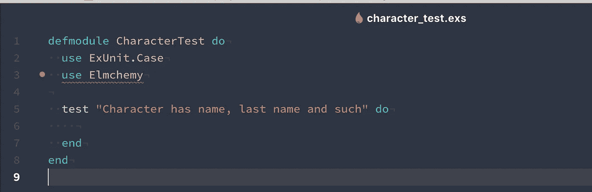

test/character_test.exs - Ignore the error on `use Elmchemy`. Our plugin just can’t see dependencies that are installed as mix archives

现在我们的角色应该有什么？肯定是名和姓。有些性别也不错。年龄被高估了，所以我们不考虑它。不多，但对我们的 MVP 来说足够了。

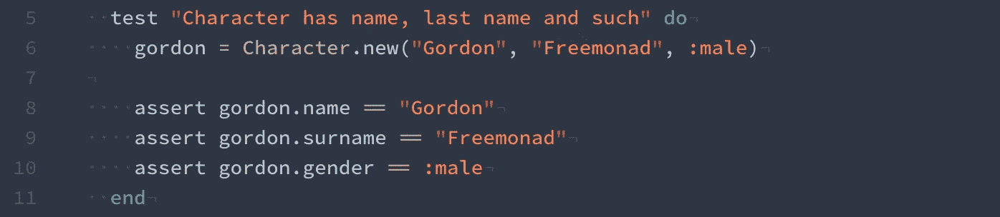

test/character_test.exs

酷毙了。下一件事是我们希望他有基本的统计数据。伤害的力量，武器需求的智力，生命值的活力，应该足够我们的 MVP 了。我们还不知道默认值是什么，所以让我们检查统计数据是否存在并且是整数。

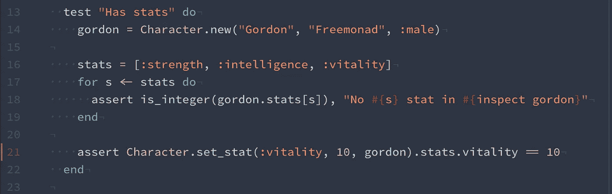

character_test.exs

我们也检查我们是否能使用`set_stat/3`功能为我们的角色设置一个属性。

如果统计数据不能为拥有它们提供一些好处，它们就什么都不是:

**活力提升健康，显示为{current_hp，max_hp}元组:**

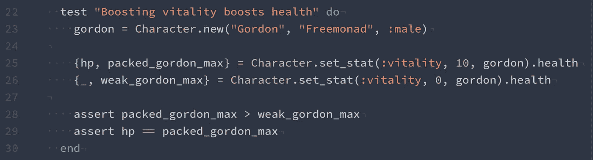

test/character_test.exs — We check that max hp increased, and also that our current hp adjusted itself accordingly

在我们的测试中，我们创建了一个新的 Gordon，并克隆了他的两个副本。一个增强了 10 点生命力，另一个和我们一样是程序员——0 点。然后我们比较他们的健康点，期望前者有更多的健康点。在最后一行中，我们确保提高戈登的最大生命值，也相应地提高他的基础生命值。

**请注意，我们将函数的目标作为最后一个参数，而不是第一个。那是因为在* [*固化的*](https://en.wikipedia.org/wiki/Currying) *环境中，为了让管道工作，我们需要把管道目标作为最后一个参数——这就是埃尔姆和埃尔姆切米的标准**

**情报让我们可以装备更先进的武器:**

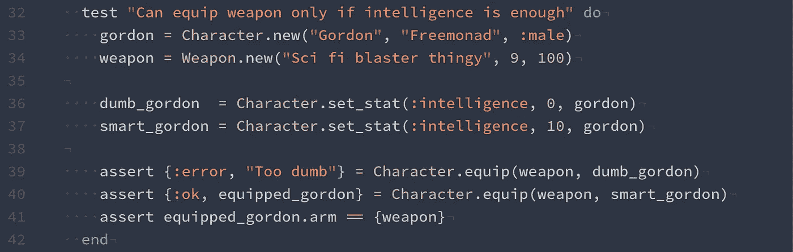

test/character_test.exs — We create two Gordons, a weapon with 9 intelligence requirement,

这里我们创建了一个新角色和一个 9 级 100 伤害的武器。然后我们得到戈登的两个克隆体:
-一个有`10`智力
-另一个有`0`。我们对两个角色都运行了`equip`功能，预计它会在有`0`智能的角色上失败，但在有`10`智能的角色上成功

在最后，我们确保了更聪明的戈登的克隆人在他的手臂上有一件武器。请注意，我们将其包装在单元组`{weapon}`中，因为这就是 Elmchemy 表示`[Maybe](http://package.elm-lang.org/packages/elm-lang/core/latest/Maybe)`类型的方式。其中`{value}`为`Just value`，而`nil`为`Nothing.`

# 履行

# 测试#1 —人物姓名、姓氏和性别

## 功能 1-类型别名

现在我们有了测试，我们可以开始实现我们的角色了！对于我们的模式，我们将使用一个`type alias`。它允许我们对任何其他类型有一个共同的名称。我们要用它来给一个结构体起别名。Elmchemy 用原子作为键来表示地图。

用我们的类型别名声明创建一个`elm/Character.elm`文件。

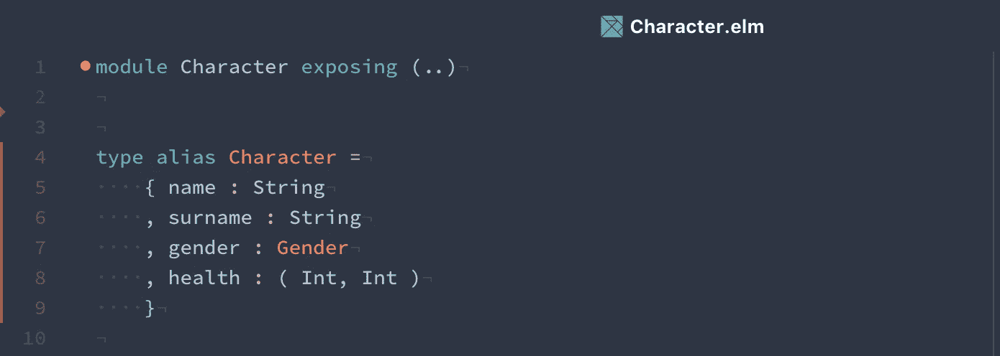

elm/Character.elm

> **类型别名提示**:如果我们别名化的类型是一个结构或元组，我们可以使用别名作为一个函数来创建它的一个实例，其中每个参数都是我们类型中的一个后续值。f.i `Character name surname gender health`

我们声明我们的角色有名字和姓氏，它们是字符串。
一个`Gender`类型的性别，是我们还没有声明的类型，健康为 tuple，其中第一个是当前健康，后者是最大健康。

## 特征 2-联合类型

每当我们不想要匹配的东西，我们想要一个自定义类型。Elmchemy `types`中的
是所谓的[‘标记联合’](https://en.wikipedia.org/wiki/Tagged_union)，它的基本意思是，每个类型声明中的第一个符号是一个‘标记’，它告诉我们值代表什么类型。Elmchemy 中的联合类型在单个标记的情况下表示为原子，在包装一个或多个类型的标记的情况下表示为以原子开始的元组。
这就是我们宣布性别的方式

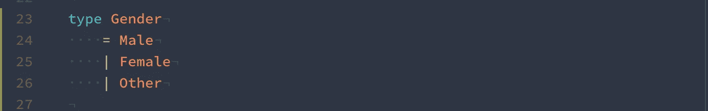

elm/Character.elm — We declare that gender can either be an atom :male, :female or :other

## 功能 3-将别名类型作为函数

现在我们可以声明一个`new`函数，它根据参数返回一个新字符。

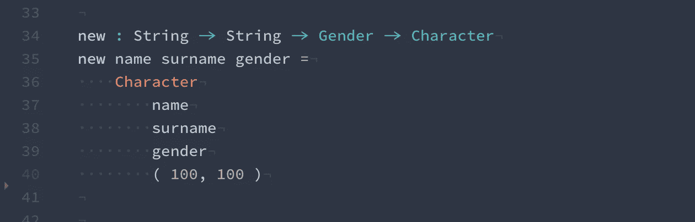

elm/Character.elm — function returning our Character type alias intance

我们接受 3 个参数，它们是作为字符串的名字和姓氏，以及作为我们新创建的`Gender`联合类型的性别。然后，我们按照定义字段的顺序将参数作为函数传递给字符类型。我们也在 100 最大值上传递了健康值为 100 的默认参数。

如果我们现在在终端中运行`mix test`，我们应该会通过第一个测试。还剩三个。

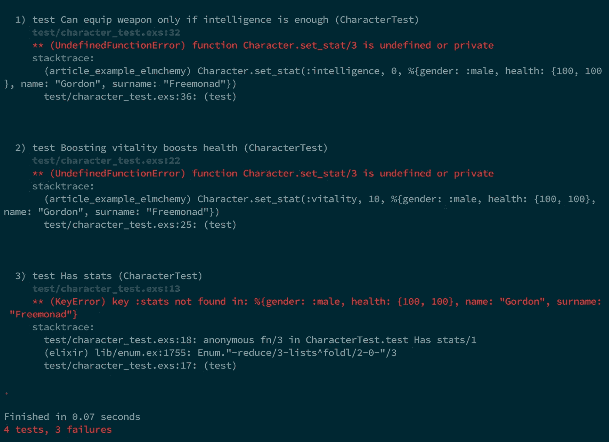

# 测试 2——性格统计

是时候添加统计数据了。让我们回忆一下我们的测试案例


character_test.exs

首先我们需要为我们的角色类型定义属性。

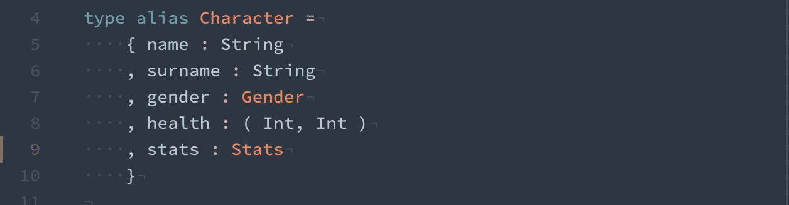

并定义统计结构:

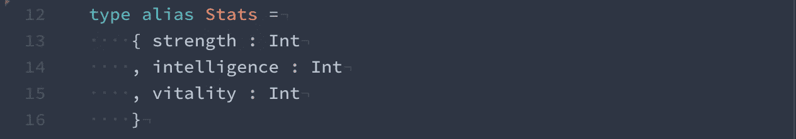

当我们保存时，我们的编译器应该提醒我们，我们的`new/3`函数不再与我们的类型相关。


让我们更新它以包含所有值为 0 的默认统计信息

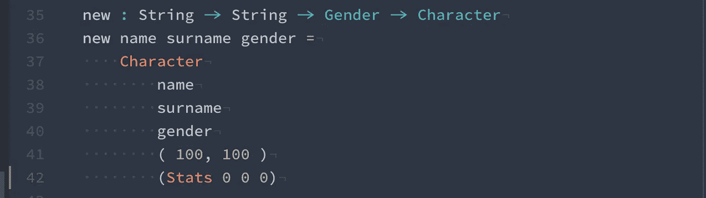

## 特性 4 —关于联合类型和记录更新语法的 case 语句

我们需要一种统计数据来匹配

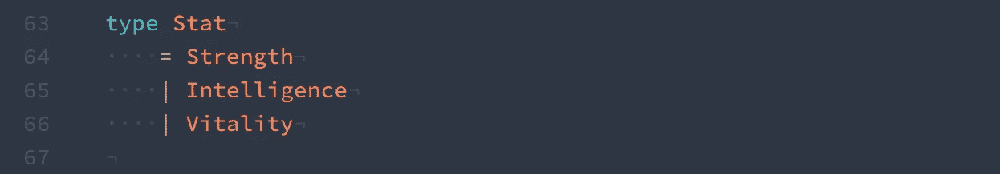

现在我们需要声明一个函数，它接受一个 stat、值和字符，并将 stat 更新为我们想要的值。

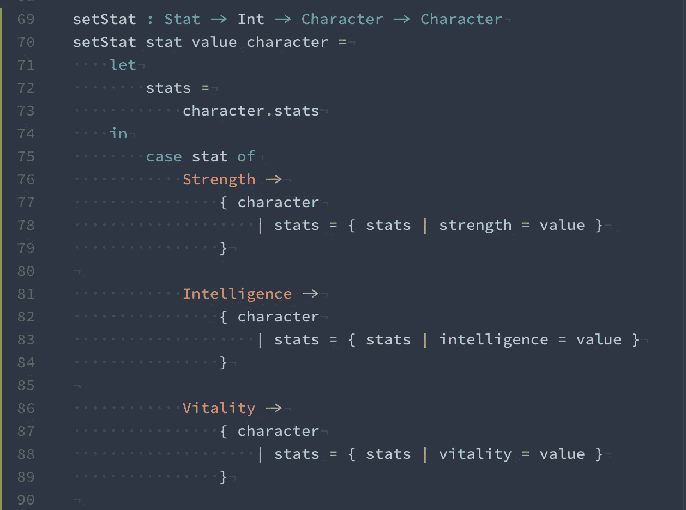

> 你知道吗？
> 你可以使用记录更新语法定义类型别名。
> `type alias Namable a = { a | name : String}`
> 表示任何具有类型为`String`的字段`name`的结构。
> 然后你可以像这样创建从它派生的类型:
> `type alias Cat = Namable { lactoseIntolerance : Bool }` `type alias Dog = Namable { catIntolerance : Int }`
> 但是记住，这样你牺牲了实例化类型别名的短语法，并且必须手工键入整个结构。

太好了。那是另一项测试！

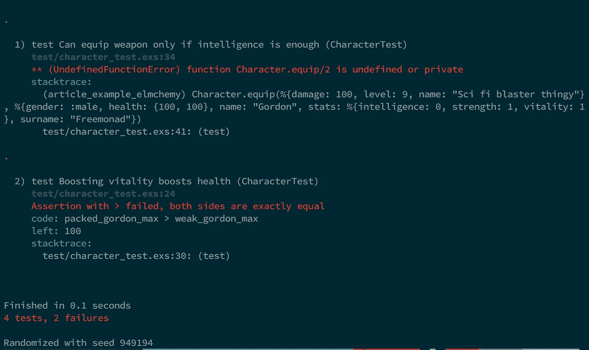

# 测试 3——增强活力


test/character_test.exs — We check that max hp increased, and also that our current hp adjusted itself accordingly

现在我们需要在设置活力属性时增加改变生命值的功能。

## 功能 5—作为函数的运算符和自定义运算符

因为我们的 HP 是一个元组，所以我们想对它使用`Tuple.map`。但是为了代码的整洁，我们将定义一个操作符作为中缀操作符。

我们可以使用任何我喜欢的操作符，但是为了形状的缘故，我为左边的元组元素选择了`<$`,为右边的元组元素选择了`$>`。你可以尝试最适合你的方法。

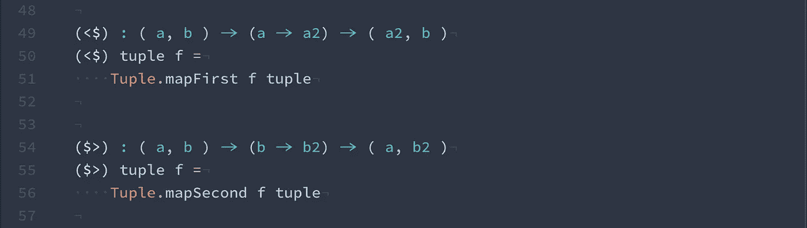

> 你知道吗？
> 有大量的内置操作器让你的生活更轻松。您可以使用`|>`和`<|`来传输函数结果，使用`<<`和`>>`来组合函数。甚至有一个逗号运算符可以为您创建元组。
> `(,) a b`相当于`(a, b)
> (,,) a b c`到`(a, b, c)`等等。每个操作符仍然是一个函数，所以我们可以把它们传递给其他函数，让我们的代码更有表现力。
> 实现两个列表的压缩所需要的只是编写
> `List.map2 (,) listA listB`

太好了。现在我们可以将健康变化添加到我们的`setStat`案例的`Vitality`分支中。

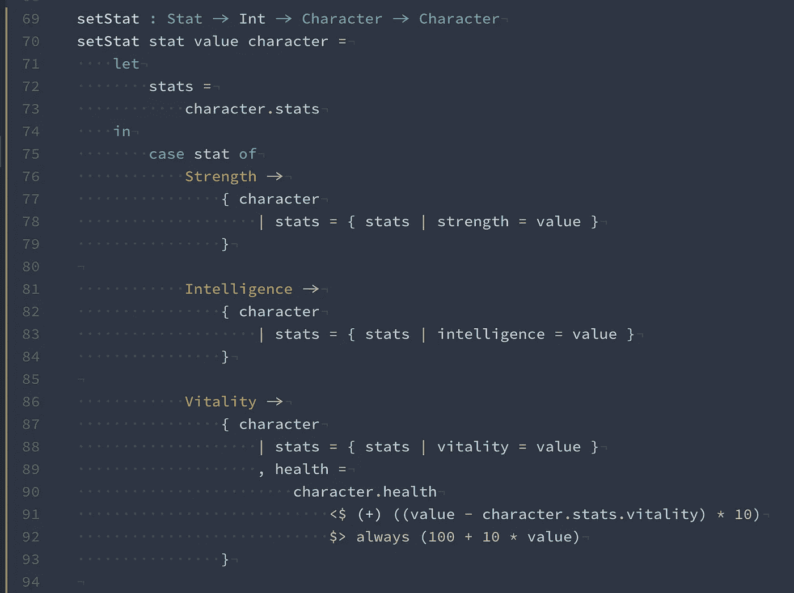

我们用`<$`加上当前生命力的差值和新的生命力值乘以 10。
然后我们用`$>`设置为基数 100 加 10 倍体力值。
因为我们需要给它传递一个函数，在第一种情况下我们给它一个`(+)`函数，在第二种情况下我们给它`always`，它基本上返回*总是*同样的东西(基本上它的意思和`\_ -> (100 + 10 * value)`一样)
如果我们不使用我们的操作符，代码将如下所示

```
character.health
  |> Tuple.mapFirst ((+) ((value - character.stats.vitality) * 10))
  |> Tuple.mapSecond (always (100 + 10 * value))
```

现在我们应该只剩下一个测试失败了。

# 测试# 4——当我们足够聪明的时候装备武器


test/character_test.exs - a weapon with 9 intelligence requirement,

所以我们需要一个功能，要么能要么不能装备武器。为此，我们将使用`Result a b`类型，其值为
`Err a`或`Ok b`，直接转换为`{:ok, a}`或`{:error, b}`。

> 请注意 Err 翻译成`:error`而不是`:err`的区别。这是 Elmchemy 中的一个例外，在不牺牲一致性的情况下保持 Elixir 和 Elm 的互操作性

但在此之前，我们需要实现一个通用的武器类型。为此，我们创建一个新文件，并学习导入和使用远程类型。

## 功能 6-从其他模块导入的联合类型和类型别名

让我们创建一个新的`elm/Weapon.elm`文件，并添加一个`new`函数，为我们创建一个武器

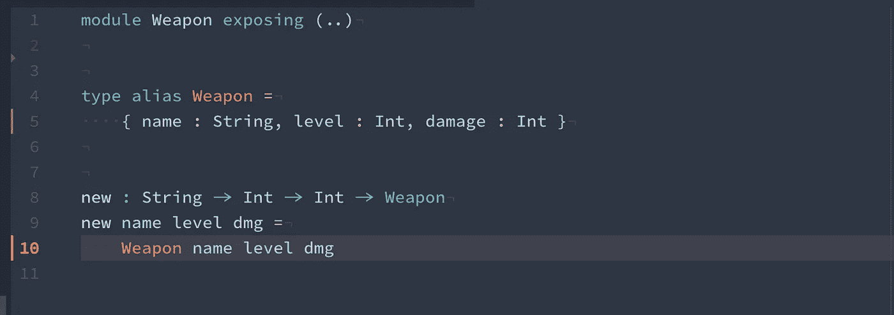

elm/Weapon.elm — weapon type definition

**请注意，我们创建* `*new*` *函数只是为了在我们的灵丹妙药代码中使用。* `*Weapon*` *类型别名在 Elmchemy 的作用域内使用时本身就是一个工厂函数。* `*Character*` *工厂函数(* `*Character.new*` *)有所不同，因为我们为它指定了一些默认值**

现在我们已经有了我们的`Weapon`类型，我们可以实现我们的`equip`函数，但是首先我们需要在我们的`Character.elm`文件的顶部添加一个导入，
我们使用`import Weapon exposing (Weapon)`，因为第一个是模块的名称，后者是我们想要导入的类型别名。

而且我们的角色现在没有胳膊。让我们添加一个手臂，类型为`Maybe Weapon`。就像我们之前决定的那样，我们想要使用`Maybe`类型，因为我们的角色要么手里有东西，要么什么都没有。
让我们给我们的`Character`型加上一只手臂

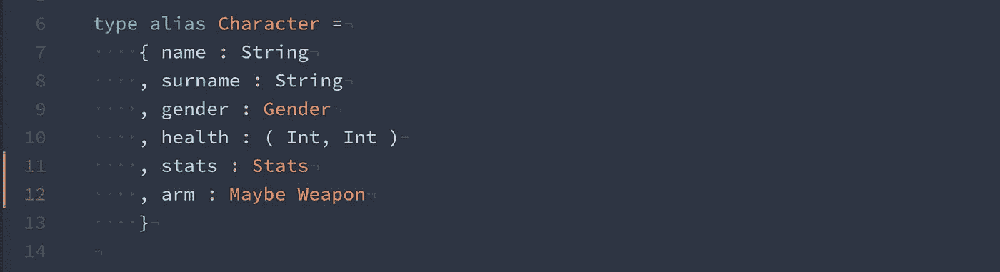

> 你知道吗？
> 有一种速记语法，可以将 struct 中的字段作为函数来访问。通过编写`.field`，你可以拥有一个函数来获取记录的`field`。相当于`\a -> a.field`
> 比如:
> `arsenal : List Character -> List Weapon`
> `arsenal squad = List.map .arm *squad*`

我们还需要给我们的`Character.new`函数添加一个`arm`的默认值。

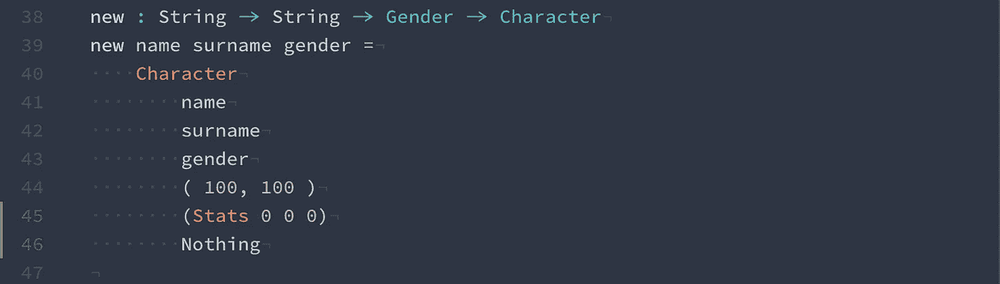

elm/Character.elm

现在我们有了从其他文件导入的类型和角色的手臂，我们可以开始我们的武器装备实现了:


elm/Character.elm

就是这样！如果我们现在运行测试，我们应该看到所有 4 个测试都是绿色的。

如果你跳过了一些部分，你可以在这个库下面看到整个项目:
[https://github.com/wende/elmchemy-article-example](https://github.com/wende/elmchemy-article-example)

**这是第二部分的结尾，在第三部分中，我们将关注从 Elmchemy 调用 Elixir code 并编写自己的本机模块。**

如果有任何关于这个项目的问题，我很乐意在评论区回答。

# 公告:

## Elmchemy 正在更名，很快将被命名为“Elchemy”(不带“m”)

第一部分

—第三部分>>>

[](http://bit.ly/HackernoonFB)[](https://goo.gl/k7XYbx)[](https://goo.gl/4ofytp)

> [黑客中午](http://bit.ly/Hackernoon)是黑客如何开始他们的下午。我们是这个家庭的一员。我们现在[接受投稿](http://bit.ly/hackernoonsubmission)并乐意[讨论广告&赞助](mailto:partners@amipublications.com)机会。
> 
> 如果你喜欢这个故事，我们推荐你阅读我们的[最新科技故事](http://bit.ly/hackernoonlatestt)和[趋势科技故事](https://hackernoon.com/trending)。直到下一次，不要把世界的现实想当然！

