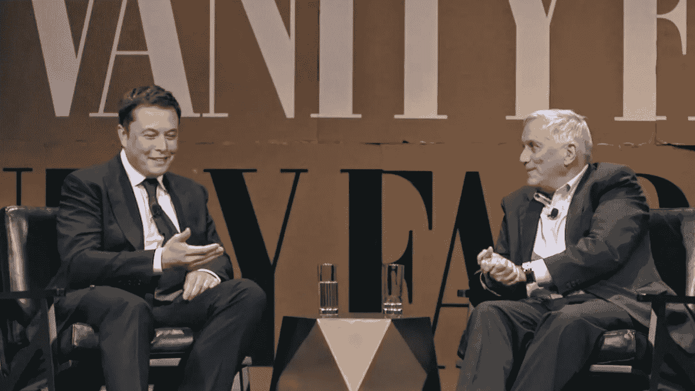

# 埃隆·马斯克可能发明了比特币

> 原文：<https://medium.com/hackernoon/elon-musk-probably-invented-bitcoin-9d6c7b7f9c3b>

Musk and Isaacson on Bitcoin [Link](https://www.youtube.com/watch?v=fPsHN1KyRQ8&feature=youtu.be&t=33m44s)

# **1。中本聪大概就是埃隆马斯克**

# **2。埃隆·马斯克是今天的本·富兰克林**

# **3。在马斯克的指导下，比特币可能会更有用**

## **1。Satoshi 大概就是 Elon**

马斯克有能力发明比特币吗？大概吧。

*   2008 年的[比特币论文](https://bitcoin.org/bitcoin.pdf)是由懂经济学和密码学的人写的。马斯克为 Zip2 和 X.com/贝宝创立并编写了生产互联网软件。
*   比特币的源代码是某个[精通 C++](https://www.newyorker.com/magazine/2011/10/10/the-crypto-currency) 的人写的。马斯克显然理解 C++，他坚持认为应该在 X.com 和 SpaceX 使用 c++。
*   抛开经验不谈，马斯克反复吸收和应用跨领域的知识来制造产品，比如 Hyperloop，以论文[的形式发布了 alpha stage](https://web.archive.org/web/20131003020455/http://www.spacex.com/sites/spacex/files/hyperloop_alpha-20130812.pdf)。

他会想要创造它吗？大概吧。

*   那是 2008 年(大衰退)，他可能有动力通过创造一种不需要银行的货币来解决对银行缺乏信任的问题。

原来的[比特币论文](https://bitcoin.org/bitcoin.pdf)听起来像马斯克吗？有点吧。

*   第一原理的标志性推理。
*   数量级计算。
*   在论坛帖子中，使用“数量级”。
    [链接 1](https://satoshi.nakamotoinstitute.org/posts/bitcointalk/threads/15/#15)
    [链接 2](https://satoshi.nakamotoinstitute.org/posts/bitcointalk/threads/19/#50)
    [链接 3](https://satoshi.nakamotoinstitute.org/posts/bitcointalk/threads/42/#3)
    [链接 4](https://satoshi.nakamotoinstitute.org/posts/bitcointalk/threads/120/#2)
    [链接 5](https://satoshi.nakamotoinstitute.org/posts/bitcointalk/threads/232/#213)
*   还有使用[【血腥硬】](https://satoshi.nakamotoinstitute.org/posts/bitcointalk/threads/79/#6)。

马斯克会匿名 10 年吗？大概，原则上。

*   Satoshi 创造了不需要中央权威的点对点货币比特币。

马斯克是否在 2014 年用[这条推文](https://twitter.com/elonmusk/status/444358711796985857)暴露了自己的身份？也许吧。

*   这条推文是在 T2 论坛发帖一周后发出的。

马斯克不拥有任何比特币还能当 Satoshi 吗？是的。

*   他[曾公开表示](https://www.youtube.com/watch?v=fPsHN1KyRQ8&feature=youtu.be&t=33m44s)(2014 年 10 月)他没有任何比特币，这与一个删除了自己私钥的“好聪”是一致的。这意味着 Satoshi 的 100 万枚硬币(截至 2017 年 11 月价值约 80 亿美元)一去不复返了。

Satoshi 可能是一群人吗？大概不会。

*   Satoshi 可能是马斯克、尼克·萨博和哈尔·芬尼的合作。但似乎更有可能的是，马斯克阅读了他们的研究论文，获得了灵感，并独自打造了这款产品。

## **2。马斯克就像富兰克林**

马斯克确定了我们这个时代最紧迫的问题，并花时间来解决这些问题:可持续能源、多星球生命、人工智能安全。

同样，本·富兰克林“在需要做的时候做了需要做的事情”。他是一个博学的企业家，为公众利益撰写小册子，对纸币的本质和必要性进行适度的调查。他选择的笔名？《沉默的杜古德》。

富兰克林和马斯克还有一些有趣巧合的共同点。两者

*   开始在[报社](https://en.wikipedia.org/wiki/Benjamin_Franklin#Newspaperman)报社[创业](https://en.wikipedia.org/wiki/Zip2)
*   分享对[专利](https://www.tesla.com/blog/all-our-patent-are-belong-you)的[信念](http://www.pbs.org/benfranklin/l3_inquiring_little.html)
*   [用](https://en.wikipedia.org/wiki/Leyden_jar)[电容](https://books.google.com/books?id=Dda0DAAAQBAJ&lpg=PA4&ots=rscj28IQ86&dq=elon%20musk%20capacitor%20vance&pg=PA4#v=snippet&q=capacitor&f=false)研究过吗

## **3。比特币可以利用他的帮助**

比特币有些问题。它有一个重大的[分裂](https://en.wikipedia.org/wiki/Bitcoin_Cash)(2017 年 8 月)，刚刚避免了[另一个](https://en.wikipedia.org/wiki/SegWit2x)。验证一笔交易至少需要 10 分钟，其吞吐量比信用卡少 5000 倍。

如果马斯克发明了比特币，这一知识似乎会在某个时候公开。但如果现在公开，马斯克可以作为货币的“创始人”提供指导。(Vitalik Buterin 为以太坊做这个。)马斯克可以协调区块大小和闪电网络的变化，让比特币变得更有用。

埃隆——如果你是聪，谢谢。如果没有，那么，谢谢你发明了特斯拉跑车。

*   [名利场面试](https://www.youtube.com/watch?v=fPsHN1KyRQ8&feature=youtu.be&t=33m44s)
*   [聪的论坛帖子](https://satoshi.nakamotoinstitute.org/)
*   [比特币纸](https://bitcoin.org/bitcoin.pdf)