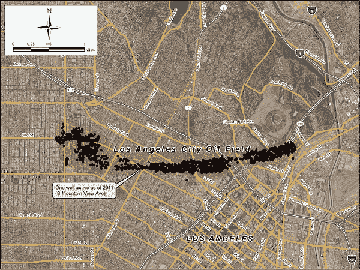

# 埃隆·马斯克的无聊公司隧道可能是人类的 B 计划

> 原文：<https://medium.com/hackernoon/elon-musks-boring-company-tunnels-might-be-a-plan-b-for-humanity-8ebd88efcff6>

埃隆·马斯克(Elon Musk)与公共资金和他的公司有着奇怪的关系。我没有声称背后有任何数字，但太阳能电池板(SolarCity)、电动汽车(Tesla)和太空旅行(SpaceX)得到了税收的大量补贴。你还能如何资助一家激进的科技公司？

这就把我们带到了隧道。众所周知，它们耗费大量时间和成本。想想 https://en.wikipedia.org/wiki/Brenner_Base_Tunnel 的 T2 T3，34 英里长，预计耗时 20 年。很多非常聪明的人已经建造隧道很长时间了，只是因为你把它变小了，并不意味着你消除了未知。

考虑一下马斯克想在洛杉矶建隧道的地方。洛杉矶有活跃的石油[钻井](https://hackernoon.com/tagged/drilling)。

Me 认为，这样的地质特征会使任何类型的隧道工程无法估计。

财产所有人的权利也包括在内。财产权虽然不是由法院强制执行，但确实延伸到地球内部。矿业公司必须购买在私有土地上挖掘的权利。当然，还有很多机制，比如征用权，行业可以滥用这些机制来得到他们想要的东西。Boring Company 将如何获得在私人和公共土地下挖掘的权利？更多补贴？

这将如何产生利润？从过路费和票务？因此，再一次，将未使用的公共资源转化为私人利润。

地面也支撑着上面的结构，我不知道这些隧道有多深，但是太低了，而且温度会非常高。太高，你就有下沉和地基位移的风险。

因此，很明显，有许多许多挑战必须克服，这些挑战本质上不是立法或技术问题。并不是说任何人都应该害怕挑战，但我们必须考虑这项技术的潜在替代用途。

想想看，SpaceX 技术更直接的应用不是去火星，而是用于军事目的。想想自动驾驶汽车的一个副作用是对个人位置的无处不在的监控。公众资助的马斯克公司的技术被用来对抗公众的可能性令人难以置信，所有这些都在令人愉快的行善外表下包裹着令人难以置信的后果。

马斯克非常关心人类的未来，当然不是所有人，否则他可能会从事更卑微的追求，比如清洁水和教育。这种隧道的另一个功能是在持续的气候事件中，如冰河时期，为人类生存提供保障。当然，这些设施空间有限，只能满足少数人的需求。

你可以用你的特斯拉换一张票来度过世界末日。

就我个人而言，我宁愿死在地上，也不愿在地下生活。

> [黑客中午](http://bit.ly/Hackernoon)是黑客如何开始他们的下午。我们是 [@AMI](http://bit.ly/atAMIatAMI) 家庭的一员。我们现在[接受投稿](http://bit.ly/hackernoonsubmission)，并乐意[讨论广告&赞助](mailto:partners@amipublications.com)机会。
> 
> 如果你喜欢这个故事，我们推荐你阅读我们的[最新科技故事](http://bit.ly/hackernoonlatestt)和[趋势科技故事](https://hackernoon.com/trending)。直到下一次，不要把世界的现实想当然！

