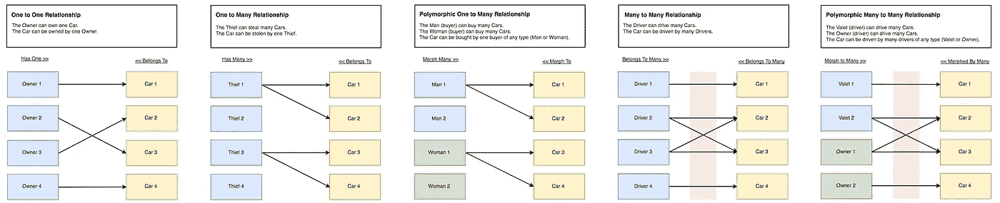
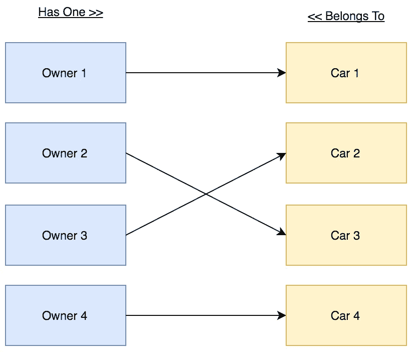
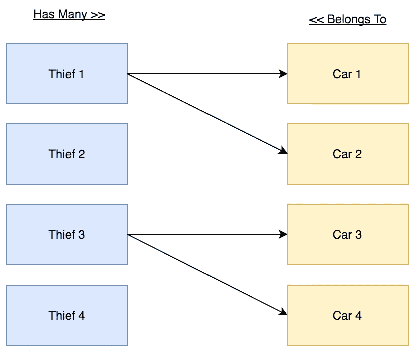
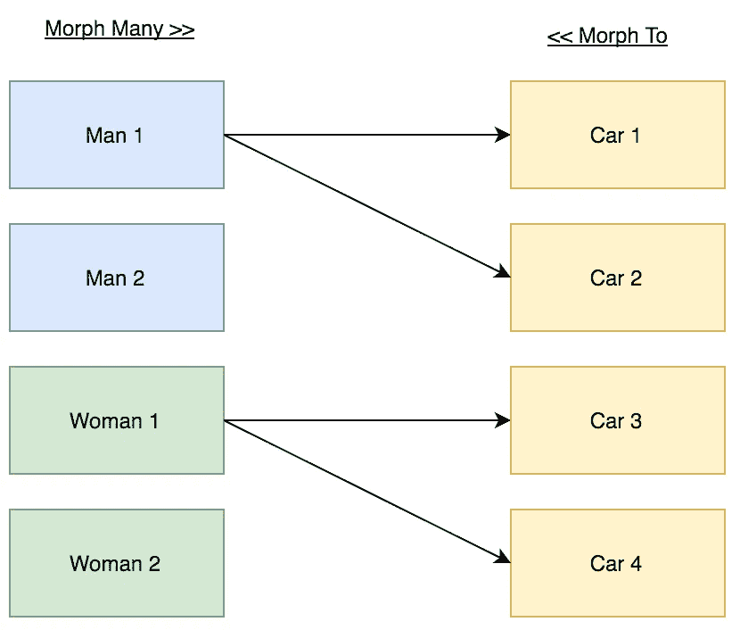
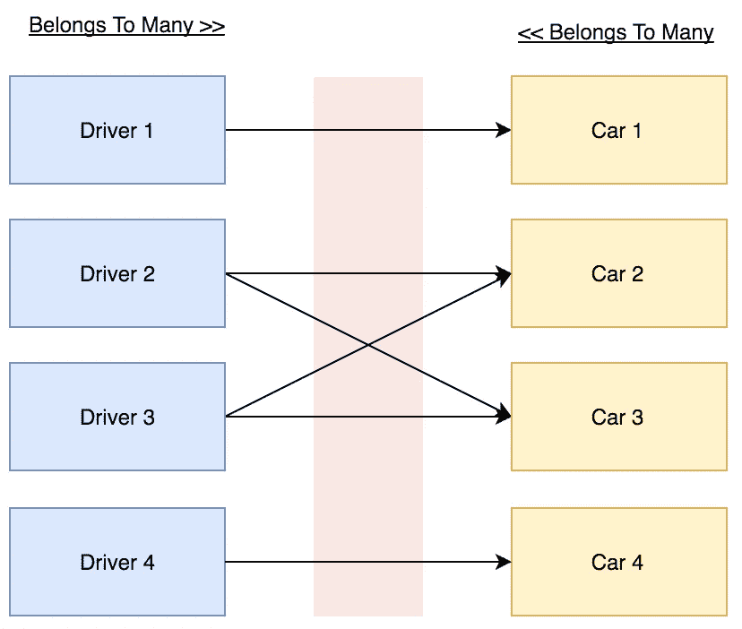
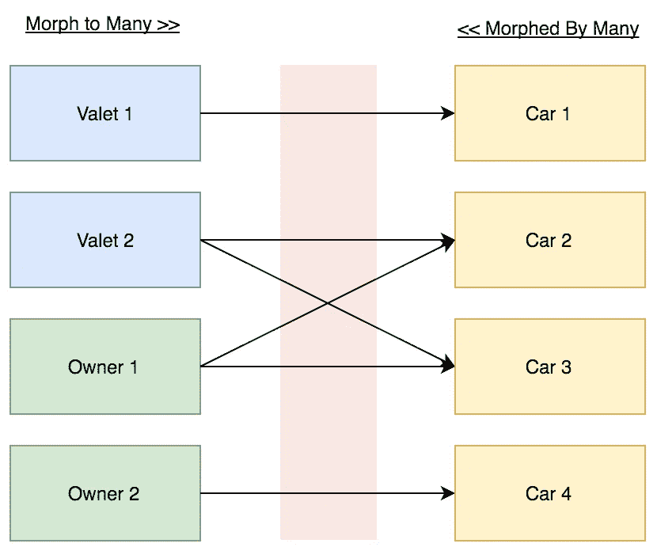
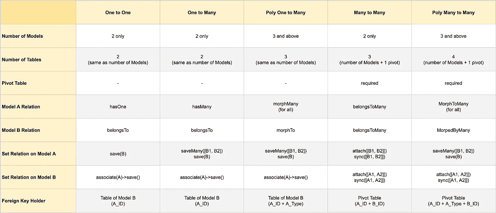
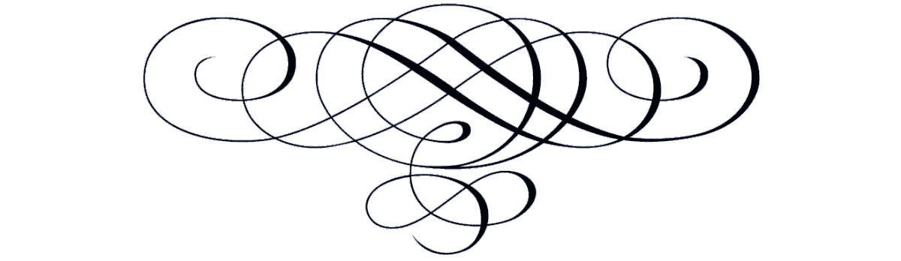

# 雄辩的关系备忘单

> 原文：<https://medium.com/hackernoon/eloquent-relationships-cheat-sheet-5155498c209>

Laravel 雄辩的 ORM 版本 5.5 的备忘单。



# 一对一的关系

## 演示详情:

在这个演示中，我们有 2 个模型(**车主**和**汽车**，以及 2 个表(**车主**和**汽车**)。

## 业务规则:

**车主**可以拥有一辆**车**。
汽车**可以归一个**车主**所有。**

## 关系图:



## 关系详情:

**汽车**表应该存储**车主**T21 的 ID 。

## 雄辩的模型:

```
class Owner
{
    public function car()
    {
       return $this->hasOne(Car::class);
    }
}class Car
{
    public function owner()
    {
        return $this->belongsTo(Owner::class);
    }
}
```

## 数据库迁移:

```
Schema::create('owners', function (Blueprint $table) {
    $table->increments('id');
    $table->string('name');
});Schema::create('cars', function (Blueprint $table) {
    $table->increments('id');
    $table->string('name'); $table->integer('owner_id')->unsigned()->index()->nullable();
    $table->foreign('owner_id')->references('id')->on('owners');
});
```

## 商店记录:

```
// Create relation between Owner and Car.$owner->car()->save($car);// Create relation between Car and Owner.$car->owner()->associate($owner)->save();
```

## 检索记录:

```
// Get Owner Car$owner->car;// Get Car Owner$car->owner;
```


# 一对多关系

## 演示详情:

在这个演示中，我们有 2 个模型(**小偷**和**汽车**)和 2 个桌子(**小偷**和**汽车**)。

## 业务规则:

这个**小偷**可以偷很多**车**。
汽车**可以被一个**小偷**偷走。**

## 关系图:



## 关系详情:

**汽车**表应该存储**小偷 ID** 。

## 雄辩的模型:

```
class Thief
{
    public function cars()
    {
       return $this->hasMany(Car::class);
    }
}class Car
{
    public function thief()
    {
        return $this->belongsTo(Thief::class);
    }
}
```

## 数据库迁移:

```
Schema::create('thieves', function (Blueprint $table) {
    $table->increments('id');
    $table->string('name');
});Schema::create('cars', function (Blueprint $table) {
    $table->increments('id');
    $table->string('name'); $table->integer('thief_id')->unsigned()->index()->nullable();
    $table->foreign('thief_id')->references('id')->on('thieves');
});
```

## 商店记录:

```
// Create relation between Thief and Car.$thief->cars()->saveMany([
   $car1, 
   $car2,
]);// Or use the save() function for single model.$thief->cars()->save($car);// Create relation between Car and Thief.$car->thief()->associate($thief)->save();
```

## 检索记录:

```
// Get Thief Car$thief->cars;// Get Car Thief$car->thief;
```


# 多态一对多关系

## 演示详情:

在这个演示中，我们有 3 个模型(**男人、女人**和**汽车)、**和 3 张桌子(**男人**、**女人**和**汽车**)。

## 业务规则:

**男**(买家)可以买很多**车**。
**女**(买家)可以买很多**车**。
**车**可以由一个买家(**男**或**女**)购买。

## 关系图:



## 关系详情:

**汽车**表应存储**买方 ID** 和**买方类型**。
*“买手”是对一群模特(男女)的称呼。而且不限于两个。买家类型是模型的真实名称。*

## 雄辩的模型:

```
class Man
{
    public function cars()
    {
        return $this->morphMany(Car::class, 'buyer');
    }
}class Woman
{
    public function cars()
    {
        return $this->morphMany(Car::class, 'buyer');
    }
}class Car
{
    public function buyer()
    {
        return $this->morphTo();
    }
}
```

## 数据库迁移:

```
Schema::create('men', function (Blueprint $table) {
    $table->increments('id');
    $table->string('name');
});Schema::create('women', function (Blueprint $table) {
    $table->increments('id');
    $table->string('name');
});Schema::create('cars', function (Blueprint $table) {
    $table->increments('id');
    $table->string('name'); $table->integer('buyer_id')->unsigned()->index()->nullable();
    $table->string('buyer_type')->nullable();   
    // or use $table->morphs(‘buyer’); instead of "buyer_id" and "buyer_type"});
```

## 商店记录:

```
// Create relation between buyer (Man/Woman) and Car.$man->cars()->saveMany([
   $car1, 
   $car2,
]);$woman->cars()->saveMany([
   $car1, 
   $car2,
]);// Or use the save() function for single model.$man->cars()->save($car);
$woman->cars()->save($car);// Create relation between Car and buyer (Men/Women).$car1->buyer()->associate($man)->save();
$car2->buyer()->associate($woman)->save();
```

## 检索记录:

```
// Get buyer (Man/Woman) Cars$men->cars
$women->cars// Get Car buyer (Man and Woman)$car->buyer
```


# 多对多关系

## 演示详情:

在这个演示中，我们有 2 个模型( **Driver** 和 **Car)、**和 3 个表( **drivers** 、 **cars** 和一个名为 **car_driver** 的数据透视表)。

## 业务规则:

**司机**可以开很多**车**。
**车**可以由很多**司机**驾驶。

## 关系图:



## 关系详情:

**Pivot** 表“car_driver”应存储**司机 ID** 和**汽车 ID** 。

## 雄辩的模型:

```
class Driver
{
    public function cars()
    {
       return $this->belongsToMany(Car::class);
    }
}class Car
{
    public function drivers()
    {
        return $this->belongsToMany(Driver::class);
    }
}
```

## 数据库迁移:

```
Schema::create('drivers', function (Blueprint $table) {
    $table->increments('id');
    $table->string('name');
});Schema::create('cars', function (Blueprint $table) {
    $table->increments('id');
    $table->string('name');
});Schema::create('car_driver', function (Blueprint $table) {
    $table->increments('id'); $table->integer('car_id')->unsigned()->index();
    $table->foreign('car_id')->references('id')->on('cars')->onDelete('cascade'); $table->integer('driver_id')->unsigned()->index();
    $table->foreign('driver_id')->references('id')->on('drivers')->onDelete('cascade');
});
```

## 商店记录:

```
// Create relation between Driver and Car.$driver->cars()->attach([
   $car1->id,
   $car2->id,
]);// Or use the sync() function to prevent duplicated relations.$driver->cars()->sync([
   $car1->id,
   $car2->id,
]);// Create relation between Car and Driver.$car->drivers()->attach([
   $driver1->id,
   $driver2->id,
]);// Or use the sync() function to prevent duplicated relations.$car->drivers()->sync([
   $driver1->id,
   $driver2->id,
]);
```

## 检索记录:

```
// Get Driver Car$driver->cars// Get Car Drivers$car->drivers
```


# 多态多对多关系

## 演示详情:

在这个演示中，我们有 3 个模型(**代客、车主**和**汽车)、**和 4 个表(**侍者**、**车主、** **汽车**和**司机**)。

## 业务规则:

**代客**(司机)可以开多辆**车**。
**车主**(司机)可以开多辆**车**。
**车**可由多名司机驾驶(**代客**或/和**车主**)。

## 关系图:



## 关系详情:

**枢轴**表“司机”应存储**司机** **ID** 、**司机** **类型**和**小车** **ID** 。
*“司机”是对一群模特(代客和车主)的称呼。而且不限于两个。驱动类型是模型的真实名称。*

## 雄辩的模型:

```
class Valet
{
    public function cars()
    {
        return $this->morphToMany(Car::class, 'driver');
    }
}class Owner
{
    public function cars()
    {
        return $this->morphToMany(Car::class, 'driver');
    }
}class Car
{
    public function valets()
    {
        return $this->morphedByMany(Valet::class, 'driver');
    }

    public function owners()
    {
        return $this->morphedByMany(Owner::class, 'driver');
    }
}
```

## 数据库迁移:

```
Schema::create('valets', function (Blueprint $table) {
    $table->increments('id');
    $table->string('name');
});Schema::create('owners', function (Blueprint $table) {
    $table->increments('id');
    $table->string('name');
});Schema::create('drivers', function (Blueprint $table) {
    $table->increments('id'); $table->integer('driver_id')->unsigned()->index();
    $table->string('driver_type');
    // or use $table->morphs(‘driver’); instead of "driver_id" and "driver_type" $table->integer('car_id')->unsigned()->index();
    $table->foreign('car_id')->references('id')->on('cars')->onDelete('cascade');
});
```

## 商店记录:

```
// Create relation between driver (Valet/Owner) and Car.$valet->cars()->saveMany([$car1, $car2]);
$owner->cars()->saveMany([$car1, $car2]);// Or use the save() function for single model.$valet->cars()->save($car1);
$owner->cars()->save($car1);// Create relation between Car and driver (Valet/Owner).$car->valets()->attach([
    $valet1->id,
    $valet2->id,
]);$car->owners()->attach([
    $owner1->id,
    $owner2->id,
]);// Or use the sync() function to prevent duplicated relations.$car->valets()->sync([
    $valet1->id,
    $valet2->id,
]);$car->owners()->sync([
    $owner1->id,
    $owner2->id,
]);
```

## 检索记录:

```
// Get driver (Valet/Owner) Cars$valet->cars
$owner->cars// Get Car drivers (Valet and Owner)$car->owners
$car->valets
```



> **在推特上关注我** [**马哈茂德·扎尔特**](https://twitter.com/Mahmoud_Zalt) **。**