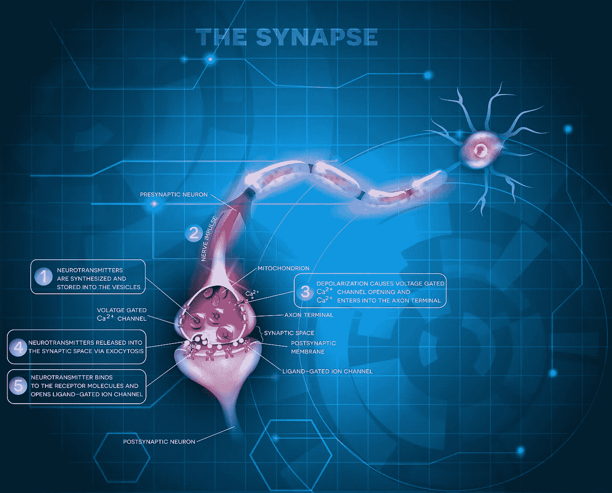

# 拥抱人工智能中的认知偏差以构建一次性学习者

> 原文：<https://medium.com/hackernoon/embracing-cognitive-biases-in-artificial-intelligence-to-build-one-shot-learners-8d8bd3aafb4c>

认知偏见受到了很多抨击。聪明的人会尽最大努力避免或减轻它们。科学家们试图在他们的实验中控制它们。确认偏差会比培养皿中的细菌更快地杀死实验。甚至顾名思义，它们是要不惜一切代价避免的东西。总而言之，“偏见”是一个极其可鄙的词。谁愿意被不公平的偏见和目光短浅？维基百科将认知偏差定义为“以某种方式思考的倾向，这种倾向会导致系统地偏离理性或良好判断的标准。”没有人想成为糟糕的思考者。

**但是如果我们对认知偏差的看法是错误的呢？**

如果给偏见命名会制造一个困住我们理解的监狱呢？因为它们被命名为固有的负面事物，我们的大脑会自动假设它们都是不好的，这本身就是一种偏见。你甚至还没走出大门，就开始有了消极的信念！

如果这种消极的信念结构让我们看不到它们对人工智能研究人员非常有用，那会怎么样？

换句话说:**如果它们是好东西呢？**

你看，我们可能对认知偏差有严重的偏见。我们有一个盲点。事实上，我认为许多认知偏差(尽管不是全部)如此重要，以至于它们应该被重新命名为“认知捷径”或“认知启发法”。随着人工智能科学在未来几年的发展，特别是在更小的数据集和无监督学习领域，我认为研究人员将更密切地关注这些“偏见”，并确切地了解它们是什么:帮助我们处理从很少到没有信息的学习的必要捷径。

OpenAI 的通信主管杰克·克拉克(Jack Clark)指出: **“我们正试图建立这样的系统，即…‘一次性学习’系统。这个想法是开发能够从少数甚至一个例子中学习有用的东西的系统。”**

目前成功的人工智能模型依赖于海量数据。有了深度学习，我们可以向机器输入数百万张肿瘤图像，神经网络可能会变得足够好，足以[精确定位癌症，其准确性让最好的放射科医生都感到羞愧](http://phys.org/news/2016-11-cancer-deep.html)。但是人类可以用更少的信息做到这一点。当你带一个孩子到后院扔球给他时，他不需要看一千万张人们扔球和接球的手绘图片来学习如何玩接球。他只是需要他的父亲和一点实验。给他几周时间，他会在这方面有一定的天赋。如果他继续成为一名专家，他肯定会学习更多的例子，但仍然远远达不到今天一台机器需要学习的数量。现在，由于潜在的天赋、才能和欲望，一些孩子会比其他孩子更优秀，但所有人似乎都有一些内置的通用学习算法。他们可以用少得惊人的输入来学习，这是[计算机还做不到的事情。](https://soundcloud.com/a16z/feifei-li-a16z-professor-in-residence)

自从我们第一次梦想智能机器以来，人工智能研究人员一直在寻求开发通用学习算法。

如果进化已经给了我们创造“一次性”学习者的答案，但我们错过了它们，因为我们称之为偏见，那会怎样？

认知捷径是我们应对世界的一种好方法。它们是算法和过滤器。它们让我们快速做出决定，避免危险，寻找食物，建立关系，了解我们周围的事情，同时保存我们的能量。你的大脑也想保存能量是有原因的。它可能需要它来做一些真正危险的事情。你大脑的主要工作是让你尽可能长时间地活着。如果你发现自己在一栋着火的大楼里，你会感谢你的大脑抓住那股能量，这样你就能找到出去的路。

坦率地说，我们不能没有偏见。我们需要他们。它们是进化给你的优雅礼物。他们解决了一个非常严重的问题。正如巴斯特·布鲁姆在他出色的认知“偏见”综述文章中指出的，世界上有太多的信息。你的大脑不可能一下子处理好。你没有足够的时间和精力。字面上。如果你必须把你见过的每棵树上的每片叶子都捡起来，你会蜷缩成一个胎儿的姿势，一天 24 小时都要吃饭，只是为了在再次倒下之前有足够的精力起床五分钟。你的大脑试图尽快挑出最重要的部分，这样你就可以在你的环境中采取行动。

我们开发了认知捷径，作为一种优雅的方式来限制每天每一秒向我们涌来的信息洪流。当你不知道下一步该做什么时，看看[其他人在做什么，然后模仿他们](http://25cognitivebiases.com/bias-15-social-proof-tendency/)，这是一个有用的策略。如果你没有很多例子，那么[给你手头的几个例子增加份量，或者记住](https://en.wikipedia.org/wiki/Availability_heuristic)，看看你能得出什么样的初步结论，这并不一定是件坏事。事实上，如果你的大脑对那段记忆赋予了额外的权重，那很可能是出于一个非常好的理由。你的大脑不只是传递随机搜索得到的第一个记忆。它给了你一个它认为对你最重要的东西。这可能是因为它是最痛苦或最快乐的，这是大自然如何给我们的神经网络增加“[权重](https://en.wikipedia.org/wiki/Synaptic_weight)”的。

一个很好的偏见的例子是，你天生就能发现快速运动。为什么？因为快速移动的东西会杀死你，比如蛇。事实上，蛇对我们的祖先来说是如此致命，以至于我们进化出了特定的启发式方法来发现它们，即使它们完全静止并伪装起来。在任何场景或图像中，人类都能比其他任何东西更快地发现蛇。即使我们完全错过了复杂背景中静止不动的其他事物，我们也能做到这一点。这是大脑进化处理我们世界中最重要的事情的一个例子。对我们来说就是生存和繁衍。对于计算机来说，情况会有所不同，但我们应该训练计算机拥有认知偏差，而不是回避它们。如果一辆自动驾驶汽车不能发现快速驶来的东西，它还能在这个世界上做什么？这对赛车和车上的每个人都是一种威胁，所以它最好注意并采取行动。

但是等等，你在想。毫无疑问，一些认知偏见是不好的。就拿[定型](https://en.wikipedia.org/wiki/Stereotype)来说吧。当然，我们可以同意，对整个群体的刻板印象本质上是错误和危险的？这导致了历史上一些最严重的虐待。

但是刻板印象能有用吗？最基本的刻板印象无非是在群体中寻找模式。他们的特征是群体中许多人共有的吗？当然可以。可以肯定地说，有些刻板印象相当准确。例如，被艺术吸引的自由派比保守派多。或者另一个例子是，保守主义者倾向于支持既有传统而不是新思想。刻板印象在晚宴上肯定是有帮助的。如果我猜对了，参加晚宴的那群人是保守倾向的，那么如果我是进步的，我可能最好避免像气候变化这样的特定热点话题，我的目标是吃一顿没有大辩论、大吼大叫和不愉快情绪的晚餐。

另一方面，刻板印象导致可怕结果的例子数不胜数。如果法官基于黑人更有可能犯罪的偏见，认为黑人更有可能成为惯犯，他可能会做出更严厉的判决。另一方面，如果一名警察认为一名穿西装的白人没有枪，因为他不符合他对罪犯的刻板印象，这可能会让他被杀。在最坏的情况下，刻板印象是种族灭绝等人类最可怕行为的主要理由。

这引出了一个严肃的问题。一条认知捷径是如何变成认知偏差的？有什么区别？为什么它在某些情况下有用，而在另一些情况下却是一场灾难？答案就藏在维基百科关于刻板印象的条目中:

“[刻板印象导致]不愿意重新思考自己对刻板印象群体的态度和行为。”

啊！就是我们懒得考虑新信息的时候。我们可能会先对人做出判断，然后当我们获得新的信息，应该改变我们的理解，我们忽略它，而不是拥抱它。我们不惜一切代价坚持原来的结论。那才是真正的认知偏差！就是我们停止学习的时候。

换句话说就是懒惰。

在我看来，懒惰是人类思维中唯一真正的缺陷。这是拒绝走得更远，拒绝鞭策自己，拒绝重新审视我们的世界模型。这可以追溯到我们保存精神能量的需要。这在一定程度上是有用的，但当走极端时，它会使我们目光短浅、僵化和不灵活。简而言之，这让我们产生了偏见。更糟糕的是，我们相信自己是绝对清晰、正确和合理的，这让我们陷入了一个错误和危险的思维循环，强化了我们的弱点，而不是我们的优势。

认知捷径给了我们第一个答案。但是我们应该随着新的信息去适应和改变。人类通常做不到这一点。对人工智能研究人员来说，好消息是计算机不会有这个问题。它们不担心保存所有的能量来躲避蛇的咬。我们可以开发模仿认知捷径的算法，让机器成为更好的“一次性”学习者，但计算机不会因懒惰而遭受折磨。随着新信息的出现，计算机将成为持续的学习者，随着时间的推移调整它们的理解。

我对人工智能研究者的挑战是重新思考你关于认知偏见的想法。从称它们为快捷方式开始。首先解放你的思想，然后回去看看旧的研究论文。我肯定我不是唯一一个从这个角度考虑的人。通过快速搜索，我确实找到了一些论文，在这些论文中，人们[探讨了与偏见同行，而不是试图减轻偏见](https://www.cs.cornell.edu/home/cardie/papers/mlj-final.pdf)。当然，大部分论文都被称为“[克服认知偏差](http://act-r.psy.cmu.edu/wordpress/wp-content/uploads/2015/09/Thomson-Lebiere-and-Bennati-2014-Human-Model-and-Machine-ACM-draft-052614.pdf)”或类似的东西，但这是意料之中的。我鼓励你看得更深。浏览前几个谷歌页面。人工智能中的许多想法正从过去回到我们身边，因为我们有马力和数据集来实际实现它们。我毫不怀疑，一些隐藏的宝石仍然埋藏在 20 世纪 60 年代至 90 年代的文件中。要找到它们，我们只需克服一个人的缺陷，并推动自己走得更远。

如果我们有勇气不断学习和调整我们的理解，就没有我们克服不了的偏见。

关于我:我是一名作家、工程师和连续创业者。在过去的二十年中，我涉及了从 Linux 到虚拟化和容器的广泛技术。你可以看看我的最新小说， [***一部史诗般的中国科幻内战传奇***](http://amzn.to/2gAg249) *在这部小说中，中国摆脱了共产主义的枷锁，成为世界上第一个直接民主国家，运行着一个高度先进的、人工智能的去中心化应用平台，没有领导人。你也可以查看一下* [***蝉开源项目***](http://iamcicada.com/) *，该项目基于书中的想法，概述了如何立即将该技术变为现实，你也可以参与测试。*

> [黑客中午](http://bit.ly/Hackernoon)是黑客如何开始他们的下午。我们是 T21 家庭的一员。我们现在[接受投稿](http://bit.ly/hackernoonsubmission)并乐意[讨论广告&赞助](mailto:partners@amipublications.com)机会。
> 
> 如果你喜欢这个故事，我们推荐你阅读我们的[最新科技故事](http://bit.ly/hackernoonlatestt)和[趋势科技故事](https://hackernoon.com/trending)。直到下一次，不要把世界的现实想当然！

