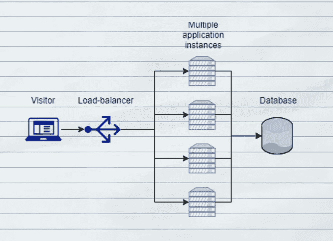
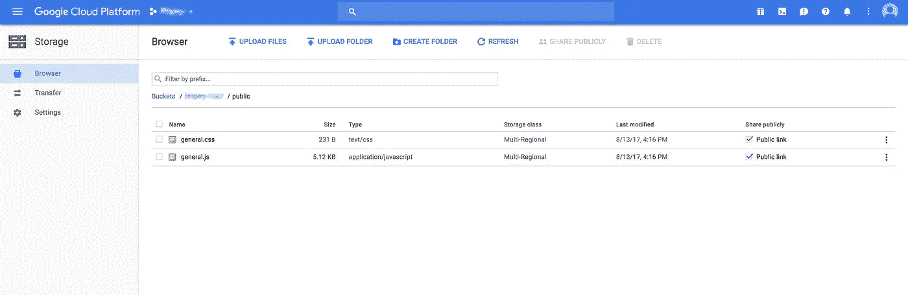

# 支持云轻松扩展应用

> 原文：<https://medium.com/hackernoon/empower-the-cloud-to-scale-applications-with-ease-c1a47d05cf88>


作为一名开发者，我想不断地构建和发布特性。如果出现问题，那么我希望能够**回滚**。另外**中央日志**应该开箱即用。最重要的是，应该有类似于**自我修复**的机制来避免 24/7 的感知。当我创建具有可伸缩性的应用程序时，我希望能够自动伸缩。如果有人在社交网络上分享我的应用程序，这可以让我降低成本，并处理大量的访问者。

自过去十年以来，情况发生了变化。存储非常便宜。云变得可支付，并减少了处理应用程序不断变化的流量峰值所需的工作量。此外，还有生产就绪的方法来隔离运行应用程序，如 [docker](https://hackernoon.com/tagged/docker) 。

我将向您展示如何将应用程序开发的最佳实践与云解决方案结合起来。

# 1.容器化应用

[集装箱很旧，docker 也没什么新的。但是改变的是容器周围的工具。如果我把我的应用程序放在一个容器中，那么我将获得很大的灵活性，并避免](http://blog.aquasec.com/a-brief-history-of-containers-from-1970s-chroot-to-docker-2016)[供应商锁定](https://en.wikipedia.org/wiki/Vendor_lock-in)。

例如，AWS (Lambda)的无服务器产品就是一个很好的例子。我可以将一些小功能部署到云上，并将它们连接起来，形成一个高度可扩展的系统。在这种情况下，我不需要管理任何东西。但是，如果我想换成另一种产品会怎么样呢？通常这很难。通常建议使用他们的数据库。在这种情况下，数据库也是完全托管的，并且高度可扩展。如果我同意使用他们有益的工具，他们就会抓住我。

因此，他们可以按照自己的意愿改变价格和报价。

**将我的代码隔离起来**保护我免受这样的牢狱之灾。我还尝试在开发、测试和生产环境中运行相同的应用程序，以降低复杂性。通过使用环境变量，我可以控制调试设置和其他环境细节。我将演示这有多简单。

通过使用正确的 Docker 映像，可以将 NodeJs 应用程序容器化。我创建了一个包含一些应用程序代码的简单文件:

```
// server.js
var http = require('http'); 
var ifaces = require('os').networkInterfaces();

http.createServer((req, res) => {
    // simulate some io like a db access
    setTimeout(() => {
        res.end('Hello it\'s '+ new Date())
    }, 50)
}).listen(8080)
```

要拥有有效的 NodeJs 应用程序，需要初始化 NodeJs 项目。

```
**$ npm init**(...){
  "name": "gcloud",
  "version": "1.0.0",
  "description": "",
  "main": "server.js",
  "scripts": {
    "test": "echo \"Error: no test specified\" && exit 1",
    "start": "node server.js"
  },
  "author": "",
  "license": "ISC"
}Is this ok? (yes) **yes**
```

下一步是创建 Dockerfile 文件，将应用程序放入容器中。我使用包含启动应用程序所需的每个步骤的 [node:onbuild image](https://github.com/nodejs/docker-node/blob/master/8.3/onbuild/Dockerfile) 。

```
# Dockerfile
FROM node:onbuild
EXPOSE 8080
```

就是这样！现在容器可以在本地构建和运行了。

```
$ docker build -t my-app:v1 .
$ docker run -p 80:8080 my-app:v1
```

之后应用程序运行: [http://localhost:8080](http://localhost:8080)

这意味着我现在可以:

*   在每个环境中运行这个容器(Windows、MacOS、Linux 等等)，
*   多次启动它(使用不同的端口:-p 81:8080，-p 82:8080，…)，
*   暂停、运行和更新它，
*   与他人共享此容器，
*   运行它不会对系统产生任何副作用。

这种灵活性允许我为我的应用程序自由选择最佳环境。请随意尝试。把它放在 AWS，谷歌云，Azure 或者老式的裸机服务器上。

# 2.创建无状态应用程序

伸缩的基础是能够将流量分配给运行我的应用程序的多台机器。当然，我可以用一个更强大的服务器替换我现在的服务器。但是这样做的成本更高，并且会达到无法再进行扩展的程度。

云有现成的工作负载均衡器，将流量分配给多台机器。**将状态保存在数据库或客户端使伸缩成为可能**。什么机器处理特定访问者的什么请求并不重要。



为了演示如何设置这样一个环境，我使用了谷歌云引擎。我也可以通过使用 AWS 等其他提供者来获得类似的结果。

按照我的指示，你需要[创建一个谷歌云账户](https://cloud.google.com/)。有一个免费的流量，你可以使用 1 年。因此你可以随便玩玩。但是要小心，总是关闭所有实例。否则会有意想不到的成本。为了安全起见，在你开始玩之前，定义一些限制。对我来说，这是一个恼人的负担，因为我害怕有意想不到的成本。

**体验云环境**非常重要。就这么做吧，探索如何托管当今的现代应用程序。它并不像你的直觉告诉你的那样危险:)。

特别是在 Google Cloud 上，有很棒的互动教程，总是关注清理使用过的资源。

安装完 [Google cloud sdk](https://cloud.google.com/sdk/docs/) 之后，你应该准备好了。我会用 Google App Engine 的[灵活变种](https://cloud.google.com/appengine/docs/flexible/)。这是他们产品的完全管理的变体。如果我需要更多的控制，我使用他们的容器引擎。

我可以上传一个 docker 容器，我将有一个运行设置。有一个小助手工具，为我准备云的应用。

```
$ gcloud beta app gen-config --custom
```

这将创建一个 *app.yaml* 文件并更新我的*docker 文件*。现在，我准备将我的应用程序部署到 Google App Engine。

```
$ gcloud app deploy
```

就是这样。这将需要一段时间，因为这是我的第一次部署。之后，我有 2 个运行实例。

```
$ gcloud app instances listSERVICE  VERSION       ID                                VM_STATUS 
default  20170813t112  aef-default-20170813t112927-cgvs  RUNNING
default  20170813t112  aef-default-20170813t112927-k4qg  RUNNING
```

现在，我有了一个基于我的容器的高度可伸缩的环境，它给了我很多很酷的功能。仅举几个例子:

*   当流量增加时自动放大和缩小，
*   无需停机即可重新部署我的应用程序，
*   将流量分流到不同版本以测试新功能，
*   出错时回滚到旧版本，
*   中央日志记录和
*   运行状况检查，并在出现问题时自动重启。

我已经应用了很多有益的工具，甚至在我考虑如果我的应用程序发展，这些东西在将来会很重要之前。

# 3.将 CDN 用于静态内容

除了与容器相关的特性，云还提供了更多。其中一个有用的特性是简单集成了一个[内容交付网络(CDN)](https://en.wikipedia.org/wiki/Content_delivery_network) 。[云存储](https://cloud.google.com/storage/)不是真正的 CDN，但具有类似的优势，并且非常易于使用。通常，cdn 用于提供静态内容。这些文件将存储在许多位置，以缩短请求的响应时间。将自动选择最近的可用位置来处理资源请求。尤其是现代应用程序有很多这样的问题:

*   图片，
*   Css，
*   字体和
*   动态客户端脚本(JavaScript)。

IO(数据库访问，文件访问)一直是 web 应用的瓶颈。因此，努力减少真正的请求总是好的。所有可以缓存的静态文件都应该被缓存。这大大减少了应用程序的工作量。我尽可能将简单的工作外包给高度专业化的系统。

如果我打开任何复杂的网站，比如亚马逊，我会看到大量的请求。他们的比例是这样的:

```
287 requests, 5.8 MB transferred, Finished after 1.4 secondsinitial request is about 103 KB~99% cachable
```

让我们计算一下创建一个可以处理 100 万用户的页面:

```
198 / 200 requests are static
1,000,000 users# a user will go from page to page every 10 seconds
1,000,000 users / 10 s = 100,000 full page loads / s
20,000,000 requests per seconds without a CDN200,000 requests per second with a CDN
```

从 *20，000，000 rq / s* 到 200，000 听起来可以实现。没有 CDN 这个目标似乎很重。这只是交通高峰时的负荷。但特别是我想乘着人群的浪潮。可能发生的最糟糕的事情是我的应用程序在如此激动人心的时刻崩溃。

回到我的例子，我添加了一个 JavaScript 和 CSS 到我的基本站点。因此，必要的请求增加了两倍。我可以使用谷歌云存储来外包我的静态文件。首先，我创建一个存储，允许公共读取访问，并同步我的静态资源文件夹:

```
$ gsutil mb gs://medium-example
$ gsutil defacl set public-read gs://medium-example
$ gsutil -m rsync -r ./public gs://medium-example/public
```

我打开谷歌云存储概述就能看到确切位置。



我可能只想访问生产环境中的存储托管资源。因此，我需要在我的应用程序中调整一些资源路径，如下所示:

```
**const resourcePath = process.env.ENVIRONMENT === "production" ? 'https://storage.googleapis.com/medium-example' : '.'**const simulateSomeWorkToDo = (pathname, res) => {
  // simulate some io like a db access
  setTimeout(() => {
    res.end(`
    <html>
      <head>
        <link rel="stylesheet" type="text/css"   
        href="${resourcePath}/public/general.css">
      </head>
      <body>
        Hello,
        it's ${new Date()}.
      </body>
    <script src="${resourcePath}/public/general.js"></script>
    </html>`)
  }, 50)
}
```

为了在我的生产应用程序中设置变量，我可以修改 app.yaml 文件。

```
env: flex
runtime: customenv_variables:
  ENVIRONMENT: 'production'
```

这就是我如何使用当今的云来专注于应用程序开发而不是运营。我使用容器在任何我想去的地方运行我的应用程序。通过使用像 Google App Engine 这样的容器管理解决方案，我有了一个预配置的集群，它有很多功能。通过将静态内容放入 CDN，我缩短了响应时间，节省了成本，并进一步提高了可扩展性。

能够快速**更新应用**真是太有趣了。或者通过执行单个命令**将它们发送到生产就绪环境**。我可以利用[金丝雀释放](https://martinfowler.com/bliki/CanaryRelease.html)或回滚，如果出了问题。我什么也没做就把 HTTPS 从盒子里拿了出来。**中央日志**，s **elf 修复机制，自动缩放**等等。最好的一点是:你不需要管理你的服务器。没有更新，没有重新启动，你的服务器没有问题。如果出现问题，云会自动用一个新的实例替换缺陷实例。

所有云提供商都在自动化运营方面花费了大量时间。这不是 devs 的主要业务。因此，我使用现有的解决方案。此外，我可以花更多的时间做对我的生意重要的事情。

如果你想看得更多，享受阅读的乐趣，那么请随意点击小按钮。如果你今天过得很好[，请在 twitter 上关注我](https://twitter.com/Journerist)。

# 参考资料:

*   [https://12factor.net/](https://12factor.net/)
*   [https://cloud.google.com/](https://cloud.google.com/sdk/docs/)