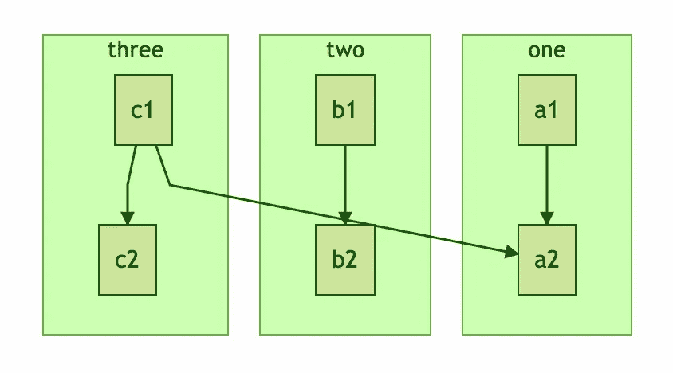

# 授权给你的用户，让他们可以钓鱼

> 原文：<https://medium.com/hackernoon/empowering-yours-users-so-that-they-can-fish-fbf5abb5c22b>

> 添加功能很容易；支持和维护它简直是一场噩梦！

Photo by Rafa Prada

有一天，我们收到了一个用户的反馈，问我们如果 [LightPaper](http://lightpaper.42squares.in/?utm_source=medium&utm_medium=link&utm_campaign=social) 支持[美人鱼](http://knsv.github.io/mermaid/#mermaid)库就好了。

我们以前从未听说过美人鱼图书馆，当我们开始研究它时，我们无法相信我们以前怎么可能从未听说过这么棒的图书馆。Mermaid 允许你使用类似 Markdown 的语法来添加不同类型的图表。

Mermaid and LightPaper — a match made in heaven?

正如你可能已经知道的那样， [Markdown](https://www.google.com/url?sa=t&rct=j&q=&esrc=s&source=web&cd=1&cad=rja&uact=8&ved=0ahUKEwiDp-uE1pPKAhWHMGMKHRVBDCAQFggdMAA&url=https%3A%2F%2Fdaringfireball.net%2Fprojects%2Fmarkdown%2F&usg=AFQjCNHv9KHN0sy6hbV7IQZFbHeB43L3qQ&sig2=UQKK1ZLHS_bsu9ue72wpqQ) 允许你用传统的文字处理软件做几乎所有你能做的事情，但是有纯文本的力量。Markdown 意味着内容第一；格式化只是一个工件和事后的想法。有了 Markdown(和一些语言扩展)，你可以添加表格、图片、链接、脚注、目录等等。

Markdown 唯一缺少的是一种添加纯文本图表的简单方法。考虑到所有这些，在 LightPaper 中支持美人鱼是一个完美的选择。

## 但是等等…

> “作为开发人员，最重要的工作不仅仅是实现一个功能，而是理解问题的根源，并找出实际需要完成的工作。”

作为开发人员，直接实现一个特性总是很诱人的。但最重要的是要弄清楚问题到底是什么，以及“要做的工作”到底是什么。

支持美人鱼实际上并不是主要问题。主要问题是能够轻松地添加第三方库来扩展 LightPaper 的功能。

支持开箱即用的功能是一个很好的营销工具。但是我们知道如果我们只是支持 Mermaid 开箱即用，那么添加一些其他库的请求将会不断出现。还有其他可能的问题:

1.  永远维护它的负担
2.  膨胀的代码库
3.  用户必须依靠我们发布最新版本的库
4.  支持噩梦——用户会认为库是我们产品的一部分，如果库有任何问题，他们会联系我们，甚至寻求库的帮助。

> 把增加每一个功能想象成与它结婚——一旦承诺，就很难收回。

## 不要给鱼，但是…

因此，为了避免这些可能的麻烦，我们在 LightPaper 1.2 中添加了一个新特性，允许用户添加任何任意的 CSS 或 JavaScript 源代码。这很棒，因为现在你不仅可以添加任何第三方库，还可以挂接自己的脚本和自定义 CSS。这样，您可以修改输出，而不必编写或更改预览主题。

这实际上开启了很多其他的可能性。添加像 [MathJAX](https://www.mathjax.org/) 这样的东西现在很容易，添加 [PrismJS](http://prismjs.com/) 也很容易——即使 LightPaper 开箱即用地支持它们。或者甚至使用 [PlainTextJS](https://github.com/dtjm/plaintext.js) 添加对其他纯文本格式的支持，比如 TaskPaper、Textile、Fountain。

我们要求我们的测试版用户试用这一新功能，到目前为止，我们只收到了积极的评价。甚至实际上告诉我们关于 Mermaid 的用户也说这比支持现成的库要好:

> 我无法形容这有多酷。

## 不是第一次了…

事实上，当人们要求能够将一篇文章直接上传到 WordPress、Tumblr、Medium 等热门博客时，我们以前也做过类似的事情。我们最终发现，大多数人实际上想看看一篇博客文章最终会是什么样子——有点像真正的预览。这就是为什么我们在 LightPaper v 1.1 中引入了 [Real Preview](http://blog.42squares.in/2015/11/25/feature-real-preview/) ，而不是支持 10 个不同的博客和随之而来的令人头疼的问题，并且用户再次喜欢这个特性！

## 一石多鸟…

所以下次当用户问你要一个特性时，不要只是一头扎进去开始实现，多想想实际的问题。试着设身处地为用户着想，看看这个问题是否能为更多的用户解决。这将不仅在实现阶段节省您的时间和资源，而且在将来您实际需要支持它时也会节省您的时间和资源。

厌倦了外观和功能都像“记事本”应用程序的昂贵的 markdown 编辑器？试试[**OS X**](http://lightpaper.42squares.in/?utm_source=medium&utm_medium=footer_link&utm_campaign=social)**的光纸。**

LightPaper 让您使用强大的功能编写文档/文章/博客，例如 markdown、[文件夹导航器](http://lightpaper.42squares.in/#sidebar-container)、[真实和实时预览](http://lightpaper.42squares.in/#preview-container)、[阴影注释](http://lightpaper.42squares.in/#shadow-container)、[多选项卡](http://lightpaper.42squares.in/#multitabs-container)、[自定义样式](http://lightpaper.42squares.in/#styles-container)、[无干扰模式](http://lightpaper.42squares.in/#styles-container)、[语法高亮显示](http://lightpaper.42squares.in/#extras-container)、[数学渲染](http://lightpaper.42squares.in/#extras-container)、[完全 GFM 支持](http://lightpaper.42squares.in/#extras-container)包括 GitHub 任务、 [Jekyll](http://lightpaper.42squares.in/#extras-container)

Try LightPaper for OS X

> 黑客中午是黑客如何开始他们的下午。我们是这个家庭的一员。我们现在[接受投稿](http://bit.ly/hackernoonsubmission)并乐意[讨论广告&赞助](mailto:partners@amipublications.com)机会。
> 
> 如果你喜欢这个故事，我们推荐你阅读我们的[最新科技故事](http://bit.ly/hackernoonlatestt)和[趋势科技故事](https://hackernoon.com/trending)。直到下一次，不要把世界的现实想当然！

