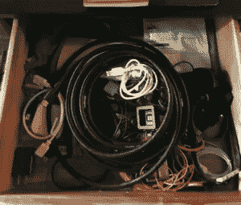

# 清空你的垃圾抽屉

> 原文：<https://medium.com/hackernoon/empty-out-your-junk-drawer-11b94bf2d91a>

每个人都有一个[垃圾抽屉](https://hackernoon.com/tagged/junk-drawer)。或者两个。或者十个。我的一个在左边。

每家[公司](https://hackernoon.com/tagged/company)也是如此。它现在通常被称为“实验室”(向臭名昭著的[谷歌实验室](https://en.wikipedia.org/wiki/Google_Labs)致敬，后者于 2011 年解散。)

我们已经看到许多公司建立实验室，作为尝试创造新产品的一种方式。在大多数情况下，大约一年后，这是一个随机狗屎垃圾抽屉。

在周一的 Techstars 会议上，为了回应我说的一些话， [Jason Seats](https://twitter.com/seats) 脱口而出“那只是把它放在垃圾抽屉里。”我喜欢座椅这样做——它让我停下来思考。而且，在这种情况下，他是绝对正确的——简单地删除我的想法(以及围绕它的活动)然后把它放入垃圾抽屉要好得多。

我开始讨厌“实验室”这个概念了幸运的是，我参与的大多数公司已经关闭了实验室，并以更系统的方式将其重新吸收到产品组织中。

在某个时候，我意识到，实验室要么是(a)一个随机的地方，让不再从事核心业务活动的创始人呆在那里，要么是(b)一个研究一系列产品无法取得进展的事情的地方。这两个都是基本问题。

如果(a)是创始人的随机位置，CEO 可能不会围绕创始人处理组织问题。或者创始人可能不知道如何与一个正在扩大的组织合作。有些情况下，你希望一位(或多位)创始人去做一个新的 R&D 项目，这个项目可以被称为实验室，但它应该专注于一个特定的产品创新，而不是一个没有定义的随机杂物箱。当我想到这里的成功案例时(我有一些)，它实际上是“新产品 R&D”而不是“实验室”，即使新产品还没有明确定义。但这导致了(b)。

如果(b)在一系列产品无法取得进展的事情上工作的地方，这通常出现在首席执行官(和潜在的创始人)对新产品开发的速度感到沮丧时。在我的世界里，当一家公司的第一个产品达到 500 万美元左右的收入时，这是一个反复出现的主题。这种情况会在未来的多个时间点再次发生，这是创办一家公司和扩大公司规模之间差异的一个很好的例子。这很容易归咎于产品组织，但实际情况往往比这更复杂。有时是单个高管；通常这是工程和运营组织(包括客户支持)互动的方式。有时，首席执行官们缺乏对如何在增加新产品的同时运营成熟/扩大产品线的理解。

在这两种情况下，将创建实验室作为解决问题的默认方法都不是好方法。而且，当我从 CES 回来的时候，我会把我的垃圾抽屉里所有的垃圾都扔掉。

*原载于***。**

******

> *[黑客中午](http://bit.ly/Hackernoon)是黑客如何开始他们的下午。我们是 [@AMI](http://bit.ly/atAMIatAMI) 家庭的一员。我们现在[接受投稿](http://bit.ly/hackernoonsubmission)并乐意[讨论广告&赞助](mailto:partners@amipublications.com)机会。*
> 
> *如果你喜欢这个故事，我们推荐你阅读我们的[最新科技故事](http://bit.ly/hackernoonlatestt)和[趋势科技故事](https://hackernoon.com/trending)。直到下一次，不要把世界的现实想当然！*

**