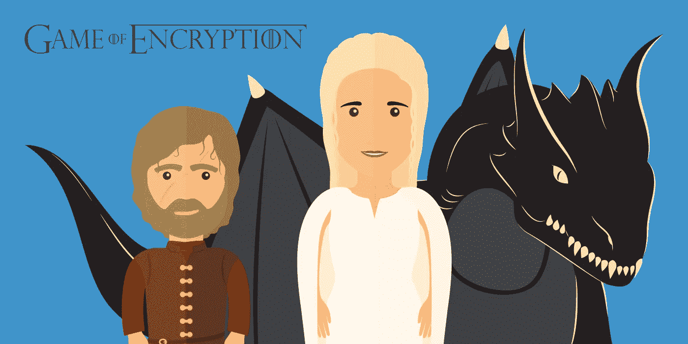
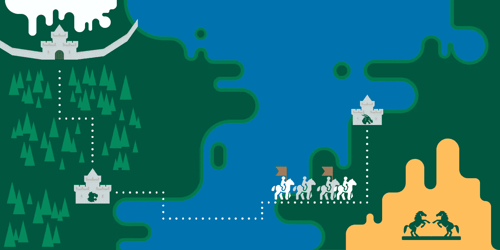
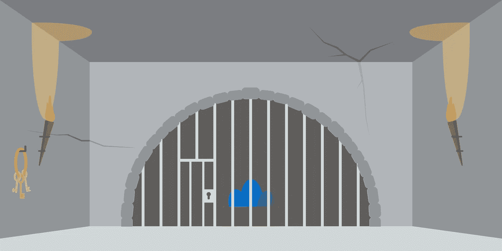

# 《权力的游戏》中解释的加密类型

> 原文：<https://medium.com/hackernoon/encryption-types-explained-with-game-of-thrones-3d2596ef4a0d>

## 你在云端的数据有你想象的那么安全吗？了解不同类型的加密，自己找出答案。为什么不用《权力的游戏》来实现呢？

我们经常听到的一个问题是:为什么我需要你的[加密](https://hackernoon.com/tagged/encryption)服务？我的云提供商也提供加密服务。到目前为止，我和我的数据没有发生任何变化。

嗯，你的云提供某种类型的加密来保护你的数据可能是真的。但是你知道什么数据是加密的，什么时间，用什么方式加密的吗？用《权力的游戏》来说:当丹妮莉丝、提利昂或艾莉亚·史塔克穿越维斯特洛和埃索斯时，你可能也想知道他们是否安全，是否活着，是否过得好。

# 你的墙够高吗？

另一个问题将我们带到了这里的利害关系:为什么你认为你的敏感数据，或者你的朋友，或者商业伙伴的数据比你最喜欢的电视节目中的虚构人物值得更少的保护？嗯，一个答案可能是，因为数据是抽象的，因为对数据的威胁比《权力的游戏》中发生的一切更隐蔽，也不那么明显可怕。

山姆威尔·塔利:“白行者在冰下沉睡了数千年。当他们醒来…
派帕:“当他们醒来…什么？”山姆威尔·塔利:“我希望这堵墙足够高。”

加密本身并不意味着安全。很有可能你的云提供商确实提供了加密，但不是在任何时候，也不是以一种确保任何人都无法访问你的数据的方式。本文通过《权力的游戏》中的例子展示了如何区分不同类型的加密。了解如何建造一堵足够高的[墙](http://gameofthrones.wikia.com/wiki/The_Wall)，保护您的数据免受大部分威胁。

**剧透提醒:本文包含关于《权力的游戏》的剧透。具体来说，一个是关于一个角色在第一季结束时的死亡，另一个是关于某个角色在六季中幸存至今的事实。如果您不想知道，请跳过端到端加密和哈希章节。**😉

# 加密类型—知识就是力量

当服务向你保证你的数据是加密的，你还是应该看一下细则。例如，静态加密和端到端加密之间有很大的区别。在这篇文章中，我们将解释一些最重要的术语，帮助您对数据的安全性做出明智的决定。之后，您可以自己决定想要为您的云采用哪种安全级别。你会注意到，尽管加密是一个复杂的系统，但它对每个人来说都是可以理解的，尤其是在用《权力的游戏》来解释的时候。

云、消息和在线安全领域最重要的术语是端到端加密、静态和传输中的加密、零知识加密和哈希。多亏了 WhatsApp，端到端加密可能是目前最知名的加密术语。请继续阅读，找出它到底是什么，以及它与提利昂·兰尼斯特有什么关系。

# 端到端加密—您的数据将不受任何影响，即使是《权力的游戏》

端到端加密意味着消息从离开一个领域到到达目的地都是安全的。想象一下勇敢的提利昂·兰尼斯特传递你的信息。他有守卫和同伴在从一个王国到另一个王国的旅途中保护他。今天已知的任何威胁都无法穿透这种保护。在起点和终点之间徘徊的任何东西都不能打败他。当他到达城堡时，信息也受到了保护，提利昂和他的同伴们没有放弃它，直到它被送到真正的接收者手中。

由于提利昂在《权力的游戏》迄今为止的所有赛季中幸存下来——这本身就是一个伟大的成就——他在我们今天所知道的世界中是不可能被破解的，就像非常安全的端到端加密一样。

用[连线](https://www.wired.com/2014/11/hacker-lexicon-end-to-end-encryption/) :
的话说，“端到端”的承诺意味着信息加密的方式只允许信息的唯一接收者解密，而不允许中间的任何人解密。换句话说，只有终端计算机持有加密密钥，公司的服务器就像一个不识字的信使，传递着它自己也无法破译的信息。”

这里的威胁等级是多少？其实很低。如果您的 messenger 使用端到端加密，您可以放心，没有人可以阅读，即使是服务提供商。

问题是，端到端加密并不真正适用于云存储，它是一种针对消息的加密系统。WhatsApp 和许多其他信使，如[threma](https://threema.ch/en)、 [Signal](https://whispersystems.org/) 或 [Wire](https://wire.com/en/) ，为信息提供端到端加密。然而，众所周知的云提供商——Dropbox、OneDrive、Google Drive 或 I cloud Drive——使用其他加密类型。如果你在你的云中通过链接共享数据，它也不是端到端加密的。

在 Dropbox、OneDrive 或 Google Drive 中共享数据的一个基于云的端到端加密选项是 [Whisply](https://whisp.ly/) 。它将您自己的提利昂添加到您的云链接中，从而使它们更加安全。

# 静止加密——只要女王站在你这边，你在君临就是安全的

静态加密是一些云提供商默认为他们的客户提供的，有时也用于私有和免费的云存储，但有时只从付费版本开始。这意味着一旦你的数据到达你的云，也就是他们的服务器，云提供商就会加密你的数据。

想象一下，丹妮莉丝把她珍贵的龙蛋藏在一个金库里，以防有人试图偷走它们，比如她嫉妒的哥哥韦赛里斯。静态加密的问题是丹妮莉丝只从别人那里租了这个金库，比如说布拉佛斯的铁银行。金库的提供者，钢铁银行，正在给她加密。多亏了铁银行，一个对伤害或偷窃鸡蛋感兴趣的外人将无法进入这个金库，除非他或她设法从丹妮莉丝那里偷到了这个金库的钥匙(密码)。

然而，丹妮莉丝并不是唯一一个拥有金库钥匙的人。租给她这个保险库的铁银行也有钥匙。如果有更有权力的人来敲门，铁银行可能会被迫交出钥匙。

实际上，这可能是美国当局引用了爱国者法案。从另一方面来说，这种比较是惊人的:龙蛋象征着丹妮莉丝的权力和权威。在我们数字化和全球化的世界里，数据也是力量。谁控制了数据，谁就负责。丹妮莉丝为保护她的力量而战，我们这些使用者也应该如此。

# 传输中的加密:您的数据在旅行期间是安全的

提利昂·兰尼斯特再次传递你的信息或数据，在从一个领域到另一个领域的旅行中，没有什么可以伤害他。但是，您并不真正知道数据到达目的地后会发生什么。提利昂只是把它交给别人。

这意味着将静态加密和传输中的加密结合起来并不能提供端到端的加密或零知识加密，因为在数据到达目的地和加密之间可能存在一个薄弱环节。提利昂将你的消息安全送达目的地。在这里，一名警卫接管并将信息放入保险库。然而，在这一点上，他可以阅读消息，复制它，或者复制锁定数据的密钥，以便他可以随时访问它。如果政府和当局要求的话，这也是一个让他们一窥究竟的绝佳时机。

# 零知识加密—或者带上您自己的龙

零知识加密在安全性方面类似于端到端加密。如果您对您的消息和共享云链接进行端到端加密，并且对您的云进行零知识加密，那么您的数据就不太可能发生任何问题。想象一下，提利昂·兰尼斯特和他的同伴们以及丹妮莉丝和她的龙们正密切关注着你的数据。一切都好，对吧？

让我们回到丹妮莉丝保护金库的问题上。现在，她的龙已经孵出来了，它们是她的超能力。因为她不想相信钢铁银行永远不会背叛她，她带来了自己的龙，除了她没有人可以进入金库。那些龙只听它们妈妈丹妮莉丝的话，对吗？

这同样适用于零知识加密。它给你完全控制的力量。除了你没有人可以进入保险库，因为你带着你自己的保护，也就是 BYOD，带着你自己的龙。所有内容在每个时间点都是加密的，除了你自己没人知道你的密码，因为它在离开你的设备之前就已经被散列了。

为您的云提供额外的加密解决方案，如 [Boxcryptor](https://www.boxcryptor.com/en/) ，保护您在布拉佛斯铁银行的金库，就像丹妮莉丝的龙会守护她最珍贵的东西一样。因此，如果你手头有龙来保护我们数字化世界中隐藏的超能力——我们的数据和隐私权——为什么不使用它呢？

# 哈希和盐——或者关于《权力的游戏》中的故事和因果关系

哈希是数据安全的一个重要元素。它们的一个常见用例是保护存储在服务数据库中的用户密码，另一个用例是电子邮件签名。

哈希是这样创建的:一个单词、一个句子或任何类型的数据都被输入到哈希函数中。这个散列函数将数据转换成看似随机的字符或数字的集合，但长度是固定的。对于相同的输入，输出总是相同的。但是，如果您只是稍微更改输入，散列将完全不同。重要的是，当给定输出时，你不能计算出输入是多少。

试着用《权力的游戏》的剧情和讲故事来想象一下。想象一下，你在第七季开始的几个星期后加入这个系列，之前没有任何知识。除非故事提供倒叙，否则你将无法说出一切是如何导致第七季的现状的。当前的情况是输出(散列),而您无法从这个单一的时间点获得输入(到那个时间点为止发生的所有事情)。

然而，如果你在第一季中稍微改变一下故事——假设奈德·史塔克活了下来——结果可能会完全不同，就像使用哈希函数一样。

因为我们不是在《权力的游戏》中，而是在非常真实的 IT 领域——安全领域，所以某个值的哈希值总是相同的这一事实存在一个大问题。当一个具有散列密码的数据库被黑客攻击，并且 200，000 个用户具有相同的密码时，散列也将是相同的。如果该密码的哈希是已知的(如果您使用“password”或“123456”的可能性很大)，则哈希不再保护该密码。解决办法是:盐和胡椒。

Salting 意味着在密码中添加另一个部分，例如用户的电子邮件地址和一些特定于应用程序的字符串，然后对这些部分进行哈希运算。由于您的密码、应用程序特定的字符串和您的电子邮件地址的组合很可能是唯一的，因此攻击者无法仅获取哈希并搜索它来获取您的密码。他必须为你的散列重新尝试所有的密码猜测——这花费了太多的时间。Pepper 是一种进一步的保护机制——不开玩笑，他们真的这么叫它——它给代码中的输入添加了另一个术语。这个术语存储在数据库之外的其他地方，这样黑客在抢劫数据库时就不会得到它。如果没有密码，他们就无法检查自己的密码猜测是否正确，这让一切都变得更加安全。

例如，我们在 Boxcryptor 就是这样做的。你的密码被散列，加盐和胡椒。为了实现零知识—请记住，我们不知道您的密码—密码甚至在到达我们的服务器之前就在您的设备上进行哈希运算。为了确保万无一失，它会在我们的服务器上再次进行哈希处理。这样，你就可以在不知道你的密码的情况下被服务认证。

因此，当你使用的服务声称他们通过散列法保护你的密码时，你最好希望——或者问——他们会不会先加点盐和胡椒。

# 突破口就要来了。云加密

我们不想耽搁你太久。下面是对哪家云提供商使用哪种加密技术的简短比较。如果你已经知道了所有的内容，请马上向下滚动到这一页的末尾。

## Dropbox

*   [静态加密](https://www.dropbox.com/help/security/safe-to-use)又名布拉佛斯的铁银行。但是没有龙。
*   [传输中的加密](https://www.dropbox.com/help/security/safe-to-use)使用 SSL/TLS。
*   密码是用盐和胡椒混合而成的[。](https://blogs.dropbox.com/tech/2016/09/how-dropbox-securely-stores-your-passwords/)

## Google Drive 个人账户

*   [传输中的加密](https://productforums.google.com/forum/#!topic/drive/QH7rOcS-cCo;context-place=topicsearchin/drive/encryption):“所有进出你的设备的传输都使用 HTTPS 和 TLS。”
*   静态加密:显然[不是](https://productforums.google.com/forum/#!topic/drive/QH7rOcS-cCo;context-place=topicsearchin/drive/encryption)。所以最好自己加密你的 Google Drive 数据，加一些龙。

## 谷歌商务驱动

*   [静态加密](https://support.google.com/googlecloud/answer/6056693)就像在布拉佛斯的铁银行一样。但是最好带上你自己的龙，尤其是如果你在欧洲经营商业数据的话。

## OneDrive

*   “我们已经实施并将保持适当的技术和组织措施，旨在保护您的信息免遭意外丢失、破坏或篡改；未经授权的披露或访问；或非法破坏。”([在线服务隐私声明](https://www.microsoft.com/en-us/privacystatement/OnlineServices))。要么相信微软认为合适的东西对你也有好处，要么带来你自己的安全。
*   OneDrive 业务:静态加密[和传输中加密](https://technet.microsoft.com/en-us/library/dn905447(v=office.15).aspx)。

## 亚马逊 Drive 和 Prime Photos

*   "你有责任维护适当的安全和保护你的文件."([使用条款](https://www.amazon.com/gp/help/customer/display.html?nodeId=201376540))。好的，明白了。我会带上我自己的龙。

## iCloud Drive

*   [静态加密](https://www.apple.com/privacy/approach-to-privacy/)又名布拉佛斯的铁银行。但绝对没有龙。
*   使用 SSL/TLS 进行传输加密。

请分享或推荐这篇文章来支持我们。帮助我们传播知识，帮助其他人理解加密，以便有朝一日云中和通信中的数据安全和隐私成为规范。