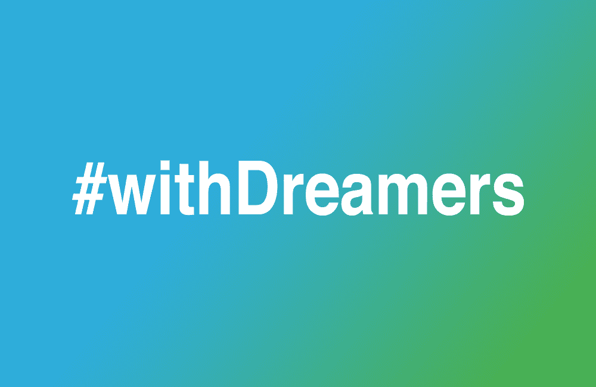

# 科技巨头谴责 DACA 末日

> 原文：<https://medium.com/hackernoon/end-of-daca-condemned-by-tech-giants-dace67473c17>

## 脸书、谷歌、易贝、苹果、微软、Salesforce、Linkedin、Twitter……硅谷与梦想家站在一起，表达自己的不满。

“对我们国家来说，这是悲伤的一天，”马克·扎克伯格在决定宣布后在《脸书邮报》上说终结 DACA 的决定不仅是错误的。给年轻人提供美国梦，鼓励他们走出阴影，相信我们的政府，然后为此惩罚他们，这尤其残忍。"

苹果公司的蒂姆·库克(Tim Cook)周末在 Twitter 上发帖，强调该公司大约 250 名员工是梦想家:“我和他们站在一起，”他说。“他们应该得到我们平等的尊重，也应该得到植根于美国价值观的解决方案。”

同样在 Twitter 上，微软总裁兼首席法律官布拉德·史密斯呼吁国会采取行动，通过急需的立法。

[在一篇长长的博客文章](https://blogs.microsoft.com/on-the-issues/2017/09/05/urgent-daca-legislation-economic-imperative-humanitarian-necessity/)中，Smith 提醒我们“这 80 万人来到我们国家时还是孩子。”

他说:“他们在这个国家长大。他们参加了我们当地的学校，并把数百万美国公民视为朋友。他们遵守我们的法律，在这里纳税，并自愿向联邦政府申请 DACA 救济。他们忠于这个国家，把时间和金钱贡献给当地的教堂、学校和社区团体。梦想家是我们国家的一部分。”

> 他们属于这里。

谷歌的桑德尔·皮帅回应了这些评论。

“梦想家是我们的邻居、朋友和同事，”他在推特上写道。“国会需要立即采取行动。”在 1400 条转发中还有

[Salesforce 的首席执行官马克·贝尼奥夫昨天在推特上发表了一句简单的话……和一张 GIF 图片。](https://medium.com/u/268314bb7e7e#DACA”
<figure class=)

> [DACA =爱。首席执行官❤️·达卡！](https://medium.com/u/268314bb7e7e#DACA”
<figure class=)

[Linkedin 的杰夫·韦纳(Jeff Weiner)写道:“我有幸遇到的一些最有韧性、最有天赋、最有奉献精神的年轻人是梦想家。废除该计划在任何层面上都是错误的。”](https://medium.com/u/268314bb7e7e#DACA”
<figure class=)

 [## 杰夫·韦纳在 LinkedIn 上写道:“一些最有弹性的，...

### 我有幸遇到的一些最有韧性、最有天赋、最有奉献精神的年轻人是梦想家。废除…

www.linkedin.com](https://www.linkedin.com/feed/update/urn:li:activity:6310942585628172288) 

推特的杰克·多西在推特上强调，“终结#DACA 是对那些想要为我们的未来做出贡献的人的毁灭性打击。”