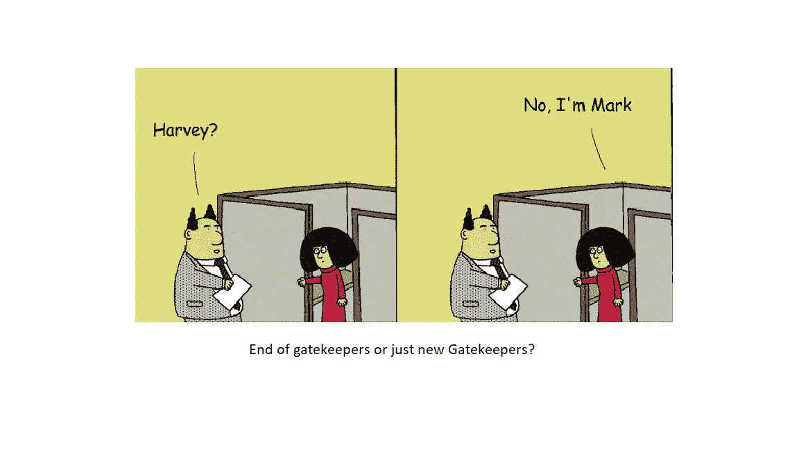
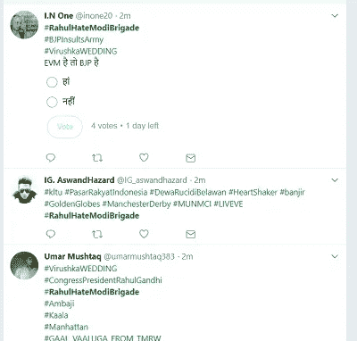
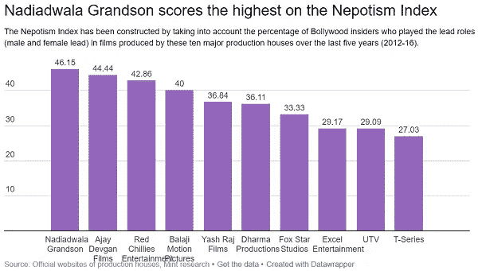

# 守门人的终结，还是只是新的守门人？

> 原文：<https://medium.com/hackernoon/end-of-gatekeepers-or-just-new-gatekeepers-f7a2aac3e738>

End of Gatekeepers? Original Image copyright: Dilbert.

温斯坦丑闻爆发大约一周后，本·汤普森写了一篇关于守门人时代终结的大胆文章。[https://stratechery.com/2017/goodbye-gatekeepers/](https://stratechery.com/2017/goodbye-gatekeepers/)

温斯坦是典型的看门人。他利用自己作为温斯坦公司负责人和无数未来女演员命运决定者的地位对女性进行性骚扰。

> *“温斯坦涉嫌向《纽约时报》施压——以及他影响媒体的能力——基于媒体也是看门人的事实*”

本说，温斯坦在媒体的关系意味着一个故事可能会被扼杀。互联网无疑改变了这一点——大部分是积极的。通过赋予每个人发布的能力——它打破了障碍——现在每个 Twitter、Whatsapp 和脸书的用户都是记者。有时候，一个故事会像病毒一样传播开来，帮助人们关注传统媒体报道不足的问题。

然而传统媒体仍然有很多分销渠道。这意味着广告/付费用户大军可以被用来控制社交媒体的趋势&从而控制整个叙事。拥有最多美元的人在现实世界中最有影响力，脸书也是如此。

[http://www . livemint . com/Consumer/fmndrnomzwzlxye 0 rfe FSK/How-to-manufacturing-a-Twitter-trend . html](http://www.livemint.com/Consumer/FmndRnomzWZlXye0rFEfSK/How-to-manufacture-a-Twitter-trend.html)——Twitter 上一篇关于制造业趋势的像样文章。

Users spamming with hashtags to game the trend algorithm

在#FakeNews 时代，至关重要的货币是信任。互联网使得揭露或概述传统媒体叙事中的错误成为可能。我希望这能使他们在编辑标准上更加严格，并对公众负责。

国大党所有审查实例的众包列表。

但是我们如何让个体出版商更加负责任呢？？

在线下世界，出版商/报纸非常重视他们的声誉。然而，谁应该让个体出版商负责呢？新兴出版物的增长与其制造争议的能力密切相关，这又如何呢？

Twitter 的 blue tick 程序——本应认证(知名人士的)身份，却给了人们(主要是记者)一种权利感和重要性。

# YOUTUBE 和电影

Youtube 为许多创作者打开了大门。更多的人有机会成功。BB Ki Vines 的 Bhuvan Bam 是大明星之一——令人敬畏的内容。米提拉·帕尔卡在马拉地语电影中大放异彩。但即使很少有人像 PewDiePie 一样只需要 Youtube 来赚钱，对于绝大多数创作者来说——Youtube 是通往圣杯的大门——电影和更大的名气。

The Gatekeepers are still strong in Bollywood

但是圈内人仍然掌握着宝莱坞的钥匙。LiveMint 做了一篇关于宝莱坞裙带关系的大文章。

[http://www . livemint . com/Consumer/fzftxzio 9 oqt 9 kmeswn9 ei/Which-Bollywood-producer-scores-high-on-the-the-the-neptomism-Inde . html](http://www.livemint.com/Consumer/FZftXzIO9oQt9KMesWN9eI/Which-Bollywood-producer-scores-highest-on-the-Nepotism-Inde.html)

网飞和其他订阅服务正在占据大量以前由电影占据的空间。然而，网飞的铸造和生产过程像温斯坦公司一样不透明。

然而，由于网飞是一家上市公司，不像 T 系列，它可能会更负责任。最近一段时间，我们看到网飞更换了一部电视剧的男主角，因为有报道称他们遭到性骚扰。Youtube 删除了煽动暴力的视频。脸书正试图解决假新闻问题

新的守门人

脸书、推特、Youtube 和网飞是新的守门人。他们用算法和模糊的政策取代了过去的看门人。

*推特解释了为什么不删除川普关于朝鲜的推文。*

事实是，谁控制了发行，谁就控制了叙事。希望新的守门人比旧的守门人对规则更加透明。

**链接**:

1.  本·汤普森关于守门人末日的文章。[https://stratechery.com/2017/goodbye-gatekeepers/](https://stratechery.com/2017/goodbye-gatekeepers/)

如果你觉得这篇文章有用，请随时点击绿色的“掌声”按钮——多次:)，并发表评论。

如果你试一试，我会很高兴的。可以关注我的 [*推特*](http://www.twitter.com/vernekard)