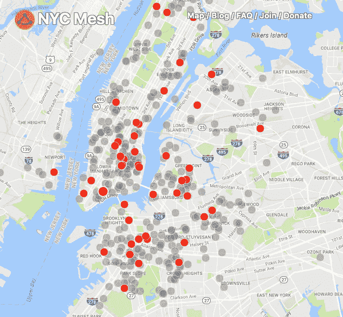

# 终结网络中立:限制你连接自由的 FCC 该死的冰山一角

> 原文：<https://medium.com/hackernoon/ending-net-neutrality-tip-of-the-fcc-fuckery-iceberg-that-limits-your-freedom-to-connect-d0d117b5f91>

本周，联邦通信委员会将对网络中立进行投票。联邦通信委员会主席和前威瑞森律师 Ajit Pai 希望不仅仅是结束网络中立。不要以为我们只需要担心被困在慢车道上，FCC 可能会让 ISP 阻止你使用信息高速公路的入口匝道。关于 Bit Torrent、[等证据确凿的案例，Pai 认为【Comcast 等互联网服务提供商阻止使用某些技术(威胁到他们的市场地位)的历史没什么大不了的。像威瑞森、美国电话电报公司、康卡斯特和时代华纳这样的公司提出的论点是，为了更好地管理网络，他们需要有快速通道和慢速通道。苏珊·克劳福德(Susan Crawford)撰写并发表了大量文章，讲述了由于康卡斯特(Comcast)等公司的垄断行为，美国在公共宽带接入方面远远落后于其他工业化国家。](https://arstechnica.com/tech-policy/2017/11/comcast-throttling-bittorrent-was-no-big-deal-fcc-says/)

不幸的是，这很容易造成稀缺的假象，因此公司可以逃避数据上限和额外的访问费用。

## **稀缺与丰富的概念问题**

ISP 垄断者欺骗了公众，让他们认为互联网上有“细管道”,我们缺乏传输比特的能力。

我和 Bob Franks ton(visi calc(第一个电子表格)的共同创建者)等成员在一个列表服务中，他最近发布了:

> 我们有一个完整的电信行业，其前提是假设比特是由想象中的骡子长途运输的货物。或者也许是火车…
> 
> 然后我们用一个已经失去任何意义的词——宽带——然后想要更多，即使它意味着用隐喻制造整个产业。然后我们讨论有限的带宽——比如用完了几英寸，或者用完了纽约的地平线。

在一次 Ted 演讲中，鲍勃向听众提出了这样一个问题:“你们中有多少人付钱给人行道供应商来这里？”那么，我们为什么要接受这样的想法:让必须盈利的提供商决定他们想要对我们的连接自由施加什么样的限制？

## **互联网服务提供商希望法规保护他们**

共和党人和许多公司抱怨政府监管，但他们已经写了州法律来“监管”市政当局提供自己的宽带的能力，声称控制“通行权”的能力将使一些小城镇获得相对于 AT&T 等公司的不公平竞争优势。ISP 垄断者资助了美国立法交易委员会，该委员会游说州立法机构限制市政宽带网络的建设，甚至将其定为非法。

## **建立你自己的网状网络，保护你连接的自由**

是时候一起绕过 ISP 垄断者了。在互联网交换点与其它网络对等，无需传统 ISP 即可访问互联网。在纽约，我们有一个快速增长的网状[网络](https://hackernoon.com/tagged/network)。[https://nycmesh.net](https://t.co/6G3wvYMvVX)

> NYC Mesh 是一个社区拥有的网络。加入我们的网络以取代您当前的互联网连接。
> 
> 我们的网络由遍布全市的 Wi-Fi 路由器“节点”和“超级节点”组成。该网络直接连接到互联网主干网，因此我们不依赖于 ISP。我们所有的网络节点合作分发数据，在紧急情况或互联网关闭时，网络也可以独立运行。
> 
> NYC Mesh 是一个中立的网络，不会阻止或歧视内容。NYC Mesh 不会收集、存储、监控或记录通过我们网络的任何用户流量或内容。
> 
> 我们的 [ASN](https://en.wikipedia.org/wiki/Autonomous_system_(Internet)) 是 AS395853，我们连接到[德 CIX 互联网交易所](https://en.wikipedia.org/wiki/DE-CIX_New_York)。请[联系我们](mailto:peering@nycmesh.net)与我们的网络同行。

[Join](https://nycmesh.net/join/) our Community Owned Network

最后，感谢 goFCCyourself.com 的约翰·奥利弗。现在就去给联邦通信委员会点颜色看看。