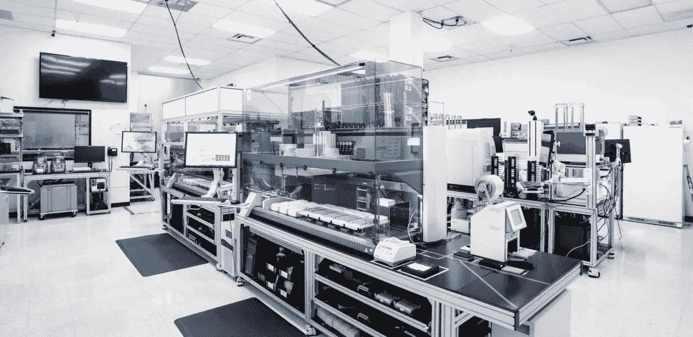

# 工程生物学改变世界

> 原文：<https://medium.com/hackernoon/engineering-biology-to-change-the-world-6e6526ce4d74>

2011 年，我在《纽约时报》上看到了[德鲁·恩迪](https://en.wikipedia.org/wiki/Drew_Endy)写的一篇关于将[工程](https://hackernoon.com/tagged/engineering)和计算引入生物学的文章。生物计算机、智能工程植物和活细胞数据存储的概念让我充满好奇和兴奋。将基础生物学知识与工程学原理结合在一起的想法启发了我。那年夏天，我飞往斯坦福进行暑期实习，在那里我第一次潜入了合成生物学的世界。

6 年后，我现在在 Zymergen 工作，这是一家利用软件、自动化和合成生物学来创造更好产品的公司。我加入自动化团队是为了建立一个平台，让我们能够释放生物学的力量。

数百万年的进化发展出了被称为细胞的微小、多功能的工厂。它们储存制造各种有用分子所需的指令(DNA)和机器(细胞器)。在过去的 40 年里，基因工程革命使我们能够在利用机器的同时编辑这些指令。这导致了化学品和药品的生物生产，否则这是不可能的。曾经需要 23500 只动物的 8000 磅胰腺来制造一磅胰岛素。今天，大部分胰岛素是在大型发酵罐中由转基因酵母生产的，这种生物也曾被用来制造啤酒和面包。

我们现在正处于一场新的革命之中。测序和合成 DNA 的时间和成本正在迅速下降。廉价的计算能力和处理单元的创新为人工智能的性能和应用的飞跃铺平了道路。实验室自动化的进步使得通量和效率比以往任何时候都要高。

我们正在一个很大程度上未被书写的未来中工作。实验设计的经典规则让位于基于发现的方法。自动化工作流减少了对吞吐量和资源的传统限制。科学家的直觉现在可以通过数据驱动的模型得到增强。Zymergen 将这些[工具](https://hackernoon.com/tagged/tools)整合在一起，定义了生物工程和技术的新时代。我很高兴能参与其中。

页（page 的缩写）我们正在招人。

> [黑客中午](http://bit.ly/Hackernoon)是黑客如何开始他们的下午。我们是 [@AMI](http://bit.ly/atAMIatAMI) 家庭的一员。我们现在[接受投稿](http://bit.ly/hackernoonsubmission)并乐意[讨论广告&赞助](mailto:partners@amipublications.com)机会。
> 
> 如果你喜欢这个故事，我们推荐你阅读我们的[最新科技故事](http://bit.ly/hackernoonlatestt)和[趋势科技故事](https://hackernoon.com/trending)。直到下一次，不要把世界的现实想当然！

