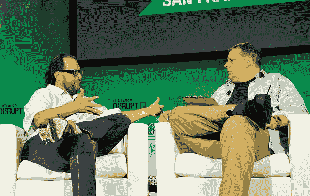

# 选择早期创业的工程师指南

> 原文：<https://medium.com/hackernoon/engineers-guide-to-picking-an-early-stage-startup-d9dfaea62902>

## 我希望 10 年前就知道的事情

我经常从我指导的工程师那里得到的一个问题是，你如何决定什么样的早期创业值得努力？通常，这是在你拥有付费的客户标识或大牌风险投资基金之前很久的事了，这些都是潜在成功的“信号”。

我曾经是一名程序员。我也不得不考虑这个问题。我如何决定？

十多年来，我一直在打造新产品和新业务，以下是我希望自己早就知道的事情。

# 复杂性是你的敌人

大多数伟大的公司都是建立在用(事后)明显的新观点解决大问题的基础上的。让我们举几个例子:

*   **优步**:解决了一个显而易见的问题——在繁忙时间找不到出租车。他们有一个有点明显的观点——为什么我们不用这些新的 iPhones 来找出汽车在哪里，然后把它们送到这里。是的，之后变得相当复杂，但核心前提并不复杂，难以理解。
*   当马克·贝尼奥夫(Marc Benioff)见到他的技术联合创始人(帕克·哈里斯(Parker Harris)、戴夫·莫伦霍夫(Dave Moellenhoff)和弗兰克·多明格斯(Frank Dominguez)时，他遇到了一个明显的大问题——企业软件应该更像 Amazon.com——可以作为互联网上的网站访问。他打算从建立销售人员管理销售线索的方法开始。

> 这个世界充满了复杂性。这些创始人的天才在于找到复杂问题的简单解决方案。

优步正慢慢着手解决运输物流问题，利用云计算、移动支付、基于手机的 GPS 系统等，建立一个司机和用户的实时市场。

> 如果你看到了所有这些复杂性，却不能将其归结为简单的一行问题陈述，你可能会成为伟大的经济学家，但不会成为初创公司的创始人。

# 市场是你的朋友

很难说它比马克·安德森更好(他认为安迪·拉赫勒夫帮助思考这个问题)。一如既往，他是对的:

*   当一个伟大的团队遇到一个糟糕的市场，市场就赢了。
*   当一个糟糕的团队遇到一个伟大的市场，市场就赢了。
*   当一个伟大的团队遇到一个伟大的市场，一些特别的事情就会发生。

让我们把这个应用到几个例子中。

*   优步:如果你看看负面媒体和他们一路走来犯下的所有错误，美国和外国公司投入的数十亿美元决心减缓它的增长——公司幸存下来，并做得很好，主要是因为市场需要它。数百万消费者(和司机)的生活变得更好，因为我们花了数十亿美元解决了一个关键问题。
*   这是一个遇到了伟大市场的伟大团队。我知道，因为我很幸运从第一天起就在那里。首席信息官们每年在存储和计算基础设施上花费超过 1000 亿美元。当你做出更好的东西时，你可以在不到 7 年的时间里从零到 10 亿的收入。

> 你不可能在一个百万美元的市场中建立一个十亿美元的公司。无论我们投入多少机器学习、云计算、聪明的 UX 和设计。

Salesforce Founders — the Engineers and the CEO. It worked out well.

Find your Benioff (source: [FlickR](https://www.flickr.com/photos/techcrunch/15005667709/in/photolist-oRZYdM-aVfRSD-97tgTV-9sLA5G-9sHzZ2-fND4vc-9sLAc9-fNBQjR-9sLA8m-dcszJJ-9sHzXr-dcsx1U-8HxKt6-dcqFwK-cc9XoL-dcsoqh-dcsBgA-dcsBZA-dcshhV-aigkKL-dcsnWN-dcs73y-dcqCYi-9sLAd9-dcsk1G-fNBRfM-fNVBFA-dcrXUa-dcrW9u-dcsox4-dcsjkC-fNBPya-dcs9UB-dLzw38-dcs1Sb-dcsuYz-fND5jp-dcsrKh-dcqEm4-7eJKcT-dcs8SA-8HxLg6-dcsoTX-dcsmTt-dcrSXw-fND59R-atiRwL-andmuW-97woBo-8HurGe))

# 首席执行官:她能筹集资金吗？她能卖吗？她能雇佣吗？

创业是艰难的，你必须在有限的数据下做出艰难的决定。你必须从投资者那里筹集资金，这些投资者在鸡尾酒会上很友好，但当你必须筹集资金时，他们变成了真正的*银行家*。你需要一个能帮助风投看到愿景的 CEO。

> 所有的创业公司都是钱用完就死。

首席执行官的工作是找到你的前 10 个客户。她能做到吗？人们会因为她有洞察力、魅力和可信度而听她的吗？如果答案是肯定的，那你就走对了路。

> 所有的创业公司都是在客户用完的时候死掉的。

现在，你有了一位可以筹集资金并获得首批客户的 CEO，但她能招人吗？你能想象你的朋友想为她工作吗？

> 所有的创业公司在没有工程师的时候都会死掉。

# 愿景和使命

几乎所有对创业旅程的分析都表明，调整风险后，你最好还是保留那份大公司的工作。

> 归根结底，只有当创业比你的生活方式更好时，你才应该创业。

虽然以上启发是我作为投资者和高管判断产品和创业公司的方式，但没有人知道创业公司是否会成功。

如果团队的愿景和使命与你一致，那就开始这段旅程吧。如果它通过了淋浴测试。如果你在与创始人会面两天后醒来，想到你希望与他们一起工作。如果你的想象力允许你看到这个初创公司的早期幼苗有一天会真正成为一个改变大事情的公司。

作为我的导师和榜样，马克·贝尼奥夫经常说:

> 人们高估了你一年能做的事情，也低估了你十年能做的事情，除非你是苹果 CEO 史蒂夫·乔布斯。

当加入一家初创公司时，关注这家公司在 10 年后会发生什么变化。这让你兴奋吗？

*__*

我们正在为我们的创业公司招聘员工。如果你是一名工程师，想和我一起工作——给我发邮件，地址是 prekari.com 安舒

> [黑客中午](http://bit.ly/Hackernoon)是黑客如何开始他们的下午。我们是 [@AMI](http://bit.ly/atAMIatAMI) 家庭的一员。我们现在[接受投稿](http://bit.ly/hackernoonsubmission)，并乐意[讨论广告&赞助](mailto:partners@amipublications.com)机会。
> 
> 如果你喜欢这个故事，我们推荐你阅读我们的[最新科技故事](http://bit.ly/hackernoonlatestt)和[趋势科技故事](https://hackernoon.com/trending)。直到下一次，不要把世界的现实想当然！

