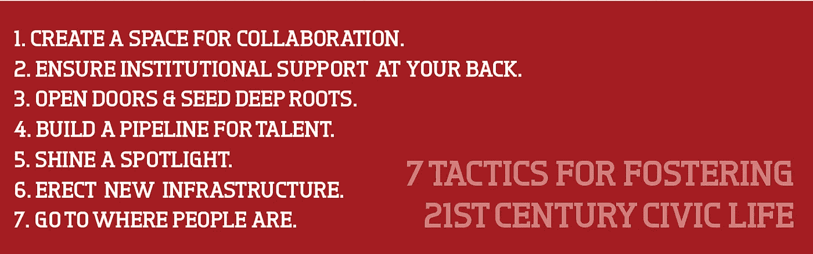

# 公民企业家精神的引擎

> 原文：<https://medium.com/hackernoon/engines-of-civic-entrepreneurship-f9630b7229ff>

## 城市将公民热情转化为有意义的公民行动和企业家精神的聪明方法

法国观察家亚历西斯·德·托克维尔指出，在我们的美式民主中，我们想象中的私人生活和公共生活之间的界限对于现实来说过于粗糙、过于严格。当他记录我们年轻的共和国的早期时，他看到的是一个社会，围绕着小城镇构建，充满了各种各样的协会:政治的、公民的、社会的等等。在曾经发生火灾的地方，一支志愿者队伍被集结起来应对未来的灾难；在需要建桥的地方，一队队的人聚在一起开始工作。美国的社团生活无处不在，它不是由自我或幻想定义的；取而代之的是共同的需要和集体的决心。

美国以自己的方式具有创业精神。

虽然从那时起发生了很大的变化——消防部门不再是志愿者经营的，公共工程维护我们的道路和桥梁——但核心思想仍然存在。在一个民主国家，当人们团结在一起时，他们可以在政府内外做大事。过去，公民在政府没有做到的地方挺身而出。现在，由于新的工具和技术，我们看到了更深层次的合作。我们看到公民和他们的公共代表一起努力寻找满足他们社区需求的最佳方式，加强他们，并为 21 世纪定义一种新的企业家精神:一种明确的公民精神，并偏向于创新。

# 培养 21 世纪公民生活的 7 个策略

放眼全国，你可以看到各种各样的策略和方法来利用这一新的创新机会。不过，也出现了一些共同的主题。下面是一些策略的*工作列表(我重复:*一些*——这是我非常希望继续添加的东西)聪明的城市和其中的社区被证明是有效的:*

## *创造一个协作的空间*

> *“这不是群众的智慧，而是群众中某个人的智慧。不是网络本身聪明；而是个人变得更聪明，因为他们与网络相连。”史蒂文·约翰逊*

*公民技术空间以一种有意义的方式区别于其他领域:通常情况下，它不是零和的。城市之间没有竞争力，通常，一个城市的公民组织、企业家或初创公司也没有竞争力。因此，合作不仅是可以接受的，而且是受到鼓励的。要实现这种合作，密度以及由此产生的随机连接至关重要。好人需要好的地方才能走到一起。*

1.  ***合作/创客空间** : [1871](http://www.1871.com/) (芝加哥)[市民大厅](http://civichall.org)(纽约) [Ctrl 集体](http://www.ctrlcollective.com/) (LA)*
2.  ***聚会** : [一百万杯](http://www.1millioncups.com/)(堪萨斯城)*
3.  ***黑客马拉松/每周黑客夜**:芝加哥、洛杉矶、旧金山等*

## *确保机构支持和资金支持*

> *“硅谷已经形成了一个工程师和风险资本家的临界质量，以及所有的支持结构——律师事务所、房地产，等等——这些都实际上是为了接受创业公司。”——埃隆·马斯克*

*但是越来越不仅仅是硅谷有这样的支撑结构。全国各地的城市都在利用其独特的资产，无论是当地的产业、历史悠久的慈善机构，还是年轻的天使投资者，来为新企业家积累资本资源。甚至超越开支票，为本土创业公司提供建议、指导和关系支持。*

1.  ***VC /机构资金**:[Arch Angels](http://www.stlouisarchangels.com/)(STL)；[戈尔德赫什基金会](http://www.goldhirshfoundation.org/)(洛杉矶)； [Awesome 基金会](http://www.awesomefoundation.org/)，GovTech 基金(各城市)*
2.  ***私人赞助** : [索克拉塔](https://www.socrata.com/newsroom-article/open-data-platform-provider-socrata-sponsors-national-day-civic-hacking-donating-data-hosting-platform-technical-support/)(西雅图)[阿扎维亚](http://www.summerofmaps.com/)(费城)*
3.  ***地方加速器/孵化器** : [影响枢纽](http://www.impacthub.net/)(各城市)[1776](http://www.1776.vc/)(DC)[智慧芝加哥协同](http://www.smartchicagocollaborative.org/)， [TechStars](http://www.techstars.com/) (各城市)*
4.  ***地方融资新(众包)模式** : [睦邻](https://neighborly.com/go)*

## *敞开大门，深深扎根*

> *“21 世纪的主要断层线不是在右或左之间，而是在**开放**或封闭之间。”亚历克·j·罗斯[我的强调]*

*一种不同的“旋转门”正在全国各地的城市出现:市政官员不是永久离开市政厅去私营部门工作，而是出去几个小时参加当地的会议，或者邀请市政创新者进去真正了解市政挑战。*

1.  ***与市政厅的关系** : [现任首席创新/技术官](/@abhinemani/on-boston-politics-and-the-arc-of-civic-innovation-be37621f947f#.twaivv5xi)、 [FastFWD](http://fast-fwd.org) (费城)、常驻企业家( [SF](http://entrepreneur.sfgov.org) 、 [Boston](http://newurbanmechanics.org/boston/join-our-team/) & LA)*
2.  ***公民实习/奖学金** : [市长创新奖学金](http://innovatesf.com/) ( [SF](https://manhattan.edu/content/san-francisco-mayors-innovation-fellowship) )，[美国奖学金代码](http://codeforamerica.org)(各城市)*

## *为创新者/人才/能源建立渠道*

> *“……我所看到的城市和大都市地区现在正在开始关注**基本面**……**你有技术工人以及大学、公司、企业家和工会之间的合作吗，这样你才能真正竞争和繁荣……”** —布鲁斯·卡茨*

*俗话说:“如果你建造了它，他们就会来。”不完全是。黑客空间和伙伴计划的好坏取决于你在里面找到的人。这就是为什么各个城市都在大力投资当地的智力“资本”——培养有才华的企业家，然后鼓励他们留在自己的城市使用他们的才能。*

1.  *当地大学、社区学院或学校:康奈尔理工大学(纽约)、CUSP 大学(纽约)、哈里斯公共政策学院(芝加哥)*
2.  ***技术培训/技能分享**:编程女孩、铁路桥梁、图书馆数字扫盲项目(全部在多个城市)*

## *点亮聚光灯*

*猜测动机可能是一个冒险的游戏，尤其是当你开始将公民利益和商业利益混合在一起的时候。人们很容易认为，进入公民空间的企业家是受现金驱动的，而且仅仅是现金。但是正如许多城市所显示的那样，有办法在不投入资金的情况下吸引、鼓励和动员企业家。让他们知道这座城市在他们身后，这座城市支持他们，他们正在帮助他们的城市。借力城市的*声音*作为*首都*，其天字第一号讲坛。*

1.  ***媒体** : Technical.ly(费城、DC 等)*
2.  ***竞赛:** [NYC 大应用](http://bigapps.nyc/p/)、 [LA2050](https://www.la2050.org/) 、OpenDataRace(费城)*
3.  ***市长/名人表彰:** [为 LA 黑客& I.am.Angel 基金会](https://www.youtube.com/watch?v=12r-3PechX4)，市长参与黑客马拉松(多个城市)*

## *建立新的市政(数字)基础设施*

> *你看，一个国家的伟大并不需要一些巨大的纪念碑让所有人都看到。这不是一个通往特定目的地的旅程，而是一个持续不断、永无止境改进的承诺。”—桑尼·濮培德*

*以前有市民聚集的市政厅和公园；诚然，这些问题依然存在，但对话已经发生了变化。在线。(很大一部分。)那么，我们需要的是投资于新型的市政基础设施，以促进我们在数字时代的参与——无论是大参与还是小参与。*

1.  ***社区参与的公民应用** : [城市回答&填字游戏](http://www.codeforamerica.org/blog/2012/08/13/honolulu-answers/)；[local wiki](http://localwiki.org)；[Textizen](https://www.textizen.com/)；[混音](http://getremix.com/)；[麦迪逊，OpenGov 基金会](http://www.routefifty.com/2016/01/dc-open-data-madison/125129/)*
2.  *[**打开数据**](/@abhinemani/rethinking-data-portals-30b66f00585d)*

## *去人们在的地方*

> *“……民有、民治、民享的政府..”—林肯*

*随着新的工具和界面出现在城市空间，总是有新的和闪亮的趋势。这不仅破坏了现有团体和机构的价值，而且完全忽略了公民生活的目的——民有民治。这就是为什么我们看到真正的*智能*城市是为了包容而建设的，无论是通过依靠广告牌或公交车站来传播信息，还是通过敲门来获得用户反馈，或者连接到现有的公民网络并赋予他们实现其核心目标的新手段。这些聪明的城市正在连接数字和模拟来完成工作。*

1.  ***实地、持续的反馈** : [市民用户测试小组](http://www.cutgroup.org/)(芝加哥)*
2.  ***持续外展/用户参与** : [NYC311](https://www.behance.net/gallery/4277419/NYC-311) (实体广告)[市政厅即将](http://www.cityofboston.gov/cityhalltogo/)(波士顿)*
3.  ***现有社区组织** : [LISC](http://www.lisc-chicago.org/index.html) (芝加哥)[居委会](https://www.lacity.org/city-government/subscribe-meeting-agendas-and-more/neighborhood-councils)(洛杉矶) [CfA 大队](http://brigade.codeforamerica.org)*

*如前所述，这是一份主题和策略的工作清单(考虑到该领域的变化速度，它可能有点过时，而且肯定偏向于我工作过的城市)。请分享您的想法、评论或编辑。——安*

******

> *[黑客中午](http://bit.ly/Hackernoon)是黑客如何开始他们的下午。我们是这个家庭的一员。我们现在[接受投稿](http://bit.ly/hackernoonsubmission)并乐意[讨论广告&赞助](mailto:partners@amipublications.com)机会。*
> 
> *如果你喜欢这个故事，我们推荐你阅读我们的[最新科技故事](http://bit.ly/hackernoonlatestt)和[趋势科技故事](https://hackernoon.com/trending)。直到下一次，不要把世界的现实想当然！*

**