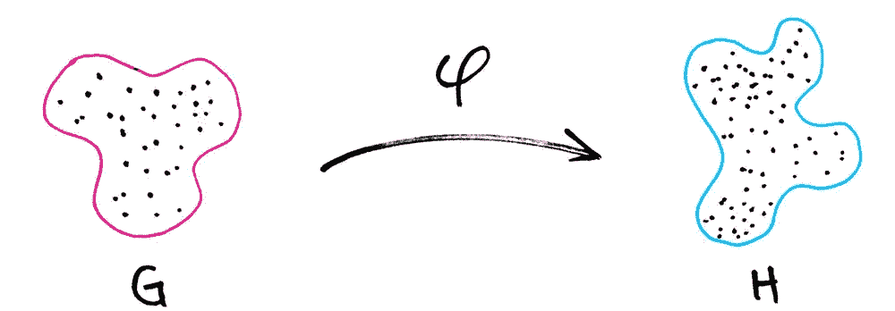

# Groovy 的增强未来

> 原文：<https://medium.com/hackernoon/enhanced-futures-for-groovy-b8b8956543fa>

在 Scala 中工作一段时间后，从函数式编程的角度来看，一些常见的问题看起来更容易了，尤其是在并行系统中工作时。

我今天不得不用 Groovy 写了一些多线程代码。我不是一个很棒的专家，但远非如此。然而，不管是哪种语言，编写并发代码都不应该那么难，对吗？

正在讨论的问题如下。我需要运行一些代码，A，当 A 完成时，我需要运行一些其他代码 B 和 c。这些链可以像我需要的那样复杂。

我查看了 Groovy 并发工具集。我可以创造未来。不错！这应该很容易。

思考我想在 Scala 中做的事情。

这是链接异步计算的一个非常好的方法。

现在，如果我有另一个计算链，比如说`anotherFuture`

我们可以使用 Scala ***对*** 进行同步。

在这里我们可以用 ***代替*** ，因为未来是一个单子，或者说是一种单子，至少它在大多数时候表现得像一个单子。

回到我的 Groovy 代码，我发现那里的未来和 Scala 的几乎没有共同之处。

在 Groovy 中，要运行异步操作，我们需要这样的东西。

为了从`future`中得到结果，我们必须在这里做`future.get()``.get()`将以 Scala 相同的方式阻塞。问题是我找不到一种方法来定义如何处理`future`的结果而不被阻塞。

当然，我可以通过 do 向池提交多个任务。

但这不是我需要的。我必须能够链接操作，并将一个任务的结果传递给下一个异步任务。

好吧，我自己完成了。

我们将把我的新未来叫做`Continuation`，这只是我取的一个名字，没什么特别的。它将从 Future 继承，所以我们也可以将它发送到一个执行池，我们最后将添加一个单子映射函数或方法，这是它们在 Groovy 中的调用方式。

为了创造一个延续，我们需要传递它将使用的未来。

Continuation 实现了 future 的相同功能，但使用的是潜在的 Future。

最重要的部分是延续增加了一个新功能，`map`。函数`map`接收一个`Closure<B>`和`ExecutorService`作为执行池，并通过创建一个新的 Future 返回一个新的`Continuation<B>`，该 Future 从 async 获取值并传递给`Closure`。*注意，这是一个非阻塞操作。*

回到最初的问题。

我们现在可以用 Groovy 来做。

在这里，`y`是传递给下一个`.map`的`someLogicB(x)`的结果。

注意，我们将`pool`传递给每个 map，但是记住 Scala Futures 需要一个隐式传递的 ExecutionContext。

## 结论

Scala 并发性很棒，这不是秘密。然而，我们不能被自己选择的语言拒之门外( *Scala 是我的*)。有时候我们需要用手头的工具来解决问题。如果您没有或没有找到所需的工具，那么就自己去构建它。

不要害怕`Monad`。单子是一种数学结构，在编程中有着广泛的用途，尤其是在函数式编程中。单子是链接操作的一种非常有趣的方式，正如我们在`map`中看到的。我们的`Continuation` 不是一个 ***完整的*** 单子，而是`map`背后的想法是从*那里来的*。

记得先写你的测试。