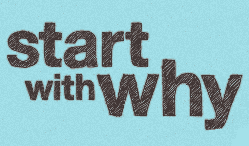

# 企业家——为什么你在下一次风险投资中需要这条建议

> 原文：<https://medium.com/hackernoon/entrepreneurs-why-you-need-this-advice-for-your-next-vc-pitch-e4312e064356>

# 企业家推销

每天，在沙丘路的办公室里，创始人都会与风险投资家会面，推销他们的产品。对于企业家来说，这些不仅仅是会议。它们是决定性的时刻，也许是改变人生的时刻。

只有真正无知的人才会对这种规模的会议毫无准备。坚如磐石的商业计划？检查。技术路线图？检查。走向市场战略？市场分析？财务预测？

检查。检查。检查。

然而……尽管竭尽全力，许多企业家并没有真正准备好迎接他们职业生涯中最重要的会议之一。他们没有准备好回答最基本的问题:为什么？

# 风投真正寻找的是什么

风投告诉我们，也告诉全世界，他们想要回答的关键问题不是“你是做什么的？”而是“你为什么要这么做？”

答案永远不会是“因为我们认为它会赚钱。”当然这个计划是为了赚钱；那是必然的。没有人在写商业计划时不相信自己的想法能赚钱。

所以“为什么”这个问题的答案是一定是完全不同的东西。最佳答案包含一种信念。一种信念。一种想做一些伟大的、有意义的、令人信服的事情的发自内心的渴望。

至少，企业家应该想要产生影响——并且相信这样做不仅是可能的，而且是不可避免的。

## 为什么？

成功的企业家必须能够从多个方面阐明这个为什么:为什么是这个产品？为什么是现在？为什么市场需要这种解决方案(即使——尤其是如果——市场还没有认识到或理解这种需求)？

但最重要的是，成功的企业家需要能够解释为什么他们的产品或解决方案或公司很重要。会对世界产生什么影响？为什么这个想法会让他们兴奋？风投正在寻找与更大的想法一致的东西——甚至可能是一个高尚的想法。

所以:不要忘记在向风投推销时谈论“为什么这很重要”。在阐述他们的价值主张、增长预测、技术能力和市场机会时，大多数企业家都非常坚定。但是在你的推介材料中保留一小部分来回答“为什么？”

“为什么”不是一个很难回答的问题。但是这是一个很难从内心回答的问题……要确信是什么激励着你，为什么你每天起床去实现它。

称之为“为什么”,或者称之为你定义品牌的第一步。不管怎样，确保这是你推销的一部分，它比你想象的更重要。

[**Emotive Brand**](http://www.emotivebrand.com) 是一家旧金山品牌战略和设计咨询公司，与创始人、初创公司、高增长公司和风投合作。

**如需进一步阅读，您可以欣赏**

你的品牌做出承诺了吗？

[为什么消息传递对于颠覆性技术如此困难？](https://www.emotivebrand.com/b2b-messaging/)

[创业初期投资品牌的六大理由](https://www.emotivebrand.com/?s=6+reasons)

*原载于 2017 年 3 月 22 日*[*www.emotivebrand.com*](https://www.emotivebrand.com/entrepreneurs/)*。*

> [黑客中午](http://bit.ly/Hackernoon)是黑客如何开始他们的下午。我们是阿妹家庭的一员。我们现在[接受投稿](http://bit.ly/hackernoonsubmission)并乐意[讨论广告&赞助](mailto:partners@amipublications.com)的机会。
> 
> 如果你喜欢这个故事，我们推荐你阅读我们的[最新科技故事](http://bit.ly/hackernoonlatestt)和[趋势科技故事](https://hackernoon.com/trending)。直到下一次，不要把世界的现实想当然！

