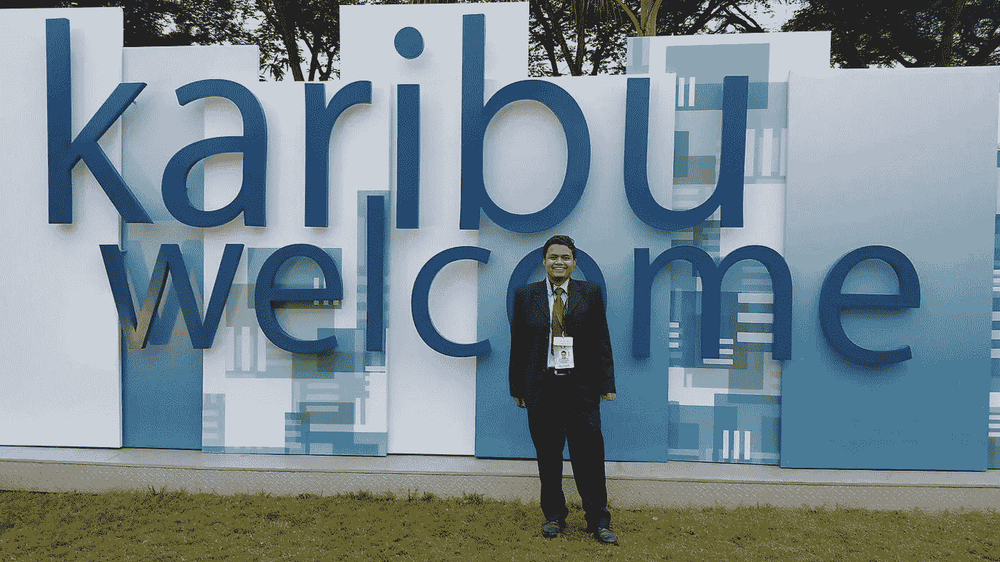

# 我 24 个月的渴望

> 原文：<https://medium.com/hackernoon/entreprenuership-journey-7165d9c3bfa8>

## 企业家的旅程

如果你时间紧迫，没有时间读这些东西，这是一篇充满失败色情、动机色情和现代创业热潮中一个被宠坏的孩子的故事的帖子，别无其他。

I ended up attending Global Entrepreneurship Summit aka had opportunity to meet some wantaprenuers, real entrepreneurs and failed entrepreneurs who claim to be as ecosystem builders.

***那我想做什么？***

2015 年 5 月，我辞去了软件工程师的工作。辞职的原因有很多，与钱无关，而是我觉得在那里不受尊重，没有成就感。我的卫生因素还可以，但是动机因素就不行了。我和我的经理的私人关系非常糟糕。

事实上，我没有做任何新的事情，我非常不开心，想在宇宙中创造一个凹痕。我在构建 OLAP 立方体，在一些生产系统上写 SQL。

我还兼职做一些咨询工作。我也计划去德国读硕士。我辞职了，说我要继续深造。我申请了德国 7 所学校的计算机科学硕士学位，我有 7 年和 5 年的雅思经验，但我被拒绝了，因为我本科的 C-GPA 很差。

我开始着手我的咨询项目。我也开始自己制造一些产品，和当地投资者一起制造一些。

***问题，解决方案，问题***

我没有专注于一件事。我开始和一个当地投资者以及几个合作伙伴一起建立 SaaS ERP。投资者是已知的，但在条款上有分歧。没有与第一个合伙人合作，继续与第二个合伙人合作，因为我们没有经验，我们聘请了一位顾问来指导我们，结果这位顾问成了伪专家。

投资者应该通过投资来制造产品，而不是他们开始销售并从客户那里获得报酬。付款被延迟，我们停止了产品的开发。我们尝试了其他一些 SaaS 或电子商务解决方案，也没有成功。

我们开始主要做咨询工作，也就是为国内外客户提供解决方案。有时我有固定的客户，没有好的开发人员，有时好的开发人员也没有固定的客户。当我既有优秀的开发人员，又有固定的付费客户时，它运行得很好。

***会议召开，视觉碰撞***

我已经申请了很多创业会议。并开始[网络](https://hackernoon.com/tagged/network)与国内外很多人，创业社区。

我发现人们主要是为了赚钱和生存。没有建立品牌或提供更好服务的愿景。同样，客户也非常相似——这是一个傻瓜游戏，现在依然如此，最好的傻瓜是赢家，现在依然如此。

我和所有的联合创始人都有观点冲突，我想问题出在我身上，我不能信任他们。我不能给他们提供固定的长期客户，他们想要的只是赚钱。我想投资建筑产品，但他们对此不感兴趣。客户交付受阻，开发商虚张声势，我也失去了一些客户，也不得不离开一些客户，因为离谱的要求，不定期付款等。

*我发现在整个商业世界中存在着巨大的信任真空，没有人信任任何人，客户不信任开发者，开发者不信任客户等等。*

**商学院*，谈恋爱***

然后在 2016 年中期，我开始学习一些 HBS 在线课程。开始准备商学院的申请，也做了 2 个在线课程。那时，突然一颗破碎的心落在我身上，要我和她结婚。

这些破碎的心经常来娶我，因为我有一个很好的名声，是一个没有关系的好人。我告诉她我不想利用你心碎的处境。但是我犯了一个可怕的错误，在拒绝了很多次之后，我又回到了她身边。

她说了很多浪漫的废话，我摔了一跤，摔得很重。我变得情绪崩溃。我也破产了，烧掉了我的积蓄。

***求职、工作搜索、志愿服务***

我又开始找工作，主要是项目管理/产品管理，有几份工作机会，但都没用。我开始寻找远程工作或工作量也不太大的升级工作。

在那段时间里，我积极参加我的志愿工作，很少参加会议，在我的志愿活动中过得很愉快。

***诀***

我第一次出国，是在非洲。然后我去了马来西亚、新加坡和印度的许多邦。我一直想去旅行，这是一次很好的经历，不用担心回来的问题。

***我现在在做什么？***

2017 年伊始，我在感情上和经济上都破产了。我不得不做很多艰苦的工作。

我只见过那个女孩 5 次，那为什么我感觉那么糟？然后我意识到我在解决很多家庭问题，职业破碎，我在寻找一个庇护所或藏身之处。

但是她从来没有告诉我她会在我身边或者她爱我。她让我变得坚强。她告诉我没人会帮你，你信任的人会在你需要他们的时候虚张声势。你会从完全陌生的人那里得到帮助——这成为了现实。

我哭泣，禁食，散步，写作，发短信给她绝望。然后我发现我到底在做什么？有人必须和我在一起，她会无缘无故和我在一起。她只是需要有人陪她出去，来治愈她破碎的心。在这个过程中，她让我变得坚强。就在我们交谈的最后一天，她也告诉我同样的事情，如果你因为这样的小互动而变得如此破碎，你会遭受很多痛苦。

事实上，之前没有人告诉我浪漫的事情，也没有人想结婚，这就是我堕落的原因。我意识到当人们需要什么的时候，他们会突然说些什么。不管怎样，我的错是我不够谨慎，但这是一个学习的经历，让我变得有意识。

***家人支持，家人支持***

我突然做了一个决定。作为长子，我必须支持我的家庭，服务我的家庭成员，照顾我患有精神分裂症的弟弟，妈妈和其他事情。

但在这段时间里，我妈妈一直在我身边，包括在短暂的浪漫经历之后，无论是精神上还是经济上。

***亮侧***

为了工作，我已经完全重建了我的心灵、头脑和建筑习惯。找客户，工作。

你可以在 Upwork 雇佣我—[https://www.upwork.com/freelancers/~0159c6d62f16d1cda1](https://www.upwork.com/freelancers/~0159c6d62f16d1cda1)

我还和我的团队在数字空间做咨询工作，从开发到营销，寻找更多的客户，建立客户群。

当我有客户时，我没有团队，现在我有一个强大的团队，但没有持续的长期客户，我正在寻找那些寻求持续软件开发和数字营销支持的客户。

从个人角度来说，我也很乐意参与一份全职的远程工作。但是升级工作看起来竞争非常激烈，但是我还没有失去希望。

在这个过程中，我现在很开心—

非常开心，事实上我从来没有这么开心过。我还有很多积蓄可以花，大部分都是为了结婚，因为我不打算再结婚了，我很乐意参与创业游戏。

毕竟，我们都必须做让自己快乐的事，对吗？我发现我从来没有这么开心过。我摆脱了生活中所有的有毒元素，走着走着，说着说着。

> [黑客中午](http://bit.ly/Hackernoon)是黑客如何开始他们的下午。我们是阿妹家庭的一员。我们现在[接受投稿](http://bit.ly/hackernoonsubmission)并乐意[讨论广告&赞助](mailto:partners@amipublications.com)机会。
> 
> 如果你喜欢这个故事，我们推荐你阅读我们的[最新科技故事](http://bit.ly/hackernoonlatestt)和[趋势科技故事](https://hackernoon.com/trending)。直到下一次，不要把世界的现实想当然！

