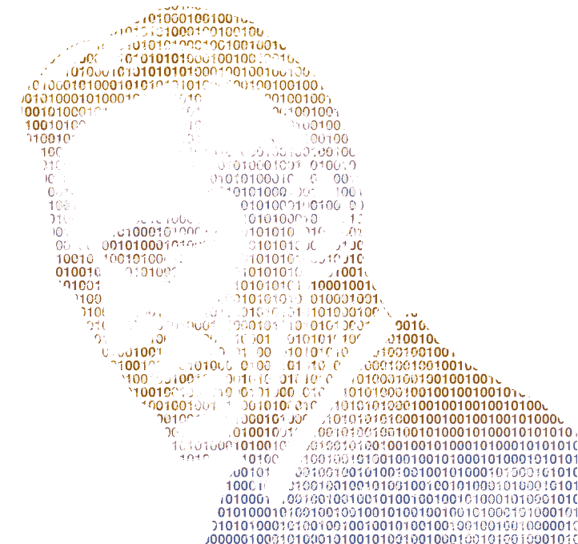

# 熵、信息和技术

> 原文：<https://medium.com/hackernoon/entropy-information-technology-57227066bdb9>

> “我最关心的是如何称呼它。我本想称之为“信息”，但这个词用得太多了，所以我决定称之为“不确定性”。当我和约翰·冯·诺依曼讨论时，他有了一个更好的主意。冯·诺依曼告诉我，‘你应该称之为熵，有两个原因。首先，你的不确定性函数已经在统计力学中以这个名字使用，所以它已经有了一个名字。其次，也是更重要的一点，没有人真正知道熵到底是什么，所以在辩论中，你总是占优势。”——**克劳德·香农**

Totally how Claude Shannon looked…

这可能会让许多人感到惊讶，但是尽管信息技术行业的许多人在他们的头衔中都有“IT ”,但很少有人能真正给你一个“信息”或“技术”代表什么的科学定义。当然，他们可以指出 MacBook Pro 或 iPhone，并将其视为信息技术的一个例子，但他们无法告诉你它们必须具有的共同点，才能被归类为信息技术，也无法告诉你为什么一本书有资格被归类为信息技术。这并不是对这些人的轻视，对这些事情的无知并不妨碍任何人去做伟大的事情，但它确实使事情变得更加困难和更加主观；我听说这可能会适得其反，不能完全理解这些术语可能会解释为什么许多概念和技术概念作为一个整体都没有得到充分的理解。

John Von Neumann: [https://en.wikipedia.org/wiki/John_von_Neumann](https://en.wikipedia.org/wiki/John_von_Neumann)

只是为了不出错，如果你能接受信息是熵，就像冯·诺依曼和香农规定的那样，那么你也能接受技术是我们优化和减少熵的方法，包括但不限于信息形式的熵。不幸的是，冯·诺依曼说的“没有人真正知道熵是什么”也是对的，这句话在今天似乎和 50 年前一样正确，但在我看来，这只是因为人们没有足够好的理由去了解它。不用说，如果你不愿意学习熵，那么你就限制了你对信息和技术的理解。虽然对它的数学理解是困难的，但功能理解并不困难，甚至似乎很直观，这并不奇怪，因为这种理解在认知科学领域和在计算机科学领域一样掀起了许多波澜。

Claude Shannon: [https://en.wikipedia.org/wiki/Claude_Shannon](https://en.wikipedia.org/wiki/Claude_Shannon)

信息是熵的同义词。虽然熵具有普遍的应用，但它只是一种对被称为“比特”的离散包的不确定性的测量，正如克劳德·香农所创造的那样，至少在这方面是如此。例如，如果你增加你自己的熵，你会增加某些事情的不确定性，但是如果你减少你自己的熵，你会减少不确定性，同时增加你对某些事情的了解。在大多数情况下，错误的信息也会导致不确定性的增加，而真实的信息会导致不确定性的减少。无论我们想检查我们的邮件或银行余额，当利用信息技术来这样做时，它使我们能够比没有它更有效地减少不确定性。因此，信息是熵，技术是一种让我们减少熵并做出决策的方法；与没有它我们所能完成的相比，它的速度常常是惊人的。

延伸阅读:
**一种传播的数学理论**
[http://math . Harvard . edu/~ CTM/home/text/others/Shannon/entropy/entropy . pdf](http://math.harvard.edu/~ctm/home/text/others/shannon/entropy/entropy.pdf)

**信息论维基**
[https://en.wikipedia.org/wiki/Information_theory](https://en.wikipedia.org/wiki/Information_theory)

**熵维基**
[https://en.wikipedia.org/wiki/Entropy](https://en.wikipedia.org/wiki/Entropy)

**科技维基**
[https://en.wikipedia.org/wiki/Entropy](https://en.wikipedia.org/wiki/Entropy)