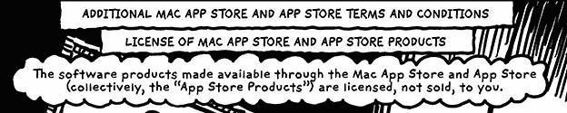
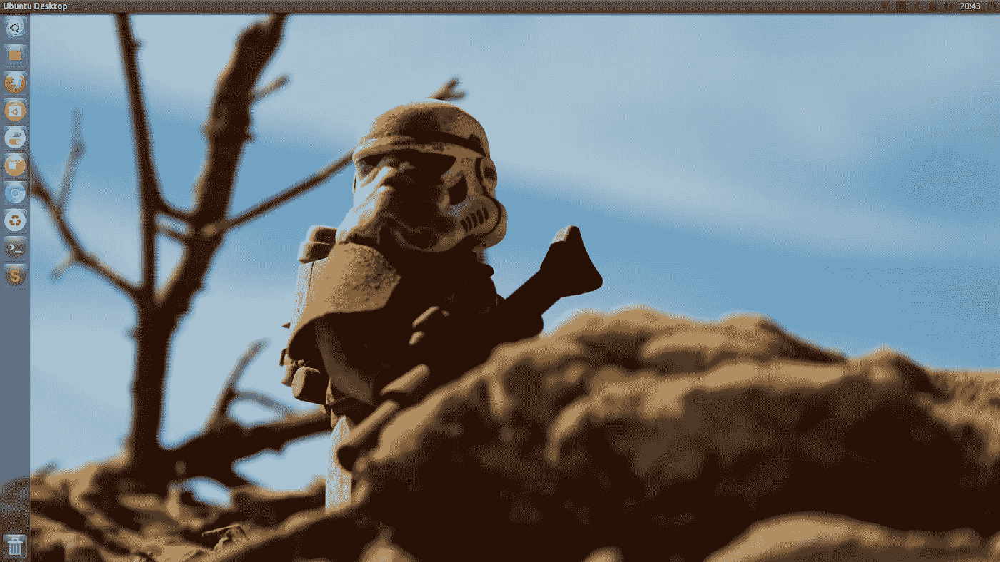
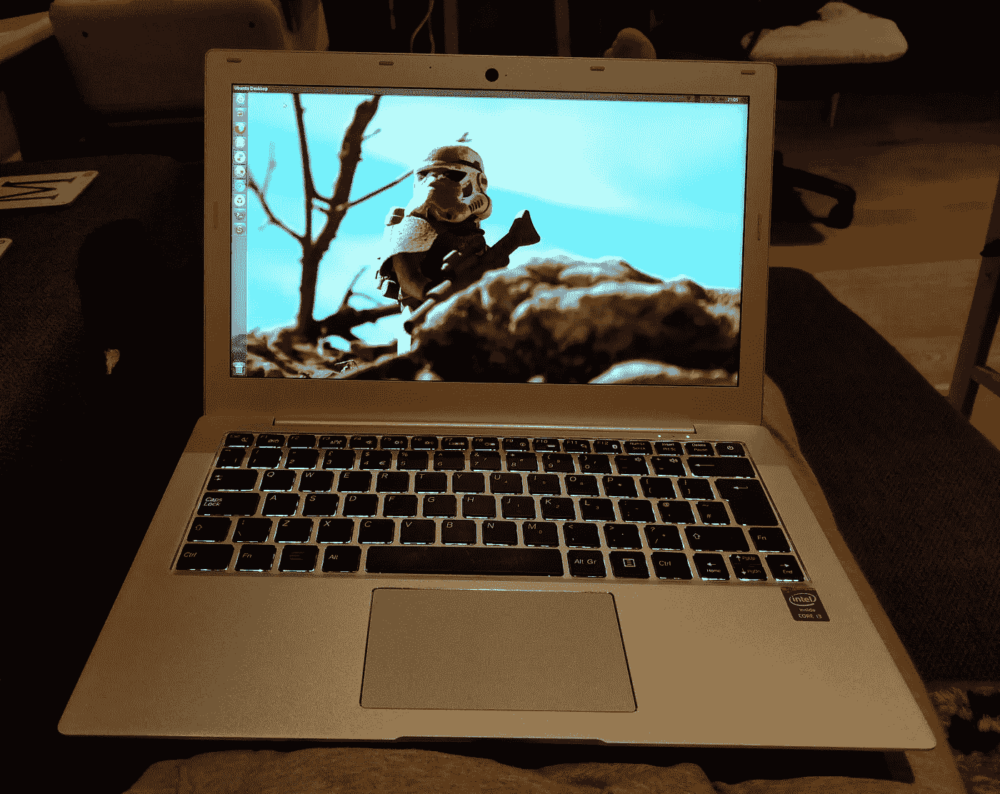
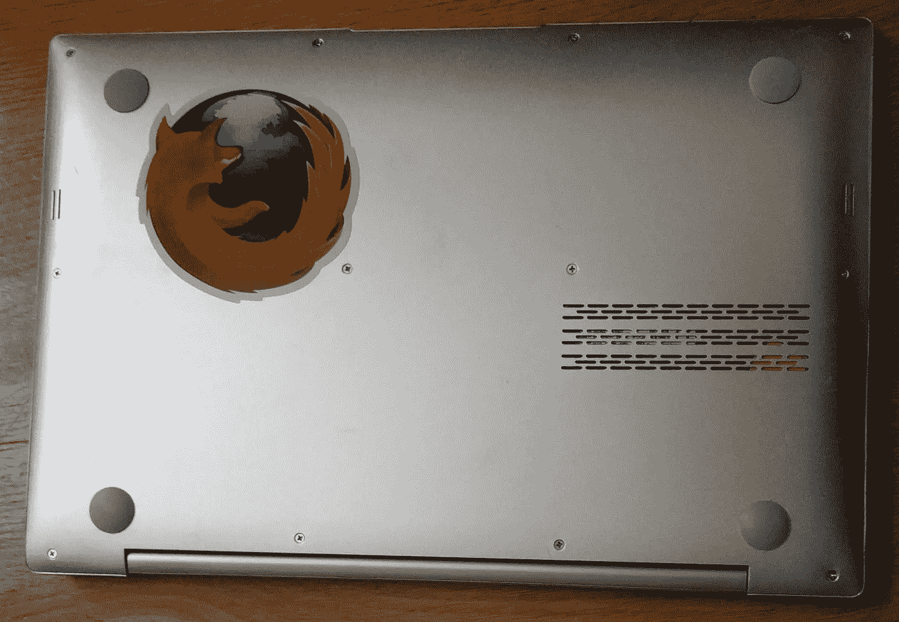
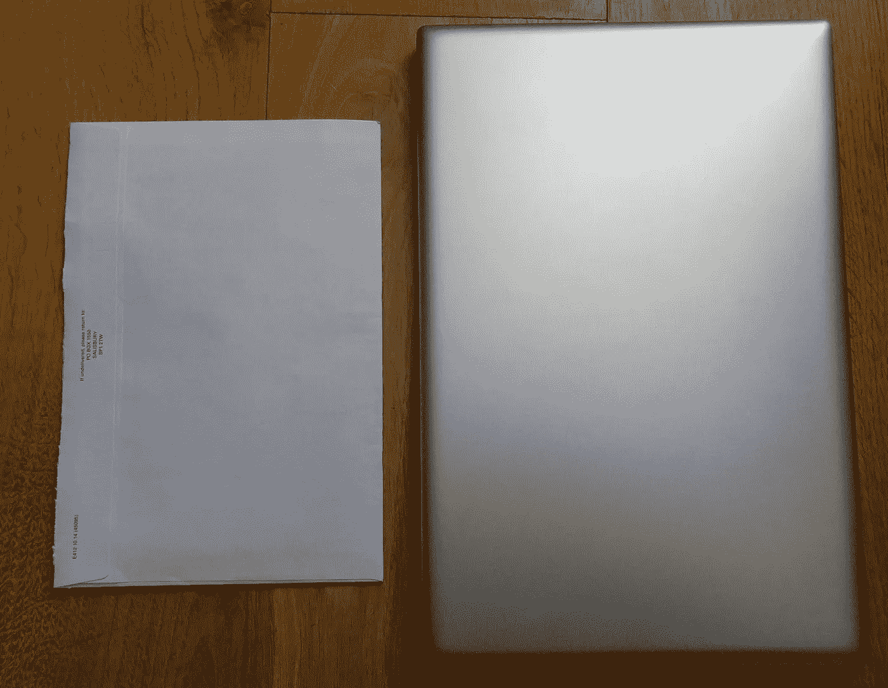

# 阿波罗评论

> 原文：<https://medium.com/hackernoon/entroware-apollo-review-f283406d75ef>

## 故事到此为止，苹果和其他选择

**苹果**

在过去的 7 年里，我一直是一个快乐的苹果消费者(2 台笔记本电脑，升级，一些配件)。当我需要的时候，很好的客户服务。决定不再从他们那里得到一个，原因如下:

*   可修复性:内部 WiFi 坏了。发现(1)这种情况极其罕见,( 2)很难解决。可维修性在过去不是问题，但目前决定尽可能长时间保留笔记本电脑，因此它成为一个需要考虑的因素。
*   封闭系统和激进锁定。我在 90 年代不喜欢微软的东西，苹果现在正在强迫(定制螺丝，仅限于苹果电视的屏幕共享就是两个例子)。
*   开始受够了不断变化的充电器适配器，不得不花很多钱买一个适配器。
*   事实上，你并不“拥有”该软件，而是被授权使用它(正如我在这里看到的可视化条款和条件:【http://itunestandc.tumblr.com/image/132727649660】T3，这里更多:[http://itunestandc.tumblr.com/ T5)，这是最后一根稻草。](http://itunestandc.tumblr.com/)
*   (否定上面的论点)已经有了机器。我会保留原来的机器，以便在必要时使用。

**二手笔记本电脑**

一位硬件技术朋友建议的另一个选择是买一台便宜的二手 Windows 笔记本电脑，在顶部或双引导上安装我最喜欢的 Linux 发行版。我不想尝试这样做，因为(1)没有实际的兼容性保证，以及(2)有电池/休眠问题。兼容性论点(1)是一个薄弱的论点，因为这些天硬件或多或少得到了支持，特别是如果不是最前沿的话。尽管有些东西可能不工作或者没有得到足够好的支持。

这个选项的常见问题是电池/休眠问题。似乎——虽然我不是这方面的专家——休眠和电池消耗在技术上很困难，并且不是所有的硬件都能很好地与 Linux 内核兼容。拥有一台需要每 2 到 3 个小时充电一次的笔记本电脑，而不是说 4、5 个小时或更长时间，是一件浪费电力、消耗电池的事情，也违背了拥有笔记本电脑的基本原则。因此，购买并安装选项被拒绝。所有这些都让我去寻找一个特定于 Linux 的供应商。

**系统 76 和其他经销商**

*   系统 76 是另一个考虑因素。目前，他们船到英国，但不确定货物在海关被拦截的可能性。也许与当地经销商或类似亚马逊的合作会有所帮助？
*   戴尔:[http://ars technica . co . uk/information-technology/2016/03/dells-sky lake-XPS-13-precision-workstations-now-come-with-Ubuntu-pre installed/](http://arstechnica.co.uk/information-technology/2016/03/dells-skylake-xps-13-precision-workstations-now-come-with-ubuntu-preinstalled/)我过去曾研究过这个选项。总的来说，我发现戴尔的 Ubuntu 笔记本电脑价格昂贵。我不喜欢这样一个事实，即作为一个普遍可用和受欢迎的品牌，没有一个地方可以让我触摸一台机器，提起它，感受它。与其他公司相比，这种做法让这个领域变得更加平等，因为在这两种情况下，你都买了一些直到拆箱时才确切知道是怎么回事的东西。几个月后，有人在这里写了一篇关于戴尔 XPS 15 体验的[评论](https://hackernoon.com/tagged/review):[https://peteris.rocks/blog/my-dell-xps-15-review/](https://peteris.rocks/blog/my-dell-xps-15-review/)。
*   自由部:非常好的主意，如果当地(英国)没有制造商，可以考虑他们。修复 BIOS 的想法非常聪明。

另外:我愿意花更多的钱买一台 Linux 优先/ Linux 友好的电脑。我需要一台轻薄的笔记本电脑，既可以坐在沙发上，也可以在旅途中随身携带。如果可能的话，我更愿意从英国公司购买，在国内尽可能多的流通资金，同时也给当地工业带来荣誉。

我不记得这家公司是如何引起我的注意的，我想是从这个名单中:[http://linuxpreloaded.com/](http://linuxpreloaded.com/)在评估所有可用的英国选项时。

## 让我们屏住呼吸

花了点时间才送到。这不是一个负号；从订单更新中，我了解到一个人组装了笔记本电脑，然后交给其他人安装软件。

在我看到解释交付移交的电子邮件后，我记得 Entroware 的网站提到他们在 5-7 个工作日内发货，而不是订单应该在 5-7 个工作日内到达。长话短说，机器在 13 天后到达。我并不立即需要它，所以等待并没有造成任何干扰。与此同时，我从以前的机器中编译了一个迁移列表:[https://gist . github . com/dimitrismistriotis/f7a 84 f 724 a 173640 b 30 a](https://gist.github.com/dimitrismistriotis/f7a84f724a173640b30a)

## 等待您的计算机到达时要做的其他事情

在网上到处找想知道 Ubuntu 会装哪个版本，如果我降级(肯定是落后一个版本)到最新的 [elementaryOS](https://elementary.io/) 硬件体验会怎么样。什么也不做。帮助我做这个决定的一个因素是阅读可能是最新的稳定元素 aryOS 的迭代不支持当前的主板。

Home screen after configuration

## 使用的第一天

我从移植我的文件并从头开始配置它开始使用笔记本电脑(我在每个新系统中都这样做，这样在安装之间就不会持续混乱)。大约一周后，我发现自己已经有机地迁移了大部分东西，越来越多地使用我的 Entroware 笔记本电脑，而不是 Macbook。我还没有完成，因为我的清单还涉及一些复制。

在某个时候，我忘记了写这篇评论文章，意识到我已经沉浸在一种体验中，这种体验比期望的“它只是工作而已”领先一步。它不仅仅是做了一件伟大的工作。在我把它作为家里的主要电脑使用了一个星期之后，我意识到 Entroware 的 Apollo 是我一直想要的笔记本电脑，老实说，我从来没有想过我会拥有它。

它支持高屏幕分辨率，没有任何问题，我可以将 HDMI 电缆插入我的电视显示器，并在那里看到视频(全屏)。可以折叠它，移动到不同的房间，然后打开它而不会停止，这是因为 hibernate 像预期的那样工作，而机器有非常好的(也许不完美，但仍然非常好)电池自治。

我发现自己在做一些 Udacity 课程，然后是一些文字处理。我把机器放在腿上几个小时，没有感觉到电池区域变得越来越热，这是我的 Macbook Linux 体验。机箱设计很好，没有一个大的水果在后面发光，它打开时没有大的 TADAAA 声音，需要黑客攻击才能禁用。额外收获:我知道，如果我想升级它的一个组件，我可以拧开后面的螺丝，就这样……用一个普通的螺丝刀，如果苹果公司的任何人正在阅读这篇文章。

Cool underneath

Back of the laptop with normal screws and it’s first sticker.

唯一感觉笨重的是触控板体验。最初，它被配置为同时具有单按钮和双按钮。它的顶部就像一个单击式触控板，而底部则可以左右点击……这与直觉相反，特别是当有一个键可以调出菜单时。我发现自己有时会使用差点扔掉的鼠标。这个问题已经在 elementaryOS 上解决了，所以也许我应该再等一会儿，或者试着深入了解 Ubuntu 的设置。其他用户和评论者也不喜欢触控板，所以我并不孤单。也有一些时候，我在打字时不小心点击了键盘，将文本指针弹出到鼠标指针当时指向的地方。皮塔饼。

## 结论

总结我们有一个响亮的“**是**”。如果你是一个对拥有一台开源软件机器感兴趣的英国居民，去 Entroware。就这么简单。

1–10 排名:9 而我则过于兴奋。我等了一个月才发这个帖子，只是想看看最初的感觉是否会消失，但我仍然很兴奋，所以 **9** 。

## 跟进想法

**现在买 Linux 笔记本电脑还来得及吗？**

大概吧。人们已经开始从台式机，甚至笔记本电脑转移到现代平板电脑(微软的 Surface，苹果最新的 iPads)和手机消费上。Entroware 可能已经进入了一个规模不断缩小的市场。

对于像我这样需要进行 web 和通用编程的人来说，可能需要一些数据争论或虚拟机/容器，似乎所需的大多数软件已经逐步移植到 OS/X。许多人已经迁移到那里，可能没有考虑回来。

记得最近读到过，在某些情况下，OS/X 主机中的 Linux VM 在能耗方面比实际的 Linux 安装表现得更好。显然，这与苹果紧密的硬件/软件集成有关，但尽管如此，对于许多人来说，OS/X 是他们的日常操作系统，如果需要，Linux 是 VMWare/vagger/docker 的替代品，只是为了更接近他们的云提供商使用的东西。

也许开发者选择的操作系统已经转向 OS/X，这创造了一个不可逆转的趋势。以上观点，背后是 stack overflow 2016 年的数据([http://stack overflow . com/research/developer-survey-2016 #技术-桌面-操作系统](http://stackoverflow.com/research/developer-survey-2016#technology-desktop-operating-system))。具体来说:*去年，Mac 超过 Linuxes，成为开发者中排名第二的操作系统。今年，趋势变得很明显是真实的。如果操作系统的采用率保持稳定，到明年的调查，不到 50%的开发者可能会使用 Windows。*

本土电脑制造商的希望，那古老但未被遗忘的 Linux 承诺。

我过去听说过的开源运动的一个承诺是，通过解决创建通用计算机——操作系统——的大部分问题，本地制造商将更容易满足其受众的特定需求。换句话说，生产大众制造商无法或不愿意生产的机器。我们已经看到了一些失败的尝试，比如 FirefoxOS，以及一些成功的尝试，比如 Raspberry Pi。虽然很少有人尝试过，但 Entroware 的尝试不知何故让这个“梦想”复活了。在英国制造或至少在英国组装，配备 EN/GB 键盘，在当地分发和交付。对于可能需要现场支持的中小型企业的台式机或服务器，可能有一个更好的价值主张:对于现场支持来说，有什么比
让制造机器的人在一个电话之外修理机器更好的呢？

**我想看到的东西**

基本操作系统和恢复介质。习惯了初级，目前在尝试最新的 Ubuntu。实际上，我不知道(我试图寻求 Entroware 的支持)如何从头开始配置一台机器，以防我想更换硬盘或出于任何原因。到目前为止，我不确定一个普通的 Ubuntu 盘和一个“点击安装”是否足够，或者是否需要其他东西。或许公司博客上的指南会有所帮助。将是好的情况下也尝试不同的分布没有风险。

## 其他评论

[http://www . jupiterbroadcasting . com/96836/entro ware-Apollo-Linux-macbook-killer-las-406/](http://www.jupiterbroadcasting.com/96836/entroware-apollo-linux-macbook-killer-las-406/)
[https://soundcloud . com/kevie-1/tux jam-48-here-there-and-entro ware](https://soundcloud.com/kevie-1/tuxjam-48-here-there-and-entroware)

## 网上商店链接

 [## 阿波罗

### 随着 Skylake 的全新升级，Apollo 比以往任何时候都更好。今天就拿起你最先进的 Ubuntu 笔记本电脑吧！

www.entroware.com](https://www.entroware.com/store/apollo) 

Top of machine against bank statement envelope — no glowing fruit…

我正在写一本名为《IT 原型》的书——这是一本给 IT 人士的“了解你自己”指南，也是一本给那些与他们互动的人的“了解你的朋友”指南。点击这里查看:[http://www.itarchetypes.com](http://www.itarchetypes.com)并订阅时事通讯，获取新章节的更新。

> [黑客中午](http://bit.ly/Hackernoon)是黑客如何开始他们的下午。我们是阿妹家庭的一员。我们现在[接受投稿](http://bit.ly/hackernoonsubmission)并乐意[讨论广告&赞助](mailto:partners@amipublications.com)机会。
> 
> 如果你喜欢这个故事，我们推荐你阅读我们的[最新科技故事](http://bit.ly/hackernoonlatestt)和[趋势科技故事](https://hackernoon.com/trending)。直到下一次，不要把世界的现实想当然！

