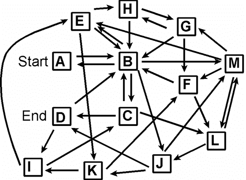
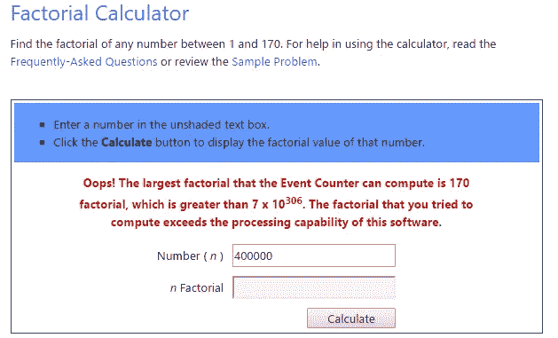

# 史诗击掌，我们刚刚击败了一个企业算法

> 原文：<https://medium.com/hackernoon/epic-high-five-we-just-beat-an-enterprise-algorithm-1520d818fa98>

如果你从来没有考虑过预测彩票号码或梦幻足球联赛的算法，那么这将是无聊的。但是如果你是一个秘密的数据科学呆子，那么请和我一起击掌！

We reduced cluster analysis time to 66% of an enterprise product

> 我们刚刚完成了数据聚类分析工具的编码:比赛花了 90 分钟，我们不到一个小时就完成了。

## 问题空间通常是 O(n ),类似于经典的旅行推销员问题

我们的[障碍赛](http://slalom.com)客户遇到了数据和成本问题。

## 数据问题

记录姓名、地址和其他个人信息，以整合各种来源的信息。我写这篇文章很匆忙，所以我不会透露任何客户特定的细节或实际的实现——那现在属于客户——但是**一个类似的问题空间可能是系谱。**

然后给定:你有死亡记录，婚姻记录，出生记录，不同时间不同拼法的不同来源的人口普查记录。你不想重复数据。你不想丢失数据。所以你需要形成一个集群。**聚类就是你如何识别 1890 年人口普查 Jimmy Joehosaphat @ 10 Band St 与 1880 年人口普查 James Johosaphat @ 10 Bond Street 相同。**

我相信你能想到如何为一个人做到这一点，但是如何在不破坏服务器的情况下将这个问题扩展到数百万人呢？

## 成本问题

成本是客户关心的问题。他们每年在企业授权上的花费高达六位数。很自然地，我想他们会用省下的钱去买一个饮水机，连接着源源不断的功能饮料。

## 工具

**微软 SQL Server 2012 和 SSIS。有时你必须利用你所拥有的。；)**

## 解决方案

我们使用 SQL Server 主数据管理(MDM)相似性函数和 SSIS 来查找所有记录之间的相似性。

> 卢克有个父亲。卢克有一个妹妹。维德的儿子是卢克。
> 莉亚的父亲是维德。莉亚的哥哥名叫卢克。丘巴卡是一只伍基人

我们将这些相似之处存储在一个表中。

然后，我们运行一个存储过程，将所有关联和传递关联合并到一个父节点。

> 卢克·天行者星团:卢克、利亚、维德
> 伍基人星团:丘巴卡

我们做到了。我们来了，我们看到了，我们踢了它的屁股！

# 加入障碍滑雪解决方案团队

The Ghostbusters were represented by Slalom’s Data Management (MDM) and Application Development teams

## 数据管理(MDM)团队

我们的超级明星 [Vaibhav Sathe](https://www.linkedin.com/in/vaibhav-sathe-77754712) 和[Soumen Chakraborty](https://www.linkedin.com/in/soumenpchakraborty)——从个性角度来看，他们应该是 Winston(埃涅·赫德森)和 Ray(丹·艾克罗伊德)——这两个人花了几周时间建立规则和模糊分析，以比较数据并确定可能的聚类关系。我和 Soumen 一起工作过一段时间，所以我在为 Aykroyd fit 打字，但是 Vaibhav 和我一起为另一个客户处理过类似的问题。他通常很安静，但我可以想象他尖叫着，“我爱这个城镇！”在打败了一个巨大的棉花糖人之后。

我们数据管理实践领域的领导者， [Teddy Wei](https://www.linkedin.com/in/teddywei) ，是一股不可忽视的力量。他对团队和客户的承诺同样匹配他的左场智慧。他在乎。就个性而言，他绝对是文克曼(比利·穆雷饰)。

Kevin Feit 也在微软 SQL Server 大师级别上提供帮助。我要把最后一部《捉鬼敢死队》留给我自己，所以我得把里克·莫拉尼斯的角色给凯文了……抱歉凯文，我在写文章。；)虽然在智力上他是一个 Egon，但他*知道* MSSQL server 和 T-SQL 就像 Neo 知道功夫一样。

## 应用程序开发团队(我们太擅长缩写词了)

任何我们，我指的是我。我在这个项目上帮忙了一周多一点的时间。我的工作，也是我特别自豪的部分，是编写一个存储过程，使用基于集合的操作将所有相关的集群连接到一个父集群。

*你想象过 SQL Server 游标吗？*不，我是用基于集合的操作**做的。**天哪！；)

在我们的最终测试中，我的基于集合的操作花费了基于光标的方法的 13%的时间。我是埃贡(哈罗德·雷米斯)。另外，当我太久没有理发的时候，我的头发会像埃贡的一样竖起来。

## 记分牌，速度竞赛

对我来说，这个项目中最激动人心的部分是在六月 Vaibhav(温斯顿)找到我的时候。他们在最终的聚类存储过程中遇到了性能问题，这个过程查看数据点之间的所有关系，并为每个聚类创建一个父类。

他们使用的一种方法需要*六个小时*才能运行。**客户需要一个在*两个小时*** 内完成的解决方案。这只是一小部分测试数据。如果我们不能花两个小时来做端到端的分析，那么这个项目就会失败。

> 如果六个小时似乎太长了，这是空间数学的问题。

你有一张包含 40，000 个关系的表。

You’re trying to figure out which piece of spaghetti is touching which piece of spaghetti and which pieces those pieces are also touching. Ahh, recursion.

所有多对多关联关系。
(A==B，B==A，B==C)

*只详细说明了关系的单个级别。*你必须自己找出传递关系。
(如果 A==B and B==C 那么 A==C)

> 要做到这一点，您必须首先查看记录 1，看看谁与记录 1 相关。然后是那些与记录 1 相关的记录，您需要查看这些记录是否有任何其他相关的记录，并将它们标记为与 1 相关。然后一直走，直到走不下去了。然后转到记录 2。

**没有任何索引的帮助，SQL Server 将不得不执行 40，000 次！阅读。我找不到计算器来计算那么大的阶乘。**

这是一个递归问题。这就是为什么 40，000 次恋爱要花 6 个小时。

> 40,000!=永远

**然后对算法进行优化，以充分利用索引。那现在给了你什么？你现在在更小的层面上做阶乘。如果一个集群的平均深度是 6 个节点，那么就变成 6 个！，就变成了 6*5*4*3*2*1，等于 720。因此，如果您最终得到 1700 个最终聚类，那么这就是您的最佳数字。**

> 6!* 1，700 =要读取 1，224，000 条记录

因此，您的最佳方案是，对于这样小的样本量，SQL Server 不必查看超过 120 万行。

> 通过索引优化，我们将时间缩短到了 15 分钟

然而，这个样本只有生产规模的 3%。该解决方案仍然无法横向扩展。

我把算法转换成了基于集合的运算。

> 通过基于器械包的操作，我们将时间缩短到了 2 分钟

这太棒了。**当我们投入生产时，该存储过程能够分析 119 万个关系，并在不到 10 分钟的时间内返回每个关系树的唯一确定的聚类。**

> 最终结果:对于 50 万条记录，识别所有关系需要 40 分钟，整合和识别所有聚类需要 10 分钟。

这就像看着所有的大学生，找出谁和谁上过床，这样你就可以找出哪些学生现在有疱疹。好吧，也许这是一个有点拘谨的比喻——但同样类型的问题空间。；)

## 愿望和经验教训

如果我有更多的时间，我会喜欢重写模糊分析步骤。看看我是否能发明一种方法，在 SQL 中为 Levenshtein 和 Jaro-Winkler 分数索引记录。我在另一个项目中使用 ElasticSearch 接近了这一点。**总的来说，我会尽量接近 O(n)log(n)。**

我还重新了解到**当您开始在 SQL Server 中处理数百万个查询时，查询执行规划器并不关心具有复合列**的索引。它可能认为表扫描比试图精确排列两个索引更好，尤其是在列不是惟一的情况下。当处理数百万列时，索引一列并包含其余的列。

**单元测试在这项工作中节省了大量的时间和头痛。每次我在我编写的存储过程中发现一个新的 bug，我都会为它编写一个新的单元测试。单元测试并不复杂，只是一个 T-SQL 文件。它会将生产记录清空到一个临时表中。将测试种子数据插入关系表。然后运行聚类分析存储过程，并使用 IF EXISTS (SELECT…)和 RAISERROR 语句来报告是否有任何预期失败。最后，它会删除测试种子数据，并将生产记录放回表中。**

建筑师的工作永远不会结束。这就是为什么法老会用他们的作品来埋葬他们。让他们闭嘴。

**这个安卓游戏(Osmos)是我想象解决这个问题的灵感来源。**

# **如果你喜欢这篇文章，请表达你的爱，点击左边的心形推荐。**

## 请在 Medium 上关注我的热情、枯燥、超级书呆子内容。

我还上了[推特](https://twitter.com/@codingjoe)和 [Instagram](https://instagram.com/codingjoe)

> [黑客中午](http://bit.ly/Hackernoon)是黑客如何开始他们的下午。我们是 AMI 家庭的一员。我们现在[接受投稿](http://bit.ly/hackernoonsubmission)并乐意[讨论广告&赞助](mailto:partners@amipublications.com)机会。
> 
> 如果你喜欢这个故事，我们推荐你阅读我们的[最新科技故事](http://bit.ly/hackernoonlatestt)和[趋势科技故事](https://hackernoon.com/trending)。直到下一次，不要把世界的现实想当然！

