# 第 22 集:HTML 和 CSS 基础的开始

> 原文：<https://medium.com/hackernoon/episode-22-a-kick-off-into-html-and-css-2ceccf245b3b>

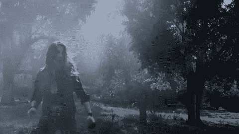

## 快速更新，

在经历了近五周的编码之后，我得出结论，我完全是一名前端开发人员。数据库周(上周)谋杀了我，这是我知道我必须陷入的噩梦。就像，如果我不得不在 Makers 把我最强的一周排到最弱的一周，它会是如下:

*   欢迎来到网络(HTTP/浏览器)
*   Javascript(令人惊讶的是，本周)
*   面向对象的设计(Ruby 代码)
*   Oystercard 挑战赛(更多 Ruby 原理和测试)
*   **生活**
*   数据库

是的，我的生活似乎比理解和实现数据库容易得多。虽然这一周是演练的结束，但这个博客将是关于快乐的事情。快乐的东西，我的意思是前端开发人员应该接触的**代码。**

从这篇博文开始，我将会谈到 HTML、 [CSS](https://hackernoon.com/tagged/css) 、 [Javascript](https://hackernoon.com/tagged/javascript) 以及更多所谓的“前端开发人员”应该知道的很酷的东西。

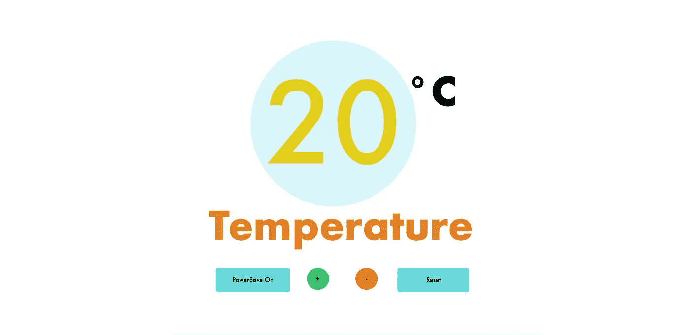

你真的看不出盒子的尽头在哪里，但它是一个网站！是啊，看起来不漂亮吗？(为什么，谢谢)。今天，这篇博客文章将开始进入 HTML 和 CSS 的世界，并希望在以后的博客文章中进一步探索这个问题。

## HTML？这是什么？

超文本标记语言是我们用来在屏幕上打印数据的编码语言。它基本上是实际逻辑代码(Ruby，Javascript)的连接器，并在页面上布局编码逻辑。它们可以是按钮、填充、形状、文本……我想还有更多。

## CSS？这是什么？

级联样式表是我们将 HTML 文件链接到的东西，使它看起来很漂亮。我们可以为 HTML 代码中的每个元素添加不同的样式属性和特性。这基本上是用来让网站看起来更好的终极设计特征。

谁认为设计不重要或不重要，我让你感到羞耻。当然，让应用程序或网站正常运行至关重要。然而，当你处于一个所有人都在制造“有用的东西”的市场中时，你的网站或应用程序将如何脱颖而出。设计，网页或应用程序的外观非常重要，因为它决定了用户是否使用它。你能和我争论吗？(设计结束)

# 让我们看一下代码，好吗…

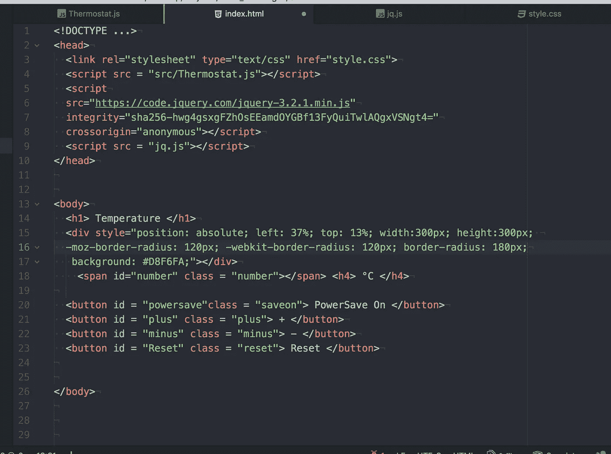

This is our HTML file for the website above

在我们 html 文件中，我们总是有一个头部和一个主体部分。在 head 部分，这是我们放置所有运行代码所需的 java/ruby 代码的地方。无论是需要文件或包，还是 css 文件，这都是 head 部分的用途。

**在我们的主体文件中，**这是我们所有的元素将要去的地方，并在页面上列出。一旦我们将所有的 java 或 ruby 代码链接到我们的 html 文件，我们就可以列出元素(如按钮、填写表单)以及文本，这样我们的 java/ruby 代码中的所有内容都可以连接到我们的显示页面。

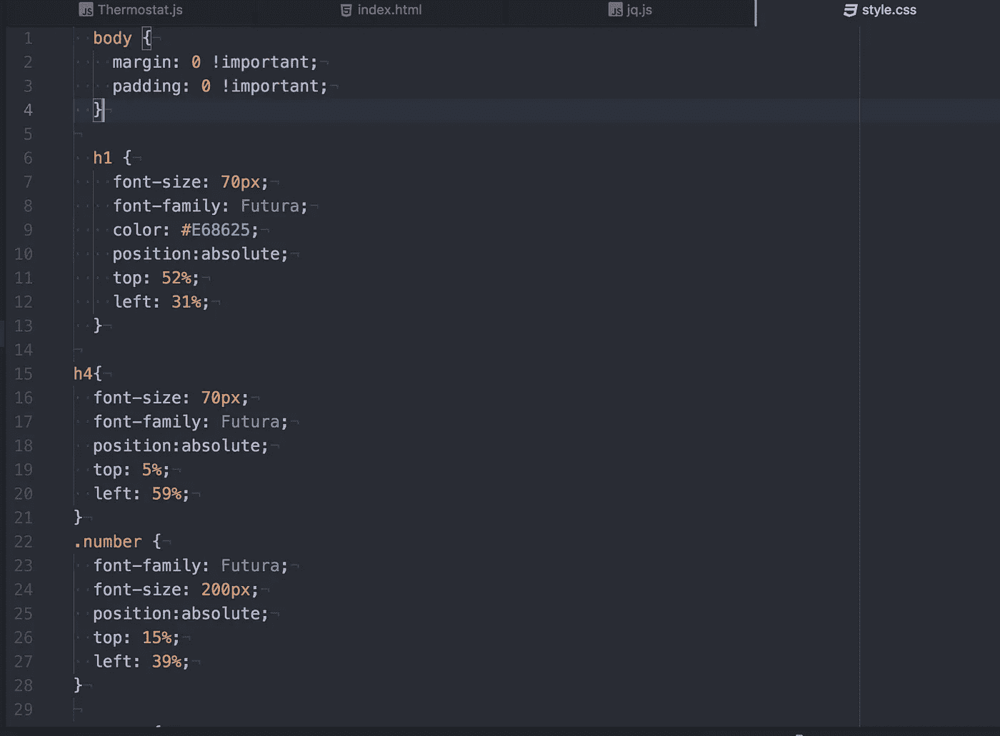

This is part of our CSS file for the moment.

虽然此刻我没有向你展示我的整个 CSS 文件，但是这张图片是一个很好的例子，因为你可以将你的样式连接到 **HTML 元素(h1，h4，body)** 或者你可以将它们连接到 **HTML 类(。号)。稍后我会提到这一点。**

# 我们如何将 HTML 和 CSS 代码链接在一起？

每当我谈到这一点时，我总是感到沮丧，因为当它只是一句简单的台词时，我花了一天时间才弄明白。

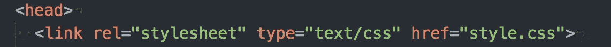

当我们把“我们需要的文件”放在标题部分时，我们将把这个 liner 放在标题部分。那么我们这里有什么？

*   我们有 rel= "stylesheet ",它定义了这行代码将链接一个样式表！如果你不这样做，它只会把那一行打成无聊的黑色文本。
*   然后，type = "text/css "定义了这个样式表将会是 css 格式的，因为可能有不同类型的代码可以用来设计样式？
*   最后，也是很重要的一点:“href = "style.css ",在这里我们将把我们的 **css 文件链接到我们的 html 文件。**

**注意:**当你通常用很多文件编码时，我们通常把所有的 CSS 文件放在一个**‘Style folder’**中，这样我们就知道所有的 CSS 文件都会在那里。我相信你必须说“href = "style/style.css "来告诉程序，嘿，这个“style.css”在“style 文件夹”里

# 让我们一行一行地看 CSS 代码(或者分段会更好):

## 在正文部分，我们将边距和填充设置为零。这是什么？

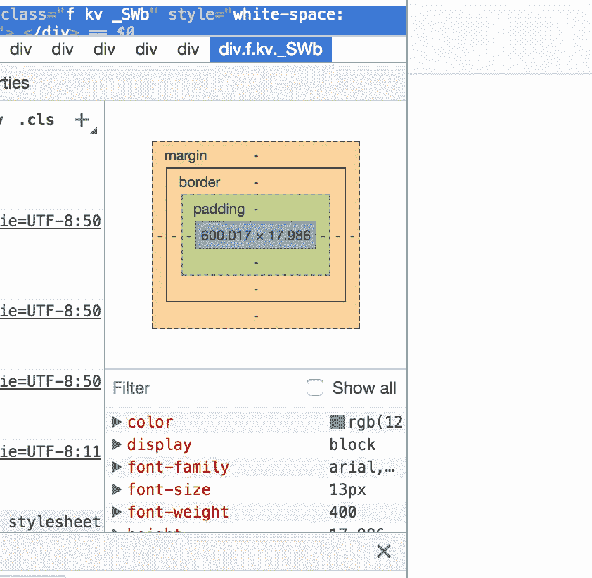

如果你检查任何一页，并在元素中寻找，一个小盒子就会出现，它由不同的盒子和不同的颜色组成。我相信，默认情况下，一个网站或网页有一个固定的边距和填充，这样你就可以用相等的空间分割你的内容。

## 当设计师变成编码员或设计编码员时，设计的力量就来了，我们可以编辑一切，甚至 HTML 中的每一个文本和元素。

做过几个项目后，我总是喜欢将边距和填充设置为零，因为这样你就知道你的网页上没有空间了。我的意思是，如果你不这样做，你将每次都在你的网站上试验空间范围。唉，有一张空画布，没有任何东西会打扰你或让你震惊，总是好的。

## 接下来，我们有 h1 特性:

H1:这意味着这是一个头球。有 h1 到 h7，它们是默认的文本大小，用来显示网页的层次结构。在 html 中，它通常被写成< h1 > < /h1 >，这适用于 html 中的大多数元素。正如我喜欢说的…

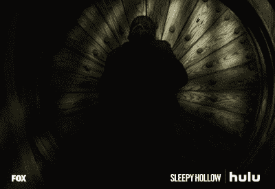

> 当一个标签打开时，另一个标签将关闭

我们列出了以下功能，其中一些非常简单:

*   字体大小(字体的大小。尽管标题是默认字体，你仍然可以改变它们的大小，这很酷。)
*   字体系列(你有 Arial，Times，Georgia，Comic Sans —不要做 COMIC SANS —)
*   颜色(这意味着字体颜色，因为**背景色**是“背景色”)
*   位置-绝对；(这是我们将要讨论的一个非常有趣的问题，它将在下面的其他内容中提供..)

## 对于所有 CSS 文档，您将总是编写以下语法:

元素{

字体大小:20px

}

**位置**是一个有趣的属性，因为它允许你在页面上移动东西。诸如(“固定”、“静态”或“初始”)之类的位置设置不允许您像这样自定义移动元素，因此得名。“初始”我相信是指你设置的默认设置。**我发现使用“绝对”将你的元素放在它自己的盒子里，因此它允许你将元素移动到页面上的任何地方。**

现在，我们已经安装了位置，然后我们可以写下它将移动到的位置的百分比。虽然位置有四个方向(上、下、右、左)，但我们实际上只需要“左”和“上”。这是为什么呢？

如果我们选择最重要的特性，什么是最重要的= 0%，什么是最重要的= 100%？0% top 将位于页面顶部，而 100%将位于页面底部！因此，我们根本不需要底部。当我们不需要右的时候，只需要左也是一样。

几乎可以对任何 html 标签中的任何 html 元素这样做。但是，如果您没有使用 html 标记或元素，该怎么办呢？我们怎么把它放进去？

# 班级。

正如每个代码都有类一样，HTML 也有自己聪明的类特性。让我们看看我的例子中的这段代码:

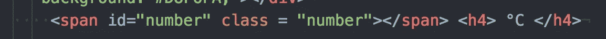

虽然我们用 h4 表示摄氏度，但是跨度呢？Span，I 在这种情况下是我们的数字，从我们的 javascript 代码连接。我该怎么设计呢？我没有使用任何 html 标签或元素。是的，你可以看到我已经把它包含在一个类中，我输入的只是 simpy

class = "数字"

在这里，我已经植入了我将为 HTML 代码的这个元素编辑的 css 元素是 number。现在，如果我们看看我们的 CSS 代码…

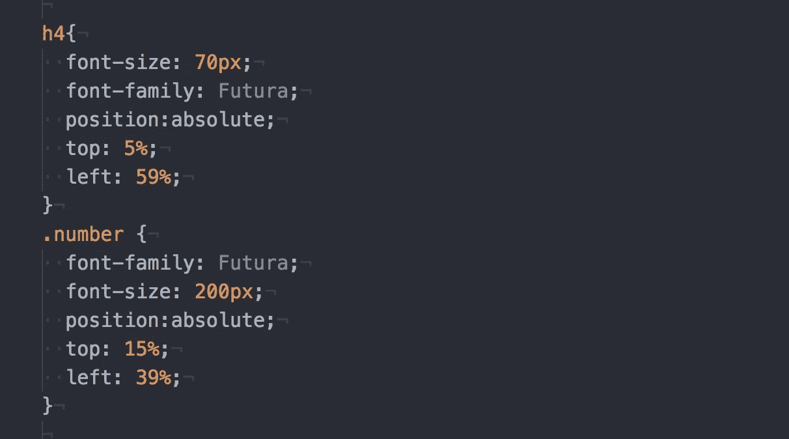

你看到了吗？现在我可以编辑我的 HTML 中的内容，包括那些我不使用 HTML 元素或标签的内容。然而，我已经能感觉到下一个问题出现了…我如何在我的代码中设计多种风格。我的那个朋友，叫做 **< div > block。**

就像所有编码语言都有块一样，在 html 中我们有

，我们可以在 div 块中确定一个类。你可以在 div 文件中对你的代码进行分段，或者我们做一些更有趣的事情，看看我用 div 块做了什么。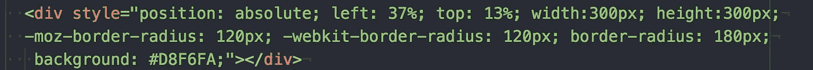

这些行话是什么？这是一个圆的 html。除了三个特征之外，你可以认出我之前提到过的大部分语法。

moz-border-radius，-webkit-border-radius 和 border-radius。这些都是圆需要的半径。如果你还没看过，就是字体后面那个巨大的蓝色大圆圈。

根据在 div 块中应用的不同功能，可以创建不同的形状。(你可以搜索如何做到这一点的链接)。

然而，让我们来看一下上下文，我说的上下文是指**优先级。**

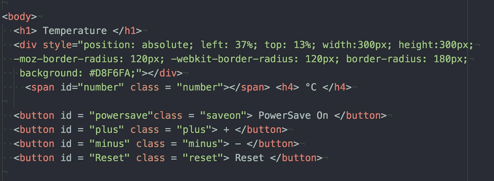

我们可以得出结论，圆圈在所有代码内容之上(就是你在屏幕上看到的按钮)。**你把代码放在什么顺序有关系吗？**是的，就像我们把它放在代码的最后一样，我们的内容会覆盖所有的内容。这是一个很难理解的概念，但我会尽可能用最好的方式解释它。

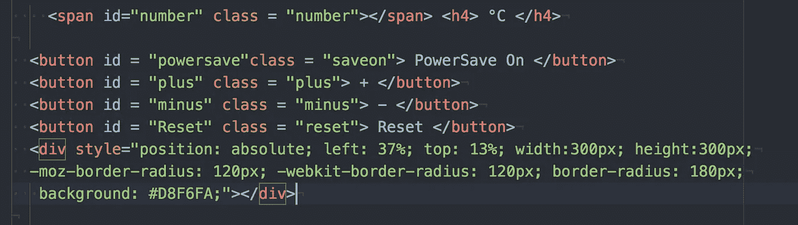

如果你来自任何创作背景，那么这个解释对你来说会更容易理解。如果不是，试着理解我的意思。

你用过 Photoshop 或者大部分创意软件吗？如果你没有，没关系，我还是会看的。

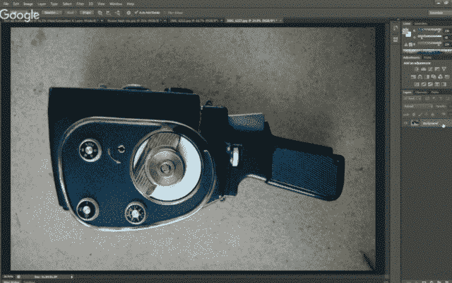

在任何创造性的程序中，或者说我相信大多数程序中，都有叫做层次的东西。如果你看到更多的矩形插入弹出，这些是层。这让我们可以在彼此的基础上构建东西。换句话说，现在，上面的 GIF 显示我们只看一张图片。然而，我们如何创建的形象是在层。

当我们考虑何时将元素放在前面或后面时，它与 CSS 或 HTML 的工作方式相同。你把一个元素放在你身体的更高处，它更可能是更早的层，如果你把它放在最后，它将是你看到的当前层，并覆盖所有元素。

# 让我们看一个按钮。

在 CSS 中格式化一个按钮是非常有趣的，因为它是一个交互特性。默认按钮通常是这样的:

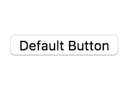

这就是 HTML 为我们服务的，当我们创建一个这样的按钮功能时…

按钮可以用不同的方式编写，但这是其中一种方式。让我们点击节能按钮，看看我们对 CSS 做了什么。**注意:这个类叫做 Save On。**

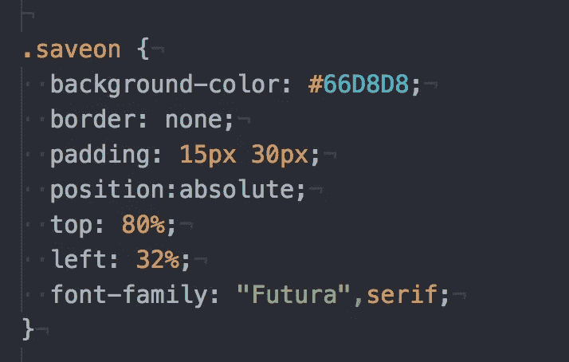

这里的新东西实际上是衬垫。我们知道填充是什么和做什么，但是对于一个按钮来说，如果我们要使按钮风格化，我们给文本一些空间是很重要的。我相信填充它的高度和宽度。

注意:小心你的按钮的大小和填充，因为用户仍然需要能够点击这些按钮。填充只给你足够的空间让你的按钮可以点击。(因为它只能在中心点选)。

不过，这里有一个巧妙的技巧。在我们的代码中，这个按钮打开 PowerSaveMode 和关闭 PowerSafeMode，如果我们希望按钮在这种情况下改变颜色，该怎么办呢？啊！不幸的是，这不是我们的 CSS 文件。这是因为我们的 CSS 文件或 HTML 文件负责，或者如我们编码员所说，我们的“控制器”查看文件。

我们的控制器应该已经用 JQUERY 和 Javascript 完成了。

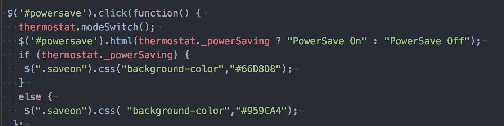

虽然这是另一个时间的帖子，但你可以在代码中的某个地方看到$符号和 css 实现…这是我们的 if 语句出现的地方，并改变我们的 CSS 元素，因为这个 JQUERY 文件是它将所有东西链接在一起的控制器…

# 今日趣事:

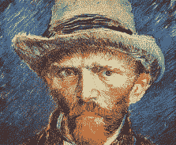

在艺术学校，代码是一种想象的工具，这真的很疯狂。这就像是 2017 年赋予我们的外星行话，我们是穴居人，用它来制作形状或将球从屏幕的一部分移动到另一部分。

从伦敦最顶尖的艺术大学之一中央圣马丁大学毕业后，编码并不是什么大不了的事情(这里说的是 HTML，CSS 和 JAVASCRIPT，我指的是前端)。像任何要学的东西一样，它只是需要时间来学习，而且学习永远不会结束。