# 第 26 集:让 HTML 更上一层楼(关于画布和形状)

> 原文：<https://medium.com/hackernoon/episode-26-taking-html-to-the-next-level-canvases-and-shapes-5b9474a273f4>

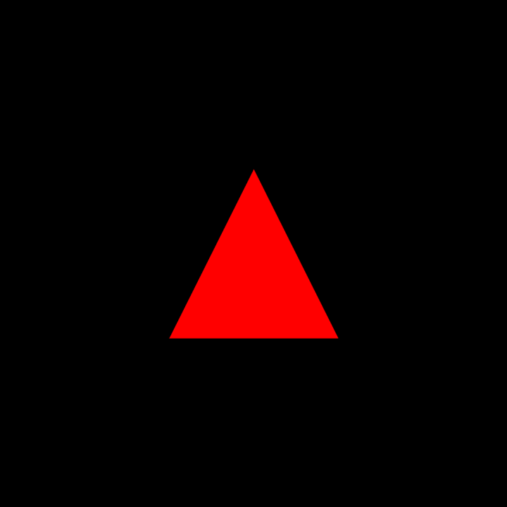

Potentially perhaps we could do this later on

最近，我在一篇早期的博客文章中开始了对 HTML 和 CSS 的讨论。我想这是我的承诺，开始探索前端世界的一部分。我在周末开始探索教程，并将反思我学到的东西。这些技巧非常酷，而且可能会越来越酷。

今天，我们将着眼于 HTML 的下一个版本，HTML 5，我们将开始在屏幕上放置形状，然后希望将它们动画化。是的，“在 [Youtube](https://hackernoon.com/tagged/youtube) 上看起来不可能完成的事情”可能没有我们想象的那么不可能。另外，作为一名动画师，这对于我和其他动画师来说也是至关重要的。

# HTML 5，是什么？

一个可以做更好的东西的 HTML 版本，比我们所知道的 HTML 有更多的增强。简单。我们还将使用 JAVASCRIPT 来控制页面上的一些元素，而不仅仅是使用 CSS。

今天我将讲述一个简单的任务“如何在屏幕上放置形状”这听起来很无聊，但用 HTML 5 和 JAVASCRIPT 做起来相当棘手。让我们来看一个 HTML 5 文件的例子，这应该很熟悉，因为它是一个 HTML 文件。

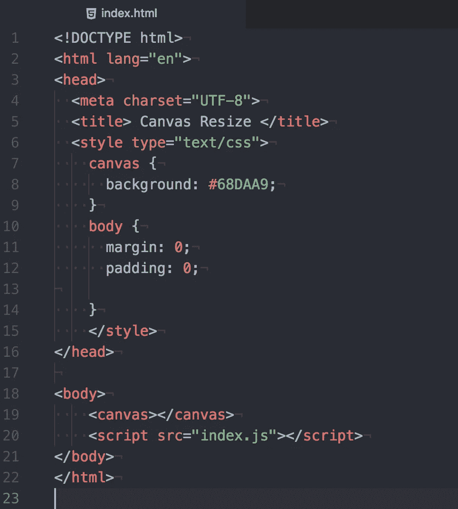

*   第 1 行，我们已经初始化了 html 文档并准备好了，我们还在第 22 行关闭了它。
*   第 2 行，我们将 HTML 语言设置为英语。耶！在 HTML 5 中，你可以设置你的 HTML 文件的语言！我们这样做是为了确保搜索引擎或屏幕阅读器帮助解释页面，因为我们也在解释页面。
*   第 4 行，我们列出了所谓的字符集。UTF-8 表示通用字符集+转换格式为 8 位)。这是一种字符编码语言，在 Unicode 中也称为代码点。我相信我们通常使用这种格式的 HTML 文件。(非常确定)
*   忽略第 6 行到第 14 行，因为那是我们可以分离成一个样式 css 文件的 css。
*   第 19 行非常重要，因为这就是我所说的设置“画布”

无论何时，我们设置一个画布，这就像设置我们将要创造的美丽事物的背景或基础。画布实际上不必覆盖整个窗口。事实上，我们可以制作不同的画布，称为不同的东西，可以在页面上布局。

然而，因为我们刚刚开始，让我们试着使用这个画布工具，不仅覆盖背景，而且根据窗口的大小，覆盖任何大小的背景。

*   第 20 行是我们需要文件的地方。我相信我们也可以把这个放进脑袋里。我们应该把这个也放在脑袋里。基本上，这需要我们的 javascript 文件，我们将使用它来做一些很酷的事情。

很好，现在我们了解了 HTML 方面的一切。如果你通读了我之前关于 HTMl 和 CSS 的博客文章，这是非常基本的东西。然而，让我们进入魔术。

# Javascript 方面:画布

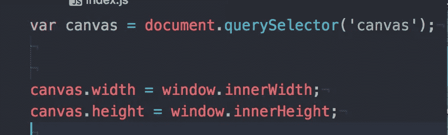

让我们从这几行开始，因为这对于我们如何为每个窗口大小制作画布很重要，不管我们如何刷新它。

在一号线上。我们设置一个文档并从查询中获取信息。我们选择从查询中获取数据，因为我们只需要 HTML 数据的一部分。URL 通过查询进行通信，在这些查询中，有数据。因为我们将这个 javascript 文件链接到我们的 HTML 文件，所以我们的代码知道从哪个文件中提取数据。在括号中，我们选择“canvas ”,如果你还记得的话，我们在我们的主体中做了一个 canvas 标记。是的，这两个有联系。

## 第 2 行和第 3 行是有趣的地方。

既然我们已经设置了“将画布数据提取到画布变量”，我们现在可以用它来调用其他东西。第 2 & 3 行是我们在画布上调用宽度和高度的地方。

现在，我们可以将 canvas.width 和 canvas.height 设置为永久数字，但是我们的画布不会在每次刷新页面和收缩窗口时调整大小。因此，我们将调用 HTML 的…5 的窗口特性，在这里我们将设置 innerWidth 和 innerHeight 的值。这意味着我们根据窗口大小来设置画布的宽度和高度。在我们保存它之前，我们必须改变背景颜色，这样我们才能真正看到画布。默认情况下，我们的画布是白色的，这是我们尝试 find 的愚蠢原因，因为我们看不到它。

因此，如果你回头看看我们的 CSS 代码，我们已经将主体颜色设置为看起来像绿色的颜色(这是某种代码的代码)。是的，是的，是的，我知道从专业的角度来说，我们会把它分割成一个 CSS 样式的文件，并把我们的代码分开，你可以随时这样做。尤其是在我们做完这个之后。

现在，如果我运行代码，忽略我已经完成的教程中的代码，我们可以注意到，每次我们决定刷新它时，画布都会适应我们的浏览器窗口。

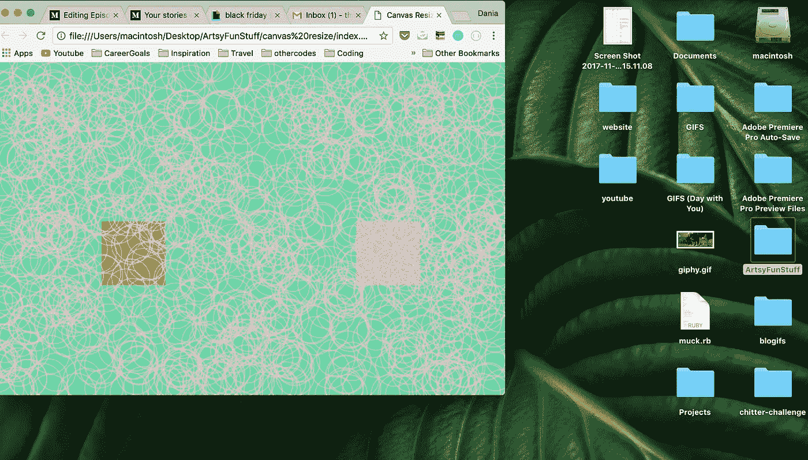

我装的时候本来是这个尺寸。如果我把浏览器拖出来…

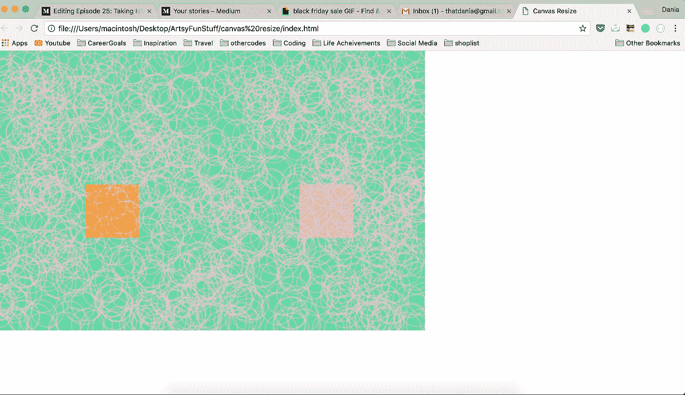

我们可以看到它保持这个大小。然而，现在我刷新它…

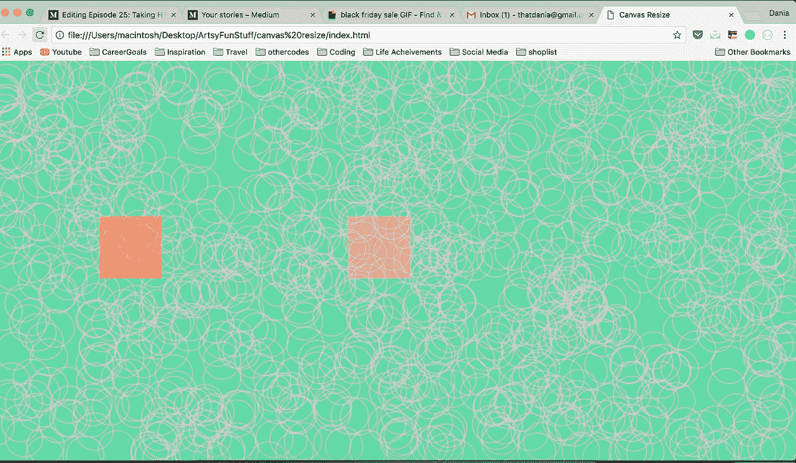

它现在适合窗口浏览器。多疯狂啊！

# 画形状:长方形和正方形。

让我们通过查看我刚刚在 Javascript 文件中编写的代码来弄清楚如何打印出矩形或正方形。

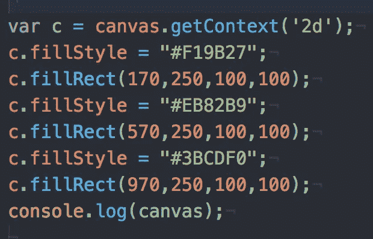

在我们的第一行，我们设置变量 c 等于画布。那一行中的“Get context”允许我们在屏幕上打印出形状。我想也有一个 3D 属性可以得到，但这是以后的探索。

一旦我们有了变量，现在我们可以进入填充样式和填充矩形。Fill Rect 会根据我们的尺寸自动给我们一个黑色的正方形或长方形。如果我们看第一个填充矩形，这四个属性是关于移动和大小的。我相信第一个是你想在 x 轴上定位的地方。第二个是 y 轴上的位置。这些从 0 开始-最大值取决于你的屏幕尺寸。0 表示顶部，而最大值表示底部。小心马克西，因为你可以永远超越页面。

下一个是长宽高的尺寸。如果我们要做一个正方形，那么是的，我们希望宽度和高度相同。如果不是，那么如果我们想要一个矩形，它可能是不同的。这段代码有两个奇怪的地方。

首先，你可以看到我做了 3 个正方形，但是电脑怎么知道什么颜色属于哪个正方形呢？顶部的填充样式与我在底部制作的第一个正方形相关。这非常有趣，因为我们的 atom 或编辑器读取代码的方式是自顶向下的。所以，它好像在说:

“嘿，你想让我用橘子填充东西！啊，你想让我用橘子填满一个正方形！好吧！”

这就是填充形状的层次结构(因为我们都不希望一直是黑色的矩形。作为设计师，我当然不会。第二件事是我们的画布日志。因为它是在我的代码中打印出来的，你可能会想“哦，这很重要”或者“我们需要在初始化形状后打印画布！”哈哈，它不应该在那里，但它实际上可以很好地使用。

当我们制作画布时，我们的画布应该是白色的，对吗？我想我之前提到过。然而，如果我们想检查我们的画布是否已经初始化或者它是否在那里呢？虽然，我们可以检查页面并尝试突出显示画布，但我们也可以打印出画布属性以显示其工作正常。它应该打印出类似“画布”的东西

# 绘制形状:多个圆形:

让我们先弄清楚如何打印出一个圆，或者试着理解如何。

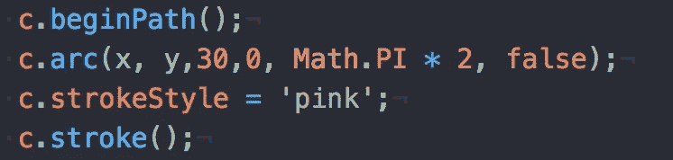

不像矩形或正方形，在那里它确切地说明它是什么，我们使用一种叫做弧的东西。弧形就像一个支架的形状，或者我们通常称之为桥。

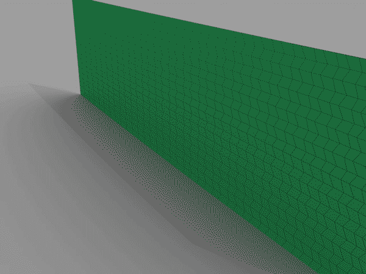

尽管它看起来与矩形或正方形的格式或属性相似，但它与圆形的构造方式略有不同。前两个坐标实际上是中心点的位置。中心点将决定我们的圆的位置，以及围绕它画圆的线的位置

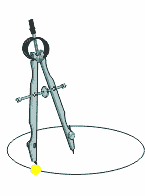

如果我们想象一个指南针是干什么的，我们在指南针上有一个点来定义中心和围绕它画一个圆的线。它的工作原理和指南针完全一样。

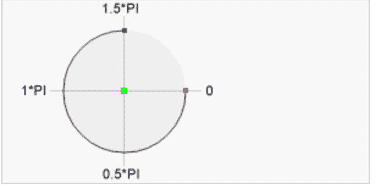

W3schools 在定义接下来的步骤时实际上很有意义。下一个元素定义起点(红色圆圈)和终点(蓝色圆圈)。所以，如果我们想画出上面这个圆的轮廓，我们会沿着(0，数学。Pi * 1.5)。因此在我的代码中，如果我只做(数学。π* 2)，它实际上做了一整圈。它不需要起点或终点，因为这些点的位置是相同的。

我希望这有意义。太好了，我们有了一个圆形的轮廓。虽然我可以选择填充这个圆，但我会展示各种形状。有些是轮廓，有些是填充。在这种情况下，我们的圆将被勾勒成粉红色。

现在，如果我们想要 10 个圈呢？50 圈？100 圈？是的，当然，让我们复制我们的代码 100 次，让我们的代码永无止境。不是该走的路。

这里，我们可以使用一个 for 循环来打印出我们想要的圆圈的数量，如果我们想要的话，也可以在整个窗口页面上展开。

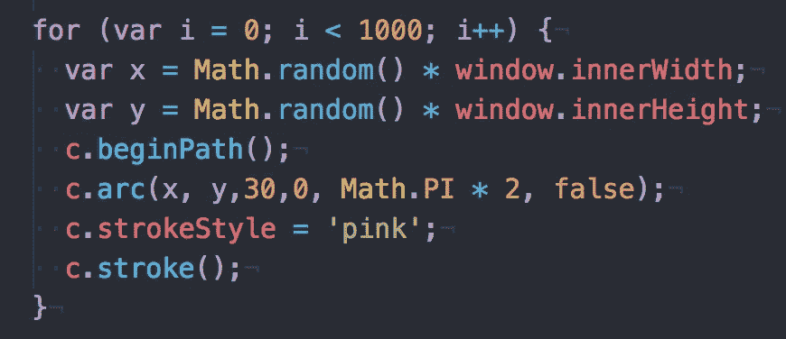

看，这是多么神奇的东西。让我们一行一行来。

所以，我们有一个 for 循环，它基本上迭代了我们所做的循环次数。在第一行中，我们设置了从 0 到 1000 的圈数！这意味着我们要打印出 1000 个圆！最后一部分(i++)将是该过程每次运行时递增到下一个循环的因子。

我们在这里实现了 1000 次。

变量 x 和 y 只是打印出窗口宽度和高度中的一个随机位置。因此，我们的程序将在浏览器上随机选择一个圆圈将要去的地方。然后，像以前一样，我们围成一个圈。然而，让我们看看我们的代码…有什么奇怪的东西或者我们没有定义的东西吗？

没错，我们使用变量 x 和 y 来确定我们在窗口浏览器中的位置！每次画圆时，这将决定我们圆的中心点(因此，位置)!多酷啊！

现在，如果我运行我的页面(或者如您之前所见)…我将在页面上放置 100 个圆圈，这样您可以看到位置的变化。

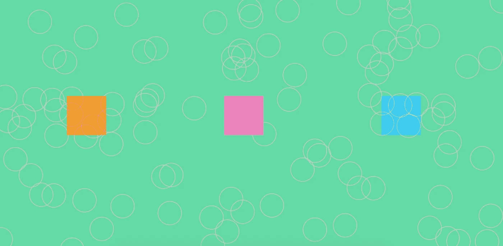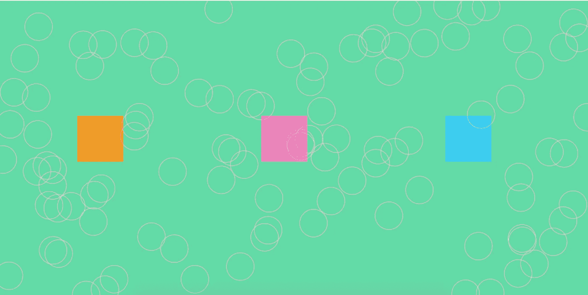

你真的看不见它，让我改变颜色。

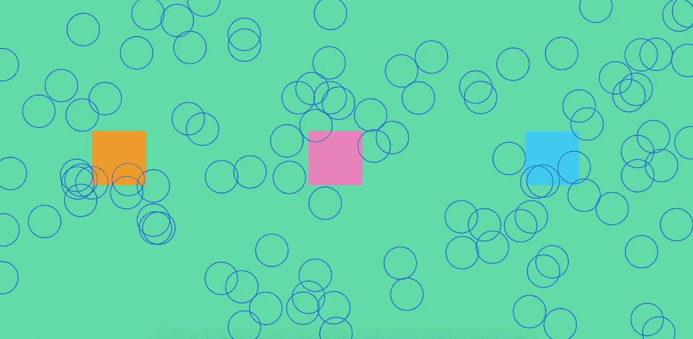

Refreshed one.

Refreshed two.

你能看到每次刷新时圆圈的位置都不一样吗？我的朋友们，这就是 for 循环的作用。是的，我知道我们还没有制作任何动画是很无趣的，但是当我回到基地的时候我们会的。然而，这是这样做的步骤之一，也是过程的一部分。

我会带着另一个帖子回来为它制作动画。不管是明天，后天，还是下周，最终都会在这里讨论。梦之队本周面临着坎坷。敬请关注 x

# 今日趣事:

我一直认为黑色星期五是不合法的，因为即使来自和其他故事的产品大量出售，它从来都不是一个合理的销售。然而，我从来没有想到会在 UDEMY 上购买短期课程。

UDEMY 有点像树屋或任何短期课程学习网站。他们的课程从 200 英镑到 10 英镑不等。什么，你可以学习任何编码扩展、程序、软件或生命？虽然我很感激黑色星期五给了我这个极客的机会，但我还是要三个。