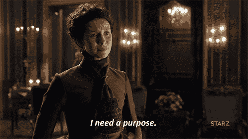
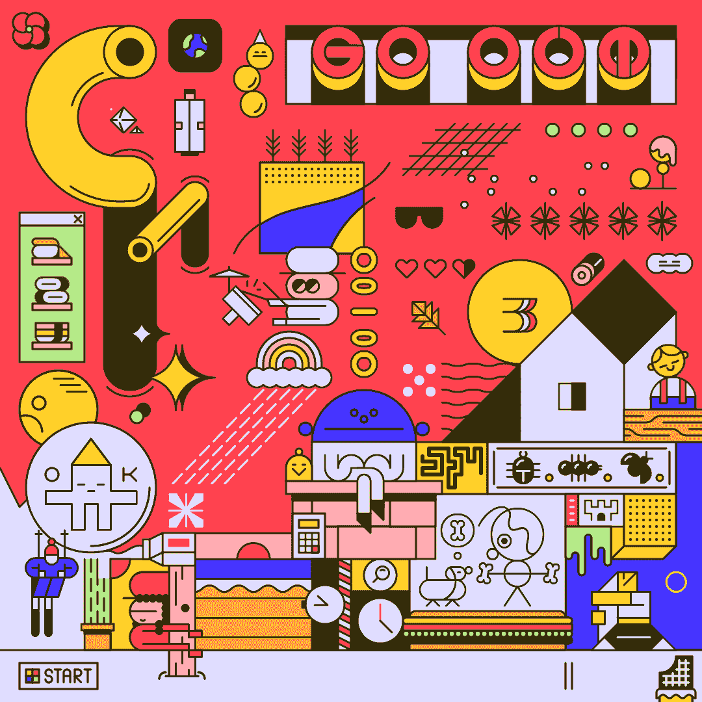

# 第 27 集:成为更好队友的方法。

> 原文：<https://medium.com/hackernoon/episode-27-the-ways-you-could-be-a-better-teammate-f933e03575d8>

这将是一篇简短的博文，因为这周我有很多事情要做。无论是享受我在网络星期一购买的 UDEMY 课程，还是 Javascript 的周末挑战，还是 AIRBNB 挑战，这都是正在发生的事情。

副业:UDEMY 在他们关于发展的短期课程上有一个惊人的交易，200 英镑的课程每个 10 英镑。完全值得，如果你想学习新技术的话。此外，你不必感到难过，因为它不是像衣服、食物或其他不必要的产品那样的物质。[学习](https://hackernoon.com/tagged/learning)从来都不是不必要的…反正…

在我的团队工作了两天，观察了其他团队的情况，我决定写这篇文章。不是说有一些好人或者坏人。每个人都很酷。然而，我们都是人。我们会犯错，我们会不完美，但如今我们没有什么是永恒的。想想看，如果人类想改变他们天生的长相，他们可以做整形手术。然而，关键是

**我们可以每天都努力提高自己。**

我将要讨论的一些方法，我甚至为忘记它们而感到内疚。因此，如果你想和我一起永不忘记这些事情，或者想改善你在团队中的工作方式，你来对地方了。

注意:虽然这可能适用于所有情况，但是当我在我的组中编码和观察其他组时，我已经考虑了这些指针

# **一个团队的真实动态:**

大多数团队，当每个人都聚集在一起时，开始变得乐观。一切都很好，每个人都很兴奋开始新的东西，如果每个人都愿意，每个人都有努力工作的良好意愿。

注意:当你在一个把每个人都视为朋友的团队中时，这种情况就更少了。

我们认为团队动力(团队如何合作)每天都在展现。事实并非如此。真正的团队活力只有在团队接受考验时才会显现。换句话说，当一个团队陷入困境时。

> 每个成员如何应对这种情况？每个成员是如何应对压力的？人们做了哪些对团队有贡献的行动？面对挑战，他们是战斗还是逃跑…还有很多问题…

尽管这个想法听起来很恶心，但我们只有在一个玻璃后面观察一个团队如何在一个孤立的房间里工作一周才会知道。

为什么？因为当我们在一个团队中时，我们正在经历我们自己的情绪和对情况的解释，我们不可能有时间来观察我们在团队中的行为，更不用说观察团队中的其他成员了。因此，在这里，我将照亮你过去的一天或一周，请你后退一步，思考对一个团队来说最重要的问题…

> 我在尽我所能成为一个更好的队友吗？

因为在一天结束的时候，你必须负责的事情是你的行为和你在你的团队必须经历的情况下的反应。

# 我们以前犯过罪的事情(至少一次)…

我可以为自己承认这一点，也可以为许多人承认这一点，我们都至少在以下事情中犯过罪:

*   你让你的压力、担忧、沮丧、悲伤情绪冲击到了团队，因为你在努力跟上。
*   你有点超前，或者没有花时间去帮助你的队友。这意味着你不被认为是你正在奋斗的队友
*   你让自己变得不耐烦，或者抨击或者做了一些团队之外的事情
*   因为你的团队落后于计划，你发现了一些小问题，但这并不是唯一的原因，或者可能从来都不是这样(例如，你的队友生病了或有个人问题，一天没来)
*   你试图给你的团队提供意见，但是你没有意识到你要么是在重复你自己，要么对团队没有任何帮助。
*   当发生分歧时，你为自己的观点而战，但没有考虑去讨论/解释另一个观点是错误的或者可能不是最好的方式。
*   你决定不说出你的感受，或者你对一个项目的担忧，因为你认为这将有助于团队向前发展，从而成为团队的负担
*   你没有考虑过问问你的队友，是否每个人都在同一页上，或者是否有人落后了。虽然这可能不是什么有罪的事情，因为你不是团队中唯一对此负责的人，但你有责任让队友之间的秘密浮出水面。
*   你已经决定在你的团队所做的工作数量上成为一个失败者，因此，把你的团队已经取得的成就的视角翻转到**我们还不够好。**
*   你已经做了所有这些事情，但没有意识到这一点，直到你在一天的辛苦工作后回到家…坐在你的浴缸里想“哦，天啊”…

Just admit it.

这是我能想到的几个例子，我很确定我们中的大多数人至少有一个是有罪的。为什么认识到我们正在犯的错误对我们来说很重要？嗯，我们不都有为团队做到最好或者为团队做到最好的意图吗？是的，如果我们这样做了，我们希望认识到我们正在做的错误，以及我们可以做些什么来改善它们。

如果你意识到自己在团队中做了上述事情中的一件，给自己一点鼓励。现在意识到总比以后好，同时，用另一只手拍拍自己的背，告诉自己你没问题。后悔、怀疑或痛打自己能让情况变得更好吗？

# 我们能做些什么？

## 提示 1:照顾好自己:

无论这是否意味着你需要从团队中抽出时间，团队的短暂休息或当你在家休息时休息一下，甚至在你的通勤途中休息一下，休息对你重新变得有效率是至关重要的。

当我们处于困境时，尤其是与人相处时，我们会感受到必须与他们同舟共济的压力。我们总是觉得我们必须跟上人们，与人们竞争，或者证明他们在他们的团队中选择了一个不会后悔的好队友。然而，如果你精疲力尽，你会成为团队工作负担之外的负担。你已经有足够的工作了，为什么还要给自己增加更多的工作呢？你必须充满活力，因为每天你都要和你的团队一起工作，精神和体力在这里都很重要。

## 技巧二:退一步观察团队。

虽然你可能在角落里很安静，仍然听着团队在讨论什么，没有什么可说的，但是如果他们开始过度思考或进入他们的头脑，观察团队是一种好处。

不是你没有为团队做贡献，更多的是你在守护着团队。如果一个团队变得太沮丧或者太固执己见，你可以建议休息一会儿或者我们下一步做什么。你可以把每个人带回到我们为什么要做我们正在做的事情的出发点。

你的团队中讨论下一步该做什么的每个人都看不到团队的气场变化。他们都被困在这个世界里，而你可以从外面看这个世界。因此，成为守护他们的人是关键，这样团队的光环才不会一天天变得越来越暗…

## 提示 3:如果你没有什么可以贡献的，不要觉得你需要。

很多时候，我们处于激烈讨论或开始讨论的情况下，我们总是觉得我们需要贡献一些东西。不管是不是重要的事情，越是不重要的事情，我们就越觉得有必要说出来。这是否会推动团队的重要性的想法被抛到了九霄云外，我们忘记了我们所说的对团队没有任何好处。

是的，我在和那些觉得倾听比说出来更难的人说话。如果你说的话对团队没有帮助，那就保持沉默。有时候，沉默可以让清晰的交流发生，这对团队来说是富有成效的。

## 提示 4:支持团队。

如果你的团队熬夜试图找出问题，而你没有足够重要的理由离开，那就留在团队里。人们不会说出来，但这将向他们证明你是忠诚的，你对团队有最好的意愿，你会为团队做任何事情。

仅仅因为你没有自己解决问题，你就是团队可以用来推动事情发展或提高效率的额外的人。很多时候，啦啦队长看起来像是一个被削弱的角色，但当团队陷入困境时，这是一个重要的角色。

另外，如果你认真想想，即使你作为一个团队失败了(希望不是因为你造成的任何事情)，这真的是世界末日吗？这是另一个时代的博客，但是当我们失败时，失败真的是世界末日吗？当然，我们可能会感到悲伤或失望，但我们不必为此自责。如果我们在经历中没有失败，我们将如何成为伟大的人，或成为成熟的人。

另外，当你回首往事时，你会感激你比现在更早拥有它…

## 提示 5:以积极的方式结束一天比想象出消极的方式要好。

我在一些团队中观察到了这一点，在漫长的艰苦工作后，臭名昭著的报价来了，这就是他们不满意的原因。你可能一生中至少听过一次这句话..

> “今天我们可以做的事情太多了！”

虽然有这种总是想做更多事情的驱动心态是好的，但它降低了团队已经完成的工作量。直到你真正审视自己，或者意识到这会如何戏剧性地改变团队的氛围和动力，你可能都不会意识到你已经做到了。

回顾过去“我们本可以做什么”并不能改变什么。这就像回顾一个“你犯下的错误，并一直纠结于此”，或者“你本可以避免一种情况”，我们当然知道这不会改变我们现在的处境。相反，我们必须训练我们的头脑，把已经做过的事情放在一边，把注意力集中在可以做的事情上。这是我们唯一能做的推动球队前进的事情。即使这是某人犯的错误，在团队解决问题后，给自己一段时间去恨和原谅那个人。

是的，这很难，因为在艰难的情况下，我们的大脑通常会找到一个替罪羊或一个简单的出路，而不是面对面地处理情况。这是本能，这很好，但这是我们应该意识到的，我们需要告诉我们的大脑…

> 现在可能会很艰难，但从长远来看，这对你和你的团队都有好处。“替罪羊”是逃避现实的一种短暂缓解，它在现实中并不能解决任何问题。

## 秘诀 6:总有事情可做。

我不在乎你对此说什么，或者团队中的人是否已经在做主要的工作，但有一些事情总是可以做的。这可能是一个小差事。也许，它可以是观看和概述项目。也许，这可能与你的工作无关，“为团队准备外卖午餐”。无论哪种方式，你的存在和行动都可以帮助你列出一个项目要做的事情。

如果你不知道它是什么，问团队还能做什么？我能帮什么忙吗？我能做点什么吗？我能做些什么来改善这种情况？通过要求你的劳动来推动团队前进的意图总是一件好事，如果不是的话，为什么要浪费你的时间呢。

## 技巧 7:复古

一、什么是复古？在 Makers，这意味着团队聚集在一起，反思已经完成的工作和需要完成的工作。这也是释放担忧的时候。所以，我会列出复古的两个好处。

## 第一个好处:

我记得威尔·史密斯在一次采访中说过这个技巧，我认为它对一个团队有效，不管他们是否有血缘关系。

每当讨论的时候，威尔·史密斯都会召集他的家人说:“好吧，我们有五分钟时间，每个人都可以畅所欲言。这个时期没有人能评判他们或者说什么。在这五分钟之后，我们只能理智地谈论它。”他在家里这样做，这样家人就能听到不同的观点，并发泄已经引起的任何麻烦或负面情绪…

从经验来看，我认为这是一个很好的方法，因为我知道我们的一个队友有他需要表达的东西。没有人因为他说了这句话而指责他，我们确实理性地讨论了这件事。因此，我可以得出这样的结论:这种方法在解决群体障碍方面非常有效(如果你明白我的意思的话)

## 第二个好处:

它让我们可以列出第二天需要做的事情的清单或“行动计划”。这可以让团队检查他们今天的成就和进度。这样就可以根据第二天的信息制定行动计划。

像目标和列表、任务列表这样的东西总是很适合每天制作，因为它们是未完成任务的指南。。此外，列清单，列出你要做的每一件事是如此有趣和愉快。是的，我在某种程度上痴迷于成为一名组织者。

我承认，复古确实需要努力。这确实需要一些思考，有时可能会令人厌烦。然而，跟踪你的进步，为你所取得的成就给自己一个鼓励，并找出你可以做些什么来使它变得更好，或者成为一个更好的人，这是有益的。

## 是的，每天做复古都很难，更别说一周一次了。教练每天都这样做(他们声称，我也相信他们的说法)，而且这不仅仅是一项任务，坚持下去是一种技能！

有时候我会觉得自己一事无成(尽管我已经做到了)，觉得自己是一个普通人。然而，作为一名团队成员、一名雇主和一个健康的人来说，管理你的独立学习和激励自己保持繁荣是一项伟大的技能，不管你是什么。作为人类幸福的一部分，我相信是从学习中成长，不管是什么。

# 结论…

我不是说执行我观察到的所有技巧是容易的，也不是在鼓励你这么做。然而，在编码训练营中，时间过得比你想象的要快。当办公桌前有一堆工作等着你和你的团队成员去完成时，考虑这些想法，并在下次你的团队动力受到挑战时实施其中的一些想法，可以让你和团队在进步方面受益。

尤其是，如果你所在的团队试图在一周内尽可能多地实现 AIRBNB 网站。

# 今日趣事:

世界上最美好的感觉之一是，尽管你有很多工作要做，但你仍然渴望忙碌。虽然我有一大堆事情要做，但我很高兴做所有的事情，这是我们都应该努力实现的目标，因为工作什么时候会减少或结束。回答:从来没有。