# 第 29 集:CSS 竞赛的幕后(AIRBNB 项目)

> 原文：<https://medium.com/hackernoon/episode-29-behind-the-scenes-of-the-css-race-airbnb-project-345be3cb670>

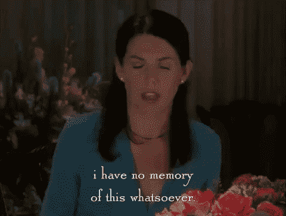

难道你不记得我说过我会实现一个 [CSS](https://hackernoon.com/tagged/css) 和 HTML 教程来到处找乐子吗，哈哈难道你不记得那个说起来容易做起来难的时代吗？哈哈，好时光。

我上一篇关于 HTMl 和 CSS 的文章是关于动画的(我将在以后的文章中完成)。只是我有一大堆事情要做，尤其是关于 AIRBNB 的挑战。**我坐在开往利物浦街的中央线列车上，早上 9 点起床，凌晨 2 点睡觉，完成了一场 CSS 比赛。**

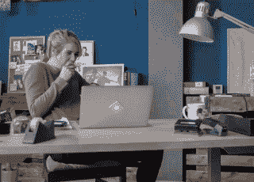

我有(不到 24 小时)来完成我们的 AIRBNB，因为如果团队中有设计师，这个网页必须看起来很好。这对我的学位和我的生活热情来说是一种耻辱。总的来说，它比我想象的要长。然而，当你在家里被你“几乎出名的设计师男友”批评你的设计时，你会意识到对于一个网站来说，还有很多你没有考虑到的事情。不可思议的是，考虑到我们仅在一周内完成了这些，添加所有这些考虑事项是不必要的。给团队一些信任。

# **这个 CSS 博客将会记录我在不到 24 小时的时间里为一个项目完成的所有事情。其中一些比你想象的要简单得多。**

W3schools 是个大奖。

所以，在我熬夜学习 CSS 的过程中，我学到了以下几点:

*   按钮悬停
*   让你的按钮看起来像是在按按钮
*   确保文本字段没有被填充，并且您可以填充到所需的长度。
*   网站布局和对齐
*   将图像添加到合适的大小并在 CSS 中定位它们
*   摆弄物体上的阴影，并允许自己移动阴影。
*   自定义你的光标(默认选项或某人的脸)我为这个光标而活。

除了我今天要讲的新技能(当我回顾时，这些技能并不难)，其余的都很简单，或者说我已经讲过了。这场比赛中最难的部分是确保你已经考虑了所有的设计元素和网站的流程。例如，最初我会用同样的方式设计一个注册和登录按钮，并把它们放在一起。然而，给定输入字段，如何知道这些输入字段是用于注册还是登录呢？

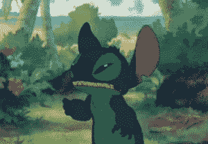

Ergh，设计问题，这让我不得不回溯我已经实现的所有设计特性。

我可能已经多次提到这一点，但我会继续这样做，因为我不相信有人会阅读我的每一篇博文。如果你是，就声明，我会道歉。

让某样东西变得实用或有效很重要吗？是的，这是所有事情中最重要的。然而，**如果市场是每个人都能做出东西的地方，你的产品会得到认可吗？让我们面对现实，好吗？不，因为你的产品和其他产品一样。**

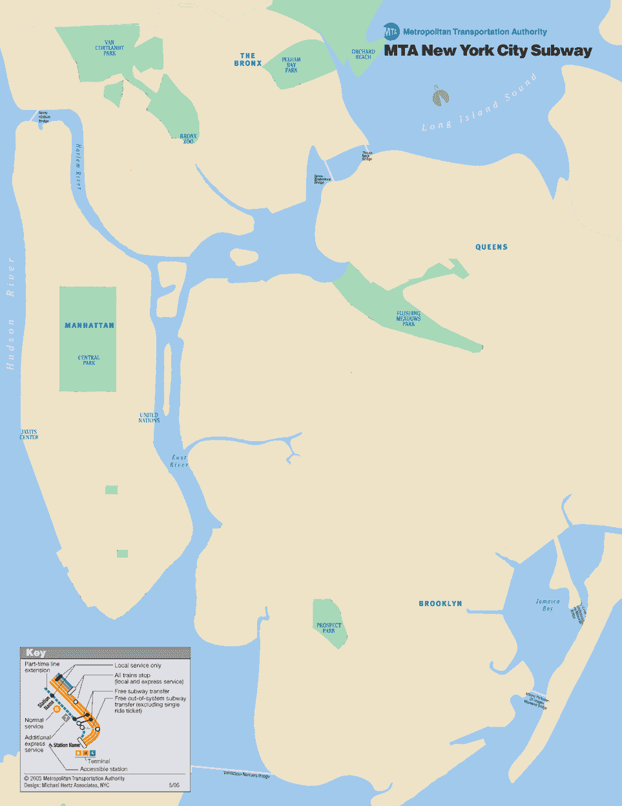

If maps were designed badly, it would be terrible for us to find our way.

虽然听起来很糟糕，但也很诚实，产品的“外观”和它的功能一起将它的价值提升到了一个很高的高度。用户如何与网站、应用或数字服务互动，对于用户是否会选择你的产品至关重要。这是我说“我很自豪我有一个平面设计学位”和“我很高兴在创客”的地方，因为我是创意产业所说的“T4”的混合体。如今的设计师意味着成为行业和客户的连接者。我们确保理解每个光谱的部分内容，并引导我们的技能，这样**当数据到达人 B 时，人 A 的东西将被点 B 准确地解释。**

我跑题了，让我们开始我的 CSS 冒险吧。

# 简介:佩服我的工作在 AIRBNB 上的价值。

我接下来要说的话听起来可能很扯淡，但我真的仔细考虑过这个设计。正如我在许多 pinterest 账户上看到的那样，网站的流量对每个页面的外观都有一定的流量和构思。例如，前两个页面如何从圆形开始，扩展到窗口，然后在网站内部，一切几乎都是矩形。

注意:这已经完成了 80%,但还没有完成，因为如果我不在最后期限内约束自己，我可以修复一些设计错误。像圆形图像和日期之类的东西我本来可以修复的，但是不管怎样…

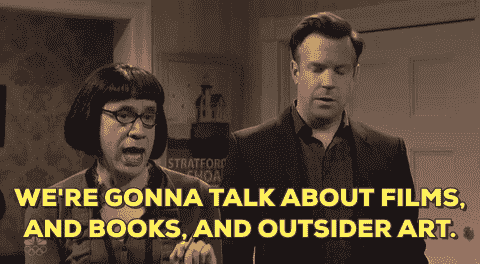

# ……..我不会检查我所有的代码

这可能没有意义，但我会解释如何做每一部分。现在，这个网站对窗口也没有反应。

# 按钮悬停:

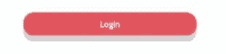

Talking about this button here…

假设我在类登录下有一个按钮，让我们检查它的 CSS 文件。这意味着当我们在 html 中写它的时候，它必须是< button type = "submit" …你可以用谷歌搜索剩下的。

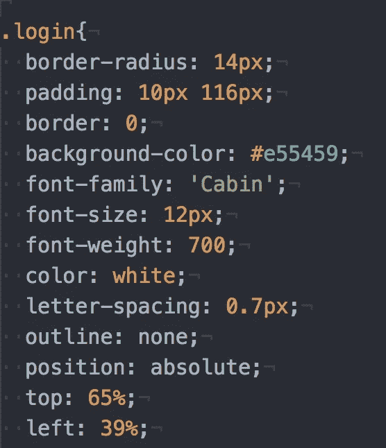

我知道这很多，但是除了下面这些，大多数都很好解释了。

*   这里的颜色是字体颜色
*   背景色是按钮的颜色
*   填充决定了边框的形状
*   边框半径赋予按钮一些曲线，使其成为曲线矩形
*   轮廓等于无，这对于按钮功能很重要，因为我们点击按钮的默认方式，它会发光，有时并不适合每一种外观。

现在，我们唯一要添加到这个按钮的登录类中的是 CSS 的另一个部分，叫做 Hover。

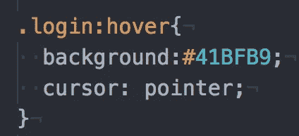

“:hover”将允许您在鼠标悬停在按钮上时更改按钮的功能！就这么简单！在这种情况下，我只是将背景按钮的颜色从红色改为浅绿色。我还改变了光标的版本(所以从箭头变成了手)，这很恶心。我稍后会谈到那件事。

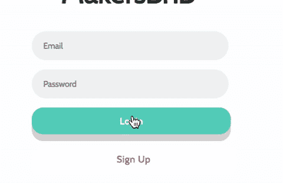

Look at this magic.

# 如何制作一个可以真正按下的按钮？

阴影。让我们通过添加一个盒子阴影元素到我们的按钮来进入它。

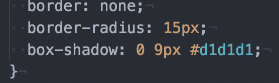

一个框阴影将做的是在你的按钮下“创建一个阴影”。你可能需要像我一样调整填充、颜色和半径来匹配按钮的形状。很好，第一步。

现在，当我们按下按钮时会发生什么。它几乎向下移动，缩进一些东西，对吗？当我们点击按钮时也会发生这种情况。所以，现在我们可以使用类似“登录:活动”的东西，类似于“登录:悬停”

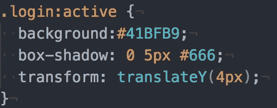

在我们的例子中，“激活”是指当按钮被按下时你点击按钮。在这里，我改变了盒子阴影的颜色，因为我们想给人一种按钮被按下的错觉。我们还增加了一个很酷的功能，叫做 transform。这将使我们的“无阴影按钮”下移，从而进入阴影。这给人一种按钮被压入缩进的错觉。

总的来说，如果你迷路了，这就是我的 CSS 寻找登录按钮的样子

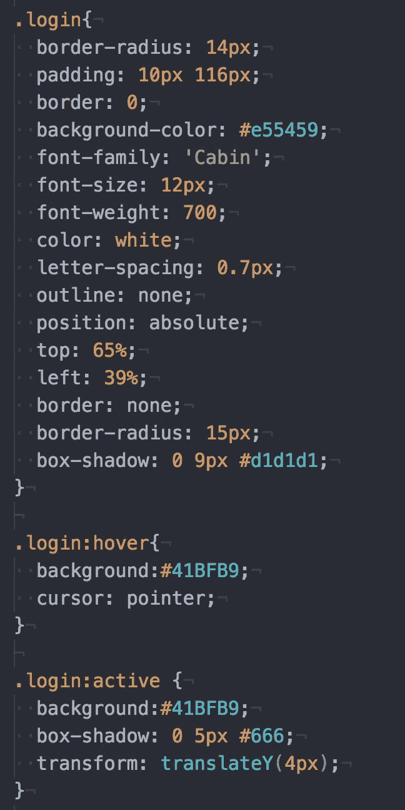

# 文本字段的危险。

我这个星期才意识到这个错误，当时我正在为一个文本字段做一件我不应该做的事情。

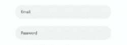

Yes this part.

当您为用户查看这个文本字段时，我们的目标是让用户可以在该文本字段中填写内容，这样就可以看到它。然而，对于任何试图弄清楚这个 CSS 的人来说，问题是我们如何扩展填充框(因为它给了我们一个默认的大小，大多数时候我们想改变它)

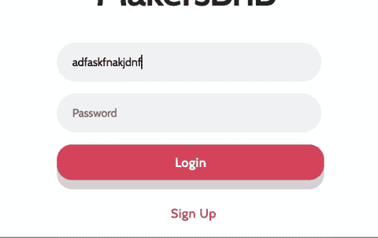

This is what we are aiming for.

## 你可能会想，既然我们已经填充了按钮，我们应该增加右边的填充。

填充:10px(上)，150px(右)，10px(下)，14px(左)

差不多是这样吧？这不会增加文本字段！这意味着如果某人有一封很长的电子邮件，它将在我们的文本字段中间被截断！(想象一下上面的 gif，其中连续类型在灰色框的中途停止)

要解决这个问题并真正做到这一点，我们应该简单地增加文本字段…对吗？这听起来是显而易见的，但是当你发现 CSS 的时候就不一样了。

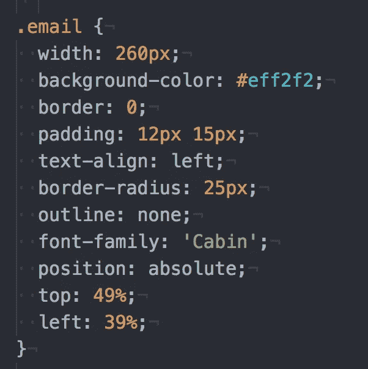

This is for the email fill in text box(The first one in the gIF)

看到我们如何使用(宽度)来扩展文本框字段了吗？这是我们应该做的事，而不是敷衍了事。

# 影子，为什么伟大？

他们让事情变得更酷。正如你在我的 air-bnb 页面上看到的，这种简洁的风格使设计非常独特。对于阴影，我将讨论圆圈所在的注册和登录页面。

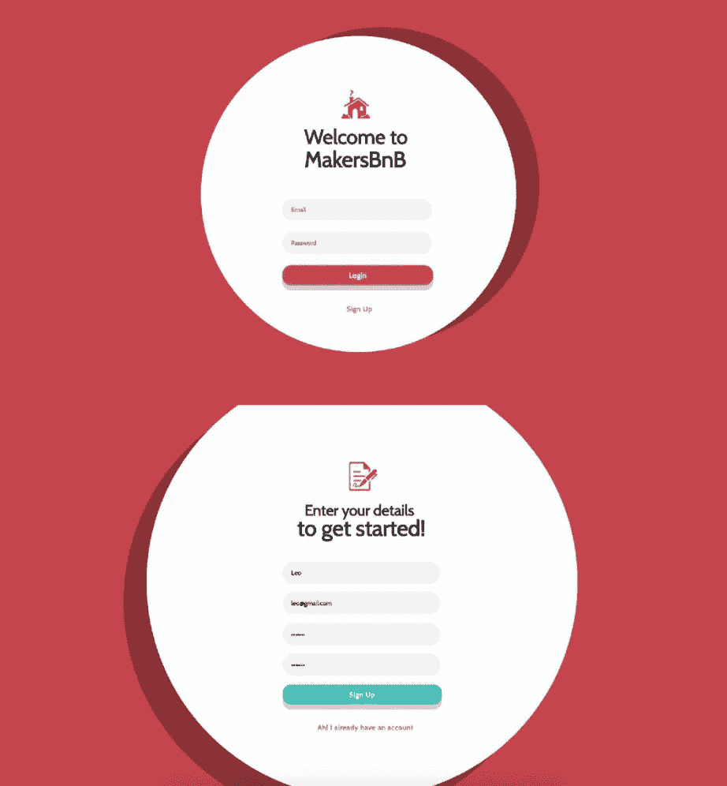

Look at these cool hipster shadows.

让我们看看第一个，让我给你看它的 CSS。

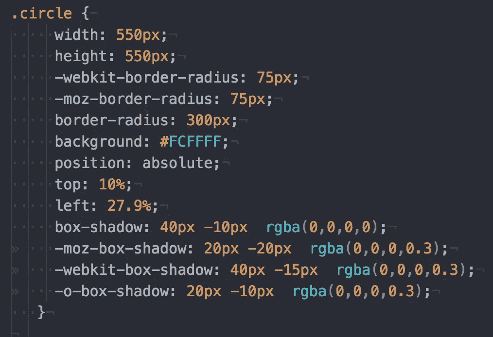

一切看起来都很清晰，甚至是我们之前提到的阴影部分。然而，这个行话的其余部分是什么，都与盒影有关。

我发现这个功能真正奇怪的地方是它如何接受 rgba 格式的颜色(这太烦人了)，但它确实接受了。有许多方法可以实现阴影效果。我只是选择了这一个，因为它是我首先发现的最有效的一个。

让我试着解释一下(我可能是错的，但这是我使用它的经验)，如果我们把阴影想象成一个聚光灯，它的轴心是从中心。moz-box-shadow 和-webkit-box-shadow 几乎是改变它与白色圆圈和阴影的 y 轴的距离的元素。

让我再写一遍:

*   moz-box-shadow = x 轴上的变化(阴影离白色圆圈有多远)
*   -webkit-box-shadow =改变它在 y 轴上的位置

通过与这两者互动，你可以从影子的来源和你想要的位置来定位它。我们使用剩余的盒子阴影来得到一个盒子阴影，并确保所有的坐标都被放置。

# 自定义光标:

See how it changes from a type to a glove?

这个特性真正酷的地方是有一组默认的光标可以调用。你可以在这里查阅。

[https://www.w3schools.com/cssref/tryit.asp?filename=trycss_cursor](https://www.w3schools.com/cssref/tryit.asp?filename=trycss_cursor)

## 光标的代码很简单。

> 光标:指针；
> 
> (这会给你一只指向按钮的手套)

## 就是这样！但是如果我们想要定制我们的光标呢？:).我所做的和实现的只是一个图像光标，虽然我希望它是一个 GIF。

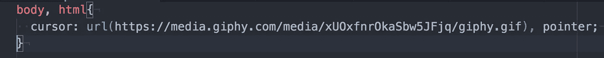

我最初试图上传我的 gif 到 GIPHY，但是它似乎只使用第一张图片，这很糟糕。然而，对于这个光标，你必须在最后设置一个默认光标，这样它就知道用下面的图像替换默认光标。

lol

我希望我可以拍一个屏幕视频，但在我们的确认预订页面上，但这需要我启动整个网站，我必须将数据输入到 so，早上 9 点有很多事情要做。

# 加分题:你是怎么得到像窗外的那个圈的。

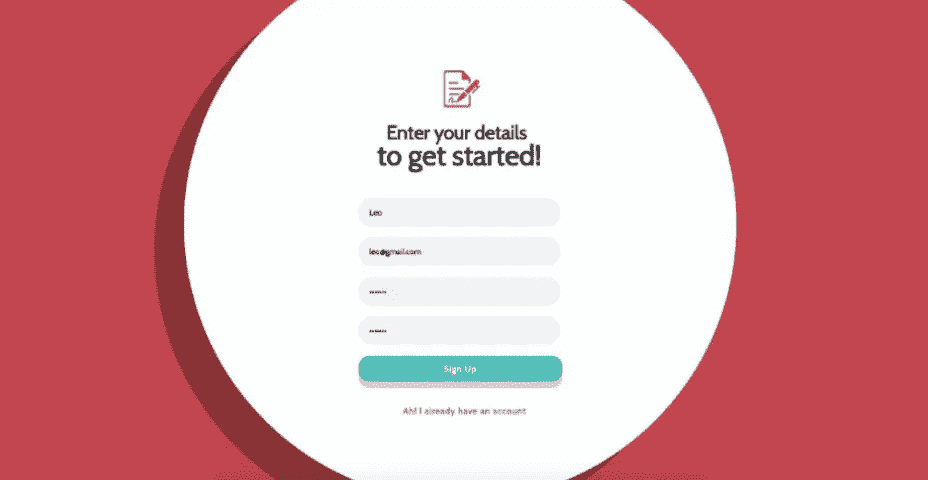

注意:这个网站没有响应，所以如果你缩小这个网站的窗口，布局将被打乱！那么，我是如何为我的计算机得到这个布局的呢？

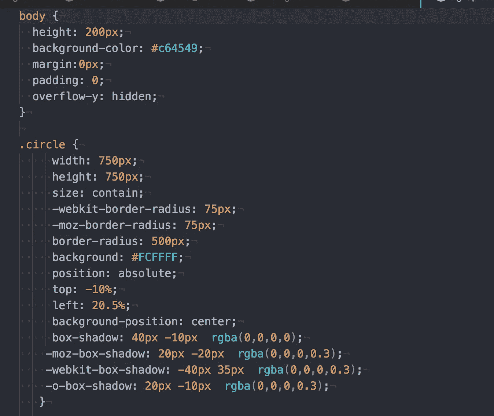

我相信它有以下特点:

*   尺寸:包含
*   背景-位置:中心；
*   边距:0px
*   填充:0:
*   溢出-y:隐藏；

最后一个元素，overflow-y 将隐藏窗口底部多余的内容。通过隐藏圆圈的溢出，它将把它的大小包含到窗口中。(非常确定这是如何工作的)

# 结论:

如果我做错了什么，请纠正我。我只是根据我在不到 24 小时内编写这段代码时所经历的事情出发。然而，这就是我现在能和你分享的所有技巧，我希望能回到我开始的 html 和 css 教程。在那之前，再见。

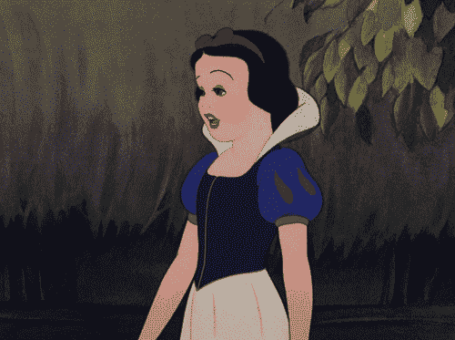

# 今日趣事

CSS 中的定位是一个很难理解的问题。目前，我有些糟糕的工作流程是，我用 position 元素分别设计每个元素的样式。这很糟糕，因为首先只有这么多 h1-h7 标签和 p 标签。其次，如果你调整了字体(比如说大小)，它可以改变你的网站定位！

这就是为什么最好在 divs 中进行。div 就像一个代码块，您可以选择编辑和移动它。它非常适合定位和对齐。

它们是一种痛苦，也是我正在思考的事情，但是如果你想改变一些小的东西，并且仍然保持一切正常，那么最好使用 div。还有那个还没掌握…