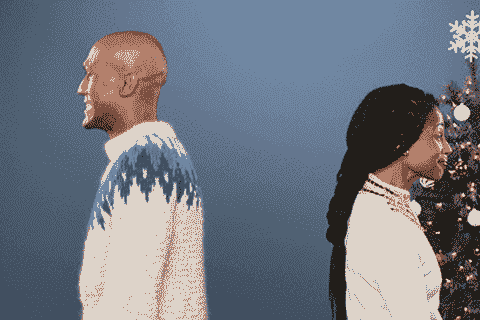
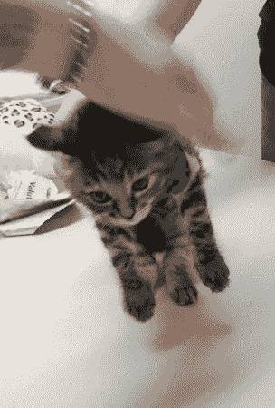
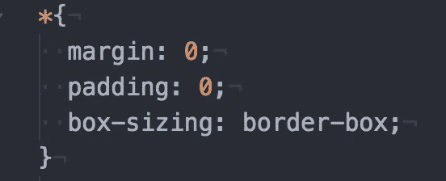
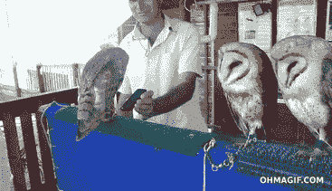
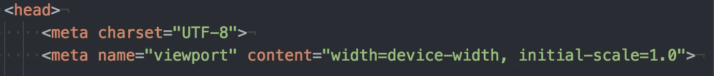
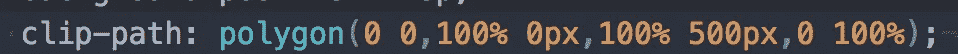
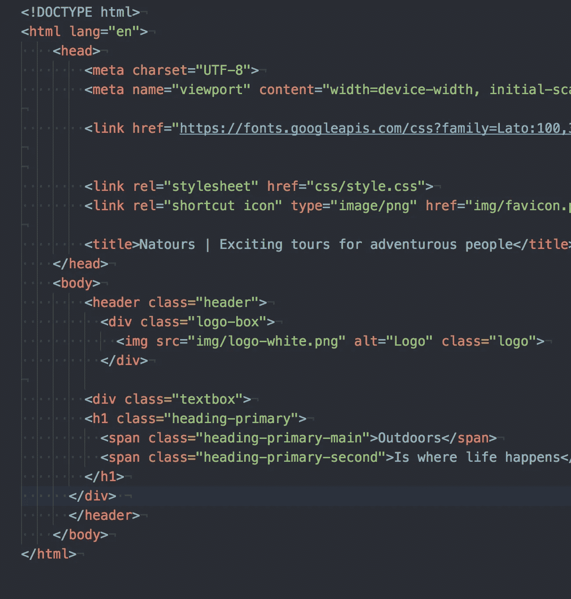
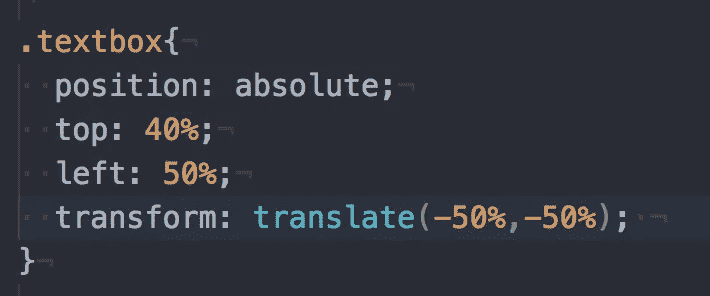
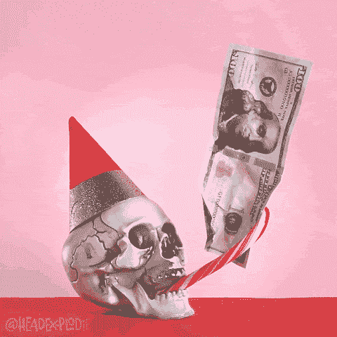

# 第 30 集:打开 CSS 盒子和练习。

> 原文：<https://medium.com/hackernoon/episode-30-opening-the-css-box-and-practices-41858d77479f>

我正在记录我在 [CSS](https://hackernoon.com/tagged/css) 的一个 Udemy 课程上的[学习](https://hackernoon.com/tagged/learning)。我不会说是哪一个，直到最后。然而，我确实觉得我在 CSS 方面比以前获得了更多的知识。太神奇了。

# CSS 中的良好实践:

在这个阶段，我只是在内部实现 CSS，就像没有明天一样。我没有意识到我的代码有规则或任何组织感，这很糟糕。如果其他人必须阅读我为自己的代码所写的内容，那该怎么办？他们不知道从哪里开始！这种不良做法必须停止。但是，CSS 中有哪些好的做法呢？

*   您的标签中的所有内容都应该是将在您的页面上实现的必需文件或样式。如果有你需要的字体或者你想应用到所有元素和页面本身的某个视图，你应该把它放在标签里面。
*   你的里的一切都应该是你编辑的内容。(即页面上的元素)
*   **开始清洗。**

一般来说，当我想到编辑网站或代码时，真的就像试图想象你的预测，并希望预测是正确的。我相信这是处理代码时最困难的挑战之一，因为当你在做的时候，它真的在无形中创造东西。只有当你点击 rack-up 或者打开一个 html 文件时，你才能看到最终的结果。

CSS 的情况更糟，因为当你编辑的时候，这些元素有固定的边框、边距和填充。例如，除非您编写代码并打开它，否则您永远不会知道元素将被放置在哪里！这就是为什么我们应该通过在 CSS 中编写以下代码来开始清理。

“*”是一个类，将应用于页面、正文和标题中的每个元素。这是一个很好的类，可以用来将所有东西应用到我称之为“开始清理”的东西上。因此，这里我们声明边距和填充为 0。这意味着我们的图像或元素应该放在页面的最左边，没有空格。这是我们的元素将要出现的地方，我们没有使用隐藏的边框或填充。这太棒了。

一个有趣的特征是我所学到的“盒子大小”。这将在窗口内对齐我们所有的框结构元素(图像，图片，文本，任何东西)。它几乎都有相似的宽度，使网站看起来干净。如果我们不这样做，我们可以创建一个 100 像素乘 500 像素的 div 框和一个 300 像素乘 100 像素的 div 框。如果我没有解释清楚，可以看看 W3schools 的这个好解释:

 [## CSS3 框大小属性

### 组织良好，易于理解的网站建设教程，有很多如何使用 HTML，CSS，JavaScript 的例子…

www.w3schools.com](https://www.w3schools.com/cssref/css3_pr_box-sizing.asp) 

现在，我们知道了通过清理空白、边框和设置边框来开始清理意味着什么

# 响应能力:

这可能是每个前端开发人员和任何其他人都想弄清楚的问题。为什么？嗯，因为一旦你确定了尺寸，当你缩小屏幕时，布局或设计就会改变。真烦人！

这就是所谓的“视口”，我们可以在 html 和 css 中要求和探索它。好东西。视区是用户在网页上的可见性。

viewport 将做的是，如果我们调用它，它将允许对页面中的元素做出响应。视口根据设备的大小调整元素。我们将内容设置为设备的宽度(在我的例子中是屏幕的宽度)。初始比例是页面加载时的缩放级别。谁知道你能做这个 CSS。太神奇了！但是，我哪里叫视口。好吧，让我给你看看。

我的 header 元素需要一个我们可以看到的图像。正如你在顶部看到的，我将高度设置为 95%vh，这是视口高度的 95%。这会将图像设置为最大高度，这样图像就不会溢出视口。这样用户仍然可以看到页面上的内容。

这里更有趣的特性是我如何用 CSS 而不是 HTML 来调用一个图像，并且设置了渐变。我们知道它是背景图像元素的线性梯度。然而，我也设置了渐变的方向(“右下方”)，并且设置了开始颜色和结束颜色。这真的很奇怪，渐变和其他功能需要这种 rgba 格式，但它很容易在任何颜色选择器中找到。

我已经将背景的大小设置为 container，这是该容器的最大大小(否则在该类中)。另一个有趣的特性是最后一行…

# 裁剪图像:

这个裁剪路径就是我们裁剪图像的方式。概念上和数学上都很疯狂。如果我们把一对数字想象成坐标(x 和 y ),每对数字代表一个点。

*   我们知道第一个坐标 0 是左，100 是右。
*   我们还知道，0 是顶部和底部可以去一个更高的数字，过去作为图像尺寸。

注意:我相信你可以用百分比来表示两者，但是作为一个好的实践，我们用百分比来表示 x 坐标，用 px 来表示 y 坐标。我们需要 y 坐标为 px，因为它能更准确地显示我们在图像上的裁剪。

多酷啊。你去。

# 跨度的实际用途是:

标签实际上是用来对文本的行内元素进行分组的。**何时以及如何开始使用 span 文本？**

好吧，假设我们有两个文本想要标记在

# 标签下。对于搜索引擎来说，

# 是至关重要的，这是搜索如何找到我们的网站。**把你网站的标题放在这里是很重要的，既要吸引人又要传达你项目的精神。**

现在，如果你的

# 有标题和副标题会怎么样。你可能会想，“为什么不把副标题放在一个

## 标签中。不好的做法。你实际上可以通过用不同的集合类调用来改变

# 标签中字体的样式。 

## 是的，我们终于不受调用文本框的 8 个元素的限制了。(h1-h7 & p)了。哈利路亚！

# 在 DIVS 搬东西。

DIVS 为什么伟大？DIVS 为什么有用？为什么 DIVS 是好的实践？

我们已经多次提到 DIVS 是代码块。这意味着我们可以在一个 DIV 中放置不同的元素，比如说编辑 DIV 的位置。

当您让“

”元素响应 viewport 函数，并希望其他元素也能响应时，这也很方便。在这种情况下，我没有使用 div，因为只有一个部分需要编辑才能实现。

但是，假设您添加了一个图像，并且您正在编辑该图像的大小。但是，您还想添加图像的定位，使其大小不会影响定位。因此，我们将 img src 行放在一个 div 中，这样我们可以将这两个特性分开。

把 div 想象成我们可以编辑和移动的盒子。当一个客户突然想要你改变字体大小，而你知道你的页面布局不会改变时，这是非常有用的。

**注意:**你能看到在 img 标签中我们已经设置了源、类和一些奇怪的东西叫做**“alt”alt 元素用于 google 搜索，说明图像是什么。Google 会搜索“logo ”,我们的图像会以某种方式出现在目录中。这样做是很好的做法。**

# 正确定位:

虽然会有另一个关于绝对位置和相对位置的区别的演讲，但是让我们来弄清楚如何正确地定位事物。

因此，对于这一部分，我们使用绝对位置并设置顶部和左侧特征。让我们想象一下我们现在没有最后一行。

现在，如果我们只是拥有它，它不会像我们想要的那样居中。什么是绝对位置，设置顶部和左侧就是设置从盒子边缘开始的位置。注意:放入一个背景色的 css 并运行它，你会明白我的意思。假设我们不希望枢轴点在最左边，我们希望它在中间！一旦它在中间，我们就可以正确地把它放在中间。

这就是最后一行出现的地方…转换，翻译。

里面的值正在改变支点。它不再与绝对位置相关联。相反，它在重新调整。所以，我认为两边的-50%正在改变中心点。我们现在实现了我们的目标，从现在开始，定位是一个试错过程。

伙计们，这是我所有的能量！直到下次 x

# 今日趣事:

如果你为在圣诞礼物上花费超过预算而感到难过，不要这样。你在一天结束时付出，至少你有好的精神。至少不是为了你自己如果你明白我的意思。