# 第 31 集:用 CSS 制作的 Powerpoint 动画

> 原文：<https://medium.com/hackernoon/episode-31-powerpoint-animations-done-in-css-90b2b4eaf054>

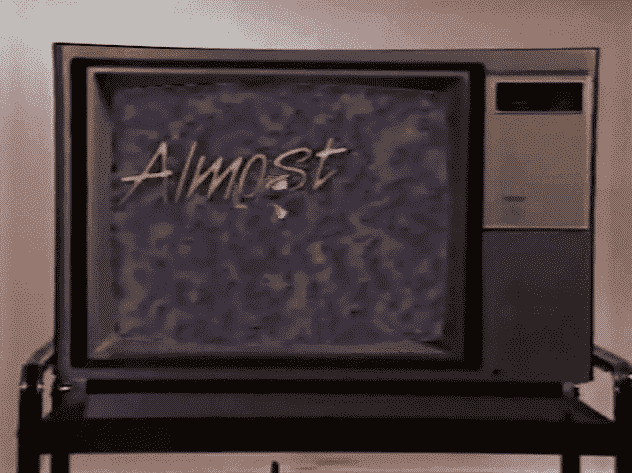

首先，在我开始之前，欢迎 31 个以上的追随者，他们神奇地出现在我的媒体页面上，并给了我的帖子很多支持。谢谢大家，大家好，我是达尼亚。GIF 科学家、动画师、博客作者(现在)和前端编码员(希望如此)。这真的很令人困惑，因为我总是会问“你从哪里来？”

其次，上一篇帖子的评论里提到了我正在做的课程的链接。我没有提到它的意图是因为我不想推荐一个整体上不太好的课程。当然，我现在学到的东西很棒，但我只学了 10%的课程。我还有 90%要去发现。澄清一下，这纯粹是我对一个人的业余生活的反思，这样我就可以对自己重新解释了。

第三，简而言之，我正在一个编码训练营(伦敦的创客学院)处理与这篇文章完全不同的主题。如果你正在寻找这些帖子(我不会说系列，因为我还不确定它是否是常数)，我会在博文的标题中写下标题 **(CSS)** 。不过，看看我的其他博客帖子也无妨。我现在差不多每周写五篇文章，内容包括项目经历、训练营经历和我学到的其他语言知识。

# 我们很酷？我们开始吧。

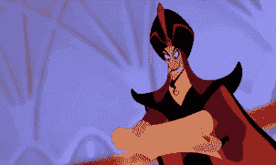

我把这篇文章叫做“powerpoint 动画”，因为我很确定我们大多数人都经历过或者看过 powerpoint。如果你没有，powerpoint 是一个制作演示文稿或幻灯片的程序。有一个叫做“文字动画”的功能，我们可以用动画来展示我们的文字是如何进入页面的。这是我们今天要讲的内容的一部分，如果其他元素没有相同的概念的话。如果没有，列表如下:

*   关键帧
*   动画文本
*   去掉那个奶昔
*   设置按钮时的技巧
*   伪类(按钮:悬停，:链接，:浏览)等
*   纽扣的造型技巧
*   button::之后？(鬼鬼祟祟但诡计多端)

# 关键帧:

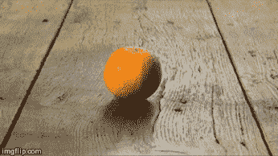

这是动画的基础，但是我想如果你没有做过动画，这很难解释。所以，如果我们看这张 GIF，这张 GIF 实际上是由多张图片组成的。在动画中，我们称之为“定格”，我们称这些图像为帧。在数字动画中，帧的等效物是关键帧。如果我使用 after effects(Adobe 的一款令人惊叹的动画软件)，他们会使用关键帧来一帧一帧地制作动画。

## 关键帧实际上是 CSS 中我们可以使用的一个属性，相当酷。比方说，我想让一个文本从右边开始，向左移动一点，然后自己居中。让我们看看代码。

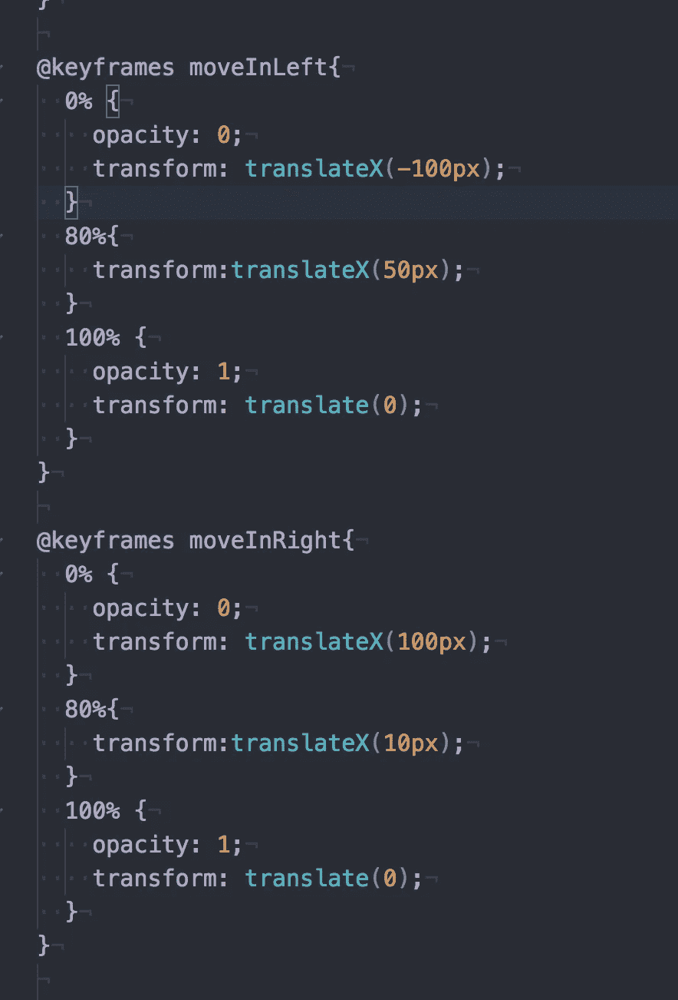

所以，这里我写了两个动画属性，但是让我们看看第一个。让我们一行一行地分析这个问题。

*   @keyframes 是我们对关键帧 css 元素的称呼。
*   下一个(moveInLeft)是我们以后可以引用或调用的动画名称…
*   现在，我们在动画中设置点。0%是动画开始时，100%是动画结束时。我们甚至可以设置两者之间的百分比，这给了我们更多的灵活性。显然，你编辑的越多，为了让动画流畅，你就越有可能需要精确的 css 元素值。一个动画师提示，点数越少，动作越流畅，但细节越少。在这种情况下，我们不需要详细的动画来将文本从右向左移动。
*   0%时，不透明度为 0，因为我希望文本进入页面时出现。这就像“哇，你是怎么做到的，它看起来比实际上要酷得多”一样，在 100%时，我会将它设置为 1。**是的，很奇怪，不透明度 0 到不透明度 100 是 0 和 1 之类的值。**
*   然后，我在动画里翻译。-100 像素，从最左侧开始，0%。80%时，关键帧会将文本从右向左移动。然后在 100%时，它将回到中心。花点时间读读这个。

很好，我们现在有了关键帧元素，我们可以将它应用到元素中。

# 如何应用关键帧:

虽然我们已经制作了一个关键帧，但是我们现在需要将这个关键帧应用到 html 中的一个元素上。因为我说过我想要一个文本动画，所以我将把它应用到一个名为(“header-primary-main”)的文本中。

我们所要做的就是在 header-primary-main 的 CSS 块中调用动画“moveInLeft”来像这样…

是的，我知道你看到两个不同的属性，你想知道，为什么显示另一个？通信不清晰。嗯，对于动画，我们既可以单独调用特性，也可以在一行中调用。让我们看看代码。

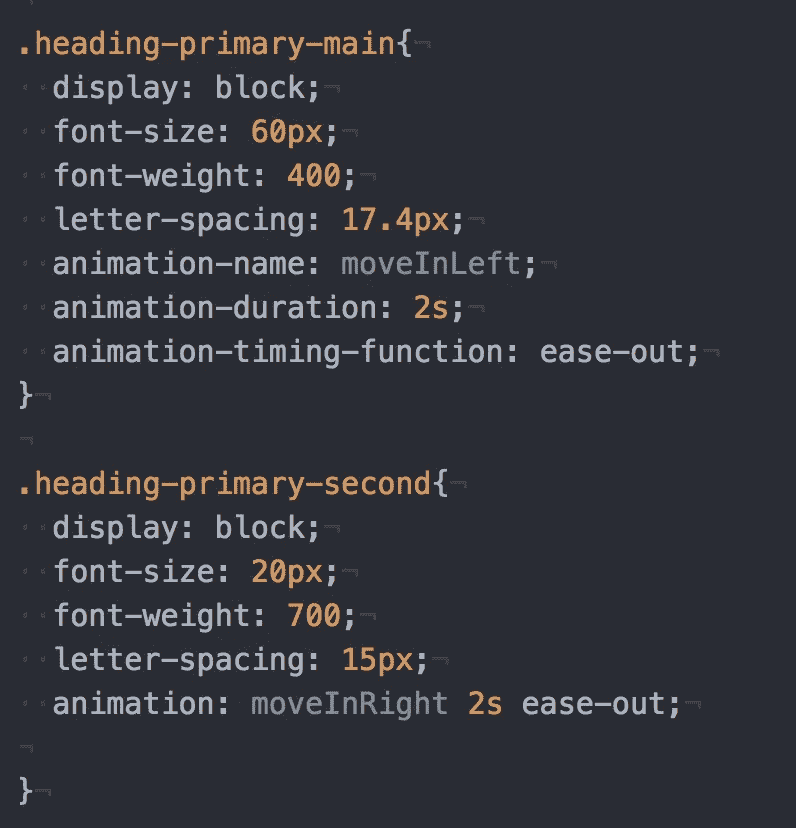

所以，我在字母间距后给动画起了个名字“向左移动”。然后，我将持续时间设置为 2 秒。然后，我设置了一个定时功能来放松，这意味着它会在接近尾声时加快速度。

现在来看“头-主-次”。我只是通过调用**动画在一行中完成了所有这些。这个怎么样？让我向您展示这段代码的作用……**

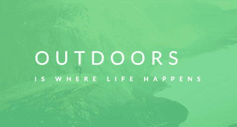

Watch this GIF carefully. There is a jitter that we will solve out later.

沃利亚。我们刚刚对 CSS 中的 HTML 元素应用了一个关键帧动画。只是为了说明我的意思:

> 点数越少，动作越流畅，但细节越少。

我将使文本翻转，并添加更多的百分比进行编辑。运用你的想象力和图片，我已经将这个编辑过的关键帧 MoveInLeft 应用于 heading-primary-main 元素。注意:旋转是以度为单位的。

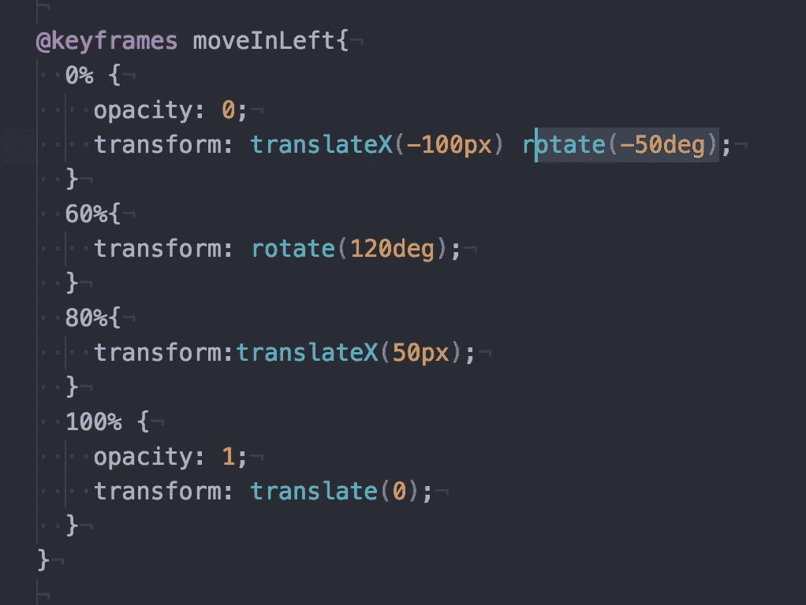

Look at this code, nothing much has changed but let’s see the outcome.

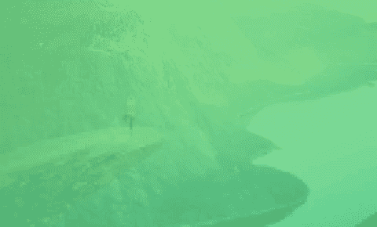

你能看到动画并不平滑，与之前的 GIF 相比，有一点轻微的抖动。这真的取决于你想要动画流畅还是精确，现在我们手头有这些[工具](https://hackernoon.com/tagged/tools)。我就是这个意思。如果你没有得到它，评论或消息给我。

# 摆脱摇摇欲坠:

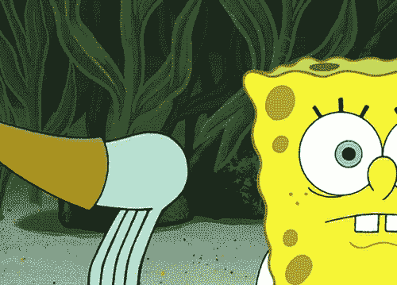

我不知道你是否对抖动有强迫症，但是我们不希望平滑的动画中出现抖动。这是一种“啊，它就在那里”的感觉，尽管它真的很小。这就像当你知道你房子里的一幅画没有集中在大约 3 度的位置，而你是唯一一个不得不目睹你房子里这种混乱的人。对于这些动画，这些轻微的抖动是基于我相信的定位而发生的，但没有人真正知道为什么。它是如此之小，以至于如果你是一个强迫症患者或对动画有强迫症，它不会产生瘙痒。

但是，为了流畅的动画，我们希望安全。一部完美流畅的动画会给客户和人们留下深刻印象，并让我们比实际上更具现代创意。我们所需要的只是 CSS 代码中的一个特性。

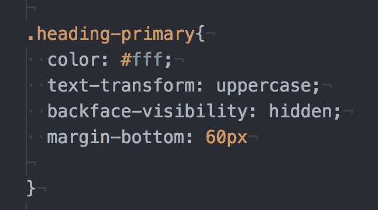

假设我将 header-primary-main 和 header-primary-second 元素放在一个名为 heading-primary 的 div 块中。我说的代码是**back face-visibility:hidden；**

无论在我们平滑的动画背后发生了什么(例如，当它试图将自己准确地定位在中心时)，我们都不必看到。我们想要平滑度…

你看到我们流畅动画中的微小邪恶静电了吗？这是我们想要消除的东西，我的假设是为什么它会在那里，因为当我们的关键帧结束时，它会将文本集中在它应该在的地方一毫米。电脑强迫症能有多严重就有多严重。

# 我提到的关于按钮的技巧:

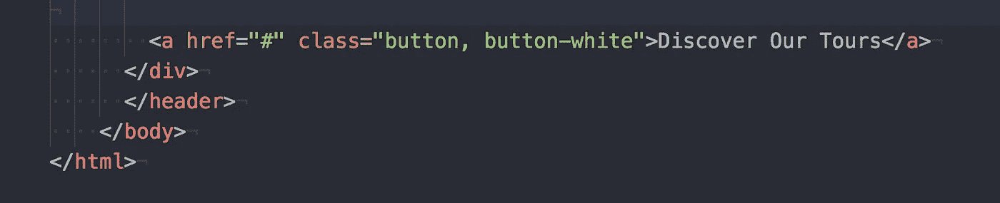

当我们在 html 中设置一个按钮时，我不知道的是按钮是一个锚。它通常用于超链接，因为按钮是这样做的，当我们点击它时，它会转到一个页面或链接，对吗？然而，当我们正在构建一个还没有地方可去的按钮时…我们可以将 **href 标签设置为#**

#在 href 标签中没有任何意义，按钮到目前为止没有任何位置。我想我把这个放进去，这样下次我看到写在按钮上的时候就能记下了。

# 伪类:(按钮)

虽然我们中的一些人知道或搜索过伪词“fake”，但 CSS 中的伪类被称为特殊类。这对于元素来说特别酷，因为我们可以调用像“悬停、链接、访问”这样的模式在下面的链接中，您可以详细了解大量的课程:

 [## CSS 伪类

### 组织良好，易于理解的网站建设教程，有很多如何使用 HTML，CSS，JavaScript 的例子…

www.w3schools.com](https://www.w3schools.com/css/css_pseudo_classes.asp) 

然而，我们将讨论我现在列出的以下三个。让我们来看看我的疯狂代码。

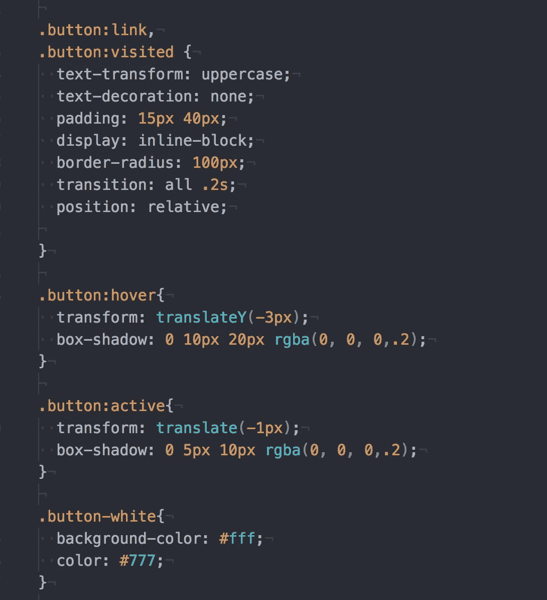

上面是一个按钮的 CSS 代码。现在，让我们看看我的 html 文件。

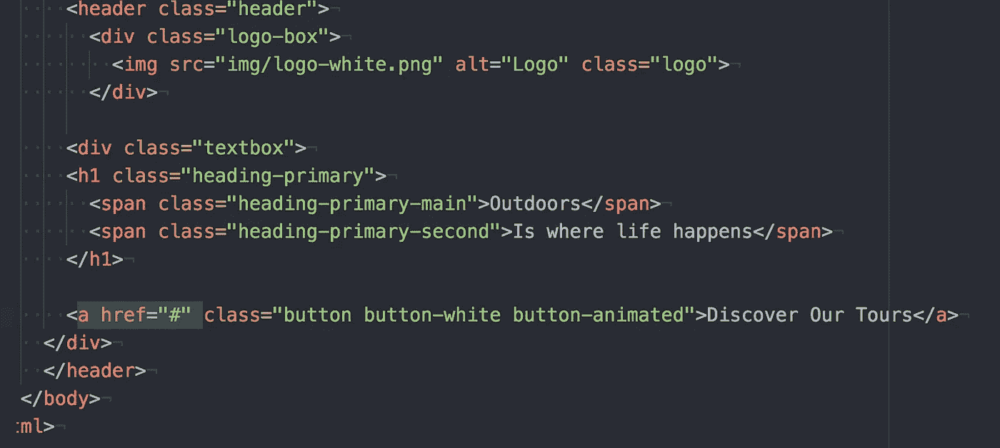

您可以在突出显示部分 a href="# "看到这个按钮，我为这个按钮提供了三个类。是的，我们可以调用多个类，这是什么魔法！给按钮提供多个类是很好的，因为我们可能想要在这些类中划分我们的样式…如果你不明白我的意思，我也不明白，但是我很确定当我们完成我的代码时，我们会明白的。

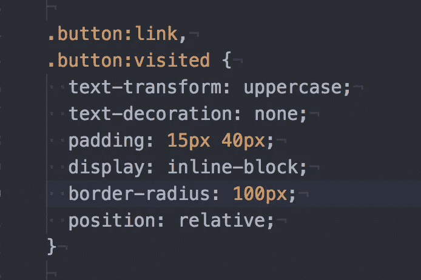

我们代码的第一部分是这样的。我们将按钮类和伪类一起调用。我们调用了伪类链接，并在一个 CSS 样式元素中进行了访问。哇哦。耶！我们能做到！

这是因为默认情况下，一个按钮有一个蓝色的链接和一个蓝色的下划线，当我们访问这个链接时，它变成紫色。就样式而言，这听起来很基本，所以让我们改变一下。

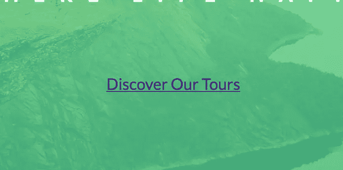

Basic. Without any css.

如果你看过我的帖子，如果没有查看我放置的属性，我的代码应该是可以理解的。

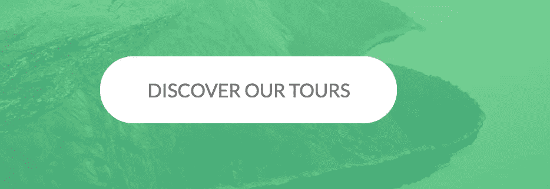

Well you look at that. Look’s better now.

然而，让我们把它提高一个档次。如果我们想在鼠标悬停在按钮上时产生一点移动和一个很酷的阴影效果呢？

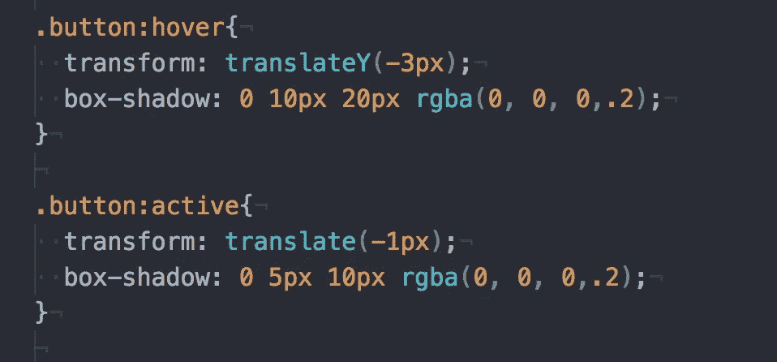

我们简单地称伪类 hover 和 active。悬停似乎很容易解释，即当我们悬停在按钮上时，这应该会发生。激活是当链接被选中时，即当我们点击按钮时。

变换和方框阴影应该是解释性的。但是，简而言之，按钮悬停下移-3，有模糊阴影。然后当你点击按钮时，下移-1 是，阴影更清晰。

太好了。我们已经创建了一个普通的按钮，当我们点击它时，它看起来像是被按下了。然而，如果我们想添加一个更酷的效果，让我们的按钮看起来更酷。当我悬停在按钮上时，它会以一种淡出的光晕扩展，然后我们悬停远离它，它会缩小光晕。

我是不是太过分了？是的，从设计角度来说，但是这将在后面介绍伪类的使用。

# 这里从设计到代码的策略是什么？

我们的设计理念是什么？我们希望当我们悬停在按钮上时，按钮以渐弱的光晕展开，当我们不再悬停在按钮上时，按钮收缩。好的，这个设计的关键是什么，和我们如何编码有关。

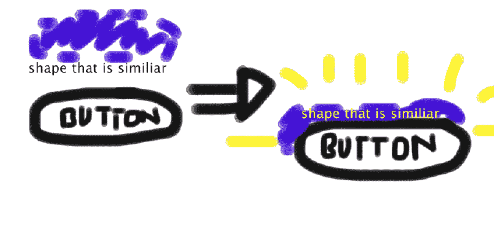

What a great diagram…

嗯，我们可以做另一个形状，类似于我们的按钮的形状，把它放在我们的按钮后面，并把这个发光效果放在那个按钮上。然而，我们需要知道这个形状必须跟随按钮的移动。

我觉得这是我能解释我的概念的最好方式，因为这是我抓住的。如果你不明白，请在下面评论，我会试着再解释一遍。

这就是::after 伪类的用武之地。

# *在伪类之后。

after 伪类在它所放置的元素的内容之后插入一些东西。记住这个概念，让我们看一些代码。

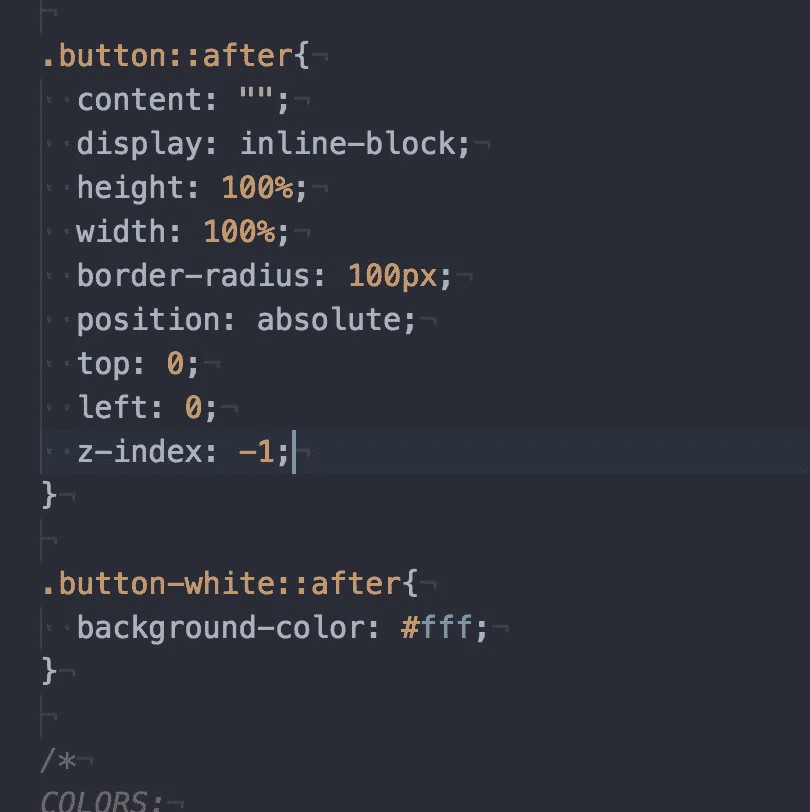

因此，我们已经调用了 button 类并将伪。在这里，我们已经设置了按钮的形状，这将是我们现有的按钮精确。然而，这里重要的是 z 索引。值为-1 的 z 索引将我们的 after duo 按钮放在我们刚刚创建的按钮后面。如果没有 z-index，我们的 button:: after 将放在我们的按钮前面。这很糟糕，因为我们创建的按钮现在将被这样屏蔽:

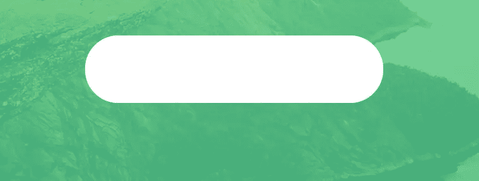

Without the z-index value that is above.

这有意义吗？我希望如此。现在，如果我们看下一段代码，我们正在设计一个不同的类。还记得我们在按钮的一个元素上设置了不同的类。

-Remember-

这就是我们开始将 CSS 样式分成不同类的地方。这样做的原因是，对于::after 类，我们希望将样式元素划分到不同的类中，这样在实践中，我们可以更容易地编辑和了解所有内容。(我相信这就是原因，但我可能是错的，但这就是我认为的原因)。我很确定这也是为什么我们可以在调用同一个按钮元素时使用不同的版本，但是这个实验是以后的事情了..

现在，我们在 button-white 类中将背景颜色设置为白色。酷，我们有类似的形状，就像我们的按钮后面的按钮。让我们开始发光吧。

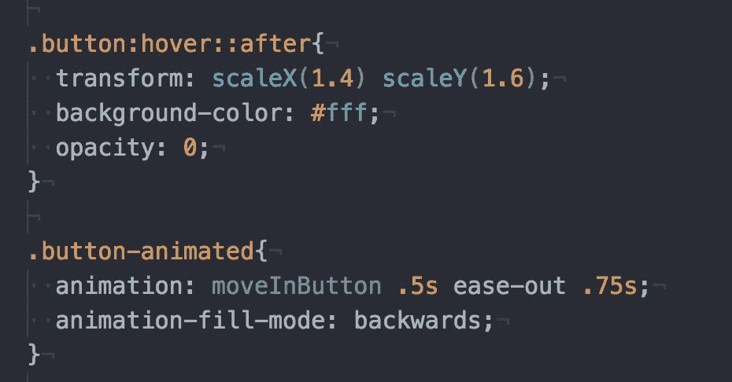

我们将永远与我们的::伪类按钮后，给我们的动画概念将在它上面。首先我们有悬停。当我们悬停在按钮上时(button::hover)。在 CSS 样式中，我们将按钮展开，背景颜色是白色，不透明度为 0。结局是这样的。

但是，如果我们刷新这个页面，页面上的动画和元素会像这样进来…

This happens every time I refresh the page

为了设计的一致性，让我们在屏幕上显示文本的同时也显示按钮。你还记得吗，我们为这个按钮设计了多个类，这样我们就可以分割我们的样式了。我们用的是最后一个名为。按钮动画。假设我们希望按钮从下面出现，让我们看看代码。

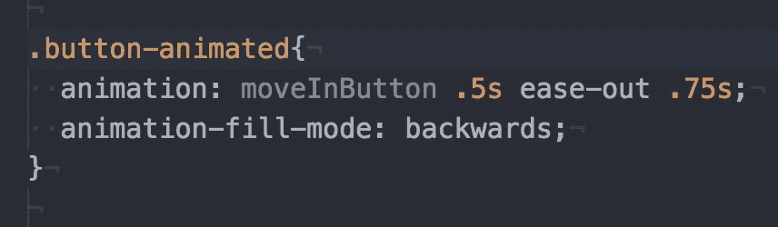

除了两件新的事情，这里的一切似乎都很好解释。我们还是过一遍吧。所以，这里我们叫一个动画叫“moveInButton”。然后我们调用动画时长，动画缓出，动画延时 0.75 秒。是的，我们可以在动画中添加的新东西之一是一行中的延迟。您也可以调用动画延迟以及属性。什么是动画 **moveInButton？**

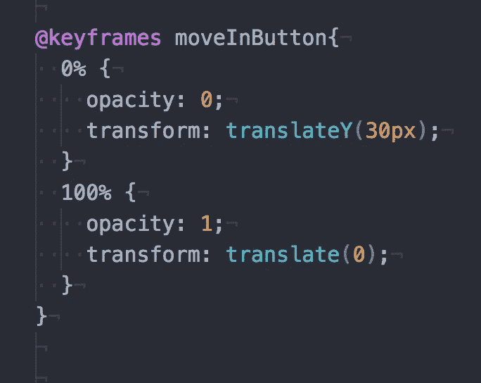

在我们的动画 moveInButton 中，我们将不透明度从 0 更改为 1。这就是按钮出现的效果。然后，按钮从 30px 开始(正面在屏幕上较低)，这意味着它从一个较低的点开始，然后上升到原始中心点。现在，让我们将这个动画实现到代码中，我们的结果就是这样！

This happens every time I refresh the page now

喔。让我告诉你写 12 分钟我学到的东西并不容易。任何问题或者我犯的任何错误，写在下面的评论里吧！前进到下一个帖子，因为我已经落后一天了，回头见。

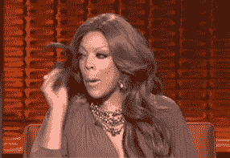

# 今日趣事:

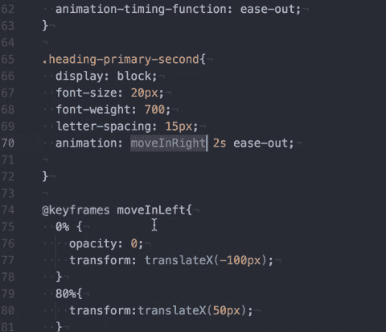

有时，你会意识到“哦，糟糕，我必须把一个单词从“button”改成“buttons ”,如果我在代码编辑器中执行 command+F，它会说我有 20 个按钮！这将需要我一段时间来改变这一切，我可能会犯一个错误，因为现在是深夜…

别担心，我的朋友。如果我们简单地执行 command+D，这将给我们多个光标放在我们的文本编辑器上，我们可以同时改变我们给定的所有点。邪恶。