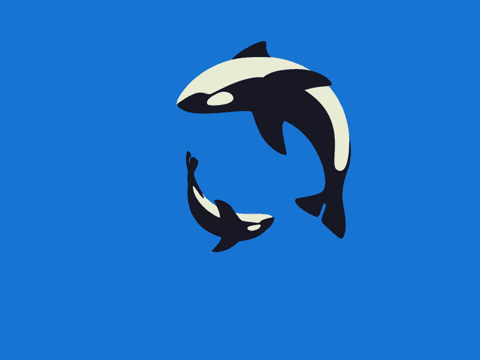
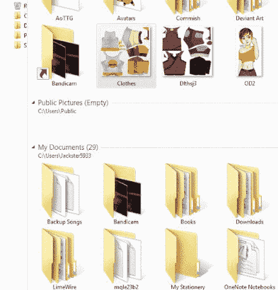
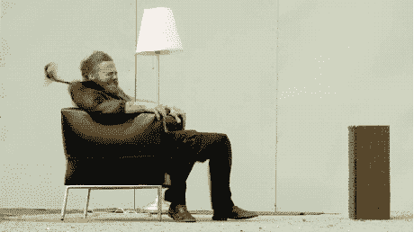
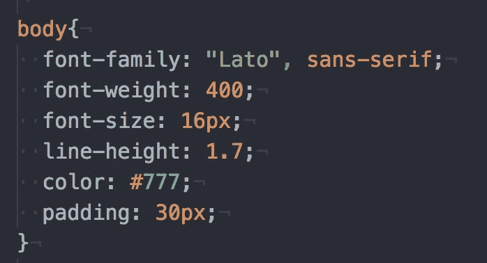
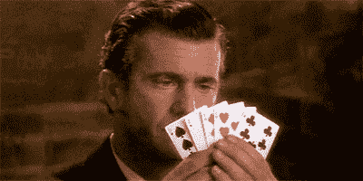
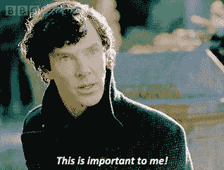
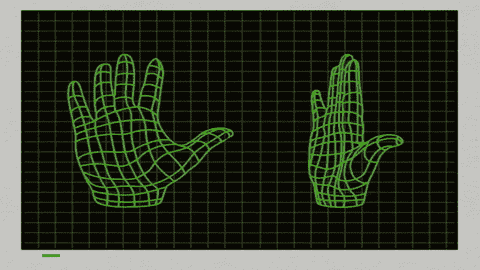
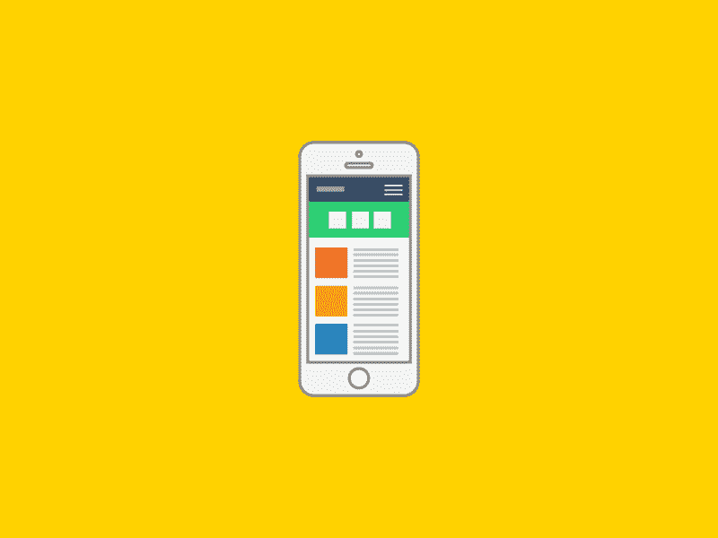
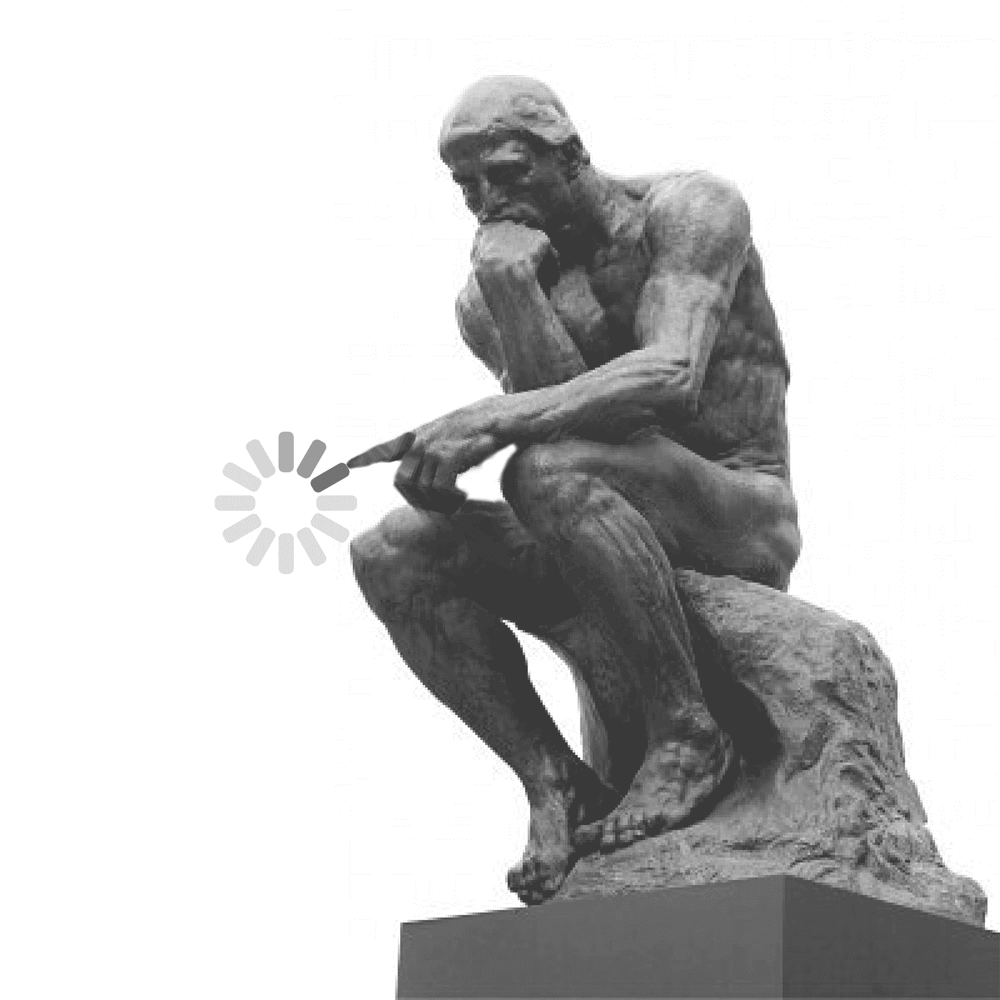
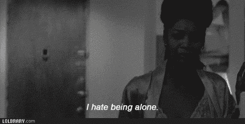

# 第 32 集:CSS 是如何工作的，我们的目标是什么。

> 原文：<https://medium.com/hackernoon/episode-32-how-css-works-and-what-we-aim-for-with-css-ecf2304904a9>


今天，我将思考很多理论和更多幕后的东西。不会有太多的 [CSS](https://hackernoon.com/tagged/css) 代码出现，但是我们会看看**CSS 是如何工作的，以及我们在用 CSS 编码时应该以什么为目标。**

尽管阅读[书籍](https://hackernoon.com/tagged/books)可能看起来是一件无聊的事情，但是理解和概念化 CSS 如何处理它的代码以及我们如何基于这些知识做出代码决策是很好的知识。

我会努力让它变得有趣，我保证。注意这个词:尝试。

# **我们的 CSS 文件是如何加载的？:**



同样适用于此的其他问题是“当所有其他代码如 HTML 被加载时，CSS 在哪里被加载”，“CSS 在我们的服务器中去哪里”以及“CSS 如何连接到所有东西？”可能会有更多的问题，我只是陈述了几个。

我们知道我们的 CSS 连接到我们的 HTML 文件，因此，我们可以得出结论，CSS 和 HTML 加载到我们的浏览器中。简而言之，在网络世界中，数据进出浏览器和服务器。浏览器就是我们在页面上看到的东西(google Chrome 或者任何一个 internet explorer 没有提到要打开你的浏览器吗？)而服务器是数据存储在某个地方某个地方的一堆计算机中的地方。因为，CSS 和 HTML 是我们在屏幕上看到的文件——是的，它在我们的浏览器中。

因此，在浏览器中，它是这样发生的:

*   首先，html 文件被加载并被解码。
*   当 html 文件被解码时，CSS 文件被加载和解码。
*   在 CSS 解码中，CSS 处理给定的值和冲突声明。



你知道我们如何在多个类上调用属性“font-weight”。CSS 处理“冲突声明”意味着它会同意“对于按钮类，字体粗细是 200 像素，对于文本类，字体粗细是 400 像素。它基本上区分了依赖于它们的类的属性和值。这只是一个例子，还可能有其他情况。

另一种情况是当我们面对不同的样式表时。css 文件基本上是一个样式表。浏览器有自己的默认样式表。那么，浏览器将如何在我们的样式表和默认样式表之间进行选择。这个不太清楚，但是一定有条件挑一个比另一个好。

此外，这一部分也是用户对样式表的操作与作者的样式表(您制作的样式表)的区别。例如，如果用户可以输入他们的颜色，背景可以改变。我们的样式表是否会被覆盖？这取决于我们写的代码，在一个优先顺序里，对吗？我相信这是一种理念，这一步在这里是有意义的。


-对于 html 和 css，在解码发生后，HTML 和 CSS 映射成一些人所说的“树的家族”因为 HTML 和 CSS 有父类、父元素、子类、子元素等等，所以这个系谱树被映射出来并存储在两个文件中。

**对于 HTML，是 DOM(文档对象模型)**

**对于 CSS 来说，就是 CSSOM (CSS 对象模型)**

*   DOM 和 CSSOM 被绘制成一棵“家谱”
*   这个“家谱”然后被实现到所选择的浏览器上。这一步是根据浏览器的大小进行所有定位和对齐的地方。毕竟，这些天我们可以在电脑或手机上查看我们的文件
*   最后，它渲染窗口，我们看到了 HTML 和 CSS 的结果！



**所有这一切都发生在几秒钟内，因为我们通常看到我们的网站立即加载！多疯狂啊！计算机比我们的劳动力更出色！**

# **CSS 优先级:**


我得出的结论是，所有的编码语言或者大部分都有这个东西叫优先级。换句话说，事情如何装载的“优先顺序”。我发现这是非常重要的信息，因为它帮助我们理解什么是 css 代码被调用。当我们遇到问题时，这可能非常方便。

**注意:所有这些都发生在我们的 CSS 代码被解码的阶段。这可能是我现在应该提到并开始使用的一些基本知识，但是嘿，我们都在这里学习。在我们的 CSS 代码中，我们调用的类/id 名被称为选择器。**CSS 属性部分是调用声明。****

**我们重复一下。**



**body** 是选择器，{}是**声明**，声明里面的东西是**调用的属性 c** 。



就像纸牌游戏一样，一些符号和数字具有更高的优先级(9 比 5，红桃比方块)，有一个比其他元素更强大的元素顺序。

*   内嵌样式(最强大)
*   本能冲动
*   班
*   元素(最弱)

## 内嵌样式:



我相信这个课程的意思是，你可以内联调用对象的优先级。重要。如果我们写！如果其中一个声明很重要，计算机会优先考虑它。例如，tgi

```
no1priority {font-weight: 200px !important}
```

据说有用！仅在必要时才重要。否则，在万不得已的紧急状态下，可以优先处理调用 id 和类的数量。

## id 和类别



我们可以通过 id 调用选择器。在我们的 html 文件中，我们可以为元素设置一个 id，如下所示:

```
<div id=“no1priority” class=“2priority> Hello </div>
```

对吗？在 css 中，我们可以通过在选择器前面放一个散列来调用 id，如下所示:

```
#no1priority {font-weight: 30 px}
```

## 类是相同的，我们可以像这样在选择器中调用类:

```
.no 2 priority {font-weight : 20 px}
```

不要忘记，我们可以在一个 div 或任何其他元素上调用多个 id 和类。这就是 CS

## 元素:

标题、段落或任何其他元素都可以这样称呼。这些是最不重要的。

```
p {font-weight: 10px
 }
```

# CSS 开发人员的三个目标:


我认为这些是每个人都应该遵循的 CSS 信条和目标。就像编写代码的目标是保持简单/最小化一样，CSS 有它自己的一套“应该遵循”的规则或目标。虽然一个人在编写 CSS 时可以设定很多目标，但令人惊讶的是，每个人都应该遵循 3 个主要原则。虽然，这三根柱子就像你在 V & A 博物馆看到的柱子，大概是人类平均尺寸的 100 倍。我们开始吧。

# 1.响应式设计:



真不敢相信很明显，当我们创建网站时，我们需要记住这一点，因为大多数动画是使我们的网站有反应的东西！这就是设计派上用场的地方，因为你想做出只对 CSS 中的元素必要的决定，而不是做过头。**响应式设计的目标是让我们创造的产品既吸引人又易于用户使用。**

**响应式设计本身是一种技能吗？**是的(虽然我上过设计学校，但这也是我不完全擅长的事情)**我们在 CSS 中需要这些知识吗？当然，因为我们在提供 CSS 文件时必须平衡功能和外观。**

这些是我抓住的以下要点，是反应式设计中至关重要的基础。虽然我也有很多东西要学，但每个人都有起点。

## 流畅的布局

当你从响应式设计的角度来考虑它时，它似乎是解释性的。我们希望我们的布局对于任何尺寸的屏幕都是流畅的，无论是电脑、笔记本还是屏幕。我们在这里的目标是创建包装器(包装你的内容的东西)、列或内容，以适应我们的应用程序在任何显示器上显示。

## CSS 媒体查询

在这种情况下，我发现 CSS 中的“媒体查询”也可以写成“@media screen ”,它可以帮助我们根据网站的显示来改变网站的设计。它允许我们在不同的屏幕上显示时设置一套新的规则。

## 响应图像

由于我们的网站将显示在不同的屏幕上，因此，我们的设计将改变，我们的图像也需要改变。当我们在不同的显示器上调整网站大小时，我们需要确保图像的质量和比例不变。咄。

## 正确的单位:

这基本上是一个记忆游戏，什么单位用于什么属性，当我们使用这些单位时，我们知道它们与多少百分比的单位相关。也许最好把它记在心里，但不要担心，我相信它来自经验。

## 桌面优先还是移动优先:

对于每个网站来说，这更多的是一种设计策略。无论设计优先于台式机还是手机，甚至是现在的平板电脑。哪一个将是主要设计，哪一个将是流体布局(我的意思是，我们对布局的适应)。这在概念上是有意义的，因为如果你知道你的网站/应用程序或任何数字产品将更多地出现在桌面上，你会希望样式的优先级是桌面而不是移动。

如何为此制定策略对我来说还是一个谜？我阅读这些文章是为了更好地理解课程的内容。我会把它们贴在这里给那些有好奇心的人看:

[https://kyleschaeffer . com/development/responsive-layouts-using-CSS-media-queries/](https://kyleschaeffer.com/development/responsive-layouts-using-css-media-queries/)

[](https://www.w3schools.com/cssref/css_units.asp) [## CSS 单位

### 组织良好，易于理解的网站建设教程，有很多如何使用 HTML，CSS，JavaScript 的例子…

www.w3schools.com](https://www.w3schools.com/cssref/css_units.asp) 

# 2.可维护和可扩展的代码:


对于任何将要使用您的代码的开发人员(很可能)，我们的代码应该易于阅读，并且对于除了基础知识之外几乎没有任何代码知识的人来说应该易于理解。这意味着:

*   我们的代码是干净的(没有注释，没有不匹配的名字，等等)..)
*   我们的代码很容易理解(我们编码的顺序应该根据我们的 html 文件)
*   我们的代码应该是可重用的(以防有人想将它用于公司正在制作的另一个产品或网站)
*   我们的代码应该组织在正确的文件中(这些文件应该以正确的方式排序。所有东西都应该正确命名，并且各就各位)
*   我们的 HTML 应该是结构化的(头脑中的东西属于头脑，而我们身体中的东西属于我们的身体，除非它真的需要发生)

# 3.Web 性能:



代码每天都在服务器之间来回运行。更不用说一个网站了，现在想想今天存在于浏览器上的数百万个网站。网站的供应量如此之大，我们设计的网站如何脱颖而出？它哪里还有机会！在这一点上，让我们忽略这样一个事实，即有一个完整的营销/品牌方面也进入这一点。

除了这一点，我们还能如何让我们的网站脱颖而出呢？

*   **少码**

这是一个很好的开始，因为我们的 CSS 代码越少，渲染的时间就越短。如果我们需要大量的代码会怎么样？

*   **压缩码**

没错。我们不想牺牲我们实际需要的代码，这样它就可以呈现在页面上。我们还能做什么来压缩我们的代码？

*   **使用 CSS 处理器(SASS)**

是的，拥有一个被称为 SASS 的 CSS 处理器来帮助我们压缩代码是一件非常有用的事情。这意味着为服务器和浏览器渲染的代码更少。还有什么！

*   **更少的 HTTP 请求**

那是另一个好的。我们从 HTTP 请求的次数越少越好。这几乎就像减少了我们的服务器、浏览器为了输出我们的代码而必须做的动作的数量。更少的请求意味着更少的工作和更快的反驳。

*   **更少的&压缩图片。**

图像可能是占用大量空间的第一件事。我的意思是，大量的空间(千兆字节，字节明白吗？).它占用了大量的内存，因此需要更长的时间来解码我们的 CSS。我们应该致力于压缩我们的图像，并仔细选择哪些图像我们需要品牌或展示我们设计的网站。这可能是至关重要的，我可以想象许多人会忘记。

希望这个理论尽可能的直接。请在下面评论你的想法，下次再见**(也许在接下来的几天，因为我必须回去反思训练营)**

# 今日趣事:



我一直相信这样一个概念，如果你足够努力地思考一个想法，它会被送到这个光环云中，在那里一些人会捡起来。我没疯，我很确定这是一个合法的概念。这就是为什么在艺术大学，当你对同一个项目提出批评时，三个人执行了你提出但没有实现的想法。

今天午餐时我一个人坐着。我是讨厌一个人坐着的主流人群。我苦苦思索，竟然耽误了开饭的时间。就在我这么做的时候，一个朋友拍了拍我的肩膀，过来加入我。有人感觉到了我的气场，并在正确的时间出现，这种可能性有多大！？我可以告诉你，**苗条。**