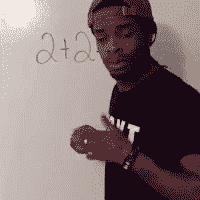
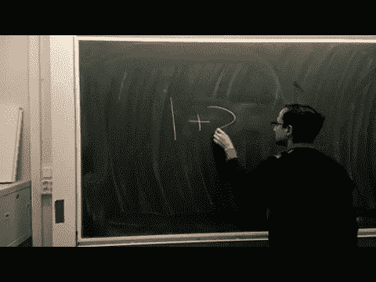
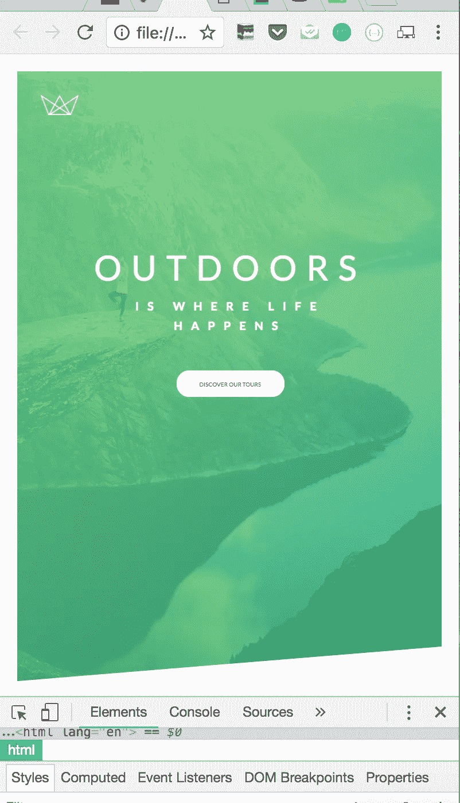

# 第 34 集:我为 CSS 学习的一个有用的单元技巧。

> 原文：<https://medium.com/hackernoon/episode-34-a-useful-technique-on-units-ive-learnt-for-css-411d3155588e>



我承认，在我的课程进行到一半的时候，要想把这些博客写下来是很困难的。简而言之，试图抛开这个博客不是为了工作而是为了娱乐/治疗(当“工作”的声音不断在你耳边萦绕，因为拥有一个博客是一种好处时，很难做到这一点)正变得难以区分。然而，我对这种情况的解决办法是享受现在，当事情到了紧要关头时，试着去担心。

虽然，我承认写这篇博客很难，因为它与数学有关。有趣的是，有人会认为你可以通过做艺术来逃避数学，然后意识到代码需要一些基本的数学。



是的，我知道，在这种情况下，这不是疯狂的代数或需要记住冗长的公式。但是，如果你是那些被数学弄得很受伤的人之一，因为无论你如何努力，结果或足够好的改进从未发生，那么是的，你明白了。就像那首歌

你告诉马斯“我们又见面了，我的克星。”除了那张纸条，让我们开始吧。

# CSS 中的单位:


如果你接触 CSS 足够多，你会知道其中的一些单位…如果不是，px，百分比，em(字体)，em(长度)和 rem。你可能会说是啊，是啊，什么，呃，你是不是在之前的基础上加了个 r，然后称之为新的东西？不，它们确实存在，让我们来看看。

## 像素

你可能经常看到它被定义为字体大小。px 代表像素，这在我们处理数字世界时很有意义。

## 百分比

基本数学，我们都知道这些是%，我们看到它在一些 CSS 中实现，可能主要是关键帧。然而，百分比也可以应用于其他属性和属性，如字体大小！这很奇怪，当你想到它，但是让我们说..

```
.parent {font-size: 20px;}.child {font-size: 150%;}
```

这里我们有一个父选择器和一个继承自父选择器的子选择器。我们已经在父选择器中声明字体大小为 20px。然而，当我们说字体大小是 150%时，它在子选择器中意味着什么呢？想想看，如果你猜对了，

> “它是父类中字体大小值的 150%。即 20 的 150%，因此是 30。”

## em(字体)和 em(长度)

根据 W3schools，这个单位是“相对于元素的字体大小”。让我用同样的情况来演示一下，但是要改变一些东西。

```
.parent {font-size: 20px;}.child {font-size: 3em;}
```

基于我们刚刚说的定义，3em 是相对于 20px 的。这意味着 3em 是“20px 的 3 倍”，因此，子选择器中的字体大小是 60 px。**但是，请记住，这种“em”字体是从它所继承的父元素中提取的。**

**em 长度以同样的方式工作，但它们取自当前元素，而不是**。例如，如果我们在选择器中处理一个长度，比如填充(因为填充是以长度度量的，字体是以像素度量的)

```
.parent {font-size: 20px;}.child {font-size: 30%;padding: 2em }
```

**父字体大小为 20px，因此子字体大小为 6px，因此填充为 12 px。是啊，慢慢体会吧。**

## em 的根

它的工作方式和 em 单元一样，但是它是从根选择器开始的。根选择器意味着被定义的第一部分。在这种情况下，我们在 html 和正文中定义了度量值…

```
.html, .body{
font-size: 16px
}.parent {font-size: 20px;}.child {font-size: 30%;padding: 2em
margin-bottom: 10rem}
```

正如你所看到的，我们有父和子选择器，尽管它们有自己的值要计算，边距底部的 rem 值(它是一个长度)，将采用在根中定义的值(在 html 中，因此主体是 **16)。因此，边距下限将为 160 像素。**


如果你想知道更多的数学转换，一些更有用的，一些不太有用的，W3schools 总是最好的方法

[https://www.w3schools.com/cssref/css_units.asp](https://www.w3schools.com/cssref/css_units.asp)

# 理解 CSS 中的数学转换并使用它们的好处。

答案很简单，那就是有效的工作流程。


在我们的世界中，有不同尺寸的多个屏幕，我们的工作流必须通过尽可能少地修改代码来适应不同的屏幕尺寸。听起来像是不可能完成的任务，对吗？好吧，让我们把媒体的询问放在一边，让我们想一想:我们能对代码做的最少的编辑是什么，它允许我们根据我们选择的窗口大小来改变我们设计的比例。

**这里有一个很棒的 CSS 技巧**就是用 px 值定义一个选择器，然后使用 rems 定义其余选择器中的其余内容。

```
.html {font-size: 10px;}.head {font-size: 2rem; //Before: font-size: 20px}
```

例如，在我们的 html 中，字体大小默认为 16px(这取决于用户的浏览器设置)。让我们改变一下，将 html 字体大小设置为 10。在这里，我选择了数字 10，因为许多其他数字的数学转换会更容易。

例如，如果我的 head 属性的字体大小是 20px…那么 rem 值是多少？嗯，我们已经定义了字体大小为 10，rem 是它的倍数…所以如果 head 属性的字体大小为 20，那么 rem 值必须为 2！

如果比率计算正确，您的设计应该保持不变。通过实现这种策略，您只需更改。html 字体大小值，如果你想看到你的设计改变依赖于窗口屏幕。是的，我已经做了一个非常简单的例子，但是让我给你看一个更复杂的代码结构的截图(不会给你看代码，这会让你头疼)


对于这个网站，html 字体大小的值是 10px。让我们把我的窗口变成一部电话，我所要做的就是在我的代码中改变一个值来得到一个完整的显示



这里，html 字体大小的值是 5px。

现在明白我的意思了吗？**只需一个值的开关，我们的整个设计就能适应窗户。谈论将大量工作委托给计算机而不是我们。**

# 但是等一下，问题来了

默认浏览器字体不是 16px 怎么办？

我们都是人，我们都有自己的偏好，可能会改变浏览器的字体大小，因为有些网站的字体很小。


因此，我们的策略到目前为止还没有完全适应人们的浏览器。但是，啊哈！对此可以有一个简单的解决方案。我们只需将设置的字体大小值改为一个百分比！这样，我们的字体大小值更抽象而不是具体，可以适应用户的…浏览器的默认…字体选择(这是奇怪的措辞)

```
//Before: 
.html {font-size: 10px;}//After:
.html {font-size: 62.5%;}
```

因为我的默认浏览器字体是 16px(如果你的是 16px，这个应该可以)。数学计算是 16px 的 62.5%是 10(这是我们想要的字体大小)。在这一点上，我们的设计不应该有任何改变。

通过这样做，无论用户浏览器的默认字体大小是多少，百分比都会适应这个值，我们的设计应该保持不变。哈！现在它在这方面是单元验证的，可以更好地适应人们的浏览器！！

数学可能需要我们使用更多的脑力，但当涉及到使我们的代码有效的良好 CSS 实践时，作为一个受过创伤的数学受害者，我可以说这是值得实践的。就这一点而言，今天的数学解释对我来说已经足够了！下次再见，x

# 今日趣事:


对于所有不知道如何放松或休息的人来说，最好尽快学会如何放松或休息，除非你想让你的身体告诉你不是这样，从经验来看，这是一个打击。