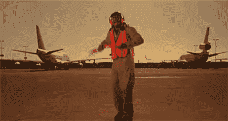
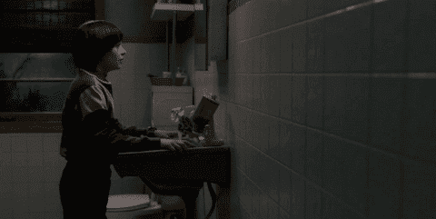
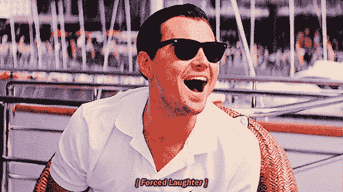
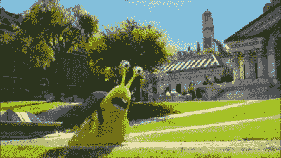

# 第六集:建设机场的思考

> 原文：<https://medium.com/hackernoon/episode-6-reflecting-on-building-an-airport-77312022182c>

What pairing is like = Pacific Rim

我的结论是，结对真的很像那部老套的动作片《环太平洋》。如果你不知道这部电影是关于什么的，公平地说，它并不精彩，但也不糟糕！用一句话来说，这是关于两个人把他们的大脑连接在一起，让一个巨大的机器人打败从海里出来的外星怪物。这是它的相似之处。

环太平洋:两个人插上电源，连接大脑，让机器人工作

结对:两个人坐在一起构建一个程序。

环太平洋:两个人的记忆交织在一起，所以他们联系更紧密

结对:你们了解彼此的挫折、喜悦和其他情绪。

环太平洋:两个人都尽自己所能支持对方，为的是两个人都付出等量的努力来支持机器人。

结对:你学习如何支持你的伴侣，或者你能为完成工作做出什么贡献。

虽然《环太平洋》的拍摄非常戏剧化，这也是为什么它更像是真实配对的戏剧版本，但我们已经配对了整整一周。现在，我们必须单独行动？

那就像拿走了我一半的大脑！好的一面！

# 反思时间，反思时间。

我得出结论，这只是第 1 周，我还没有记录挑战。让我们回想一下，至少我会反思我的成就和我做了什么。(哎！我不能给出所有的答案，也不打算一周七天都写代码。那不健康)

所以，在这次挑战中:我设法做了下面的测试并通过了测试。为成就欢呼吧。

*   *测试陆地方法是否响应机场等级*
*   *测试起飞方式是否响应机场等级*
*   *实际证明土地法行得通*
*   *实际证明起飞方法有效*
*   *测试显示飞机工作状态*
*   *使用随机。样品运行时天气是否有暴风雨*

由于这个练习与 Boris Bikes 之类的练习相似，所以我开始了第 15 个练习。根据我目前掌握的知识，我觉得我已经完成了以前学过的大部分东西。这只是新的东西。我确实尝试了一些我从未尝试过的新东西(Stubs ),但正如他们在《奇怪的事情》中所说的:“恶魔抓住了我”

What stubs felt like.

**我在周末学到了什么(不仅仅是练习):**

*   如何在不同的文件中拆分类并要求它们
*   使用关闭实例
*   用标题链接格式化自述文件。(哈哈，[设计](https://hackernoon.com/tagged/design)是一切的关键元素)
*   正确命名提交
*   如何将 [ruby](https://hackernoon.com/tagged/ruby) 卸载 home-brew 并放在正确的方向上更新到最新的 ruby(花了我一整天)

Like, finally. I couldn’t even start the challenge cause bundle wouldn’t install due to needing 2.4 like wjlanfasfs

*   如何把你的终端做成你喜欢的颜色，你喜欢的阅读风格，并且理解插件的位置。

Why go for black, when you can go for blue?

*   安装情感支持所必需的 Atom 包。

**改进:**

It’s nor right but it’s okay

*   沮丧或有压力时保持快乐。
*   当你感到不开心的时候，与人交谈。它帮助你的大脑想要完成事情。

*   下次我做这个周末挑战的时候得到大脑更聪明的部分(哈哈笑话)

# 今日趣事:

很明显，如果你参加更多的周中挑战，那么你会对周末挑战更有经验。不过，这是个好建议。

**永远不要在周日下午开始周末挑战。**

**从来没有。比你想象的要长得多。**

