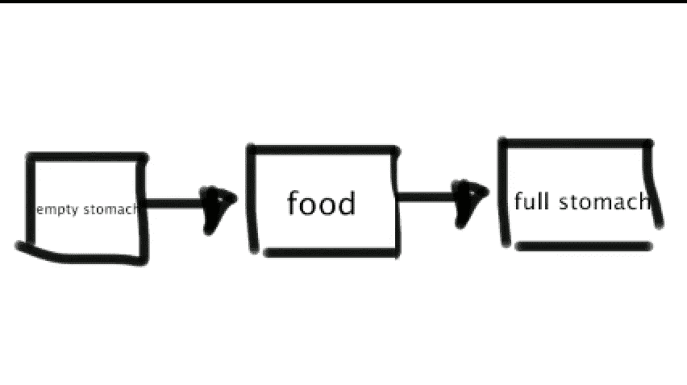
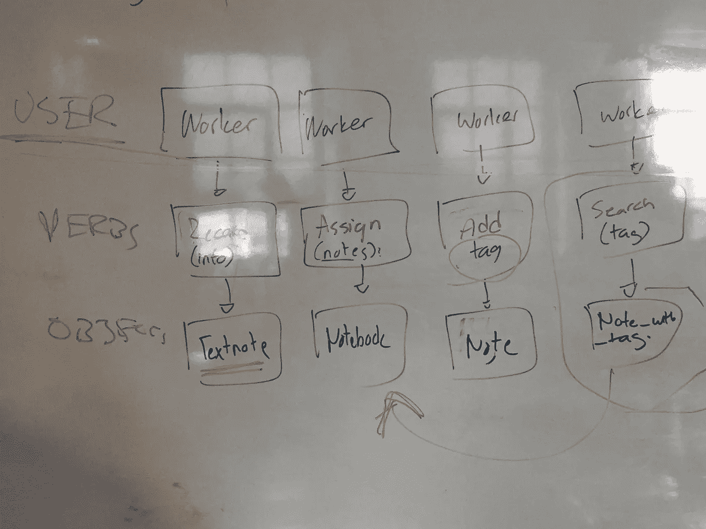
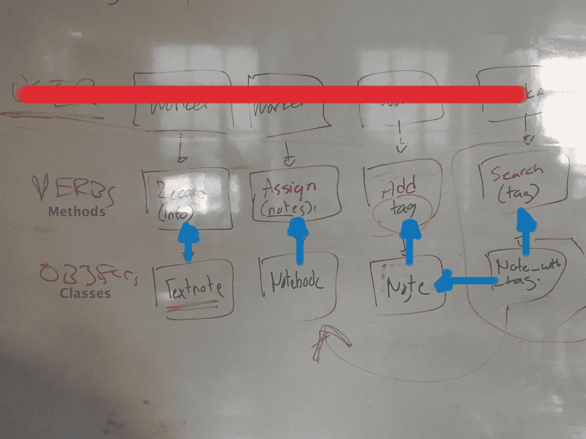
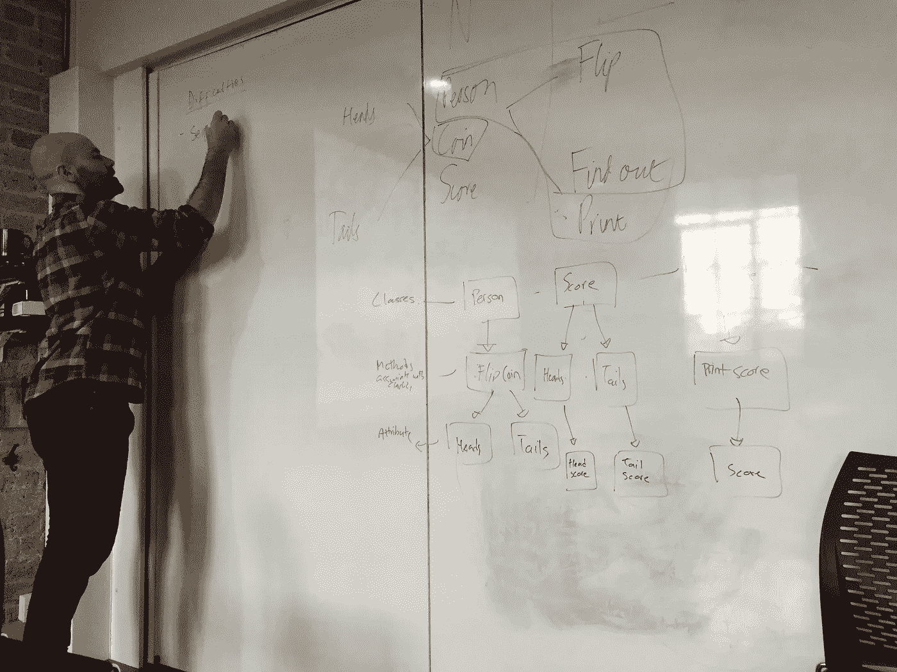

# 第 8 集:创造性的东西(关于编码图)

> 原文：<https://medium.com/hackernoon/episode-8-something-creative-diagrams-b4b21a88515e>


当一个人想到“[编码](https://hackernoon.com/tagged/coding)”时，你绝不会想到它实际上是一个创造性的过程或者有任何创造性。这是一门只有当你真正沉浸其中时，你才会知道它有什么的学科。你发现你能做的越多，你就越意识到你不仅仅是一个程序员，还是一个“富有想象力的工程师”，我的意思是，你可以创造一个独角兽世界，每当用户悲伤时，它就会射杀猫。真的，可以。

作为一名进入编码学校的设计师，这可能是我一生中最快乐的一天。**“耶！终于！有创意的东西！”让我们开始吧。**


问题 1: **为什么绘制图表或设计代码结构很重要？**

它节省时间？它澄清了一切？在[实现](https://hackernoon.com/tagged/implementing)代码之前更容易编辑？修改草稿比修改最终稿对你有好处，最终稿是你代码的解决方案？**是的，这些都是正确的。**


我喜欢把这个创造性的过程想象成绘制一张你将要做的事情的地图。对于任何一个“富有想象力的工程师”来说，知道所有的东西是如何布置的，以及所有的东西是如何匹配的，这几乎是关键。


编码时，图通常是顺序图，用方块和箭头表示。我不打算在这里贴一个，因为所有的谷歌图片看起来非常混乱，所以我会画一个简化的。



My bad example, for instance.

问题 2: **如何为代码设计图表？**

嗯，通常情况下，一个程序员会谈论建立一个新的世界或问题，无论是创建一个应用程序或天知道是什么。客户(如果他擅长沟通)会清楚地表达这个新世界、应用程序和其他东西需要做什么，并列出它们。这被称为**“用户故事”**但是说实话，在现实世界中，我怀疑每个人是否都能够完美地记住、考虑和传达用户对程序的每一个需求。


因此，一个看起来不错的用户案例应该是这样的:

> `In order to use public transport
> As a customer
> I want money on my card`

所以，如果我们有了这个，现在我们需要弄清楚如何构建它。我们以前做过(或者我以前提到过)的是从用户故事中制作一个**领域模型**。如果你已经忘记了，就去查一下。所以让我们从这个用户那里收集名词和动词。

```
Objects(Nouns)   | Messages(Verbs) 
Public Transport | Use 
Customer         |   
Card             | Want (money)
```

建议:在做任何事情之前，最好先把这个计划安排好。一行一行做总是好的。当你决定你比文本更聪明并逐行跳转时，它开始变得令人困惑。


让我们进入棘手的部分。为什么顾客没有动词？嗯，我的意思是，如果你看这条线，它不会，但这是题外话。

**客户**就是用户。在我们的代码中，我们不必包含用户的任何部分，因为用户将是使用我们所创造的东西的人。是的，在领域模型中，将元素分成**对象、消息和用户**总是好的，这样你就可以开始消除那些你不必关注的单词。我假设(这是不好的假设，不要这样做)总会有一个用户，就像有一种类型的观众。所以，第二行，我们可以把它放在一边。

现在，我们必须在两对中进行选择，以决定哪一对是焦点。嗯，一个永远是焦点**，一个永远是结果**。虽然，这是一个非常好的用户故事样本，但它的判决肯定让我困惑(所以如果它让你困惑，那么很好，我不是唯一一个不会翻译英语的人)。****

****在这种情况下，**【使用公共交通工具】**是我们的结果，因为我们希望我们的系统**【卡上要钱】**到**【使用公共交通工具】**？”****

****没关系，这很难掌握，所以让它都吸收一点。****

********

****太好了，你回来了！因此，结论是，在我们精心措辞的用户故事中，我们将始终有一个**用户**、**一个焦点(功能)**和一个 **n 结果**。在我们的例子中，第 1 行是结果，第 2 行有用户，第 3 行是我们的焦点。****

## ****在我们的焦点中，这意味着我们想要我们的……****

****类做名词:**“胖大海/卡片”******

****和我们的****

****法做动词:**【要钱】******

****如果我们认真思考我们的意思，我们可以把它改成**“balance”**，因为我们希望我们的卡上有钱。****

********

****你可能在想(Dania，你很聪明，因为你是设计专业的学生，你可能已经知道它是如何工作的了)****

********

****你可以和我的搭档一起看看我的用户图，看看我们犯的所有错误。一个好的建议是永远记住这些图(尽可能多的编辑和使用)最终是为代码准备的。****

****不要陷入图表中。这些计划很好，但你的目标是把它编码出来。可悲的是，代码不仅仅是绘制有趣的图表或图片。****

> ****原始用户图表:****

********

> ****图表应该是什么样子****

********

****向 Edward 致敬，他通过查看我们的图表提供了所有这些关于图表的精彩知识。:)****

********

****Classy Ed****

# ****今日趣事！****

********

****什么是布卢姆斯伯里分类法？是不是一个听起来很美的经济学名词？是不是听起来很专业的税务版本？“bloomsbury”公司支持这种税收结构吗？如果一个人不知道这是什么，他可以有很多解释。****

****这是一种学习方法，在学习代码或学习如何解决代码中的问题时会很方便。****

*   ****记住****
*   ****解释****
*   ****evaluate 评价****
*   ****分析****
*   ****创造****

******不过，不要因此而自杀。如果这种学习方法对你不起作用，那就不是你应该遵循的咒语。请记住，当你不知道从哪里开始或忘记时，它会派上用场。******