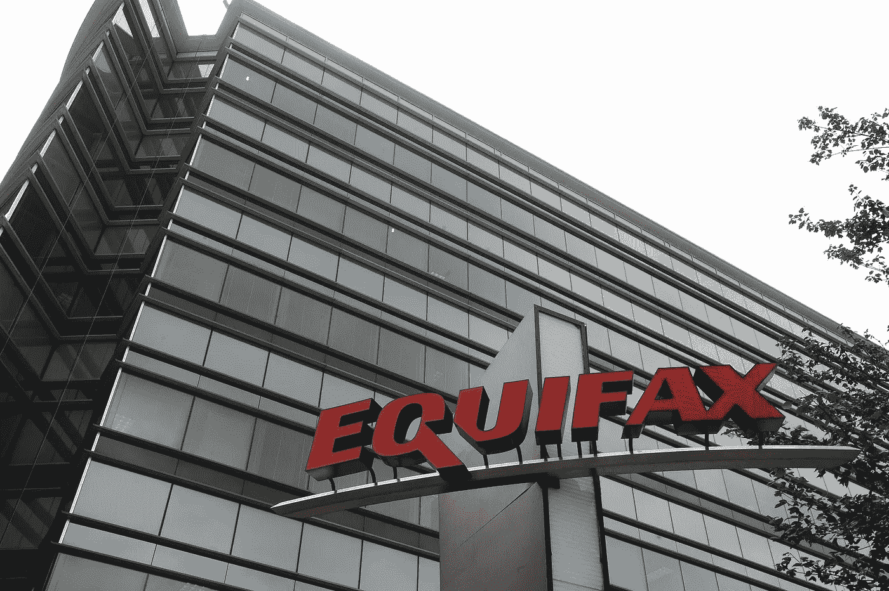

# Equifax 网络安全余波:停止谈论“基础”，这里是你今天能做的。

> 原文：<https://medium.com/hackernoon/equifax-cybersecurity-aftermath-stop-talking-about-basics-heres-what-you-can-do-today-8c19416bc3f0>

Image source, NBC news, [here](https://www.nbcnews.com/tech/security/massive-equifax-data-breach-could-impact-half-u-s-population-n799686).

抛开音乐学位不谈，围绕“Equifax 错在哪里”的相关讨论是可以预见的，也是荒谬的。作为一个行业，我们现在可以做一些*将*有所作为的事情，而更好的补丁管理并不能解决问题。下面我谈谈我眼中的失败主义产业，一个急需的范式转变，并补充我自己的偏见，如何通过使用网络欺骗在某些方面做得更好。

每次数据泄露后听到的批评和给出的建议都是老一套的[安全](https://hackernoon.com/tagged/security)基础知识。不要误解我，作为一名安全专业人员，我相信基础，我相信过程。但是，他们永远不会完美。

此外，还有无尽的基本循环。如果攻击者通过漏洞或错误配置进入，他们应该能够拥有我们的整个基础架构吗？我们能做些什么与众不同并会有所作为，不是两年后，而是今天？

网络安全存在固有的不对称性，对手只需成功一次，而防御者必须时刻保持警惕，成本差异巨大。我们必须换一种方式思考。我们必须改变攻击者的经济状况，让他们的行动更具风险，每一步的成本都更高。

要做到这一点，我们应该考虑的安全基础是战略性的。我们能控制自己的地盘吗？我们是建立静态防御还是保持敏捷？我们能控制攻击者掌握我们的哪些信息，从而控制他们的活动吗？在网络安全方面，我们是如此的失败主义，每天早上去上班的时候，我们都意识到，如果坏人想要我们输，我们就会输。我拒绝接受。

三年前，我放弃了一切，决定换个话题。为了做到这一点，我开了一家名为 [Cymmetria](https://www.cymmetria.com/) 的公司，专注于创造网络欺骗[技术](https://hackernoon.com/tagged/technology)来增强防御者的能力。我厌倦了再一次听到攻击者被发现需要 250 天，或者看到另一种新技术试图更快地发现恶意软件或漏洞，就像 10 年前 NetWitness 或 Trusteer 所做的那样，只比人工智能好 10%。为了创造新的东西，我着眼于战略世界。我们必须改变网络安全中的不对称，更重要的是，扭转对攻击者的局面。这就是网络欺骗的作用。

早在 2014 年，我试图就网络欺骗问题接近人们，他们的反应往往是，“蜜罐？”今天，我很高兴地说，网络欺骗已经成为一种最佳做法。2017 年对我们来说是惊人的一年，有入境 RFP、项目和预算，以及无止境的安装。Gartner 提供了帮助，将欺骗定义为企业的十大安全控制措施。

网络欺骗解决不了世界问题，也抓不到一切。然而，当处理真正的痛点时，它确实使攻击者的生活更加艰难。狩猎就是这样进行的。我们希望在周界内的边缘也有同样的可见度？我们要对抗横向运动？捕捉响应者/传递散列？能够确定地说出事件/警报是否真实？网络欺骗可以做到这一点。

然而，当数据泄露发生时，人们仍然谈论更好的补丁管理。虽然攻击者是技术的极快采用者，但防御者却不是。

网络欺骗并不是安全领域唯一的新技术。此外，它不会解决你所有的问题。然而，它会在您的环境中找到攻击者，并帮助您将他们踢出局。这是一个成长中的行业。你应该调查一下，从我有偏见的角度来看，你应该看看 [Cymmetria](https://www.cymmetria.com/) 。

事实上，和我谈谈。三年前，我把生命押在了这个概念上。是时候夺回控制权，不再做一个失败主义的行业了。

加迪·埃夫隆。
(推特: [@gadievron](http://twitter.com/gadievron) ，脸书: [@gadioncyber](https://www.facebook.com/gadioncyber/) )

# Equifax # databreach #基础#修补#不对称#网络欺骗#cymmetria