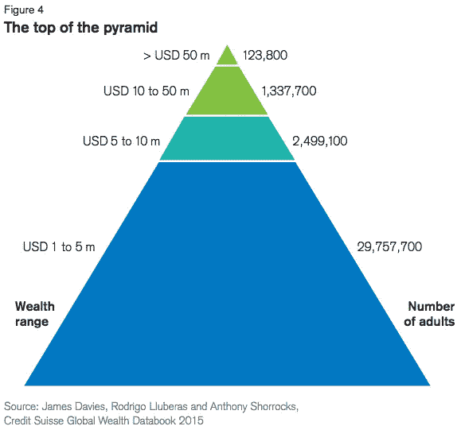
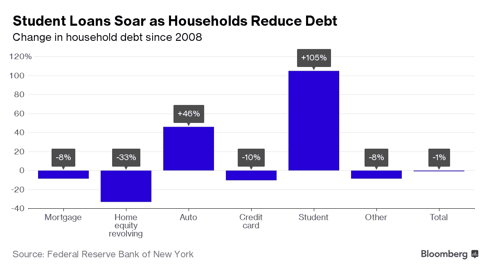
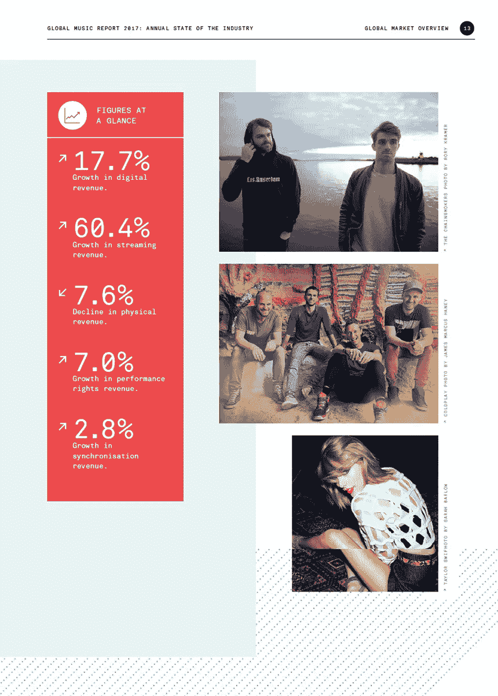
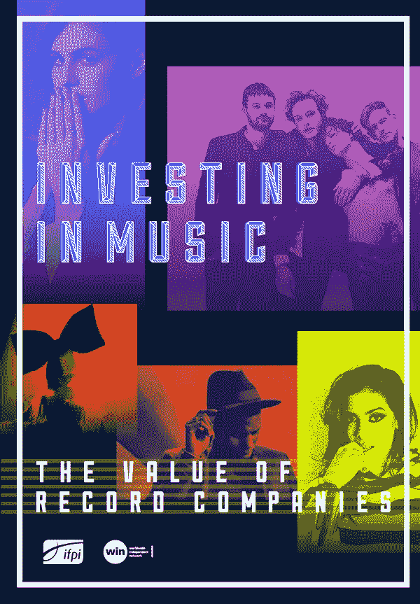
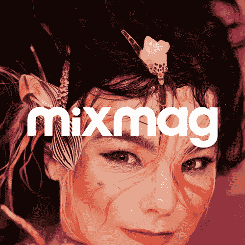

# 自由创作者的平等化

> 原文：<https://medium.com/hackernoon/equitization-of-freelance-creators-c050c7d744c>

## 为什么我们应该依靠和支持有创造力的天才

# 结构不平等

员工的梦想没有实现。正如斯蒂格利茨写道的那样，[……]在二十世纪中叶，人们开始相信‘水涨船高’:经济增长会给社会各阶层带来越来越多的财富和更高的生活水平[……]在随后的[经济和政治辩论中，这种‘涨潮假说’演变成一种更加具体的观点，根据这种观点，倒退的经济政策——有利于富裕阶层的政策——最终会惠及所有人。给予富人的资源将不可避免地“渗透”到其他人身上[……]因此总体财富增加了，但这并没有导致经济生产能力或工人平均边际生产率或平均工资的增加。相反，工资可能会停滞甚至下降，因为租金份额的上升是以工资为代价的[……]导致低利率的货币政策可以增加这些“非生产性”固定资产的价值[……]管理全球化的方式导致了更低的工资，部分原因是工人的议价能力被削弱(](https://hackernoon.com/tagged/economic) [1](http://evonomics.com/joseph-stiglitz-inequality-unearned-income/) ， [*](https://www8.gsb.columbia.edu/faculty/jstiglitz/sites/jstiglitz/files/Inequality%20and%20Economic%20Growth.pdf) )。

# 劳工和教育危机

今天，全世界的失业率都很高。根据世界银行的数据( [2](https://data.worldbank.org/indicator/SL.UEM.TOTL.ZS) ，大约为 5.767%；根据国际货币基金组织的数据( [3](http://www.imf.org/external/datamapper/LUR@WEO/OEMDC/ADVEC/WEOWORLD) ，发达国家大约为 5.7%；根据经济合作与发展组织的数据( [4](https://data.oecd.org/unemp/unemployment-rate.htm) ，大约为 6%。2015 年，全球总失业人数为 1.971 亿，比 2007 年危机前的水平高出 2700 万。[……]发达经济体和新兴市场经济体的经济活动预计将在 2017 年至 2018 年加速，全球增长预计分别为 3.4%和 3.6%，与 10 月份的预测( [5](https://www.imf.org/external/pubs/ft/weo/2017/update/01/) )相同。世界人口约为 74-76 亿( [6](https://data.worldbank.org/indicator/SP.POP.TOTL) )，年增长率为 1.8([7](https://esa.un.org/unpd/wpp/DataQuery/))。这里有一个问题，全球青年失业率再次上升，预计约为 13%。

Global Wealth Report 2015 by [Credit Suisse](https://publications.credit-suisse.com/tasks/render/file/?fileID=F2425415-DCA7-80B8-EAD989AF9341D47E)

就我们没有未来的可持续增长模式而言，这已经足够令人兴奋了。随着新兴经济体借贷越来越多，全球债务在 2017 年初创下了 217 万亿美元的历史新高(超过国内生产总值的 327%)。长期以来，经济增长和繁荣与高等教育密不可分。当然啦最富有的 2%的成年人拥有全球一半以上的财富。乐施会指责激进的工资限制，因为企业太专注于向富有的所有者和高管提供越来越高的回报( [11](https://www.oxfam.org/sites/www.oxfam.org/files/file_attachments/bp-economy-for-99-percent-160117-en.pdf) )。据《瑞士瑞信银行》估计，全球有 34 亿人，即 71%的成年人的财富低于 1 万美元，而占全球人口不到 1%的百万富翁却拥有 45%的总财富。

Student Debt in America Has Hit a New Record by [Bloomberg](https://www.bloomberg.com/news/articles/2017-02-17/student-debt-in-america-has-hit-a-new-record)

在过去的十年里，美国的大学贷款余额增加了 8330 多亿美元，达到 1.4 万亿美元的历史最高水平。根据纽约联邦储备银行的数据，去年美国学生债务总额达到创纪录的 1.31 万亿美元，这是美国教育债务连续第 18 年上升。

不仅如此，56%的员工在财务状况方面感到压力很大。这些员工中有 53%的人表示，压力影响了他们在工作中的注意力和工作效率。人们意识到，全世界的就业和我们的制度都有问题。似乎对创造者和实践的直接投资总体上被低估了，但劳动力和教育市场被高估了。

Global Music Report 2017 by [IFPI](http://www.ifpi.org/downloads/GMR2017.pdf)

# 看音乐产业传承

音乐产业是关于大量和数字的。正如索尼音乐娱乐公司的施里达尔·苏布拉马年所认为的，“我们正看到消费者的态度从内容所有权向轻松访问大型图书馆的转变”。华纳音乐集团报告了 14 年来最好的一个季度(Q2，2017 年)，收入 9.17 亿美元，现金流增长 59%——远远足以抵消数字下载销售的持续下滑( [17](http://www.slush.org/news/investing-music-underexplored-opportunity/) )。据估计，全球唱片公司每年在艺人和曲目以及营销方面的投资高达 45 亿美元。各大唱片公司的花名册上大约有 7500 名艺人，还有数万名艺人与独立唱片公司签约。新人是这个行业的生命线，这些艺人中有 25%是在去年签约的( [18](http://www.ifpi.org/downloads/GMR2017.pdf) )。

Investing in Music: The Value of Record Companies by [IFPI](http://investinginmusic.ifpi.org/report/ifpi-iim-report-2016.pdf), 2016

全球独立唱片公司的总收入为 56 亿美元。独立音乐公司的特点是既渴望寻找新的音乐形式和艺术家，又愿意承担风险。在今天的市场上，独立的标签继续平衡艺术和商业的优先权。引用，早期的独立唱片公司，如大西洋唱片公司和国王唱片公司，在 20 世纪 40 年代引入了布鲁斯和 R & B 音乐[…]成立于 1959 年的 Island Records 发挥了类似的“桥梁”作用，在 20 世纪 60 年代和 70 年代向全球观众介绍了新一代的摇滚和雷鬼艺术家。最初，这个标签与牙买加音乐联系在一起，在英国推广斯卡和雷鬼音乐，尤其是鲍勃·马利的音乐。还提拔了 U2 ( [20](https://gallery.mailchimp.com/cdbff2f6ef24c011286beddb0/files/full_report_here.pdf) )。

继大卫·鲍依证券化[普尔曼鲍伊债券](http://www.pullmanbonds.com/)成功之后，很多投资者更加关注[音乐证券化](https://www.billboard.com/articles/business/7973935/fans-invest-royalties-eminem-catalog-royalty-exchange)。尽管 2004 年评级下调至 Baa3，普尔曼债券已经成为世界上一种新的证券化资产。事实上，这笔贷款以 7.9%的利率贷出 10 年，这个利率相当高。荷兰养老基金 ABP 投资了 [Imagem](https://uk.imagem.com/our-clients) ，并在 Imagem 最近以 5 亿到 6 亿美元的价格被卖给巴林另类投资公司旗下的协和音乐集团时套现。正如《华尔街日报》所写的，“一小部分但越来越多的投资者正在购买音乐人未来收益的权利，他们被每年 8%至 12%的回报率所吸引，当垃圾债券的收益率低于 6%时，回报率会更高”。根据投资总监的说法，英国国教 79 亿英镑的投资基金正在为今年的新资产分配寻找音乐版税和直接风险投资交易。

# 创作者捐赠:新音乐家和实干家

尽管每笔唱片交易都不尽相同，但通常都有一些共同的投资领域，尤其是在涉及新兴艺人的协议中。这些是预付款、录制资金、音乐视频制作、巡演支持和宣传费用。在一个主要的唱片市场上，让一个艺人破产可能要花费 50 万到 200 万美元。根据世界银行 2013 年委托进行的一项研究，到 2025 年，全球众筹市场可能达到 900 亿至 960 亿美元，大约是全球风险资本行业规模的 1.8 倍。

> “如果你看看音乐行业，就会发现有一整层人过去常常出去寻找乐队，”赫希说。“这是世界上最酷的工作”，mortgage Ventures 的管理合伙人大卫·赫希(David Hirsch)将众筹比作音乐行业所谓的 A&R，或艺术家和曲目。

[Platoon](https://platoon.ai/): We live to create. We live for the creatives

音乐创作和尺度都变了。多亏了 YouTube、SoundCloud、VK 和所有的新平台，欧洲出现了许多魅力非凡、令人印象深刻的创作者。他们生活在奥托·冯·俾斯麦之后，他说:“我们生活在一个奇妙的时代，在这个时代，强者因其谨慎而变弱，弱者因其大胆而变强。”人们正在改变整个就业模式。因此，有一个活生生的想法，我们应该让自由职业者在不断变化的经济中发挥更大的作用。忘掉那些真正的大公司吧。从公司到创造者，是时候让经济个性化了。世界各地的独立音乐家、演员、电子游戏玩家、自由艺术家、作家、哲学家、工程师和实干家将能够从他们的追随者和其他捐赠者那里获得独立的融资。

[Mixmag](https://soundcloud.com/mixmag-1): The World’s Biggest Dance Music and Clubbing Destination

这都是关于本质，其中(A)创作者得到令牌化，出售他们的数字令牌，并通过区块链的确认接收投资和捐赠；新创企业(B)支持创作者的多样性。尽管如此，请记住，工资可能会停滞不前，甚至下降，因为租金份额的上升是以工资为代价的。因此，显而易见的是:大品牌的权力也应该受到限制，但如果人们不想恢复自主权，品牌也不会。