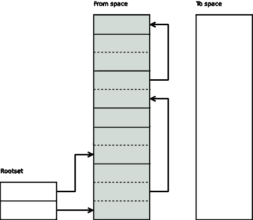
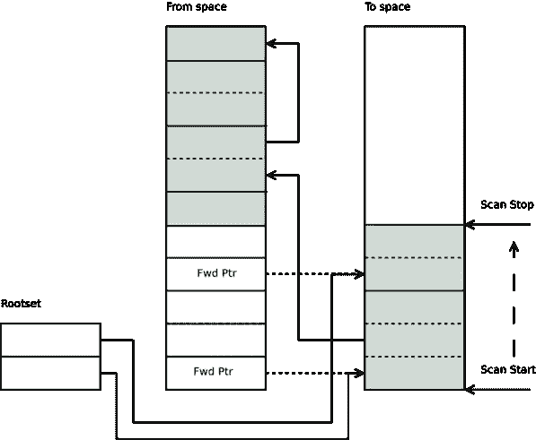
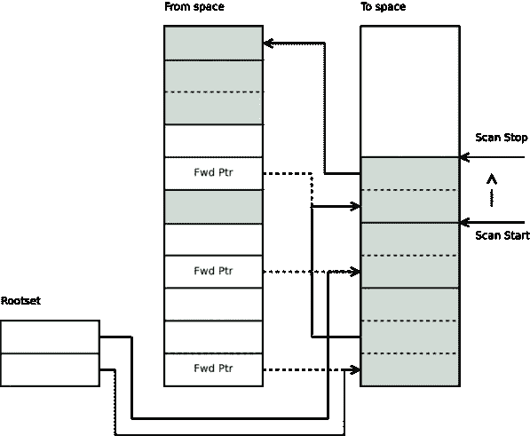
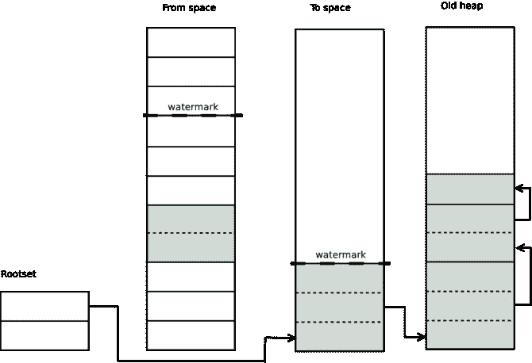

# Erlang 垃圾收集器

> 原文：<https://medium.com/hackernoon/erlang-garbage-collector-dfc9ad952130>

卢卡斯·拉尔森

**这是对我们之前的博文** [**Erlang 19.0 垃圾收集器**](http://www2.erlang-solutions.com/l/23452/2017-11-30/56mhg2) **的更新。有了 Erlang/OTP 20.0，一些事情发生了变化，这就是这篇更新博文的原因。**

Erlang 用一个[跟踪垃圾收集器](https://en.wikipedia.org/wiki/Tracing_garbage_collection)管理动态内存。更准确地说，是一个每进程分代半空间复制收集器，它使用 [Cheney 的](http://bit.ly/2BnAuM7#cheney)复制收集算法和一个全局大对象空间。

# 概观

每个 Erlang 进程都有自己的堆栈和堆，它们被分配在同一个内存块中，并且彼此相向增长。当堆栈和堆[相遇](https://github.com/erlang/otp/blob/OTP-18.0/erts/emulator/beam/beam_emu.c#L387)时，垃圾收集器被触发，内存被回收。如果没有回收足够的内存，堆将会增长。

# 创建数据

通过计算表达式在堆上创建术语。有两种主要类型的术语:[立即术语](https://github.com/erlang/otp/blob/OTP-18.0/erts/emulator/beam/erl_term.h#L88-L97)不需要堆空间(小整数、原子、PID、端口 id 等)和 cons 或[装箱术语](https://github.com/erlang/otp/blob/OTP-18.0/erts/emulator/beam/erl_term.h#L106-L120)(元组、大数字、二进制等)需要堆空间。立即项不需要任何堆空间，因为它们被嵌入到包含结构中。

让我们看一个例子，它返回一个包含新创建数据的元组。

```
data(Foo) -> Cons = [42|Foo], Literal = {text, "hello world!"}, {tag, Cons, Literal}.
```

在本例中，我们首先创建一个新的 cons 单元格，其中包含一个整数和一个包含一些文本的元组。然后创建并返回一个用 atom 标签包装其他值的大小为 3 的元组。

在堆上，元组需要其每个元素以及头的字长。Cons 单元格总是需要两个字。将这些东西加在一起，我们得到元组的 7 个字和 cons 单元的 26 个字。字符串`"hello world!"`是 cons 单元格的列表，因此需要 24 个字。原子`tag`和整数`42`不需要任何额外的堆内存，因为它是一个*立即数*。将所有项加在一起，本例中所需的堆空间应该是 33 个字。

将此代码编译成 beam assembly ( `erlc -S`)显示了正在发生的事情。

```
... {test_heap,6,1}. {put_list,{integer,42},{x,0},{x,1}}. {put_tuple,3,{x,0}}. {put,{atom,tag}}. {put,{x,1}}. {put,{literal,{text,"hello world!"}}}. return.
```

查看汇编代码，我们可以看到三件事；从`{test_heap,6,1}`指令可以看出，这个函数中的堆需求只有六个字。所有的分配被组合成一条指令。大部分数据`{text, "hello world!"}`是一个*文字*。文字，有时称为常量，不在函数中分配，因为它们是模块的一部分，在加载时分配。

如果堆上没有足够的空间来满足`test_heap`指令对内存的请求，那么就启动垃圾收集。它可能会在`test_heap`指令中立即发生，也可能会延迟到稍后发生，这取决于进程所处的状态。如果垃圾收集延迟，任何需要的内存都将在堆碎片中分配。堆碎片是额外的内存块，是新堆的一部分，但不分配在项通常驻留的连续区域中。详见[年轻堆](http://bit.ly/2BnAuM7#the-young-heap)。

# 收藏家

Erlang 有一个复制半空间垃圾收集器。这意味着，在进行垃圾收集时，术语会从一个不同的区域(称为空间中的*区域)复制到一个新的干净区域(称为空间*到空间*)。收集器通过[扫描根集](https://github.com/erlang/otp/blob/OTP-18.0/erts/emulator/beam/erl_gc.c#L1980)(堆栈、寄存器等)启动。*



它跟踪从根集到堆的所有指针，并将每个术语逐字复制到空间的*中。*

在标题字被复制后，一个 [*移动标记*](https://github.com/erlang/otp/blob/OTP-18.0/erts/emulator/beam/erl_gc.h#L45-L46) 被破坏性地放置在其中，指向*到空间*中的术语。指向已经被移动的术语的任何其他术语将[看到这个移动标记](https://github.com/erlang/otp/blob/OTP-18.0/erts/emulator/beam/erl_gc.c#L1125)并复制引用指针。例如，如果具有以下 Erlang 代码:

```
foo(Arg) -> T = {test, Arg}, {wrapper, T, T, T}.
```

堆上只存在 T 的一个副本，在垃圾收集期间，只有第一次遇到 T 时，才会复制它。



在[根集引用的所有术语](https://github.com/erlang/otp/blob/OTP-18.0/erts/emulator/beam/erl_gc.c#L1089)被复制后，收集器扫描*到空间*并复制这些术语引用的所有术语。扫描时，收集器遍历从*到空间*的每一项，任何仍然引用来自空间的*的项被复制到*到空间*。一些术语包含非术语数据(例如堆上二进制文件的有效负载)。当收集器遇到这些值时，会简单地跳过它们。*



我们可以到达的每个术语对象都被复制到*到空间*并存储在*扫描停止*行的顶部，然后扫描停止移动到最后一个对象的末尾。


当*扫描停止*标记[赶上](https://github.com/erlang/otp/blob/OTP-18.0/erts/emulator/beam/erl_gc.c#L1103)扫描开始标记时，垃圾收集完成。此时，我们可以从空间中[释放](https://github.com/erlang/otp/blob/OTP-18.0/erts/emulator/beam/erl_gc.c#L1206)整个*，从而回收整个年轻堆。*

# 分代垃圾收集

除了上面描述的收集算法，Erlang 垃圾收集器还提供分代垃圾收集。另一个堆称为旧堆，用于存储长期数据。原始堆称为年轻堆，有时也称为分配堆。

考虑到这一点，我们可以再次查看 Erlang 的垃圾收集。在复制阶段，如果在*高水位线* 之下，任何应该复制到年轻*到空间*的内容都被复制到旧*到空间* *。*


[*高水位线*](https://github.com/erlang/otp/blob/OTP-18.0/erts/emulator/beam/erl_process.h#L1021) 被放置在先前的垃圾收集(在[概述](http://bit.ly/2BnAuM7#overview)中描述)结束的地方，并且我们已经引入了一个称为旧堆的新区域。当进行正常的垃圾收集过程时，任何位于高水位线以下的项都被复制到旧的*中，而不是年轻的*中。



在下一次垃圾收集中，任何指向旧堆的指针都将被忽略，不会被扫描。这样，垃圾收集器就不必扫描长期有效的术语。

分代垃圾收集旨在以牺牲内存为代价来提高性能。这是因为在大多数垃圾收集中只考虑年轻的、较小的堆。

世代假设预测大多数术语倾向于在年轻时消亡，对于像 Erlang 这样不可变的语言，年轻术语甚至比其他语言消亡得更快。因此，对于大多数使用模式，新堆中的数据在分配后很快就会死亡。这很好，因为它限制了复制到旧堆的数据量，还因为使用的垃圾收集算法与堆上的活动数据量成比例。

这里要注意的一个关键问题是，新堆上的任何项都可以引用旧堆上的项，但是旧堆上的*项不能引用新堆上的项。这是由于复制算法的性质。旧堆术语引用的任何内容都不包括在引用树、根集及其追随者中，因此不会被复制。如果是的话，数据将会丢失，火和硫磺将会覆盖地球。幸运的是，这对 Erlang 来说很自然，因为术语是不可变的，因此旧堆上不会有指向新堆的指针。*

为了从旧堆中回收数据，新堆和旧堆都包括在收集过程中，并被复制到一个公共的*空间*。然后，来自新堆和旧堆的空间的*都被释放，并且该过程将从头开始。这种类型的垃圾收集称为全扫描，当高水位线下的区域大小大于旧堆的空闲区域大小时触发。也可以通过手动调用 [erlang:garbage_collect()](http://erlang.org/doc/man/erlang.html#garbage_collect-0) 来触发，或者通过运行到由 [spawn_opt(fun()，[{fullsweep_after，N}])](http://erlang.org/doc/man/erlang.html#spawn_opt-4) 设置的年轻垃圾收集限制来触发，其中 N 是在强制对年轻和旧堆进行垃圾收集之前要进行的年轻垃圾收集的数量。*

# 年轻一代

新堆或分配堆由概述中描述的堆栈和堆组成。但是，它还包括附加到堆的任何堆碎片。所有堆碎片都被认为是高水位线以上的，并且是年轻一代的一部分。堆碎片包含不适合堆的术语，或者由另一个进程创建然后附加到堆的术语。例如，如果 bif binary_to_term 在没有进行垃圾收集的情况下创建了一个不适合当前堆的项，它将为该项创建一个堆片段，然后为以后安排垃圾收集。此外，如果消息被发送到进程，则有效负载可以被放置在堆片段中，并且当消息在 receive 子句中匹配时，该片段被添加到年轻堆中。

该过程不同于 Erlang/OTP 19.0 之前的工作方式。在 19.0 之前，只有新堆和堆栈所在的连续内存块被视为新堆的一部分。堆碎片和消息在被 Erlang 程序检查之前就被立即复制到新堆中。19.0 中引入的行为在许多方面都更胜一筹，最重要的是它减少了必要的复制操作数量和垃圾收集的根集。

# 确定堆的大小

正如概述中提到的，堆的大小[增长](https://github.com/erlang/otp/blob/OTP-18.0/erts/emulator/beam/erl_gc.c#L247)以容纳更多的数据。堆分两个阶段增长，首先是从 233 个字开始使用斐波那契数列的[变体。然后在大约 100 万字的时候，这个堆只有](https://github.com/erlang/otp/blob/OTP-18.0/erts/emulator/beam/erl_gc.c#L199-L208)[以 20%的增量增长](https://github.com/erlang/otp/blob/OTP-18.0/erts/emulator/beam/erl_gc.c#L215-L227)。

年轻堆增长有两种情况:

1.  如果堆+消息和堆碎片的总大小超过当前堆大小。
2.  如果全扫描后，活动对象的总量大于 75%。

年轻堆收缩有两种情况:

1.  如果在年轻的收集之后，活对象的总量小于堆的 25%,并且年轻的堆是“大的”
2.  如果在全扫描之后，活动对象的总量小于堆的 25%。

在堆增长阶段，旧堆总是比新堆领先一步。

# 文字

当垃圾收集一个堆(新的或旧的)时，所有的文字都留在原处，不会被复制。为了确定在进行垃圾收集时是否应该复制一个术语，使用了以下伪代码:

```
if (erts_is_literal(ptr) || (on_old_heap(ptr) && !fullsweep)) { /* literal or non fullsweep - do not copy */ } else { copy(ptr); }
```

在不同的架构和操作系统上，`[erts_is_literal](https://github.com/erlang/otp/blob/OTP-19.0/erts/emulator/beam/global.h#L1452-L1465)`检查的工作方式不同。

在允许映射未保留的虚拟内存区域的 64 位系统上(除 Windows 之外的大多数操作系统)，映射一个 1 GB 大小的区域(默认情况下),然后将所有文字放在该区域内。那么，要确定某个东西是否是字面量，所要做的就是[两次快速指针检查](https://github.com/erlang/otp/blob/OTP-19.0/erts/emulator/beam/erl_alloc.h#L322-L324)。该系统依赖于这样一个事实，即尚未被触及的存储器页面不会占用任何实际空间。因此，即使映射了 1 GB 的虚拟内存，ram 中也只分配了文字实际需要的内存。文字区域的大小可以通过+MIscs erts_alloc 选项进行配置。

在 32 位系统上，没有足够的虚拟内存空间来为文字分配 1 GB，因此根据需要创建小的 256 KB 大小的文字区域，然后使用整个 32 位内存空间的卡片标记位数组来确定一个术语是否是文字。由于总存储空间只有 32 位，所以卡片标记位阵列只有 256 个字大。在 64 位系统上，相同的位阵列必须是 1 万亿字长，因此这种技术仅在 32 位系统上可行。在数组中进行[查找比在 64 位系统中进行指针检查要稍微贵一点，但也不是特别贵。](https://github.com/erlang/otp/blob/OTP-19.0/erts/emulator/beam/erl_alloc.h#L316-L319)

在 64 位窗口上，erts_alloc 不能进行未预留的虚拟内存映射，Erlang term 对象中的一个特殊标签用于确定某个东西[是否为文字](https://github.com/erlang/otp/blob/OTP-19.0/erts/emulator/beam/erl_term.h#L248-L252)。这是非常便宜的，但是，该标签仅在 64 位机器上可用，并且将来有可能对该标签进行大量其他良好的优化(例如更紧凑的列表实现),因此在不需要它的操作系统上不使用它。

这种行为不同于 Erlang/OTP 19.0 之前的工作方式。在 19.0 之前，文字检查是通过检查指针是指向新堆块还是旧堆块来完成的。如果不是，那么它被认为是字面意思。这会导致相当大开销和奇怪的内存使用情况，因此在 19.0 中被删除。

# 二元堆

对于大于 64 字节的二进制项，二进制堆是一个大的对象空间(从现在开始称为堆外二进制)。对二进制文件堆进行[引用计数](https://en.wikipedia.org/wiki/Reference_counting)，并且将指向堆外二进制文件的指针存储在进程堆上。为了跟踪何时减少堆外二进制文件的引用计数器，一个包含函数和外部函数以及堆外二进制文件的链表(MSO-标记和清除对象列表)被编织到整个堆中。在垃圾收集完成后， [MSO 列表被清除](https://github.com/erlang/otp/blob/OTP-18.0/erts/emulator/beam/erl_gc.c#L2299)，并且没有将[移动标记](https://github.com/erlang/otp/blob/OTP-18.0/erts/emulator/beam/erl_gc.c#L2325)写入头字的任何堆外二进制文件的引用[被递减，并且可能被释放](https://github.com/erlang/otp/blob/OTP-18.0/erts/emulator/beam/erl_gc.c#L2344-L2367)。

MSO 列表中的所有项目都是按照它们被添加到进程堆中的时间来排序的，因此当进行小规模垃圾收集时，MSO 清理器只需一直清理，直到它[遇到旧堆上的堆外二进制文件](https://github.com/erlang/otp/blob/OTP-18.0/erts/emulator/beam/erl_gc.c#L2369)。

# 虚拟二进制堆

每个进程都有一个与之相关联的虚拟二进制堆，该堆具有该进程引用的所有当前堆外二进制文件的大小。虚拟二进制堆也有限制，并且根据进程如何使用堆外二进制文件而增长和收缩。二进制堆和术语堆使用相同的增长和收缩机制，因此首先是类似斐波那契数列，然后是 20%的增长。

虚拟二进制堆的存在是为了在可能存在大量可回收的堆外二进制数据时，[更早地触发](https://github.com/erlang/otp/blob/OTP-18.0/erts/emulator/beam/beam_emu.c#L364)垃圾收集。这种方法不能捕捉到二进制内存释放不够快的所有问题，但是它确实捕捉到了很多问题。

# 信息

消息可以在不同的时间成为进程堆的一部分。这取决于流程是如何配置的。我们可以使用`process_flag(message_queue_data, off_heap | on_heap)`配置每个进程的行为，或者我们可以在开始时使用选项`+hmqd`为所有进程设置默认值。

这些不同的配置有什么作用，我们应该何时使用它们？让我们从一个 Erlang 进程向另一个进程发送消息时会发生什么开始。发送过程需要做几件事:

接收方进程的进程标志`message_queue_data`控制步骤 2 中发送方进程的消息分配策略，以及垃圾收集器如何处理消息数据。

上述过程不同于 19.0 之前的工作方式。在 19.0 之前没有配置选项，其行为总是与 19.0 中的`on_heap`选项非常相似。

# 消息分配策略

如果设置为`on_heap`，发送进程将首先尝试直接在接收进程的年轻堆块上为消息分配空间。这并不总是可能的，因为它需要接收过程的*主锁*。当进程执行时，主锁也被持有。因此，在高度协作的系统中，很可能会发生锁冲突。如果发送进程无法获得主锁，则会为消息创建一个堆片段，并将消息有效负载复制到该堆片段上。使用`off_heap`选项，发送方进程总是为发送到该进程的消息创建堆碎片。

当试图找出你想使用哪种策略时，有许多不同的权衡要考虑。

使用`off_heap`似乎是一种获得更具可伸缩性的系统的好方法，因为在主锁上很少发生争用，然而，分配堆碎片比在接收进程的堆上分配更昂贵。因此，如果发生争用的可能性很小，那么尝试将消息直接分配到接收进程的堆上会更有效。

使用`on_heap`将强制所有消息成为新堆的一部分，这将增加垃圾收集器必须移动的数据量。因此，如果在处理大量消息时触发了垃圾收集，这些消息将被复制到年轻堆中。这又会导致消息很快被提升到旧堆，从而增加旧堆的大小。这可能是好的，也可能是坏的，取决于这个过程到底做了什么。大的旧堆意味着新堆也将更大，这反过来意味着在处理消息队列时将触发更少的垃圾收集。这将暂时增加进程的吞吐量，但会占用更多的内存。然而，如果在所有的消息都被使用之后，进程进入一种状态，在这种状态下，接收到的消息要少得多。那么在下一次全扫描垃圾收集发生之前可能会有很长一段时间，而旧堆上的消息将一直存在，直到发生这种情况。因此，虽然`on_heap`可能比其他模式更快，但它使用更多内存的时间更长。这种模式是遗留模式，几乎是 Erlang/OTP 19.0 之前处理消息队列的方式。

这些策略中哪一个是最好的，在很大程度上取决于流程正在做什么以及它如何与其他流程交互。因此，像往常一样，分析应用程序，看看它在不同选项下的表现。

[1]: C. J .切尼。一种非递归列表压缩算法。Commun。美国计算机学会，13(11):677–678，1970 年 11 月。

[2]: D. Ungar。世代清除:一种无中断的高性能存储回收算法。SIGSOFT Softw。英语。注释，9(3):157–167，1984 年 4 月。

**用** [**二郎**](http://www2.erlang-solutions.com/l/23452/2017-11-30/56mhk4) **和** [**仙丹**](http://www2.erlang-solutions.com/l/23452/2017-11-30/56mhk6) **了解更多我们的工作。**

*原载于*[](http://bit.ly/2BnAuM7)**。**