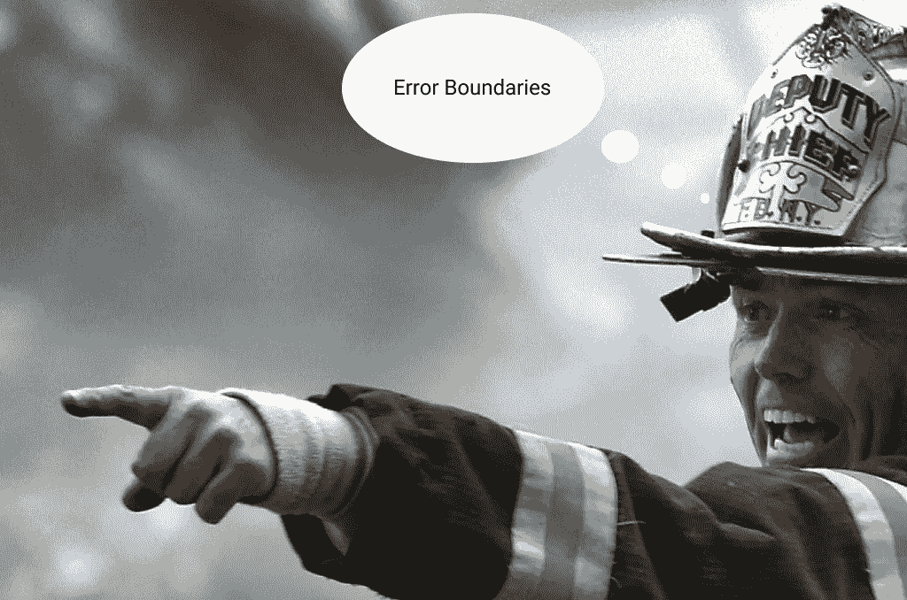

# React v16.0 中的错误边界

> 原文：<https://medium.com/hackernoon/error-boundaries-in-react-v16-0-2ab67b780329>

v16 已经上市，所以它成了镇上的新话题。是的，React 已经迁移到麻省理工学院许可证。

React v16 推出了一些新功能，**错误边界**就是其中之一。所以，这篇文章是关于错误界限的，比如它们是什么，如何使用它们等等。

在 react 中，渲染期间的任何运行时错误都会使 React 处于中断状态，并且整个组件树会从根中卸载，需要刷新才能恢复。

这可以通过使用一个名为 Error Boundaries 的特殊 React 组件来防止，该组件在运行时出现错误时提供一个回退 UI，如 try-catch 块。

这些组件使用一种特殊的生命周期方法来实现，这种方法可以捕捉子组件树中的任何错误。React v15 有这个名为***unstable _ handle error***的方法，但是对错误边界的支持非常有限。这个 unstable_handleError 方法不再工作，因为 React v16 提供了一个名为***componentDidCatch***的新方法。

错误边界仅捕获子组件的错误。自身内部的任何错误都不会被捕获，并且该错误将传播其上最近的错误边界。任何错误边界未捕捉到的任何错误都将传播到根，使整个应用程序崩溃/连根拔起。请看下面的笔和要点。

A pen describing all the scenarios that may happen with an Error Boundary Component

React 团队内部曾讨论过保留一个损坏的 UI 是否比完全移除它更好。但是他们已经在他们的产品中使用了。例如，Facebook Messenger 将侧边栏、信息面板、对话日志和消息输入的内容包装到单独的错误边界中。如果这些 UI 区域中的某个组件崩溃了，其余的组件仍然可以交互。

> 这完全取决于你的产品设计。

React 团队还鼓励使用 JS 错误报告服务，这样人们可以了解生产中发生的未处理的异常，并修复它们。

# 错误堆栈

React v16 在开发中将渲染过程中出现的所有错误打印到控制台。除了错误消息和 [javascript](https://hackernoon.com/tagged/javascript) 堆栈之外，它还提供了**组件堆栈**,因此现在人们可以看到组件到底是在哪里崩溃的。

你也可以使用 babel plugin[babel-plugin-transform-react-jsx-source](https://www.npmjs.com/package/babel-plugin-transform-react-jsx-source)在组件栈中看到文件名和行号。

# 移民

如果一个人正在使用 React v15 的 *unstable_handleError* 并且想要迁移到 React v16，React 团队已经提供了一个 [codemod](https://github.com/reactjs/react-codemod#error-boundaries) 。

# 资源

[丹·阿布拉莫夫的 React v16](https://reactjs.org/blog/2017/07/26/error-handling-in-react-16.html) 中的错误处理

> 我目前正在浦那的 Raja 软件实验室用 React 开发一些很酷的东西。你可以在推特上找到我。

> 如果你喜欢这篇文章，请点击拍手图标。