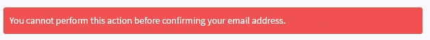
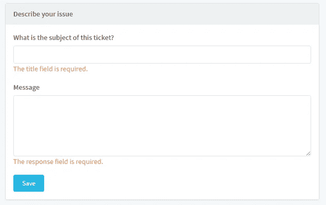

# 错误消息与验证消息— Laravel 刀片式服务器

> 原文：<https://medium.com/hackernoon/error-messages-vs-validation-messages-laravel-blade-1f196c31466f>

我喜欢在页面顶部显示错误消息，使用 Laravel 和 Blade 很容易做到这一点:

```
**@if(**!**empty**($errors->first())**)** <div class="row col-lg-12">
        <div class="alert alert-danger">
            <span>{{ $errors->first() }}</span>
        </div>
    </div>
**@endif**
```

每当我用一个错误把用户重定向回来，我知道这个页面将能够在顶部正确地显示消息，因为有了基本模板。



return redirect()->back()->withErrors(‘Your error message here’);

但是，如果您这样做，然后设置一个表单验证，您将只能在页面顶部看到第一条错误消息。我们可以遍历`errors`变量中的所有消息，但是它仍然会在页面顶部显示表单错误，而不是在每个字段下。为了防止这种情况，我们可以利用来自 Laravel 表单请求的消息包。

# 在单独的信息包中设置验证信息



## 1-基本表单请求

创建一个`BaseFormRequest`并从 FormRequests 中扩展它。

```
**use** Illuminate\Foundation\Http\FormRequest;**class** BaseFormRequest **extends** FormRequest {

    **protected** $errorBag = 'form';

}
```

## 2-为现场消息设置刀片组件

在这里，我们使用属性`$errors->form`来匹配步骤 1 中设置的`errorBag`值。我们还使用了一个名为`field`的变量，无论何时使用这个组件都需要设置这个变量。

```
**@if(**$errors->form->first($field)**)** {!! $errors->form->first($field, '<p><span class="text-warning">:message</span></p>') !!}
**@endif**
```

## 3-在您的字段下使用组件

当在表单中声明一个字段时，确保`include`步骤 2 中创建的组件，并给它一个与您的字段/规则同名的`field`变量。

```
<div class="form-group">
    <label>{{ __('What is the subject of this ticket?') }}</label>
    <input type="text" name="title" class="form-control">
    **@include(**'layouts.components.alert.field', ['field' => 'title']**)** </div>
```

## 结论

就是这样！现在，当表单请求规则失败时，它将在`form`而不是`default`上设置消息包。现在我们可以很容易地用`withErrors()`方法返回显示在顶部的错误，以及用表单请求显示每个字段的消息。

[](http://bit.ly/HackernoonFB)[](https://goo.gl/k7XYbx)[](https://goo.gl/4ofytp)

> [黑客中午](http://bit.ly/Hackernoon)是黑客如何开始他们的下午。我们是阿妹家庭的一员。我们现在[接受投稿](http://bit.ly/hackernoonsubmission)并乐意[讨论广告&赞助](mailto:partners@amipublications.com)机会。
> 
> 如果你喜欢这个故事，我们推荐你阅读我们的[最新科技故事](http://bit.ly/hackernoonlatestt)和[趋势科技故事](https://hackernoon.com/trending)。直到下一次，不要把世界的现实想当然！

