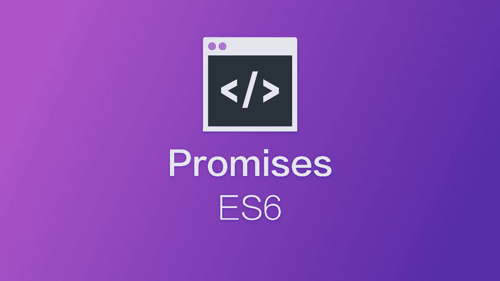

# 面向初学者的 ES6 第 2 部分

> 原文：<https://medium.com/hackernoon/es6-for-beginners-part-2-ee8a77f7f4c7>



> 这篇文章最初发表在我的博客 [Es6 上，面向初学者](https://srebalaji.rocks/es6-for-beginners-part-2/)

本文第一部分出现在[这里](https://hackernoon.com/es6-for-beginners-f98120b57414)。我在那里介绍了一些有趣的特性。:)

我将在这篇文章中讨论的话题

1.  承诺
2.  异步/等待

**承诺**

承诺是 ES6 中有用的特性之一。它们用于进行**异步**操作，如 API 请求、文件处理、下载图像等。

那么，什么是异步呢？(如果您已经知道，请稍等)

异步操作需要一些时间来完成。

例如，假设您正在定义一个向服务器发出 API 请求的函数。该函数不会立即返回输出。从服务器获得响应只需几秒钟。

因此，如果你调用那个函数，并把它的值(即输出)赋给某个变量，它将是**未定义的。**因为 Javascript 不知道函数在处理一些异步操作。

那我们怎么处理呢？

在此之前，让我们来谈谈历史。

在承诺之前，程序员习惯定义**回调。**回调是 Javascript 中的普通函数，在异步操作完成时执行。

例如，您定义了一个向服务器发出 API 请求的函数。然后你提到了一个回调函数，当我们得到服务器的响应时，这个函数就会被执行。

所以在上面的例子中，Javascript 不会停止执行，直到我们从 API 得到响应。我们已经定义了一个函数(callback ),它将在我们得到响应后执行。我想你明白了。

**那么，什么是承诺呢？**

承诺是帮助进行异步操作的对象。

从技术上讲，它们是代表异步操作完成的对象。(如果你不明白，和我呆一会儿。)

在解释如何定义承诺之前，我先解释一下承诺的生命周期。

我们有三种状态的承诺

1.  **Pending** :在这种状态下，promise 只是执行异步操作。例如，它向服务器发出一些 API 请求，或者从 cdn 下载一些图像。从这种状态，承诺可以移动到**履行**或**拒绝**
2.  **完成**:如果承诺已经达到这个状态，那么就意味着异步操作已经完成，我们已经有了输出。例如，我们有来自 API 的响应。
3.  **拒绝:**如果承诺已经达到这种状态，说明异步操作不成功，我们存在导致操作失败的错误。

行..让我们看一些代码。

```
const apiCall = new Promise(function(resolve, reject) {
 // async operation is defined here...
});
```

Promise 是通过使用 **new** 关键字创建构造函数来定义的。然后构造函数会有一个函数(我们称之为**执行器函数**)。)

异步操作是在 executor 函数中定义的。

注意，executor 函数有两个参数 **resolve** 和 **reject** 。

第一个参数 **resolve** 实际上是一个函数。它在 executor 函数中被调用，表示异步操作成功，我们得到了输出。 **Resolve** 功能帮助承诺从 **pending** 状态转移到 **fulfilled** 状态。希望你明白了。:)

和 resolve 一样， **reject** 也是一个函数。它也在 executor 函数中被调用，它表示异步操作不成功，我们得到了一个错误。**拒绝**帮助承诺从**待定**状态转移到**拒绝**状态。:)

```
const apiCall = new Promise(function(resolve, reject) {
 if ( API request to get some data ) {
  resolve("The request is successful and the response is "+ response);
 }
 else {
  reject("The request is not successful. The error is "+error);
 }
});
```

在上面的代码中，你可以看到我们在 executor 函数中做了一些异步操作。然后，如果我们从服务器得到响应，就调用 **resolve** 函数。如果有一些错误**拒绝**函数被调用并显示错误信息。

我们已经完成了对承诺的定义。让我们看看如何执行 promise 并处理输出。

```
// calling the promise.
apiCall
```

就是这样。我们完了。:) :)

开玩笑的。还没完呢。

在上面的代码中，调用函数并执行承诺(即执行**执行器**函数)。然后根据输出调用**解决**或**拒绝**功能。

但是你可以看到我们没有处理从承诺返回的输出。

例如，如果我们从 API 获得响应，那么我们必须处理响应。或者如果我们得到了错误，我们需要正确地处理它。

那我们怎么处理呢？

我们使用**处理程序**来获得承诺的输出。

处理程序只是一些在事件发生时执行的函数，比如点击按钮，移动光标等等。

所以我们可以使用处理程序来处理 **resolve** 函数被调用或者 **reject** 函数被调用的情况。

简单。:)

让我们看看一些代码

```
// calling the promise with some handlers.
apiCall.then(function(x) {console.log(x); })
```

在上面的代码中，我们为承诺附加了一个处理程序**和**。处理程序**然后**得到一个函数参数。那么函数参数本身就有一个参数 **x** 。

到底发生了什么？

当在承诺中调用 **resolve** 函数时，处理程序**然后**执行其**函数参数**。

我试着再解释一遍。

**然后**处理程序寻找调用**解析**函数的事件。所以当 resolve 函数被调用**时，**处理程序执行它的函数参数。

```
apiCall.then(function(x) {console.log(x); })// Output
The request is successful and the response is {name: "Jon Snow"}
```

同样，还有另一个处理程序**捕捉**。

**捕捉**处理器寻找**拒绝**功能。

**Catch** 函数在调用 **reject** 函数时执行其函数参数。

```
apiCall.then(function(x) {console.log(x); }).catch(function(x) {console.log(x); })// Assuming the request is not successful ( reject function is called in the promise. )Output:
The request is not successful
```

我想你明白了。

上面的代码可读性不太好。所以我们试着重构一下。

```
apiCall
.then(function(x) {
 console.log(x); 
})
.catch(function(x) {
 console.log(x);
}) 
```

啊…现在可以看了。大多数程序员都是这样写的。

好的..所以我认为你已经取得了很大的进步。

让我们回顾一下。

1.  Promise 用带函数参数的 **new** 关键字定义。那么函数本身有两个函数参数 **resolve** 和 **reject。**
2.  当操作成功时，应该调用函数 **resolve** 。
3.  当操作失败时，应调用函数 **reject** 。
4.  **然后**处理器寻找**解析**功能。
5.  **捕捉**处理器寻找**拒绝**功能。
6.  确保代码的可读性:)

下面是工作示例。如果你是新手，请练习。

Promises in Javascript.

希望你理解这个例子。直截了当。

**异步/等待**

如果你理解承诺，那么 Async/Await 是很容易的。如果你没有得到承诺，Async/Await 可以帮助你理解它。也许你也能从承诺中得到明确的解脱。:)

**异步**

Async 关键字使任何函数只返回承诺。

例如，考虑下面的代码

```
async function hello() {
 return "Hello Promise..!"
}
```

函数 **hello** 会返回一个承诺。

上面的代码等同于下面的代码。

```
function hello() {
 return new Promise(function(resolve, reject) {
 // executor function body.
 });
}
```

简单吧？

另一个例子:

```
async function hello(a, b) {
 if (a < b) {
  return "Greater";
 }
 else {
  return new Error("Not Greater");
 }
}hello(14, 10)
.then(function(x) {
 console.log("Good..! " + x); 
})
.catch(function(x) {
 console.log("Oops..! " + x); 
})Output:
Oops..! Not Greater. // if you call hello(4, 10) you get "Good..! Greater"
```

在上面的代码中，我们定义了一个**异步**函数，并返回一些值或返回一些错误。

如果在 async 函数中返回某个值，就相当于调用 resolve 函数。

如果你通过使用‘new’调用**错误构造函数返回一些错误，那么它等同于拒绝函数。**

别忘了异步函数会返回一个承诺。当然，你也可以在 **async** 函数中调用 **resolve** 和 **reject** 函数。

让我们看看它是如何工作的。

```
async function Max(a, b) {
 if (a > b) {
  return Promise.resolve("Success");
 }
 else {
  return Promise.reject("Error");
 }
}Max(4, 10)
.then(function(x) {
 console.log("Good " + x); 
})
.catch(function(x) {
 console.log("Oops " + x); 
});Output:
Oops Error// If we pass Max(14, 10) then we should get "Good Success" :)
```

**等待**

顾名思义，它让 Javascript 等待操作完成。假设您使用关键字 **await** 发出一个 API 请求。它让 Javascript 等待，直到从端点得到响应。然后它继续执行。

好的..让我们深入一点

**Await 只能在异步函数中使用。在异步功能**之外不起作用

让我们看一个例子

```
async function hello() {
 let response = await fetch('https://api.github.com/');
 // above line fetches the response from the given API endpoint.
 return response;
}hello()
.then(function(x) {
 console.log(x); 
});
...
...Output:
Response from the API.
```

在上面的代码中，你可以看到我们在从 API 获取响应时使用了 **await** 。

获取操作可能需要几秒钟的时间来获得响应，直到执行暂停，稍后再继续。

注意，await 操作只是暂停了 **hello 函数**内部的执行。 **hello** 函数之外的剩余代码不会受到影响。在函数之外继续执行。当我们得到响应时，里面的**函数参数然后** **处理程序**被执行。

希望你明白了。

让我们看一个例子

Async/Await in Javascript

在上面的例子中，你可以看到我们已经为 **getResponse** 函数使用了 **await** 。并且 **getResponse** 将在 5 秒后返回输出或错误。因此，在此之前，执行会暂停，然后返回响应。

让我们看一些实时的例子。

Async/Await in Javascript

在上面的例子中，你可以看到我们使用了多个**等待。**因此，对于每个 wait，执行都会停止，直到收到响应，然后继续执行。

用一些无效的 url 尝试同样的例子。您可以看到出现了错误。

在**异步**函数中，错误处理非常简单。如果异步函数内部出现错误，或者使用 **await** 从异步函数内部调用的其他函数中出现错误，则调用**拒绝函数**。简单。

希望你喜欢。在下一部分中，我将讨论更有趣的主题，如数组映射、数组过滤、reduce 等。仔细讨论

[](https://hackernoon.com/es6-for-beginners-77bf34bec2d1) [## 初学者 ES6 第 3 部分

### ES6 数组过滤器、数组映射、数组缩减、模板文字、导入和导出、析构对象和数组…

hackernoon.com](https://hackernoon.com/es6-for-beginners-77bf34bec2d1) 

如果你喜欢这篇文章，试着给点掌声并分享它:)