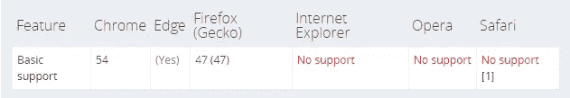
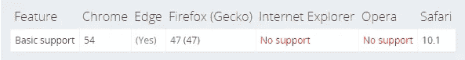
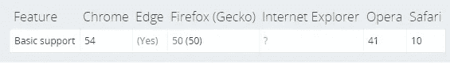
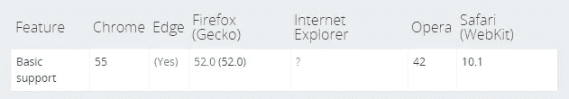
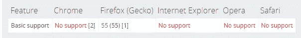
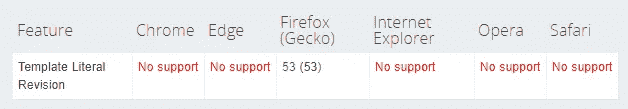

# ES8 发布了，以下是它的主要新特性🔥

> 原文：<https://medium.com/hackernoon/es8-was-released-and-here-are-its-main-new-features-ee9c394adf66>

## ECMAScript 规范第 8 版的新特性


***本*条** ***原本出现在***[***dormoshe . io***](https://dormoshe.io/articles/es8-was-released-and-here-are-its-main-new-features-15)

***这篇文章由*Jason Cheng****[**日文由 Postd**](http://postd.cc/es8-was-released-and-here-are-its-main-new-features)**[**俄文由 habrahabr**](https://habrahabr.ru/post/332900) **和** [**韩在熙**](https://jaeyeophan.github.io/2017/07/16/ES8-Standard-Release-Overview/) **翻译成中文。******

****ECMAScript 8 或 ECMAScript 2017 由 TC39 于 6 月底正式发布。似乎我们在去年谈论了很多关于 ECMAScript 的内容。不是白来的。目前，标准是每年发布一次新的 ES 规范版本。ES6 是 2015 年发布的，ES7 是 2016 年发布的，但是有人记得 ES5 是什么时候发布的吗？这发生在 2009 年，JavaScript 神奇崛起之前。****

****因此，我们跟踪 JavaScript 作为一种稳定语言的发展变化，现在我们需要将 ES8 输入我们的词典。****

****如果你是一个坚强的人，深呼吸，阅读说明书的 [web](https://www.ecma-international.org/ecma-262/8.0/index.html) 或 [PDF](https://www.ecma-international.org/publications/files/ECMA-ST/Ecma-262.pdf) 版本。对于其他人，在本文中，我们将通过代码示例介绍 ES8 的主要新特性。****

****[](http://eepurl.com/dAK9Sr)****

# ****字符串填充****

****本节向 String 对象添加了两个函数:padStart 和 padEnd。
顾名思义，这些函数的目的是填充字符串的开头或结尾，**，以使结果字符串达到给定的长度**。默认情况下，您可以用特定字符或字符串填充它，或者仅用空格填充。以下是函数声明:****

```
**str.padStart(targetLength [, padString])str.padEnd(targetLength [, padString])**
```

****如您所见，这些函数的第一个参数是`targetLength`，这是结果字符串的总长度。第二个参数是可选的`padString`，它是填充源字符串的字符串。默认值是空格。****

```
**'es8'.padStart(2);          // 'es8'
'es8'.padStart(5);          // '  es8'
'es8'.padStart(6, 'woof');  // 'wooes8'
'es8'.padStart(14, 'wow');  // 'wowwowwowwoes8'
'es8'.padStart(7, '0');     // '0000es8''es8’.padEnd(2);          // 'es8'
'es8’.padEnd(5);          // 'es8  '
'es8’.padEnd(6, 'woof’);  // 'es8woo'
'es8’.padEnd(14, 'wow’);  // 'es8wowwowwowwo'
'es8’.padEnd(7, '6’);     // 'es86666'**
```

********

****Browser support (MDN)****

# ****对象.值和对象.条目****

****`*Object.values*`方法返回一个给定对象自身可枚举属性值的数组，顺序与`*for in*`循环提供的顺序相同。该函数的声明很简单:****

```
**Object.values(obj)**
```

****`*obj*`参数是操作的源对象。它可以是一个对象或数组(即索引为[10，20，30] - > { 0: 10，1: 20，2: 30 }的对象)。****

```
**const obj = { x: 'xxx', y: 1 };
Object.values(obj); // ['xxx', 1]

const obj = ['e', 's', '8']; // same as { 0: 'e', 1: 's', 2: '8' };
Object.values(obj); // ['e', 's', '8']

// when we use numeric keys, the values returned in a numerical 
// order according to the keys
const obj = { 10: 'xxx', 1: 'yyy', 3: 'zzz' };
Object.values(obj); // ['yyy', 'zzz', 'xxx']Object.values('es8'); // ['e', 's', '8']**
```

********

****Browser support (MDN) for *Object.values*****

****`*Object.entries*`方法返回给定对象自己的可枚举属性`[key, value]`对的数组，顺序与`Object.values`相同。该函数的声明很简单:****

```
**const obj = { x: 'xxx’, y: 1 };
Object.entries(obj); // [[’x’, 'xxx’], [’y’, 1]]

const obj = [’e’, 's’, '8’];
Object.entries(obj); // [[’0’, 'e’], [’1’, 's’], [’2’, '8’]]

const obj = { 10: 'xxx’, 1: 'yyy’, 3: 'zzz' };
Object.entries(obj); // [[’1’, 'yyy’], [’3’, 'zzz’], [’10’, 'xxx’]]Object.entries('es8'); // [['0', 'e'], ['1', 's'], ['2', '8']]**
```

********

****Browser support (MDN) for *Object.entries*****

****[](http://eepurl.com/dAK9Sr)****

# ****object . getownpropertydescriptors****

****方法返回指定对象的所有自己的属性描述符。own 属性描述符是直接在对象上定义的，而不是从对象的原型继承的。该函数的声明是:****

```
**Object.getOwnPropertyDescriptors(obj)**
```

****`*obj*`是源对象。返回的描述符对象结果的可能关键字有*可配置、可枚举、可写、获取、设置和值*。****

```
**const obj = { 
  get es7() { return 777; },
  get es8() { return 888; }
};Object.getOwnPropertyDescriptors(obj);
// {
//   es7: {
//     configurable: true,
//     enumerable: true,
//     get: function es7(){}, //the getter function
//     set: undefined
//   },
//   es8: {
//     configurable: true,
//     enumerable: true,
//     get: function es8(){}, //the getter function
//     set: undefined
//   }
// }**
```

****描述符数据对于像 decorator 这样的高级特性非常重要。****

********

****Browser support (MDN)****

# ****函数参数列表和调用中的尾随逗号****

****函数参数中的尾随逗号是当我们在列表末尾添加一个不必要的逗号时，编译器不会引发错误(`SyntaxError`)的能力:****

```
**function es8(var1, var2, var3**,**) {
  // ...
}**
```

****作为函数声明，这可以应用于函数调用:****

```
**es8(10, 20, 30**,**);**
```

****这个特性的灵感来自于对象文本和数组文本中逗号的尾部`[10, 20, 30,]`和`{ x: 1, }`。****

# ****异步函数****

****`async function`声明定义了一个异步函数，该函数返回一个`[AsyncFunction](https://developer.mozilla.org/en-US/docs/Web/JavaScript/Reference/Global_Objects/AsyncFunction)`对象。在内部，异步函数的工作方式很像生成器，但是它们不会被转换成生成器函数。****

```
**function fetchTextByPromise() {
  return new Promise(resolve => { 
    setTimeout(() => { 
      resolve("es8");
    }, 2000);
  });
}**async** function sayHello() { 
  const externalFetchedText = **await** fetchTextByPromise();
  console.log(`Hello, ${externalFetchedText}`); // Hello, es8
}sayHello();**
```

****`sayHello`的调用会在 2 秒后记录`Hello, es8`。****

```
**console.log(1);
sayHello();
console.log(2);**
```

****现在印刷品是:****

```
**1 // immediately
2 // immediately
Hello, es8 // after about 2 seconds**
```

****这是因为函数调用不会阻塞流。****

****注意，`async function`总是返回一个承诺，`await`关键字只能在标有`async`关键字的函数中使用。****

********

****Browser support (MDN)****

# ****共享内存和原子****

****共享内存时，多个线程可以读写内存中的相同数据。原子操作确保可预测的值被写入和读取，操作在下一个操作开始之前完成，并且操作不被中断。本节介绍一个新的构造函数`SharedArrayBuffer`和一个带有静态方法的名称空间对象`Atomics`。****

****`Atomic`对象是类似`Math`的静态方法的对象，所以我们不能把它作为构造函数。此对象中静态方法的示例如下:****

*   ****加/减—为特定位置的值加/减一个值****
*   ****与/或/异或—按位与/按位或/按位异或****
*   ****负载-获取特定位置的值****

********

****Browser support (MDN)****

# ****下一年在 ES9 中还有一个——取消模板文字限制****

****使用带标签的模板文字(ES6 ),我们可以声明模板解析函数并根据我们的逻辑返回值:****

```
**const esth = 8;
helper`ES ${esth} is `;function helper(strs, ...keys) {
  const str1 = strs[0]; // ES
  const str2 = strs[1]; // is let additionalPart = '';
  if (keys[0] == 8) { // 8
    additionalPart = 'awesome';
  }
  else {
    additionalPart = 'good';
  }

  return `${str1} ${keys[0]} ${str2} ${additionalPart}.`;
}**
```

****返回值会是→ ES 8 很牛逼。
而对于 7 的`esth`，返回值将是→ ES 7 是好的。****

****但是对于包含例如\u 或\x 子字符串的模板有一个限制。ES9 会处理这个逃逸问题。在 [MDN 网站](https://developer.mozilla.org/en-US/docs/Web/JavaScript/Reference/Template_literals)或 [TC39 文档](https://tc39.github.io/proposal-template-literal-revision/)上了解更多信息。****

********

****Browser support (MDN)****

# ****结论****

****JavaScript 正在生产中，但它总是在更新。采用规范的新特性的过程是非常有序的。在最后阶段，这些特性由 TC39 委员会确认并由核心开发者实现。它们中的大多数已经是 Typescript 语言、浏览器或其他 polyfills 的一部分，所以你现在就可以去尝试它们。****

********

*******您可以关注我的***[***dormo she . io***](https://www.dormoshe.io)***或***[***Twitter***](https://twitter.com/DorMoshe)***了解更多关于 Angular、JavaScript 和 web 开发的内容。*******

****[](http://eepurl.com/dAK9Sr)****