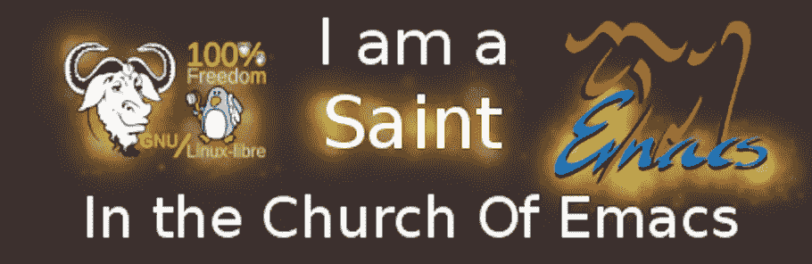

# 逃离手指拉伤地狱！前“Emacs 教会”成员告诉所有

> 原文：<https://medium.com/hackernoon/escape-from-finger-strain-hell-ex-church-of-emacs-member-tells-all-d95425ad958f>

“100% Freedom” or 100% Lies?

乍一看，Lucy Wu 似乎和其他程序员没什么两样。但是在她的笔记本电脑隐私过滤器背后隐藏着一个比她终端背景更黑暗的秘密:她曾经是 Emacs 教会的忠实成员。

“这是一个危险的螺旋——你开始使用 Emacs 作为你的主要文本编辑器，然后你知道，你开始使用 Emacs 作为你的主要操作系统，”吴警告说。“当我是 Emacs 教会的一员时，我完全与现实隔绝。听音乐、网上冲浪、发送电子邮件——这些都是通过 Emacs 实现的。”

对吴来说，灌输很早就开始了。“我在大学的计算机系统课上开始使用 Emacs，”她回忆道。“由于它是非模态的，我想它会比我的大多数同学都在使用的 Vim 有更快的学习曲线。起初，我认为我是对的——当我的朋友们正在努力进入插入模式和退出 Vim 时，我正在轻松地编写代码。”

但是，最初看起来节省时间的方法很快就变成了浪费时间的方法，让吴在 Emacs 的泥潭中越陷越深。“有了所有可供我选择的定制选项，我开始花越来越多的时间给我的 init 文件添加扩展，”她说。“我的其他朋友只打开他们喜欢的文本编辑器来编辑文件，然后他们会关闭它们。但我从未关闭过 Emacs——我变得如此依赖我的 init 文件中的个性化设置，以至于我已经忘记了正常操作一台计算机是什么感觉。”

所以，我们问吴，是什么原因让你看到了光明，离开了教会？

“就像我的许多前教会成员一样，这一切都是从我开始质疑它的`ctrl`开始的，”吴说。“在连续几个月不间断使用 Emacs 后，我患上了‘Emacs pinky’，甚至将`ctrl`与`caps lock`对应起来也没有减轻压力。但真正的打击发生在有一天我被迫在别人的电脑上使用 Emacs 的时候。”她颤抖着。“他们的环境与我的完全不同，使用起来非常痛苦——不夸张地说。就在那时，我意识到了埃马克教会让其成员脱离现实世界的程度:我们每个人都生活在自己制造的虚假现实中。”

吴继续说，“打`C-x C-c`是我做过的最难的事情之一，但它无疑让我的生活变得更好。现在我不用把所有空闲时间都花在寻找新的扩展来添加到我的 init 文件中，我有时间做各种事情，比如洗澡和交朋友。”

带着些许的不安，我们终于提出了我们所有人心中的疑问:既然否定了 Emacs，吴是否已经皈依了 vi 的崇拜？

“别傻了，”她不屑地说道。“当我还是教会的一员时，我可能连续几个月住在 CS 系大楼的地下室里，但我并不那么讨厌自己。”