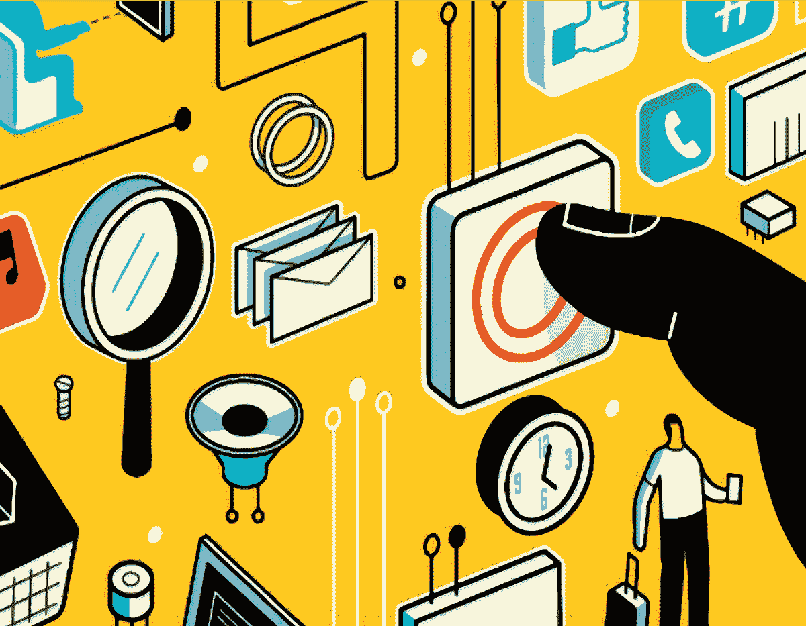

# 逃离房间

> 原文：<https://medium.com/hackernoon/escape-the-room-2d8a712ade98>

## 构建线下社区

[VenturePact](http://blog.venturepact.com/7-industries-being-disrupted-by-the-on-demand-economy/), 2016

这是我们当前文化的一个残酷现实:我从来不需要离开我在旧金山的工作室就能过得很好。当前的技术使我能够:

1.  **杂货/家居用品** *(Google Express、Prime Now、Instacart)*
2.  **任何餐厅的食物** *(鱼子酱，吃 24，蛴螬枢纽，Postmates)*
3.  **锻炼** *(精神错乱，Instagram 健身名人，YouTube)*
4.  **娱乐** *(网飞、Hulu、Prime、HBO Now……live stream SpaceX 在和男朋友闲逛时推出)*
5.  **教育/时事***(general assembly，Google News，Codeacademy)*
6.  **洗衣** *(Wash.io，漂洗)*
7.  **清洁** *【得心应手】*
8.  **沟通** *(随便什么；FB、TW、Insta、Quora、Reddit、FaceTime、Skype、SMS)*

这就好像我们在“[房间](https://en.wikipedia.org/wiki/Room_(2015_film))”(如果你没看过，就照字面意思理解)，只不过我们拥有我们可能想要的一切，并且能够随时离开。这就是可怕的地方。

> 如果我们可以从基于服务的商业互联网中获得一切，我们就不需要与外界互动。

生活在旧金山，我们都认为理所当然的数字便利让内向的人有机会生活在一个完全封闭的空间里。但是我为什么要提这个呢？这是为了说明社区的重要性。倒回 5 到 10 年前，大家都习惯在街上互动。他们说“早上好”现在，每个人都戴着耳机或打着手机，甚至连头都没抬一下。

> 我总是拦住女孩，告诉她们我有多喜欢她们的衣服或配饰，每次她们都会用一种奇怪的厌恶的眼神看着我，就像“你为什么要和我说话？”在第一个 15 秒后，他们通常会冷静下来，说谢谢。

你真正认识新朋友和发展关系的唯一时间是当你有共同经历的时候。这可能是一个生日聚会，欢乐时光，甚至是一个会议。在我们的城市培养社区的方法是继续举办这些活动。事件使人们为了多样性或共同性而聚在一起，体验新事物。作为金融城的一名自由活动策划人，我甚至无法表达让活动顺利进行有多困难。

就像我之前说的，旧金山人已经拥有了他们需要的一切，以至于他们从来没有离开过房子。相反，人们喜欢活动，因为它给他们提供了新的、令人兴奋的机会……以及离开家的借口。他们天生需要线下社区，因为他们太数字化了。即使是最差的科技公司也有一个可取之处；他们出现了。

> 我们需要保持(或开始)相互交流。

尽管出现的坏蛋只是为了推广他们的个人品牌或创业，但好事件的目标是保持社区的活力。看看德扬博物馆。他们有一个纺织小组，非常认真地不断学习织物在历史上的用途。唯一能让议会存在的是他们的活动。因为他们，我现在熟悉了从 18 世纪早期到 19 世纪 70 年代的俄罗斯芭蕾舞服装。

> 无论如何，我在讲一个警示性的故事。社区的社交性促进接受你周围的人，当有人说“早上好”时不要惊慌失措

事件教人。活动也能促进多样性。放下手机，四处看看，找点线下的东西参与。这是我们的城市。不要让它滑入平庸的社交媒体和按需经济。

## 让我们一起做更多的事情。

*原载于* [*SF 考官*](https://medium.com/u/df26784d76fd?source=post_page-----2d8a712ade98--------------------------------) *，6/27/16*

> [黑客中午](http://bit.ly/Hackernoon)是黑客如何开始他们的下午。我们是阿妹家庭的一员。我们现在[接受投稿](http://bit.ly/hackernoonsubmission)并乐意[讨论广告&赞助](mailto:partners@amipublications.com)机会。
> 
> 如果你喜欢这个故事，我们推荐你阅读我们的[最新科技故事](http://bit.ly/hackernoonlatestt)和[趋势科技故事](https://hackernoon.com/trending)。直到下一次，不要把世界的现实想当然！

