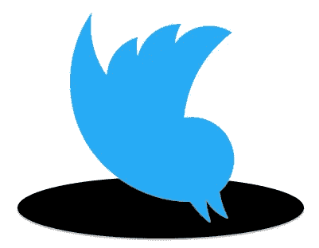
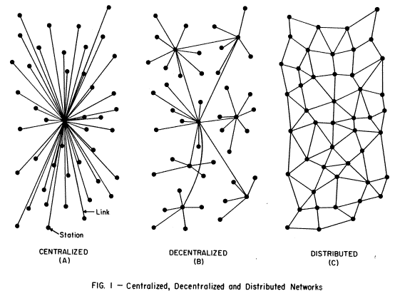

# 逃离互联网上的黑洞

> 原文：<https://medium.com/hackernoon/escaping-black-holes-on-the-internet-37d1cb670cb4>

For all the good it does, Twitter is a black hole, because it’s centralized. Fortunately the Internet, by design, is not.

2014 年 3 月 14 日，[土耳其关闭推特](http://www.reuters.com/article/2014/03/21/us-turkey-twitter-idUSBREA2K0CB20140321)。总理[雷杰普·塔伊普·埃尔多安](http://en.wikipedia.org/wiki/Recep_Tayyip_Erdo%C4%9Fan)宣布，“我们现在有法院命令。我们会根除推特。我不在乎国际社会怎么说。所有人都将见证土耳其共和国的力量。”( [Hurriyet Daily News](http://www.hurriyetdailynews.com/turkey-blocks-twitter-after-erdogan-vowed-eradication.aspx?pageID=238&nID=63884&NewsCatID=338) )他还说土耳其会“连根拔起”推特。([华盛顿邮报](http://www.washingtonpost.com/world/middle_east/turkey-blocks-access-to-twitter/2014/03/20/7bad19d2-b08c-11e3-b8b3-44b1d1cd4c1f_story.html))

是的，当我上周在伊斯坦布尔的时候，推特还很好用。

那是因为 Twitter 的根基在互联网。即使土耳其将提供网络接入的电话和有线电视系统连根拔起，他们也无法将网络本身拔起，因为网络不是集中的。它是分布式的:一个层次结构而不是一个层级结构。在最基本的层面上，网络的存在依赖于[协议](http://en.wikipedia.org/wiki/Communications_protocol)而不是任何协议。com，。组织，。edu 或者。政府将这些协议付诸实施。

网络的协议不是服务器、云、电线、路由器或代码库。它们是关于数据如何从一个端点流向另一个端点的协议。这使得互联网成为一个目的的世界，而不是一个政府、公司和个人的世界。whatevers:每个人和它上面的所有东西之间的一个巨大的零。它不能被简化为这些事物中的任何一个，就像时间不能被简化为一个钟一样。网络就像语言和数学一样，对用法漠不关心，而且支持它的每一种用途。而且，由于这种遗忘，网络支持所有人而不偏袒任何人。

反正是故意的。实施是另一回事，因为在大多数情况下，接入是由机构提供的，而这些机构本质上都是中央集权的。他们以集中的方式和集中的兴趣思考。就像[平地](https://en.wikipedia.org/wiki/Flatland)中的线条、三角形和正方形一样，他们很难理解中间的球体。但是他们需要。[我们都做](http://www.linuxjournal.com/content/opening-minds-spheres-among-us)。互联网的巨零就是那个球体。它仍然是新的，出现于 1995 年 4 月 30 日，当时[互联网内禁止一种数据货物](https://en.wikipedia.org/wiki/National_Science_Foundation_Network)(在[那种情况下](https://en.wikipedia.org/wiki/National_Science_Foundation_Network#Acceptable_Use_Policy_.28AUP.29)，商业活动)[退出](https://en.wikipedia.org/wiki/National_Science_Foundation_Network#Privatization_and_a_new_network_architecture)。此后，所有形式的数据传输都被网络的基础协议所允许和支持，因此网络本身也是如此。

回到基本原则会有所帮助。保罗·巴兰在 20 世纪 60 年代早期对比中央集权制(如政府)和分权制(如推特+脸书+谷歌等)时，阐述了这些观点。)和分布式的，[使用本图](http://www.rand.org/about/history/baran-list.html):

设计 C 被用于互联网。一个区别是:线不需要在那里，它们中的任何一条都可以通过中间物与其他任何一条连接起来，中间物对它为其上的一切所做的事情的遗忘就像地球的核心对其表面发生的事情的遗忘一样。在这篇里程碑式的论文中，大卫·伊森伯格称互联网是“愚蠢的”就像重力一样，它一点也不聪明。

Baran 的设计吸引了军方人士，因为分布式系统的“攻击面”并不比单个节点或单个连接大，所以很难让整个系统瘫痪。这就是为什么约翰·吉尔摩说“互联网把审查解释为损害并绕过它。”这种情况两年前发生在土耳其，就像今天发生在中国和其他国家一样，这些国家利用他们的特权和集中控制，在网上提供他们不喜欢的括约肌服务。

国家并不是唯一的罪犯。如今，如果不呆在脸书、Twitter、亚马逊、Instagram 和其他网站的深井里，在网上社交或做生意似乎几乎是不可能的，至少有时是如此。但是通过设计绕过它们仍然是可行的*。这种设计不是关于硬的和固定的管理线路，而是关于网络协议首先支持的自愿连接。*

*例如，尽管 Twitter 规模庞大，但它只不过是巴兰的 A 和 b 的星形设计中的一个点。当土耳其和中国政府等强大的行动者“根除”它时，这个点就变成了一个真正的黑洞。当这种情况发生时，没有光逃脱。最大的重力井有最大的攻击面。*

*当我们设计和使用集中式系统，甚至是分散式系统时，我们需要记住这一点。只有每个不超过一个节点的分布式系统才完全尊重网络的分布式本质。*

*不，为此而设计并非不可能。地球上的一切也分布在它自己对重力的利用上。你不会被拉向地面，因为一些公司为你提供重力服务。*

*为了设计完全的网络合规性，你需要遵循史蒂夫·乔布斯的[思考不同的](https://www.google.com/search?q=think+different+einstein)角色模型。*

*在我给出我的例子之前，我想听听你的。(只是在这里分发。)*

**这个帖子的一个始祖是**，2014 年 4 月 14 日发在* [*我的博客*](http://blogs.harvard.edu/doc/) *。**

******

> *[黑客中午](http://bit.ly/Hackernoon)是黑客如何开始他们的下午。我们是 [@AMI](http://bit.ly/atAMIatAMI) 家庭的一员。我们现在[接受投稿](http://bit.ly/hackernoonsubmission)，并乐意[讨论广告&赞助](mailto:partners@amipublications.com)机会。*
> 
> *如果你喜欢这个故事，我们推荐你阅读我们的[最新科技故事](http://bit.ly/hackernoonlatestt)和[趋势科技故事](https://hackernoon.com/trending)。直到下一次，不要把世界的现实想当然！*

**