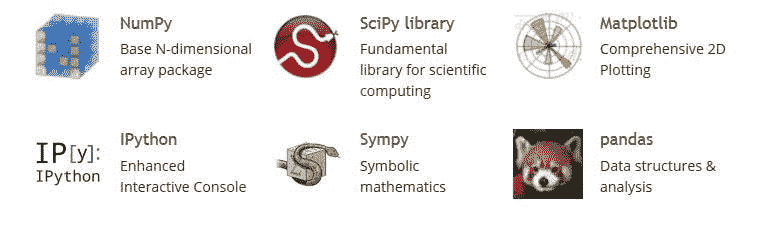
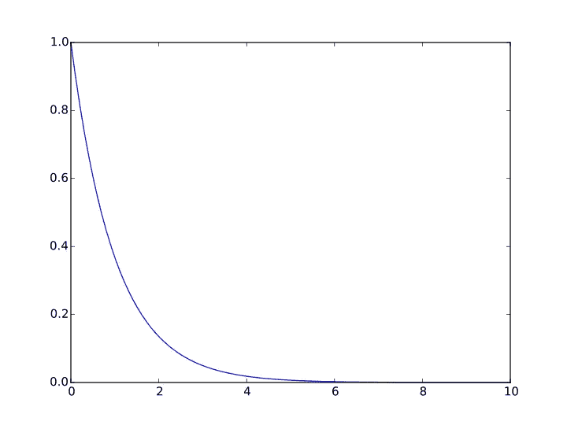
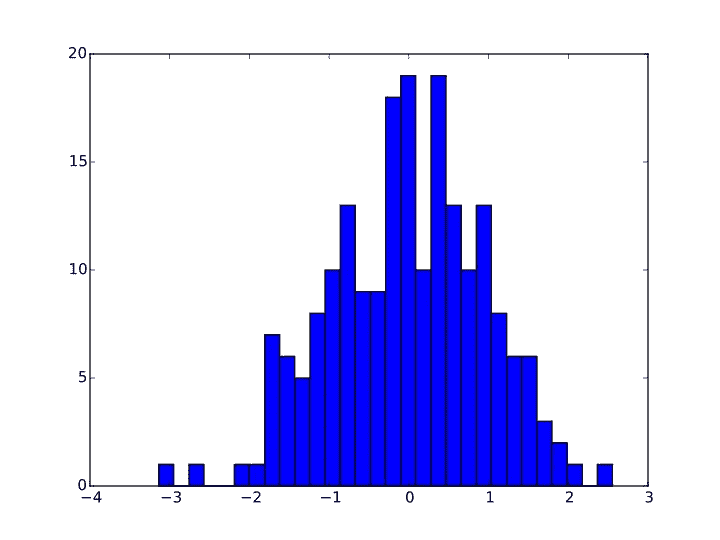
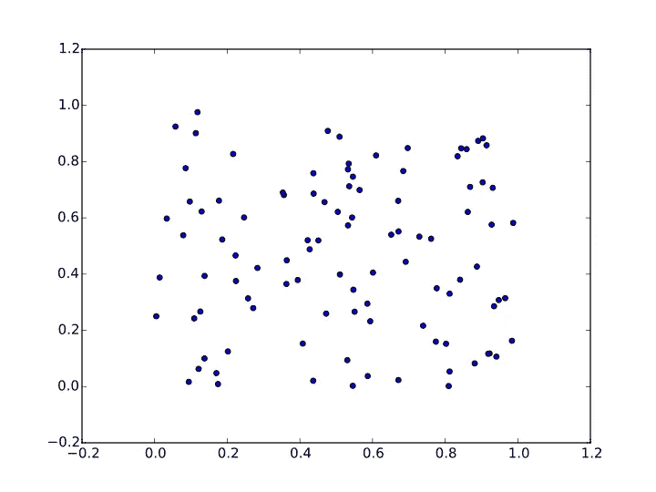

# 基本机器学习库— I

> 原文：<https://medium.com/hackernoon/essential-machine-learning-libraries-i-ad346949adea>



> 这篇文章是基本机器学习库系列的第 1 部分

大家好，

既然你已经通过之前的帖子( [1](https://mandroid6.github.io/2017/04/03/Machine-Learning-Classification/) 、 [2](https://mandroid6.github.io/2017/04/15/Machine-Learning-Regression/) )了解了[机器](https://mandroid6.github.io/2017/04/03/Machine-Learning-Classification/) [学习](https://mandroid6.github.io/2017/04/15/Machine-Learning-Regression/)背后的一些理论基础，那么是时候进入一些用于实现 ML 和/或数据科学项目的必要 python 库了。

[Python](https://hackernoon.com/tagged/python) 作为大多数开发者的选择，所使用的主要数据科学和 ml/deep [学习](https://hackernoon.com/tagged/learning)库都是用 Python 开发的。虽然 R 也被许多分析和数据科学的行业研究人员使用，但我在这个领域的经验仅限于 python。

这篇文章将只包含主要用于数据导入、预处理和可视化的库。用于 ml 模型创建的库将在下一篇文章中介绍。

# 1.Numpy


Numpy 库以类似于 MATLAB 的方式增加了对多维数组和矩阵的支持。以及对这些数组进行操作的大量高级数学函数。NumPy 的核心功能是它的“ndarray”，用于 n 维数组，数据结构。

# 示例操作:

## 数组创建

```
import numpy as np x = np.array([1, 2, 3]) x
```

输出— `array([1, 2, 3])`

```
y = np.arange(10) # like Python's range, but returns an array y
```

输出— `array([0, 1, 2, 3, 4, 5, 6, 7, 8, 9])`

## 基本操作

```
a = np.array([1, 2, 3, 6]) b = np.linspace(0, 2, 4) # create an array with four equally spaced points starting with 0 and ending with 2\. c = a - b c
```

输出— `array([ 1., 1.33333333, 1.66666667, 4.])`

输出— `array([ 1, 4, 9, 36])`

## 通用函数

```
a = np.linspace(-np.pi, np.pi, 100) b = np.sin(a) c = np.cos(a)
```

## 线性代数

```
from numpy.random import rand from numpy.linalg import solve, inv a = np.array([[1, 2, 3], [3, 4, 6.7], [5, 9.0, 5]]) a.transpose()
```

输出— `array([[ 1\. , 3\. , 5\. ], [ 2\. , 4\. , 9\. ], [ 3\. , 6.7, 5\. ]])`

输出— `array([[-2.27683616, 0.96045198, 0.07909605], [ 1.04519774, -0.56497175, 0.1299435 ], [ 0.39548023, 0.05649718, -0.11299435]])`

```
b = np.array([3, 2, 1]) solve(a, b) # solve the equation ax = b
```

输出— `array([-4.83050847, 2.13559322, 1.18644068])`

```
c = rand(3, 3) * 20 # create a 3x3 random matrix of values within [0,1] scaled by 20 c
```

输出— `array([[ 3.98732789, 2.47702609, 4.71167924], [ 9.24410671, 5.5240412 , 10.6468792 ], [ 10.38136661, 8.44968437, 15.17639591]])`

```
np.dot(a, c) # matrix multiplication
```

输出— `array([[ 53.61964114, 38.8741616 , 71.53462537], [ 118.4935668 , 86.14012835, 158.40440712], [ 155.04043289, 104.3499231 , 195.26228855]])`

更多详细的例子和教程请点击[链接](http://cs231n.github.io/python-numpy-tutorial/)。

# 2.Scipy


SciPy 是一个基于 Python 的数学、科学和工程开源软件生态系统。它有许多用于科学计算的软件包，包括但不限于优化、集成、快速傅立叶变换、ODE 以及信号和图像处理。

SciPy 被组织成涵盖不同科学计算领域的子包。下表总结了这些问题:

**子包** **描述**聚类分析算法常数物理和数学常数 fftpack 快速傅立叶变换例程集成积分和常微分方程解算器插值插值和平滑样条 io 输入和输出线性代数 N 维图像处理 odr 正交距离回归优化和求根例程信号处理稀疏矩阵和相关例程空间数据结构和算法特殊特殊函数统计分布和函数

因为在 scipy 下有很多例子，在我尝试了大部分之后，我会写一个单独的帖子。在那之前，你可以查看下面的[链接](https://docs.scipy.org/doc/scipy/reference/tutorial/index.html)

# 3.Matplotlib


Matplotlib 是一个 Python 绘图库，它以各种硬拷贝格式和跨平台的交互环境生成出版物质量数据。Matplotlib 可用于 Python 脚本、Python 和 IPython shell、jupyter 笔记本、web 应用服务器和四个图形用户界面工具包。

它提供了一个面向对象的 API，使用 Tkinter、wxPython、Qt 或 GTK+等通用 GUI 工具包将绘图嵌入到应用程序中。还有一个基于状态机(如 OpenGL)的程序“pylab”接口，设计得非常类似于 MATLAB。

# 线形图

```
import matplotlib.pyplot as plt import numpy as np a = np.linspace(0,10,100) b = np.exp(-a) plt.plot(a,b) plt.show()
```



# 柱状图

```
import matplotlib.pyplot as plt from numpy.random import normal,rand x = normal(size=200) plt.hist(x,bins=30) plt.show()
```



# 散点图

```
import matplotlib.pyplot as plt from numpy.random import rand a = rand(100) b = rand(100) plt.scatter(a,b) plt.show()
```



更多详细示例和教程，请点击此[链接](https://matplotlib.org/users/pyplot_tutorial.html)。

# 4.熊猫


Pandas 是一个为 Python 编程语言编写的软件库，用于数据操作和分析。特别是，它提供了数据结构和操作来操作数字表和时间序列。

熊猫的几个重要特征是:

*   用于集成索引的数据操作的 DataFrame 对象。
*   用于在内存数据结构和不同文件格式之间读写数据的工具。
*   数据对齐和缺失数据的综合处理。
*   数据集的整形和旋转。
*   大型数据集的基于标签的切片、花式索引和子集化。
*   数据结构列的插入和删除。
*   按引擎分组，允许对数据集进行拆分-应用-组合操作。
*   数据集合并和连接。

一些示例:

## 创建数据

```
from pandas import DataFrame, read_csv import pandas as pd from numpy.random import rand names = ['Bob','Jessica','Mary','John','Mel'] births = [968, 155, 77, 578, 973]
```

## 使用 zip 函数合并两个列表

```
BabyDataSet = list(zip(names,births)) BabyDataSet
```

输出— `[('Bob', 968), ('Jessica', 155), ('Mary', 77), ('John', 578), ('Mel', 973)]`

## 创建 dataframe 对象，以类似于 sql 的方式存储数据

```
df = pd.DataFrame(data = BabyDataSet, columns=['Names', 'Births'])
```

## 导入和分割数据集

```
dataset = pd.read_csv('Dataset_name.csv') #modified as per need X = dataset.iloc[index of input values].values y = dataset.iloc[index of target/ouput values].values
```

更多详细的例子和教程请点击[链接](https://pandas.pydata.org/pandas-docs/stable/10min.html)。另外[这篇](https://www.datacamp.com/community/tutorials/pandas-tutorial-dataframe-python#gs.cfJ29OY)是一篇很好的快速浏览文章。

到目前为止，我们已经介绍了在实际创建机器学习模型之前导入和预处理数据所需的主要 python 库。

> *在下一篇文章中，我将介绍对于创建、训练和测试各种模型至关重要的 ml 和深度学习库。敬请关注！*

*原载于 2017 年 6 月 23 日*[*mandroid 6 . github . io*](https://mandroid6.github.io/2017/06/23/Essential-Machine-learning-Libraries-I/)*。*

在推特上关注我:[https://twitter.com/mandroid_6](https://twitter.com/mandroid_6)

## 查看我关于机器学习和深度学习的其他帖子:[https://medium.com/@razzormandar](/@razzormandar)