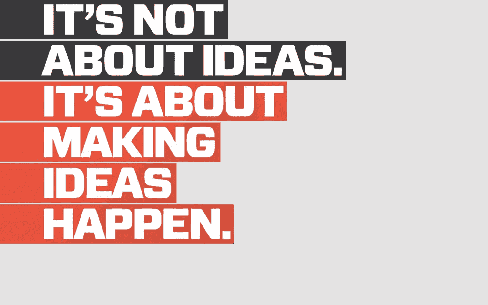
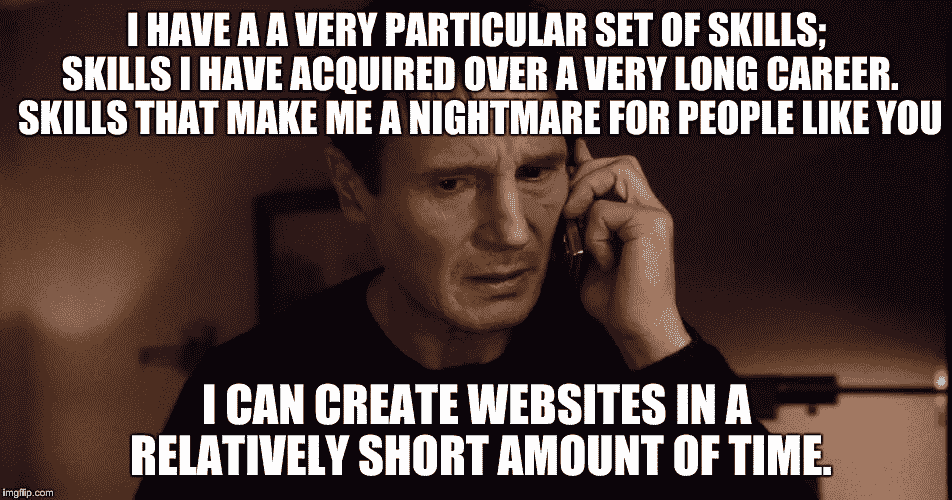

# 学习编码和创业的基本工具和资源

> 原文：<https://medium.com/hackernoon/essential-tools-and-resources-for-learning-to-code-and-building-your-startup-b7b476a3201>

你好世界！我将带你踏上一段神奇的旅程。去你从未去过的互联网上的地方旅行。你会发现许多创造、发展和培养你的项目的好方法。

这可能是你:

我把一些我喜欢的网站分成了几个类别，你会在下面看到。请随意查看任何让你感兴趣的链接。别担心，如果你决定不看所有的东西，我不会太生气。这又不是我为你做的。

## 灵感和免费材料，以帮助创建您的网站的用户界面和设计。

1.  ****—学习好的 UI 和设计的秘密。****
2.  ********[**编写我的 UI**](http://codemyui.com/)**——漂亮 UI 的片段(有代码可用)。**********
3.  ******[**字体对**](http://fontpair.co/) —寻找搭配良好的字体。******
4.  ****[**ui pallete**](http://www.uipalette.net/)**——一个帮助你找到色彩组合的网站集合。******
5.  ******[**Pablo**](https://buffer.com/pablo)**——免费让你的图片在社交媒体上变得友好。********
6.  ******[**名词项目**](https://thenounproject.com/) —图标丰富(提供免费版本)。******
7.  ********—帮助创建新标识的站点列表。********

## ******免费库存图片和视频******

1.  ******[**一个 PH 集合**](https://www.producthunt.com/e/stock-video-resources) —免费股票视频来源列表。******
2.  ****[**Pexels**](https://www.pexels.com/?ref=producthunt)****
3.  ****[**我的照片**](http://mystock.photos/)****
4.  ****[**股票上涨**](http://www.sitebuilderreport.com/stock-up)****

## ****如何编码****

1.  ********——学习如何编码的热门网站列表。********
2.  ******[**Git 指南**](http://rogerdudler.github.io/git-guide/)**—[学习](https://hackernoon.com/tagged/learning)关于 Git 的简单指南。********
3.  ******[**code 4 startup**](https://code4startup.com/)—学习如何通过建立现有的初创公司来编码。******
4.  ******C**[**ode upstart**](http://www.codeupstart.com/)——同上。****
5.  ****[**TutSet**](http://www.tutset.com/) —帮助你成为全栈 web 开发者的免费教程。****
6.  ****[**升一级**](http://leveluptuts.com/) —通过视频学习不同的编码语言。****
7.  ****[**便当**](https://www.bento.io/) —从推荐的材料中自学编码任何东西。****
8.  ****[**lifehacker 文章**](http://lifehacker.com/learn-which-programming-language-to-choose-with-this-in-1669612111) —帮你选择学什么编码语言。****
9.  ****[**一个 CodeMentor 网站**](http://www.bestprogramminglanguagefor.me/)**——根据你的需求，建议一种编码语言。******
10.  ******[**Lynda**](http://www.lynda.com) 学习编程一切事物的视频课程合集(凭某些公共借书证免费)。******

## ****您可以从免费的网站模板开始****

1.  ****[**关于页面**](https://ontrapages.com/)****
2.  ****[**PSDDD**](http://www.psddd.co/)****
3.  ****[**主题查找器**](http://themefindr.net/) —提供模板的网站集合****
4.  ****[**自由战士**](http://freebiesjedi.com/)****
5.  ****[**实物模型目录**](http://mockupcatalog.com/category/view-freebies/)****
6.  ****[**主题曲**](http://www.theme.cards/)****

## ****促进创业网站列表****

1.  ****[**Submit.co**](http://submit.co/#.eNgj)****
2.  ****[**TNW 文章**](http://thenextweb.com/entrepreneur/2015/10/30/18-best-places-to-promote-your-startup-for-virtually-nothing/)****
3.  ****[**Pitchmantra.com**](http://www.pitchmantra.com/publisher-list)****

## ****让你的技能和创业更上一层楼的精选清单****

1.  ****[**the stacks**](http://thestacks.im/)——一个包含精选列表的网站集合。****
2.  ****[**成长。供应**](http://growth.supply/free/)****
3.  ****[**市场由设计 modo**](http://market.designmodo.com/tools/)****
4.  ****[**一次 PH 采集**](https://www.producthunt.com/@hnshah/collections/free-stuff-for-startups)****
5.  ****[**成长工具**](http://growthtools.io/)****
6.  ****[**启动资源**](http://startupresources.io/)****

## ****MOAR 开发工具****

1.  ****[**开发文档**](http://devdocs.io/offline) —离线阅读文档。****
2.  ****[**codewars.com**](http://www.codewars.com/)—提高和练习你的编码技能。****
3.  ****[**CodinGame**](https://www.codingame.com/start)**—通过游戏提高和练习自己的编码技能。******
4.  ******[**tutorialzine 文章**](http://tutorialzine.com/2014/09/50-awesome-tools-and-resources-for-web-developers/) —面向 web 开发人员的牛逼[工具](https://hackernoon.com/tagged/tools)和资源。******
5.  ****[**【tuts+教程】**](http://code.tutsplus.com/tutorials/top-15-best-practices-for-writing-super-readable-code--net-8118) —编写可读代码的技巧。****
6.  ****[**一个 PH 集合**](https://www.producthunt.com/@kwdinc/collections/tools-to-build-your-next-website) —帮助你建立下一个站点的工具列表。****
7.  ****[**jQuery 卡**](http://jquerycards.com/) — jQuery 插件让你的站点更牛逼。****
8.  ****[**创客工具**](https://tools.makerscabin.com/) —开发者的更多工具。****
9.  ****[**GitHub 贴吧**](https://github.com/dypsilon/frontend-dev-bookmarks) —你需要的最好的前端开发书签。****

****恭喜你！你已经到达终点了！****

****如果您对要添加的来源有任何建议，请不要犹豫，发送给我。我一直在寻找更多的材料来学习和分享。****

****当我们暂时分道扬镳时，我将留给你一些鼓舞人心的话来帮助你实现目标。****

****去抓 em 老虎！为摇滚竖起大拇指。****

************************

> ****[黑客中午](http://bit.ly/Hackernoon)是黑客如何开始他们的下午。我们是这个家庭的一员。我们现在[接受投稿](http://bit.ly/hackernoonsubmission)并乐意[讨论广告&赞助](mailto:partners@amipublications.com)机会。****
> 
> ****如果你喜欢这个故事，我们推荐你阅读我们的[最新科技故事](http://bit.ly/hackernoonlatestt)和[趋势科技故事](https://hackernoon.com/trending)。直到下一次，不要把世界的现实想当然！****

********