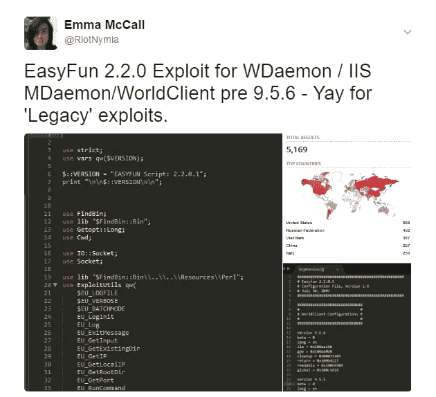
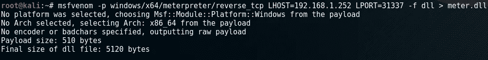
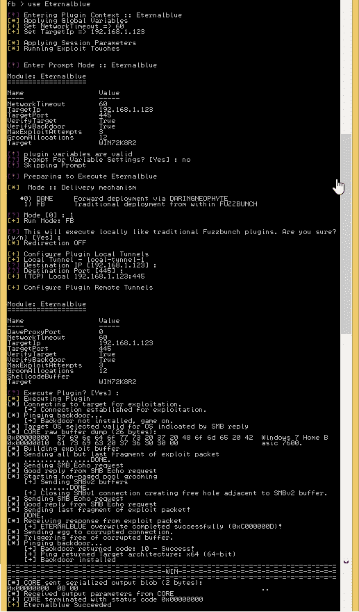
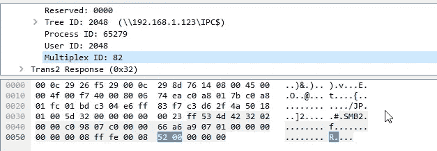
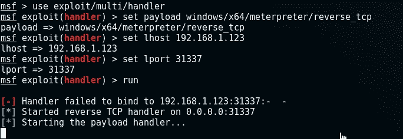
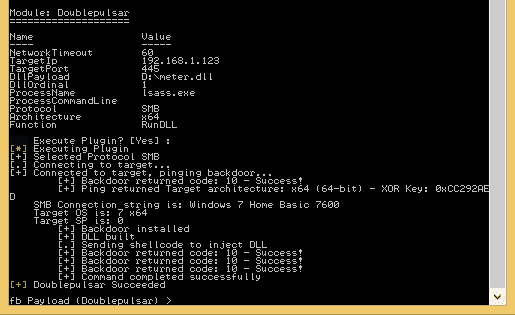
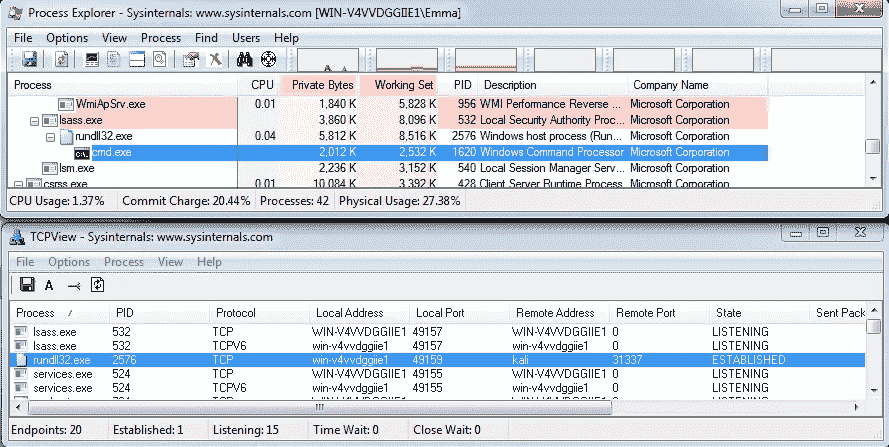
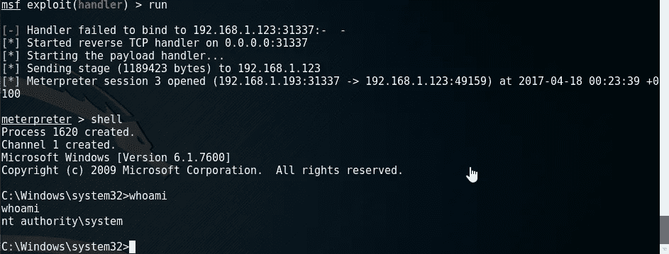
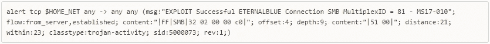
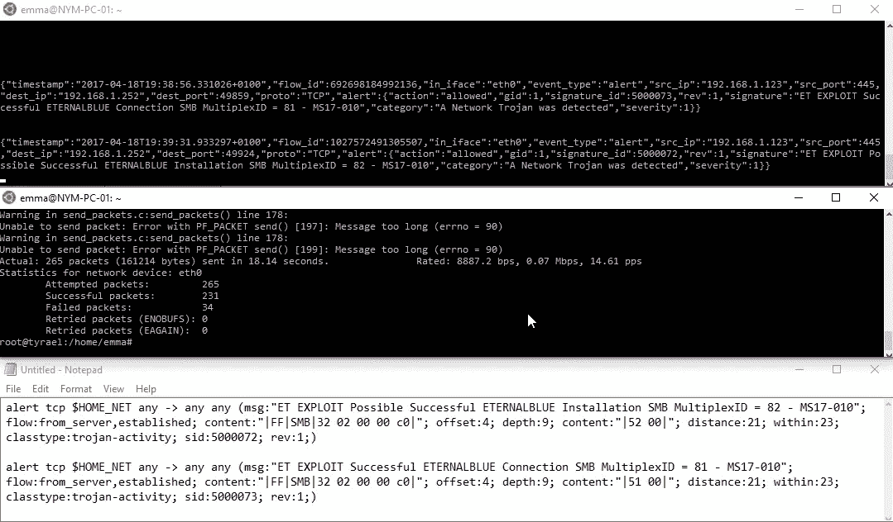

# 永恒脉冲星——一个虚构名字的实际例子

> 原文：<https://medium.com/hackernoon/eternalpulsar-a-practical-example-of-a-made-up-name-629737170a9e>

[昨天](/@xNymia/eternalpulsar-a-weekend-with-the-nsas-finest-29620f8757b9)我们讨论了这个周末的 ShadowBrokers 转储(我建议你在继续这里之前阅读它),并注意到在大约 32 个 exploit 转储中，有几个引起了我们的注意，并且在过去几天里非常有趣。

EasyFun 2.2.0 (EAFU)，这是对 WDaemon / MDaemon WorldClient(一种仍然非常常用的邮件服务器)的一些旧版本的利用。该漏洞针对 9.5.6 及更早版本。目前的版本是 18，所以这些目标应该很少，对不对？不对。

仍然有超过 5000 个已识别的潜在攻击目标，太棒了！

接下来是本文的主要话题；Windows 操作系统中 SMBv2 服务的 EternalBlue 漏洞与 DoublePulsar dropper 结合使用，可用于上传恶意. dll。

事实上，这种攻击非常非常简单，这让它变得更加可怕。我们将在 EternalBlue(EB)上使用 [FuzzBunch](https://hackernoon.com/tagged/fuzzbunch) 框架(我们之前讨论过的)，在 Windows 7 机器上开发 SMBv2 服务。DoublePulsar(DoPu)将作为我们的后门和 shellscript 执行平台上传，我们的有效载荷将是 meter preter(MSF)的 x64 版本 reverse_tcp。我已经开始称这个过程为“*永恒脉冲星*”，还有更多酷的名字，我们永远也取不够！

我在实验室环境中测试了 EternalPulsar，设置如下:

Windows 8.1(攻击者—**192 . 168 . 1 . 252**)
Windows 7(受害者—**192 . 168 . 1 . 123**)
kali Linux(MSF Handler—**192 . 168 . 1 . 193**)

我们将经历的简单阶段有:
**有效载荷创建** > **EB 利用** > **MSF 设置** > **DoPu 上传** > **扎根！**

***Payload***:
这个超级简单，我们只需要用 msfvenom 创建一个. DLL，它会回调我们的 MetaSploit 监听器。我们的目标是 x64 架构，所以让我们确保使用正确的架构(最初我没有这样做，当 DoublePulsar 指责我时，我打了自己一巴掌)。设置您想要回调的机器的 IP 地址，在本例中是我们的 Kali 实例和您将要监听的端口。

Nothing decidedly complex here simple reverse_tcp that we’ve all used.

***EB 漏洞利用:*** 就像 MetaSploit 框架一样，FuzzBunch 允许你‘使用’和配置漏洞利用及其有效载荷。

FuzzBunch configuration and execution of EternalBlue

对于此处的示例，我已经配置了目标和参数，但它们是不言自明的，您可以选择:
-目标 IP
-目标端口
-回调 IP
-确认目标操作系统
-利用尝试次数
-目标可利用性
-定义传送类型
-用于转发的远程 IP/端口(旋转)

然后，在询问我们是否准备好利用漏洞之前，我们会得到设置的最终验证。
该过程的其余部分连接到目标设备，确认其操作系统与基于漏洞利用的配置所期望的相匹配，并且该漏洞利用尚未安装。SMBv1 用于连接并在内存中创建一个缓冲区，该缓冲区将被释放，供我们的漏洞利用代码驻留(释放后使用)。

我们的漏洞利用代码被上传，植入物被放置，然后它向 FuzzBunch 发送一个返回代码，让我们知道它已经成功了。这已被确定为将 SMB 多路复用 ID 设置为值 82 (52 00h)。这不是此处的标准值，但有助于我们创建用于识别漏洞的签名，我们将在本文末尾介绍:

Multiplex ID = 82

***MSF 设置:***
下一步将我们带回到 MetaSploit，创建一个简单的处理程序来接收我们的 reverse_tcp 有效负载将执行的连接。我们有我们预期的有效载荷，监听机器的 IP(把它弄对，否则你会在 0.0.0.0 上结束监听；)和我们在有效负载中配置的端口。

MetaSploit Reverse TCP Handler

***DoPu 上传:*** 我们终于准备好上传我们的 DoublePulsar 后门和有效载荷给受害者了。随着 EternalBlue 的推出，我们得到的配置选项基本相同，只是我们被要求提供 DoublePulsar 安装后要执行的有效载荷的详细信息。在这种情况下，我们使用我们的“meter.dll ”,这是我们在阶段 1 中设置的已配置的 meterpreter reverse_tcp，以及我们要注入的进程的名称，最好总是使用标准的 windows 进程，这样我们就可以确定它在那里。

我们正在破坏[安全性](https://hackernoon.com/tagged/security)，所以让我们只使用*lsass.exe*这是方便的默认设置，我们再次确认我们正在攻击的协议(nbt 也是一个需要进一步研究的选项)和目标机器的架构。

我们得到回报，确认双脉冲星后门已经正确启动，然后。DLL 外壳代码已经构建并注入。

老实说，她就写了这么多！

***扎根！:*** 我们可以在我们的 MetaSploit 处理程序中看到，我们甚至不需要做任何进一步的事情，我们的“*meter.dll*”中包含的有效负载已经被执行并被回调到 Kali 实例。在目标系统上，我们可以看到我们的注入流程、我们的 shell 以及到我们的登台系统的连接。

我们使用 MetaSploit 访问我们拥有的 shell，可以看到，正如我们所料，我们拥有用户“nt authority\SYSTEM”的完全系统访问权限，如果您不熟悉 windows 系统，这是最高级别的权限，例如 root。

.DLL execution called back to Kali and we just grab a shell

那么，我们能对此做些什么呢？正如我们昨天谈到的[MS17–010](https://technet.microsoft.com/en-us/library/security/ms17-010.aspx)是为比 VistaSP2 更新的系统发布的，它修补了这些漏洞，使您超级安全*！(*由此，暂且)。

修补、禁用 CIFS/中小企业是您的最佳选择，可以保护您免受这种重复利用。此外，我们还花了一些时间来分析由 EternalBlue 专门生成的 SMB 流量。我们发现的两个工件是，安装(如上所示)返回了一个 82 的复用 ID，连接到当前的 EternalBlue 注入(它已经被利用，有些连接到当前的有效负载)的复用 ID 是 81。

EternalBlue connection to pre-installed backdoor value 81

EternalBlue initial exploitation success value 82

这些 MID 值不被用作标准 SMB 协议的一部分，因此是创建规则的一个相当好的基础(至少这是我一直工作和创建工作规则所使用的)。

因此，我们在 Suricata 内部确定这些的规则集是这样的(它们有点原始，我没有写太多签名):

MID=81 — Someone is successfully connecting to EternalBlue

MID=82 - Someone has potentially managed to install EternalBlue

这些规则在我的实验室 Suricata 实例中进行了测试，并在我的测试以及 Eric Conrad 通过 twitter 提供的 PCAPs 上运行。

Ignore the ET, I based my rules on their EternalRomance rule, because I’m a noob :P

你可以从我的 github 获取这些签名的完整版本:[https://github.com/xNymia/Suricata-Signatures](https://github.com/xNymia/Suricata-Signatures)

在我看来，这将是一个长期的问题。我在做 Pentest gigs 时看到的大量系统都有大量过时的补丁，系统管理员或开发人员丢弃了 Windows Server 2008 的测试机器，这些机器没有打补丁，Windows 7 家用机器禁用了自动更新。我们都知道它会发生，我们都讨厌它。现在它要咬我们了。很难。

更不要想所有的人都在生产环境中使用非法获得的 windows 版本。会让你头疼的。

> [黑客中午](http://bit.ly/Hackernoon)是黑客如何开始他们的下午。我们是 [@AMI](http://bit.ly/atAMIatAMI) 家庭的一员。我们现在[接受投稿](http://bit.ly/hackernoonsubmission)，并乐意[讨论广告&赞助](mailto:partners@amipublications.com)机会。
> 
> 如果你喜欢这个故事，我们推荐你阅读我们的[最新科技故事](http://bit.ly/hackernoonlatestt)和[趋势科技故事](https://hackernoon.com/trending)。直到下一次，不要把世界的现实想当然！

