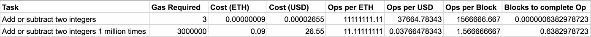
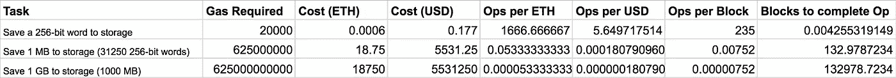

# 以太坊合同中的成本计算

> 原文：<https://medium.com/hackernoon/ether-purchase-power-df40a38c5a2f>

***气价 PSA****(2017–08–23):撰写本文时的气价中值为 28 Gwei，目前仍在 20 Gwei 的范围内。这远远大于在*[*eth asstation*](http://ethgasstation.info/)*上发现的典型平均值和安全低(分别为 4 和 0.5 Gwei)。中位数如此之高，是因为许多钱包里都有糟糕的汽油价格违约。我* ***强烈建议*** *使用加油站的平均气价或更低的气价，以避免支付高额费用，并帮助降低气价的市场价格。*

***更新****(2017–09–6):我把操作码的 Google 电子表格移植到一个*[*github repo*](https://github.com/djrtwo/evm-opcode-gas-costs)*。该回购将随着* [*黄皮书*](http://yellowpaper.io/) *的演进而维护和更新。*

当用户持有以太时，他们在存储什么？从某种意义上说，他们正在以太坊[网络](https://hackernoon.com/tagged/network)上存储执行计算的能力。这种计算是以分散的方式完成的:

> 挖掘器执行与包含在块中的每个事务相关联的计算，从而产生更新的状态。一旦成功地挖掘了一个块，挖掘器就向网络广播该块。其他挖掘器和非挖掘节点中的每一个在接受该块为有效、将该块合并到它们的[区块链](https://hackernoon.com/tagged/blockchain)的副本中、并继续移动到下一个块之前，验证事务计算的有效性和由此产生的状态变化。

你可能已经注意到网络上的每一点计算都有令人难以置信的冗余量。也就是说，每个节点验证每个事务的结果—阅读:*每个节点运行所有的计算*。

我已经研究以太坊和其他区块链应用平台很长时间了，很少有人直截了当地这么说。一旦你进入事物的更技术性的一面，它就成为系统的一个明显的特征，但是对于不太熟悉的人来说，这就不那么明显了。这难道不比仅仅在服务器上运行计算要昂贵得多吗？是的，根据协议的性质，必须如此。以下可能是经济学或计算或两者的基本原理:

> 运行代码的机器越多=花在运行代码上的钱越多

我们必须记住，在以太坊上执行代码和更新状态与在简单的服务器上做同样的事情有很大的不同。以太坊中产生的状态变化具有与服务器不同的属性——即:不变性和公共可验证性。让我们先来看看网络上的实际计算成本，然后我们可以尝试决定它是否值得。

# 这要花多少钱？

## 气体

EVM(以太坊虚拟机)中可用的每个低级操作称为一个操作码。这些操作包括 ADD(将两个整数相加)、BALANCE(获取帐户余额)和 CREATE(使用提供的代码创建新的契约)。这些操作码中的每一个都有一个与之相关的名为“气体”的数字。 *Gas* 是一个抽象数字，表示操作的相对复杂程度。比如 ADD 用 3 gas 而 MUL(两个整数相乘)用 5 gas，所以 MUL 比 ADD 复杂。

我在这里编译了 EVM[中每个操作码所需的 gas。这些信息摘自最新版本的](https://docs.google.com/spreadsheets/d/1n6mRqkBz3iWcOlRem_mO09GtSKEKrAsfO7Frgx18pNU/edit?usp=sharing)[以太坊黄皮书](https://ethereum.github.io/yellowpaper/paper.pdf) (EIP-150 修订版)——以太坊协议的正式规范。

需要注意的是，所有交易都以 21000 气为基数。所以如果你只是转账，没有和合约互动，你的交易需要 21000 气。如果您正在与一个合同进行交互，您的事务需要 21000 gas 加上与运行该合同相关的任何 gas。

## 天然气价格

虽然每次操作的天然气价格是固定的，但用户支付的每份天然气价格是动态的，由市场条件决定。气价是代表用户愿意为每种气体支付多少乙醚的值。当用户发送交易时，他们以 Gwei/Gas (1 Gwei 等于 0.000000001 ETH)指定气价，他们支付的总费用等于 *gas_price * gas_used。矿工得到这笔费用，因此他们优先考虑天然气价格较高的交易。您愿意支付的汽油价格越高，您的交易处理速度就越快。*

[ETH 加油站](http://ethgasstation.info/index.php)是了解当前天然气市场状况的绝佳资源。“推荐用户天然气价格”显示您可能支付的天然气价格范围和预期交易时间。

# 不，真的，要多少钱？

以太坊中的运营成本是 gas_price * gas_used，但是这在以太和美元中转化为什么呢？我已经编制了一份[电子表格](https://docs.google.com/spreadsheets/d/1KeWKkn0BYhOt1p6lM6BDQAWLin-2JQmGpwswU3kPw9c/edit?usp=sharing)，其中列出了当前天然气中值价格(28 Gwei)和当前美元/ETH 汇率(295 美元/ETH)下的一些示例操作和相关成本。每行显示一项任务，任务所需的汽油，以 ETH 和 USD 表示的成本，用 1 ETH 和 1 USD 可以执行的任务数量，每块可以执行的任务数量，以及执行这项任务需要的块数。

## 添加数字

以下是电子表格中的一个示例。这显示了两个整数相加或相减的相关成本。

Cost of Adding Integers

我们可以看到，将两个数字相加 100 万次需要花费 0.09 ETH 或 26.55 美元。与在本地计算机或云服务器上运行相比，这似乎相当高。让我们对 AWS 做一个快速的价格比较。

我可以[用 python](https://gist.github.com/djrtwo/434a3b0e9eaf785cdd7dec70ec561ff3) 在 0.04 秒内把两个数字加在一起一百万次。亚马逊对其最便宜的 EC2 实例 t2.nano 收取 0.0059 美元/小时的费用。这需要 0.000001639 美元/秒或 0.000000066 美元的运营费用。与 26.55 美元相比，这大约贵了 4 亿倍(或者 4 千万美元，如果你愿意支付较低的天然气价格)。哇哦。

## 存储数据

我们可能感兴趣的另一个常见操作是存储数据，无论是存储单个值(如合同到期前的天数)还是更大的值(如短篇小说的内容)。

Cost of Storing Data

从上面的片段中我们可以看到，将数据存储到区块链是极其昂贵的，但这是有道理的！当您在区块链中存储数据时，您将数据存储到一个不可变的数据库中，该数据库跨越成千上万个节点进行复制。像把你最喜欢的电影上传到区块链这样的操作是而且应该是完全成本高昂的，以保持区块链的增长可控。存储一个 256 位的字需要 20000 单位的气体，比两个数相加要贵 6000 多倍，这一事实证明了这种直觉。

存储大量数据的另一个瓶颈是大约 4700000 气体/区块的当前区块气体限制。按照每个数据块的气体上限，将 1 MB 数据写入区块链需要 132 个以上的数据块，这是假设您可以管理每个数据块的所有气体，并且不需要其他操作！

# 这是什么意思？

平心而论，把两个数字加在一起 100 万次有点做作。一个写得好的契约可能会将这种计算复杂性移出链外，更多地处理契约中的更新状态。将大量数据存储到区块链也不是一项普通的任务。根据任务的不同，用户可能会将数据的加密引用(哈希)存储在链上，而将其余数据存储在链外。

也就是说，作为开发人员，我们需要了解这些成本，并相应地设计 dApps。我们需要找到链上和链下复杂性之间的平衡，同时仍然利用区块链的分散能力。

我们还需要明白，归根结底，我们是在拿苹果和橘子做比较。随着区块链成本的增加和效率的降低，我们获得了开放的、抗审查的代码执行和公开的、不可改变的数据的保证。我们以前从未在计算中有过这样的属性，我们也没有完全理解我们可能看到的财务和社会收益。

在接下来的一年里，我期待更多的采用，并希望在以太坊区块链推出一些期待已久的产品。只有当我们在区块链开展重大活动时，我们才能真正评估成本和收益。

> [黑客中午](http://bit.ly/Hackernoon)是黑客如何开始他们的下午。我们是 [@AMI](http://bit.ly/atAMIatAMI) 家庭的一员。我们现在[接受投稿](http://bit.ly/hackernoonsubmission)，并乐意[讨论广告&赞助](mailto:partners@amipublications.com)机会。
> 
> 如果你喜欢这个故事，我们推荐你阅读我们的[最新科技故事](http://bit.ly/hackernoonlatestt)和[趋势科技故事](https://hackernoon.com/trending)。直到下一次，不要把世界的现实想当然！

