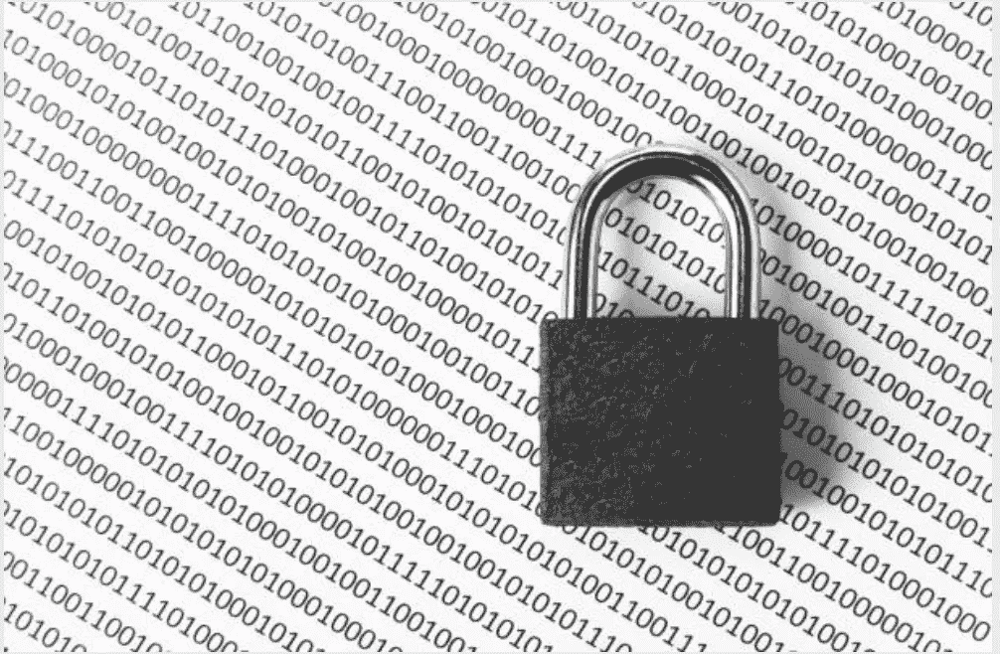
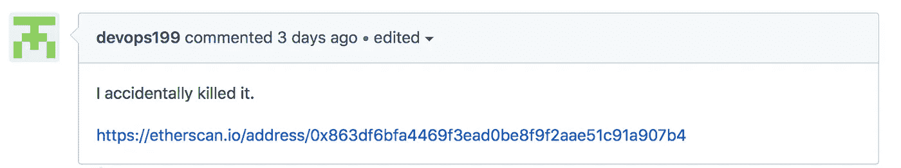

# 以太坊客户端开发者“意外”锁定 1.5 亿美元用户资金

> 原文：<https://medium.com/hackernoon/ethereum-client-developer-accidentally-locks-150-million-of-user-funds-3806070ed27c>

由于最大的以太坊客户端之一 Parity 的代码中存在安全漏洞，超过 1.5 亿美元的用户资金被冻结，无法访问。

根据 Parity Technologies 昨天(11 月 7 日)发布的警报，该漏洞是在 7 月 20 日部署的标准多签名(multi-sig)钱包更新中发现的(钱包多签名功能通过要求多个密钥来启动和广播以太坊交易，从而提高了安全性)。

这个漏洞本身是昨天由一个名为“devops199”的客户端开发者发现的，他“意外”从奇偶钱包中删除了一个代码库，然后[在 Github](https://github.com/paritytech/parity/issues/6995) 上报告了这个漏洞。

由于 devops199 的“错误”，所有使用该公司多重签名功能的钱包都被冻结，导致数千名用户完全无法访问他们的资金——估计金额超过 1.52 亿美元。

除此之外，最近推出初始硬币发行(ico)的几家初创公司和开源项目已经站出来，声称他们的 151 个钱包地址受到了软件故障的影响。

正如预期的那样，这一事件引起了人们对奇偶校验技术的极大关注，奇偶校验技术在 7 月份也因黑客攻击损失了 3000 万美元。

此外，它出现在以太坊本身因推动超过 10，000 个 ICO 项目而受到大量关注的时候，其中 13 个项目单独筹集了超过 1 亿美元。

其中之一是 Polkadot，它在上个月的象征性销售中筹集了超过 1.45 亿美元。现在，由于客户的失败，这家区块链初创公司正在处理其价值 9800 万美元的以太基金被平价锁定的问题。

另一家受到钱包失败影响的 ICO 初创公司是 Iconomi，这是一家数字资产管理平台，从 9 月份的代币销售中筹集了超过 1000 万美元。

根据区块链以太坊探险家[以太扫描](https://etherscan.io/address/0x376c3e5547c68bc26240d8dcc6729fff665a4448)的说法，Iconomi 的冷冻钱包价值约 3400 万美元。然而，该公司最近在[的博客文章](/iconominet/statement-on-the-parity-multi-sig-wallet-vulnerability-253b0675291f)中指出，钱包只包含公司资产，不包含客户资金。

帖子说:

> “存储在平台上的所有用户的数字资产都是完全安全的，平台的运行不受影响。"

尽管如此，尽管平价否认了分叉区块链以解锁客户资金的可能解决方案，但它正在为解决这一问题付出巨大努力。事实上，在社交媒体上，该团队已经敦促那些受影响的人尽快与联系。此外，该公司还创建了一个网站，致力于帮助用户了解他们的钱包是否受到影响。

## 结论

感谢你花时间阅读这篇文章，我希望你真的喜欢它。如果您发现这很有价值，请不要忘记点击👏按钮！也可以随时分享我的内容！

在所有社交媒体平台上关注@ TheCoinEconomy，了解加密货币市场和区块链科技发展的最新动态。( [TradingView](https://www.tradingview.com/u/thecoineconomy/) ， [Twitter](https://twitter.com/thecoineconomy) ， [Instagram](https://www.instagram.com/thecoineconomy/) ，[脸书](https://www.facebook.com/Thecoineconomy-353316841786257/)，[stock wit](https://stocktwits.com/TheCoinEconomy)s .)