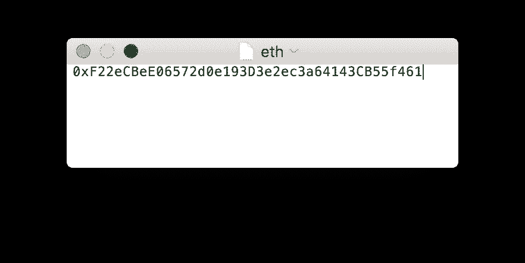
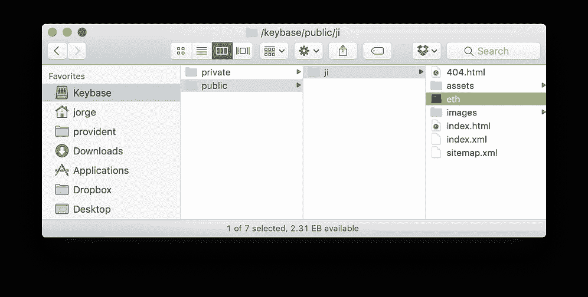
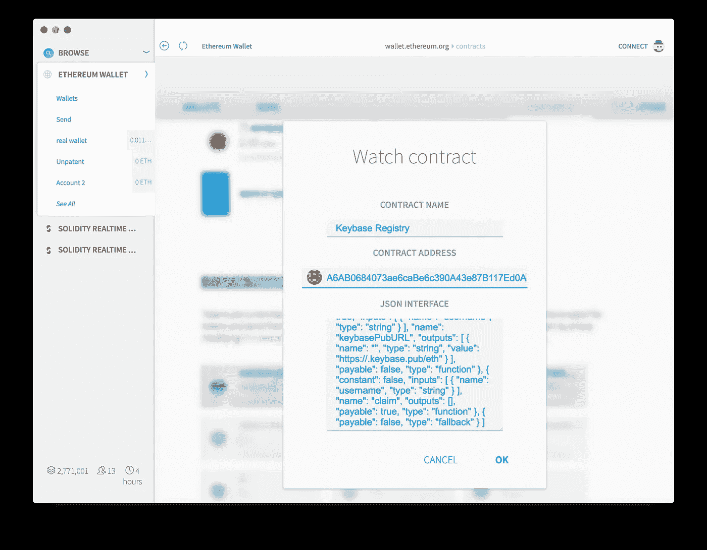
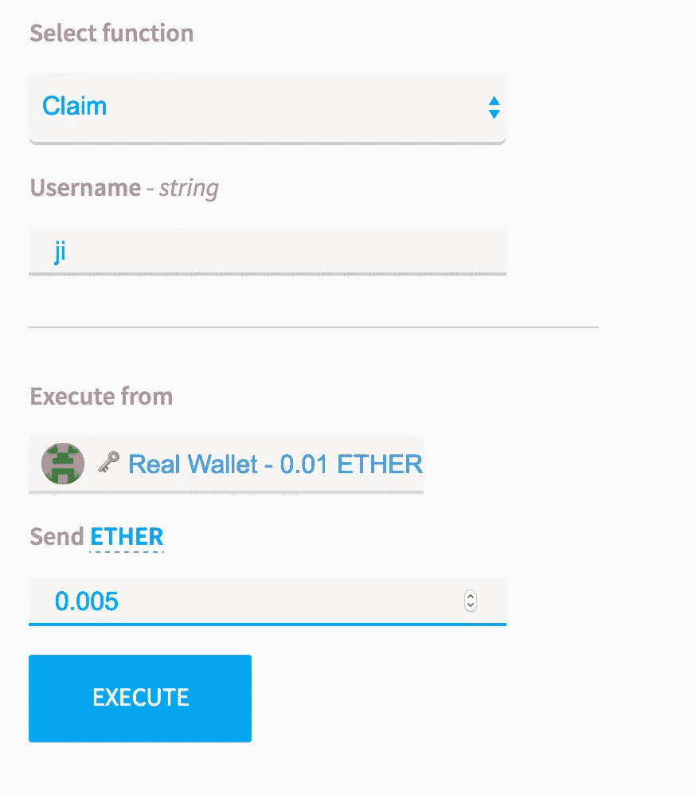
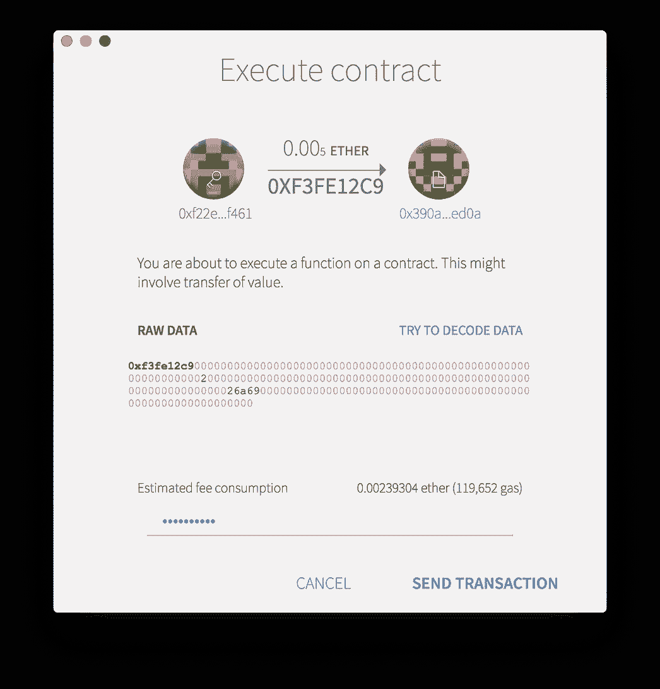
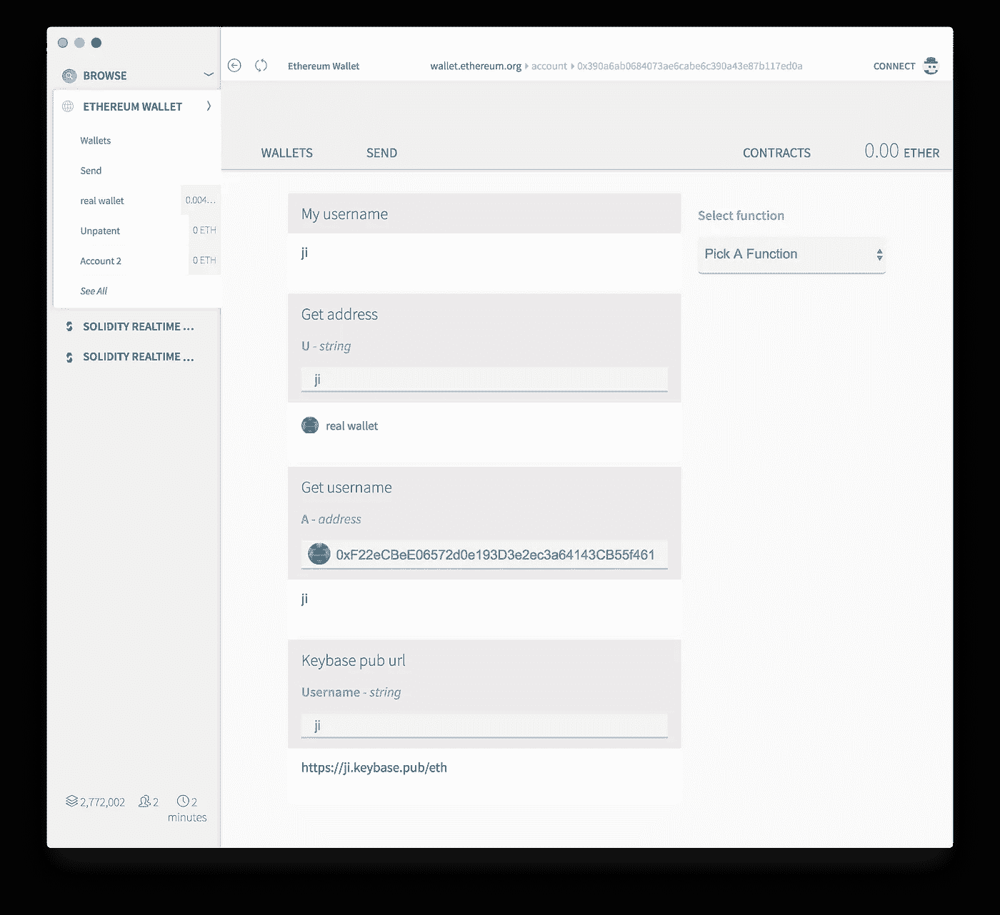

# 以太坊<>密钥库注册管理机构提案

> 原文：<https://medium.com/hackernoon/ethereum-keybase-registry-proposal-c6497e3b2af7>

## 使用 KBFS 和 Oraclize 建立以太坊地址和密钥库用户名的双向链接

**更新:我一直致力于一个更好的验证流程，这将使 KBFS 证明本身双向绑定(通过用以太坊地址私钥签署证明)。**

**更新 2:新文章现已发布:**

 [## 阿拉贡如何处理身份和以太坊密钥库解析器

### 在开发分散式应用程序时，身份是最重要的部分之一。对…来说尤其如此

medium.com](/aragondec/how-aragon-approaches-identity-and-the-ethereum-keybase-resolver-d548133e4a26) 

当构建分散式应用程序时，身份验证[不仅对于**执行 KYC** 很重要，而且对于使用人类可读且易记的字符串轻松搜索地址也很重要。虽然](https://hackernoon.com/tagged/verification) [ENS](https://github.com/ethereum/EIPs/issues/162) 可能解决后者，但是能够进一步**获得那个人是谁的链外证据**也是非常重要的。

**Keybase** 是一种允许使用加密证明进行身份链接和验证的服务。 [Keybase](https://hackernoon.com/tagged/keybase) 最近推出了 [KBFS](https://keybase.io/docs/kbfs) 一款加密安全的云存储。这允许用户拥有一个包含文件的公共文件夹，并且有一个**密码证明**只有拥有该目录的用户才被允许将这些文件放在那里。因此，我们可以证明某个用户将任意一段数据放在了那里。

尽管你可以将一个 [Zcash](http://z.cash) 和比特币地址与你的 Keybase 身份联系起来，但目前没有办法确定用户是否真的控制了列出的地址，因为加密货币部分不需要验证。

为 Keybase 构建以太坊地址验证时，提供**双向验证**非常重要，这样应用程序就可以确定与您的用户名关联的地址确实是您的。

## 提议的注册管理机构实施(KBFS +注册管理机构合同)

使用 KBFS，用户可以将文件添加到他们的公共文件中，指定他们想要验证的以太坊地址。这已经是一个有效的单向证明，我们知道只有拥有 Keybase 帐户的用户被指定了某个地址。这类似于 Keybase 现在为 BTC 和 Zcash 提供的功能。

然后，执行验证的用户必须执行**注册中心智能契约**中的功能，从他们试图验证的地址指定他们的密钥库用户名**。然后，契约将执行一个 **HTTP 请求**到 Keybase(使用 Oraclize)来获取用户的以太坊地址。**

如果匹配，那么注册中心将为该用户和地址创建一个条目。注册表允许双向搜索，即用户名到地址和地址到用户名。

## 证明以太坊地址工作流程(使用 Mist 或 Wallet)

*   首先，创建一个名为 *eth* 的文件，其中包含您想要链接到您的身份的以太坊地址，并将其保存到您的 KBFS 公共目录中。该文件将在 [https://【用户名】. keybase.pub/eth](/[username].keybase.pub/eth) 上公开。我的是这里的。

Saving the eth file to KBFS

*   现在，您必须查看钱包中的密钥库注册管理机构合同。从您的钱包，进入合同，并点击“观看合同”按钮。添加合同地址(现在 mainnet 部署的是:**0x 390 a6ab 0684073 E6 cabe 6 c 390 a 43 e 87 b 117 ed0 a**)和合同的 JSON 接口[在这里](https://github.com/izqui/keybase-ethereum-registry#json-interface)。

Watching the Keybase Registry contract

*   输入合同并执行“索赔”功能。你必须指定你的 **Keybase 用户名**(带有 *eth* 文件的用户名)并发送至少 **0.005 ETH** 以支付 **Oraclize 调用**(撰写本文时的价格，查看 [Oraclize 定价](http://docs.oraclize.it/#pricing)以了解更多信息)

Executing the claim function

*   就是这样，一旦交易被确认，你应该可以从合同中检查你新申请的用户名。

你可以在这里找到注册中心[初始实现的源代码，并在](https://github.com/izqui/keybase-ethereum-registry) [Etherscan](https://etherscan.io/address/0x390a6ab0684073ae6cabe6c390a43e87b117ed0a#readContract) 上查看当前部署的合同。

> [黑客中午](http://bit.ly/Hackernoon)是黑客如何开始他们的下午。我们是 [@AMI](http://bit.ly/atAMIatAMI) 家庭的一员。我们现在[接受投稿](http://bit.ly/hackernoonsubmission)，并乐意[讨论广告&赞助](mailto:partners@amipublications.com)机会。
> 
> 如果你喜欢这个故事，我们推荐你阅读我们的[最新科技故事](http://bit.ly/hackernoonlatestt)和[趋势科技故事](https://hackernoon.com/trending)。直到下一次，不要把世界的现实想当然！

