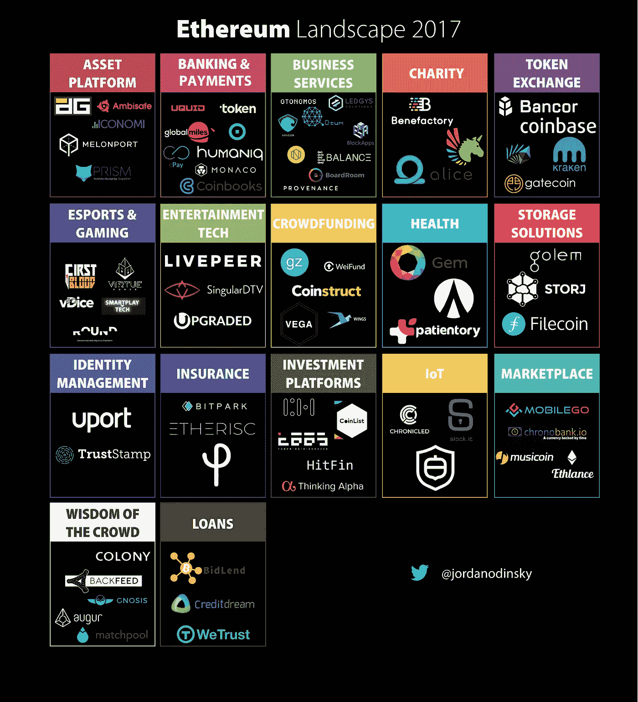
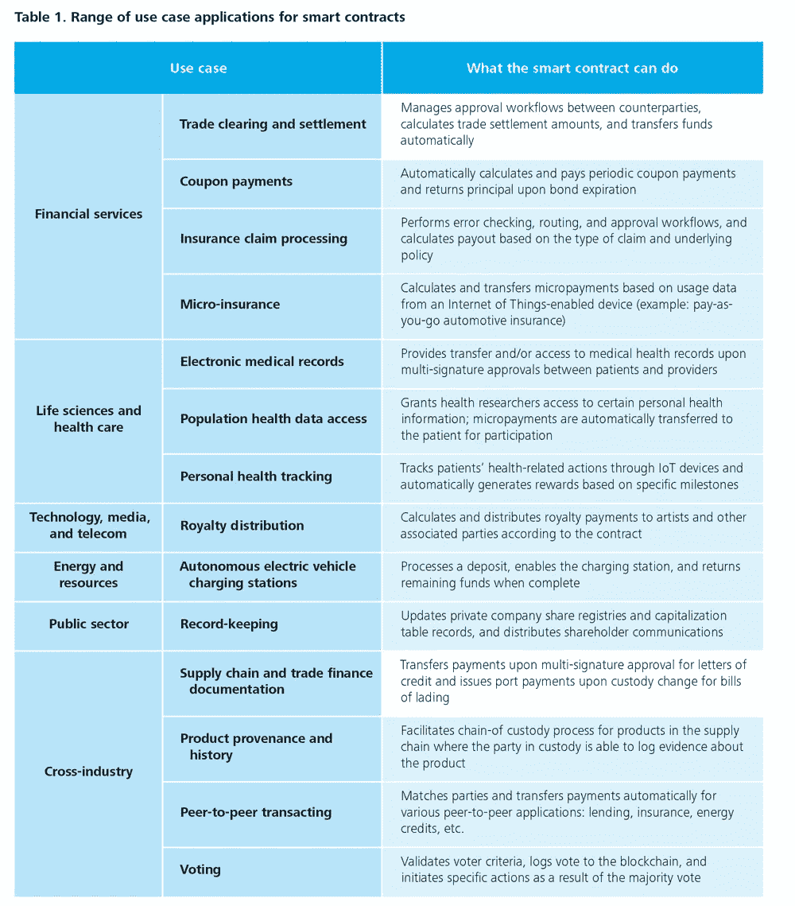

# 以太坊市场地图—2017 年 6 月

> 原文：<https://medium.com/hackernoon/ethereum-market-map-june-2017-d13928e4319e>

## 对建立在以太坊基础上的创业公司和机会的深入研究

*If you prefer to view the spreadsheet with the links to the startups,* [*click here*](https://docs.google.com/spreadsheets/d/1oQy4rH6b6vreI1cUrNTgs2Ax8G_grsYUb3eRY2ZXsqU/edit?usp=sharing)*.*

我一直对改变人们与世界互动方式的技术着迷。脸书、亚马逊、Airbnb 和优步都在塑造人们看待世界的方式中发挥了作用。他们让在线分享时刻和想法变得很正常。他们告诉我们，跳上一辆陌生人的车，甚至睡在他们备用的卧室里都没关系。它们永远改变了我们相互购买商品和服务的方式。我相信区块链技术将是下一个改变我们思考和与互联网互动方式的创新。被视为加密货币的一场革命，技术专家、风险资本家、创业迷，甚至我的父亲都站出来了解更多关于这一新的创新浪潮的信息。

过去几周，我深入研究了区块链技术及其用例。虽然上面的市场地图只是更大的区块链拼图的一部分，但我相信以太坊有潜力取代比特币成为未来的数字货币和框架，因为它拥有强大的开发者生态系统，编码简单，以及可以利用智能合约的各种应用程序。

## 以太坊是什么？

如果你刚刚开始学习以太坊，我建议从这篇写得非常好的文章开始。

TL；DR:以太坊是一种分散的区块链技术，允许用户开发和运行智能合约。智能合同是一种数字合同，允许用户以透明、无冲突的方式交换金钱或任何有价值的东西，同时避免中间人。

## 以太坊的强大用例

以太坊与比特币截然不同。以太坊是一个用户友好的平台，开发人员可以轻松开发应用程序，它不仅允许点对点交易，还允许开发人员编写应用程序以利用智能合约。

[Source](https://dupress.deloitte.com/dup-us-en/focus/signals-for-strategists/using-blockchain-for-smart-contracts.html): Deloitte University Press

而这只是冰山一角！医疗保健、市场、银行、代币交易、电子竞技、游戏、娱乐、贷款、身份管理、文件存储、商业服务、支付等领域正在开发更多的用例。

作为一名热情的投资者，我最近在 Twitter 上与 Semil Shah 进行了一次对话，分享了一个利用智能合同进行投资的有趣用例。(旁注:如果你没有跟随[semi](https://twitter.com/semil)，你就错过了。)

## 这一切意味着什么？

以太坊有潜力改变互联网、商业和我们日常互动的应用的面貌。我认为以太坊是一个刚刚开始触及表面的生态系统。想想苹果 pre 的 App Store 或者 iOS。通过为开发者提供一种简单的语言来构建利用智能合约、加密货币和协议的有价值的应用程序，以太坊将为新型商业铺平道路。随着新的应用程序和用例涌入市场，消费者自然会更倾向于测试这项技术——特别是如果它能为他们省钱的话(见[项目 Oaken](https://www.youtube.com/watch?v=lKJrTeNQGZE) 正在做什么)——许多人不会回到他们的旧系统和旧做法。我认为这是典型的网络效应。随着应用产品的增加，更多的人将采用新技术，从而使以太坊技术和各种代币更有价值。

随着这一新的创新浪潮在最近的 Token Summit 和 Consensus 2017 会议之后成为热门话题，越来越清楚的是，这不是一种时尚，而是伟大事物的开始。

**如果你正在一家基于以太坊技术的公司工作，或者如果我错过了任何公司，请随时** [**发微博给我**](https://twitter.com/jordanodinsky) **或** [**发邮件给我**](mailto:odinskyj@gmail.com) **。我很想收到你的来信！**

感谢和琳达·谢的帮助！

接下来:

 [## 推介辅助办公时间

### 我很高兴为*种子前期和种子期创业公司*推出我的个人推介辅助办公时间。我非常相信…

hackernoon.com](https://hackernoon.com/pitch-assist-office-hours-ab29b21d0027)  [## 区块链词典

### 区块链空间中最常用术语的详细列表

hackernoon.com](https://hackernoon.com/blockchain-dictionary-f4d098c9ef89) 

你好！我叫乔丹，在以色列的一家全球风投公司工作。风险投资/创业领域发生了很多事情，我想我应该在这里发表我的观察。所有观点都是我自己的。在推特上随意关注:[*@ jordanodinsky*](https://twitter.com/jordanodinsky)*。*