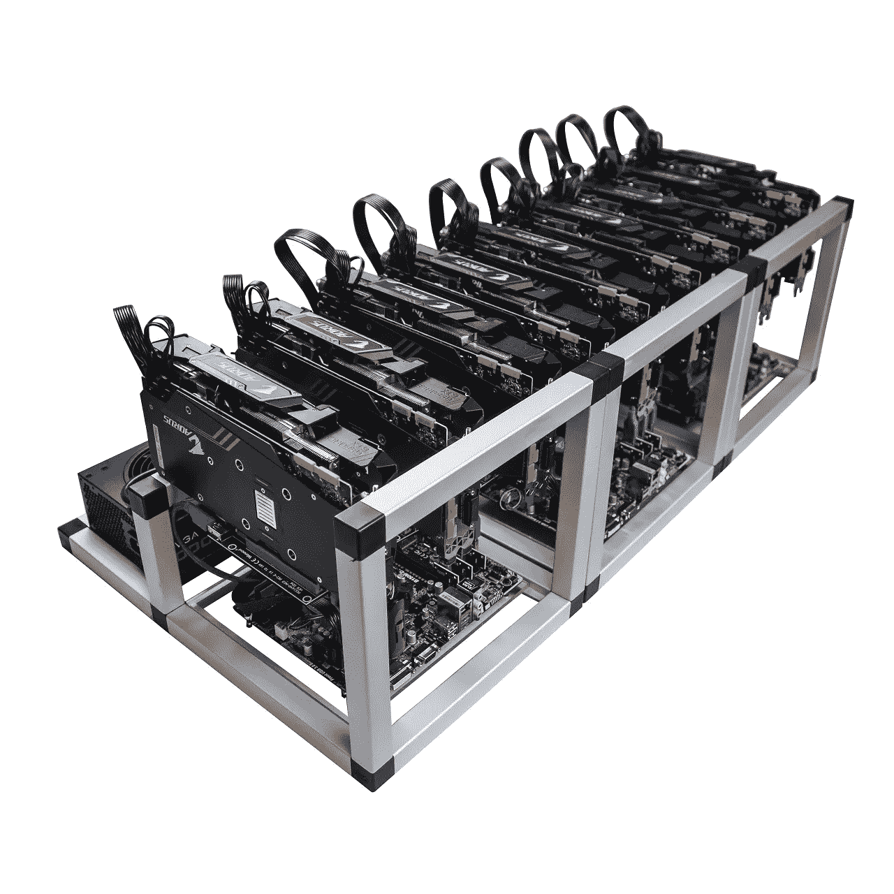

# 以太坊采矿和如何为以太坊融资

> 原文：<https://medium.com/hackernoon/ethereum-mining-and-how-to-finance-ethereum-7c4c5f22f710>

## 1.以太坊采矿赚钱吗？

采矿作业由多个因素组成，如空间、冷却、硬件、电力、税收和维护。人们可以从家用电脑开始挖掘，然后扩大到更大的规模。采矿的美妙之处在于，如果做得好，可以获得很高的利润。盈利的矿工通常会持有他们的奖励(硬币)几个月甚至几年，因为价值通常会随着时间的推移而上升，从而产生更多的利润回报。

## 2.现在开始挖掘以太坊还来得及吗？

区块链技术仍然是相当新的，但它正在快速发展。正在采矿的计算机是网络的骨干。现在开始还不算太晚，但是你应该研究和开发一个商业策略，这将导致一个有利可图的操作。

## 3.利用资金扩大采矿设施。

建立一个采矿设施并不容易，而挖掘加密货币的这一阶段是人们将花费最多时间的地方。一旦建立起来，扩大业务就不那么困难了。一旦运营顺利，当机会出现时，通过融资开始扩大采矿设施将是一个很好的选择。

## 4.将开采出来的以太坊重新投资为替代硬币。

将开采出来的以太币再投资到其他 altcoin 是另一种投资选择。相信替代硬币市场从长远来看更有利可图的矿工通常会持有他们选择的其他替代硬币，而不是出售他们开采的以太坊。

## 5.使用代币作为抵押品来获得更多资金

一个新的市场正在出现——今年年初，硬币市场的市值约为 200 亿美元，截至今天，市值为 1500 亿美元。通过 [ETHLend](http://about.ethlend.io) ，用户可以使用硬币作为抵押请求贷款。这是一个类似的概念，用一个人的汽车或房地产作为抵押，从银行贷款融资。

## 6.制定财务计划

有一个可靠的财务计划是成功拓展业务的关键。有了 [ETHLend](http://about.ethlend.io) 的 DAPP，贷款人可以参与到具有竞争性利率的自由市场中。此外，借款人和贷款人可以协商贷款期限。在借款人无法偿还贷款的情况下，抵押品将被发送给贷款人。通过使用 [ETHlend](http://about.ethlend.io) 的 DAPP，人们将有机会以一种赋予人民权力的方式参与自由市场贷款，因为没有银行或信用合作社参与控制利率、贷款期限和不必要的费用。

