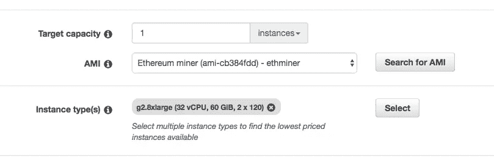
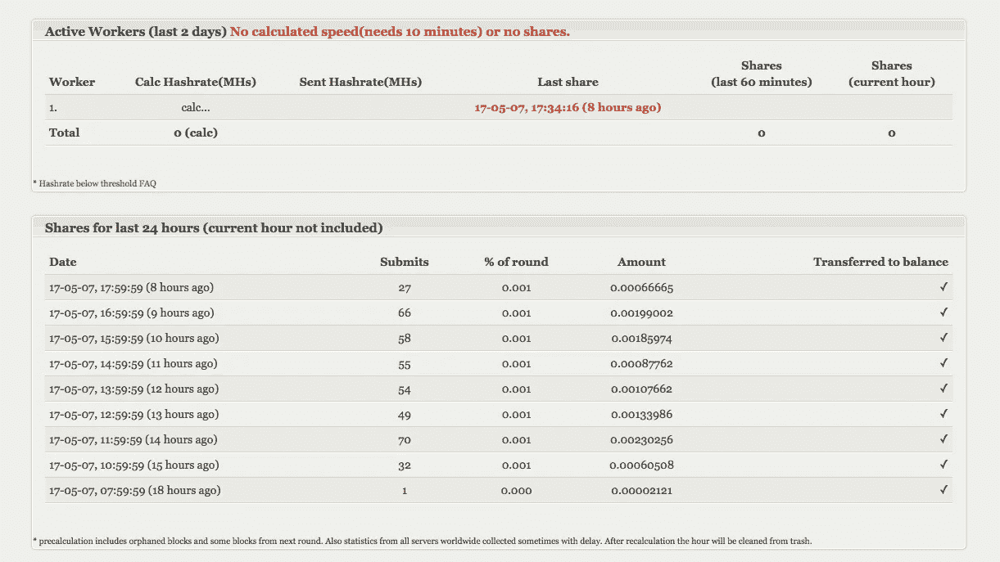

# 5 分钟内在 AWS 上挖掘以太坊

> 原文：<https://medium.com/hackernoon/ethereum-mining-on-aws-in-5mins-713f5a40949f>

如果你进过这个帖子，你一定听说过比特币挖矿。**比特币挖矿**是指使用一个节点验证交易，将其编译成一个块，解决计算难题并将该块提交给网络以获得块奖励。以上步骤中的大部分努力都是在解决那些*计算密集型的难题*。

然而，比特币挖掘对于像你我这样的普通人来说不再可行，因为挖掘的最佳硬件是专为解决这些计算难题而设计的 **ASIC(专用集成电路)**。使用自己的 CPU 或 GPU 将导致比潜在回报更高的成本(电力和硬件)。

# 欢迎来到以太坊

以太坊是一个区块链网络，有很多文章描述以太坊与比特币的区别。主要优势是区块链不仅能够管理货币，还能以分散的方式管理任何可能的项目，如 DNS。

以太坊矿工也将不得不做和比特币矿工完全一样的事情；除了那些*谜题*不仅需要计算能力，还需要内存。这就降低了 **ASIC** 相对于 GPU 的竞争优势。

# 在 AWS 上挖掘以太坊

让我们开始学习如何在 AWS 上开采乙醚！

## 设置实例

1.  将您的区域更改为 US East (N. Virgina ),因为它似乎是我们实例类型的最低价格。
2.  进入 AWS，在 EC2 控制台下，选择**现场请求。**
3.  在 AMI 下选择 Spot 实例
    请求:在 community AMIs
    中搜索 **ami-84f819f9** 在实例类型下选择 **g2.8xlarge**
4.  单击下一步并启动实例。到这一步，您应该会看到一个实例出现。

> 我们之所以在 ami 下选择 **ami-84f819f9** *是为了在你启动实例的时候得到一个安装了 cuda 和以太坊客户端的镜像。您可以执行一个* ***历史*** *命令来查看曾经输入的命令或****PS aux****来确保没有恶意进程运行。*

> 由于一篇[抄袭的帖子](https://hackernoon.com/how-to-mine-ethereum-in-5-min-3f3bc80d0c4b)，我更新了另一个 ami。我希望 hackernoon 能为此做点什么。

Step 3: AMI and Instance Type selection.

## 运行采矿机

一个典型的矿工会加入一个矿池。在这篇文章中，我将展示我们如何将[dwarfpool.com/eth](https://dwarfpool.com/eth)加入我的团队。我选择矮人矿坑没有特别的原因，有很多矿坑可供选择。事实上，为了区块链网络的安全，我会建议尝试其他的矿池。

1.  SSH 到您的实例
2.  只需在您的实例中键入以下内容
    ` ETH miner-G-F[http://eth-eu.dwarfpool.com/$](http://eth-eu.dwarfpool.com/0xA1f7e1D5322cb543A63c9C350ED4dB67af7CED99){ YOUR _ ETH _ ID } `即可

一旦你输入了，你应该很快就会看到生成 DAG 和 mining will commerce。加入矮人之池可以让你很容易的追踪你的采矿状态，例如，查看这个 [*链接*](https://dwarfpool.com/eth/address?wallet=ea7263feb7d8a8ab0a11eedd8f1ce04412ab0820) 关于其中一个矿工的状态。

如果你想加入其他矿池，他们可能会给你提供网址进入加入他们。

# 值这个钱吗？

不幸的是，这个例子的成本价比你从采矿中可能得到的还要多。举个例子，这是我挖掘了大约 7 个小时的结果。ETH 的数量是 0.01，根据当前 ETH 价格 85 美元，大约是 0.85 美元，我已经为 g2.8xlarge spot 实例花费了 7 美元。

*如果你喜欢这篇文章或者认为它对你有帮助，你可以使用我的推荐链接加入一个交流(如果你加入并交易，我会得到一些佣金):*

*   [https://hitbtc.com/?ref_id=59f3f03a31222](https://hitbtc.com/?ref_id=59f3f03a31222)
*   [https://www.binance.com/register.html?ref=10050322](https://www.binance.com/register.html?ref=10050322)

Hitbtc 和币安是值得信赖的交易所。在比特币黄金的最后一次分叉中，他们给你 1 BTG 兑换你在 24 小时内在交易所拥有的 1 个 BTC，并且它可以立即交易。另一方面，Bittrex 仍然没有任何消息，当它将被交易在这一点上。

或者，试试 coinbase 来轻松交易你的矿币，你每交易 100 美元，我们就能得到 10 美元的比特币

[https://www.coinbase.com/join/58e399c5641b9462a2ee6410](https://www.coinbase.com/join/58e399c5641b9462a2ee6410)